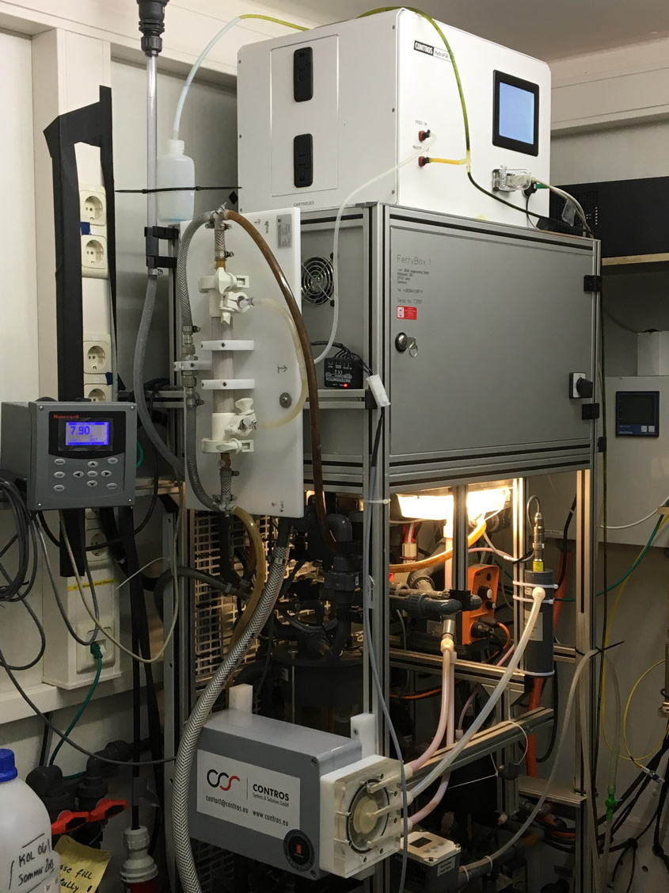
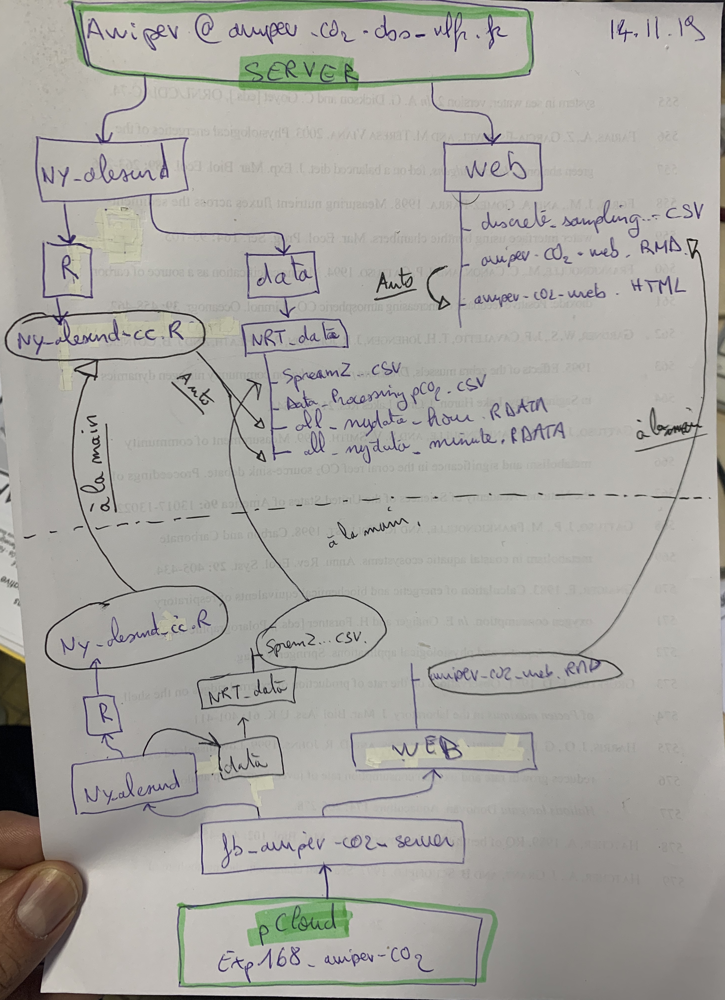

{width="250px"}

```{r set-up, echo=FALSE, warning=FALSE, message=FALSE, include=FALSE}
Sys.setlocale("LC_ALL", "en_US.UTF-8")
Sys.setenv(TZ='UTC') # on utilise UTC
rm(list = ls())

library("RColorBrewer")
if (!require("tidyverse")) install.packages("tidyverse")
library(tidyverse)
if (!require("seacarb")) install.packages("seacarb")
library("seacarb")
if (!require("gridExtra")) install.packages("gridExtra")
library("gridExtra")
if (!require("lubridate")) install.packages("lubridate")
library("lubridate")
if (!require("grid")) install.packages("grid")
library(grid)
if (!require("viridis")) install.packages("viridis")
library("viridis")
if (!require("dygraphs")) install.packages("dygraphs")
library("dygraphs")
if (!require("knitr")) install.packages("knitr")
require("knitr")
if (!require("lmodel2")) install.packages("lmodel2")
library("lmodel2")
if (!require("captioner")) install.packages("captioner")
library("captioner")
if (!require("xts")) install.packages("xts")
library("xts")
if (!require("scales")) install.packages("scales")
library("scales")
if (!require("skimr")) install.packages("skimr")
library("skimr")
if (!require("FNN")) install.packages("FNN")
library("FNN")
if (!require("patchwork")) install.packages("patchwork")
library("patchwork")
if (!require("pander")) install.packages("pander")
library("pander")
if (!require("tsibble")) install.packages("tsibble")
library("tsibble")
if (!require("slider")) install.packages("slider")
library("slider")
if (!require("kableExtra")) install.packages("kableExtra")
library("kableExtra")
if (!require("readxl")) install.packages("readxl")
library("readxl")
if (!require("oce")) install.packages("oce")
library(oce)
if (!require("pangaear")) install.packages("pangaear")
library("pangaear")
if (!require("latex2exp")) install.packages("latex2exp")
library("latex2exp")
if (!require("gtsummary")) install.packages("gtsummary")
library("gtsummary")
if (!require("todor")) install.packages("todor")
library("todor")
if (!require("ggpmisc")) install.packages("ggpmisc")
library("ggpmisc")
if (!require("tidyselect")) install.packages("tidyselect")
library("tidyselect")
if (!require("usethis")) install.packages("usethis")
library("usethis")
if (!require("ggOceanMaps")) install.packages("ggOceanMaps")
library("ggOceanMaps")
library(ggtext)  # remotes::install_github("clauswilke/ggtext")

# todor::todor_file("awipev-CO2.Rmd")
#usethis::edit_r_profile()
# to add to .Rprofile file: {.ggOceanMapsenv <- new.env(); .ggOceanMapsenv$datapath <- 'YourCustomPath'}

knitr::opts_chunk$set(echo = TRUE)

fig_nums <- captioner()
table_nums <- captioner(prefix = "Table")

#define who is the user and define path
#if (Sys.getenv("LOGNAME") == "gattuso") path = "../../pCloud\ Sync/Documents/experiments/exp168_awipev-CO2/"
if (Sys.getenv("LOGNAME") == "gattuso") path = "../../kDrive/Documents/experiments/exp168_awipev-CO2/"
if (Sys.getenv("LOGNAME") == "samir") path = "../../pCloud\ Sync/exp168_awipev-CO2/"

#################### which.closest function
which.closest <- function(x, table, ...) {
  round(approx(x=table, y=1:length(table), xout=x, ...)$y)
}

#################### Function cunit
# cunit(d = 65,i = "g", o = "mol")
# cunit(d = 65,i = "g", o = "mol")
cunit <- function(d = 65, i = "gC", o = "molCO2") {
    if (i == "gC" & o == "molCO2") {
      out <- d/12
      attributes(out) <- list(unit = "mol CO2")
    }
    if (i == "molC" & o == "molCO2") {
      out <- d*44/12
      attributes(out) <- list(unit = "mol CO2")
    }
  return(round(out, digits=2))
}

######## function to calculate min, max 3 quantiles
qq <- function (data, digits) { 
  as.numeric(formatC(quantile(x = data, probs = c(0, 0.025, 0.50, 0.975, 1), na.rm = TRUE),
                     format = "f", digits = digits))
}

#################### Regression function
# function regression plot with equation (MA or OLS) in title
ggreg <- function (xdata, ydata, type = "OLS", plot = TRUE, title = "title", xlab = "x", ylab = "y", proplot = TRUE, ...) 
  { # x and y are the names of the variables
  fit_data <- tibble(xdata = xdata, ydata = ydata)
  fit <- print(lmodel2::lmodel2(ydata ~ xdata))
if (type == "OLS") ty = 1 #one selects OLS only
if (type == "MA") ty = 2 #one selects MA only
intercept <- fit$regression.results$Intercept[ty]
slope <- fit$regression.results$Slope[ty]
predicted <- intercept + xdata * slope
error <- ydata - predicted
if (plot == TRUE) {
  plt <- ggplot(data = fit_data, aes(x = xdata, y = ydata)) + 
  geom_point(na.rm = TRUE, size = 2, colour = "blue") +
  geom_abline(aes(intercept = intercept, slope = slope),
              colour = "blue")  + 
  labs(title = title,
       subtitle = paste("\ntype: ", type,
                     "; R2 = ", round(fit$rsquare, digits = 2),
                     "; Intercept =", signif(intercept, 3),
                     "; Slope =", signif(slope, 3),
                     "\nP =", signif(fit$P.param, 3),
                    "rmse =", signif(sqrt(mean(error^2, na.rm = TRUE)), 3)),
       x = xlab,
       y = ylab) +
    theme_bw() +
    theme(plot.title = element_text(size = 10, face = "bold"),
          plot.subtitle = element_text(size = 8))
    if (proplot == TRUE) { # property-property plot
      plt <- plt +
        geom_abline(slope = 1, intercept = 0, linetype = "dashed") +
        theme(aspect.ratio = 1) +
        coord_fixed(ratio = 1, xlim = NULL, ylim = NULL, expand = TRUE, clip = "on")
    }
  return(list(plot = plt, fit = fit))
  } else {
  return(fit)
    }
}

#################### Function RMSE for model 2 regression root mean square error
#test <- readr::read_csv(file="test_file")
lm2 <- function(data = NULL, x, y) {
  col_x <- eval(substitute(x), data)
  col_y <- eval(substitute(y), data)
  col_x <- x
  col_y <- y
fit <- lmodel2(col_y ~ col_x, nperm = 99)
  intercept_MA <- fit$regression.results[2,2]
  slope_MA <- fit$regression.results[2,3]
  intercept_OLS <- fit$regression.results[1,2]
  slope_OLS <- fit$regression.results[1,3]
  predicted <- intercept_OLS + col_x * slope_OLS
  error <- col_x - predicted
  rsquare <- fit$rsquare
  P.param <- fit$P.param
  my_list <- list(intercept_MA = intercept_MA, 
                  slope_MA = slope_MA,
                  intercept_OLS = intercept_MA, 
                  slope_OLS = slope_MA,
                  rsquare = rsquare,
                  P = P.param,
                  rmse = sqrt(mean(error^2, na.rm = TRUE)))
  return(my_list)
}

#################### Mytheme
Mytheme <- function(size_labs = 7, face_font="plain") {
  theme_bw() +
  theme(title = element_text(face=face_font, size=size_labs, color="black"),
        legend.title = element_text(face=face_font, size=size_labs, color="black"),
        legend.text = element_text(face=face_font, size=size_labs, color="black"),
        axis.text.x = element_text(face=face_font, size=size_labs, color="black"),
        axis.title.x = element_text(face=face_font, size=size_labs),
        axis.text.y = element_text(face=face_font, color="black", size=size_labs),
        axis.title.y = element_text(face=face_font, size=size_labs),
        axis.ticks.x = element_line(size=0.1),
        axis.ticks.y = element_line(size=0.1),
        axis.ticks.length = unit(1.1, "mm"),
        #panel.grid.major = element_line(size = 0.25, color="black", linetype="dashed"),
        #aspect.ratio = 1 / 2,
        plot.margin = margin(t = 0, r = 0, b = 0, l = 0, unit = "cm")
  )
}

ggplotRegression <- function(fit){
ggplot(fit$model, aes_string(x = names(fit$model)[2], y = names(fit$model)[1])) + 
  geom_point() +
  stat_smooth(method = "lm", col = "red", se= FALSE) +
  labs(title = paste("Adj R2 = ",signif(summary(fit)$adj.r.squared, 5),
                     "Intercept =",signif(fit$coef[[1]],5 ),
                     " Slope =",signif(fit$coef[[2]], 5),
                     " P =",signif(summary(fit)$coef[2,4], 5)))
}

```

```{r make location map}
# svalbard_map <- basemap(limits = c(10.00, 22.00, 76.3, 80.9), bathymetry = FALSE, shapefiles = "Arctic",
#         legends = FALSE, glaciers = FALSE)
# ggsave(filename = "figures/svalbard_map.png", plot = svalbard_map, width = 25, height = 25, units = "cm")
# ggsave(filename = "figures/svalbard_map.eps", plot = svalbard_map, width = 25, height = 25, units = "cm")
# kong_map <- basemap(limits = c(11.00, 12.69, 78.86, 79.10), bathymetry = TRUE, shapefiles = "Svalbard",
#         legends = FALSE, glaciers = TRUE, lat.interval = 0.1, lon.interval = 0.5)
# ggsave(filename = "figures/kong_map.png", plot = kong_map, width = 25, height = 25, units = "cm")
# ggsave(filename = "figures/kong_map.eps", plot = kong_map, width = 25, height = 25, units = "cm")
```


```{r read observatory data, cleanup and prepare ferrybox data, echo=FALSE, warning=FALSE, message=FALSE}
d_hour <-
  readRDS(file = paste0(
    path,
    "fb_awipev-co2_server/ny-alesund/data/NRT_data/nydata_hour.rds"
  ))
d_hour <- as_tsibble(d_hour, index = datetime) %>% #d_all will be the merger
  tsibble::fill_gaps(.full=TRUE)
d_hour$date <-  as.Date(d_hour$datetime, format="%Y-%m-%d")

d_hour <- d_hour %>%
  dplyr::filter(datetime <= as.POSIXct("2021-01-10")) %>% #cutoff date
  dplyr::select(-pco2_inst) %>% # this is the serial number of pCO2 sensor, not needed
  dplyr::rename(
    pco2_fb = pco2_corr_filtered,
    temp_dur = temp_dur_filtered,
    pco2_raw = pco2_raw_filtered,
    sal_fb = sal_fb_filtered,
    temp_insitu_11m = temp_insitu_11m_filtered,
    temp_fb = temp_fb_filtered,
    ph_dur = ph_dur_filtered
  ) %>% 
  # pCO2 data post 2020-03-01 eliminated because no maintenance and lots of algae
  # pH durafet data post 2020-01-01 eliminated because no maintenance and lots of algae
  dplyr::mutate(pco2_fb = ifelse(datetime >= as.POSIXct("2020-03-01 00:00"), NA, pco2_fb),
                ph_dur = ifelse(datetime >= as.POSIXct("2020-01-01 00:00"), NA, ph_dur)) %>%
  arrange(datetime)

# read a file provided by Philipp on 2021-04-09 which fills most gaps of pressure data
# depth_complete replaces all other depth and pressure variables
svl_remos_depth <- tibble(
  readRDS(file = paste0(
    path,
    "fb_data/svl_remos_depth.rds"
  ))) %>% 
  dplyr::select(-adcp_fill, -ctd_fill)

d_hour <- dplyr::left_join(d_hour, svl_remos_depth, by = 'datetime') %>% 
  dplyr::mutate(depth = ifelse(!is.na(pressure_insitu_ctd), pressure_insitu_ctd, depth_complete))

# # Many issue with sal_ctd_insi
# # read files made available by Philipp on 2021-12-09 with quality-controlled data
# # not useful as these are FerryBox data...
# https://dashboard.awi.de/?dashboard=3865
# # NOT USED
# file_list <- c("10.1594/PANGAEA.896828", "10.1594/PANGAEA.896822", "10.1594/PANGAEA.896821", "10.1594/PANGAEA.896771", "10.1594/PANGAEA.896770", "10.1594/PANGAEA.896170", "10.1594/PANGAEA.897349", "10.1594/PANGAEA.927607", "10.1594/PANGAEA.929583")
# i <- 0; tmp <- NULL
# for (i in 1:length(file_list)) {
#     z <- pg_data(file_list[i])
#     tmp <- dplyr::bind_rows(tmp, z[[1]]$data)
# }
# tmp <- tmp %>% 
#   dplyr::mutate(datetime = lubridate::parse_date_time(tmp$`Date/Time`,
#                 orders = "ymd HM")) %>% 
#   dplyr::select(datetime, `Sal (PSU)`, `Temp [°C]`) %>% 
#   dplyr::arrange(datetime) %>% 
#   dplyr::distinct(datetime, .keep_all = TRUE) %>%  # there are a few duplicated datetime
#   as_tsibble(index = datetime)
# eff <- dplyr::left_join(d_hour, tmp, by = "datetime")

# To address the issues of sal_insitu_ctd (many outliers, see figure in tab salinities)
# the impossibly low values are identified using the threshold of the 
# minimum salinity measured in the FerryBox - 0 unit
d_hour <- d_hour %>% 
  dplyr::mutate(sal_insitu_ctd = ifelse(sal_insitu_ctd < min(sal_fb, na.rm = TRUE) - 0 |
                                        sal_insitu_ctd > 36,  # 2 outliers
                                        sal_fb, sal_insitu_ctd))

# check_plot <- d_hour %>% 
#   ggplot() + geom_point(aes(x=datetime, y=depth, col='blue', alpha = 0.7)) +
#   geom_point(aes(x=datetime, y=depth, col='red', alpha = 0.3))

# # read a file provided by Philipp on 2021-04-13 in the hope that it contains
# # in situ CTD salinity data for any month of June. IT DOES NOT
# sal_2021_04_13 <-
#   readRDS(file = paste0(
#     path,
#     "fb_data/remos_2021-04-13/svl_remos_ctd_salinity_2017_2020.rds"
#   )) %>% 
#   dplyr::rename(sal_new = svl_ctd_salinity_mean)
# zz <- dplyr::left_join(d_hour, sal_2021_04_13, by = 'datetime') %>%
#   dplyr::mutate(month = month(date)) %>%
#   dplyr::filter(depth < 4, month(date) == 6, datetime > as.POSIXct("2017-07-01 11:00:00"))
# pp <- ggplot(zz, aes(x=datetime, y=sal_new)) +
#     geom_point()

d_all <- d_hour %>%
  dplyr::mutate_all(function(x)
    ifelse(is.nan(x), NA, x)) %>% # replace all NaN by NA
  dplyr::mutate(
    depth_group = as.factor(
      dplyr::case_when(
        depth > 0 & depth <= 2 ~ '0-2',
        depth > 2 & depth <= 4 ~ '2-4',
        depth > 4 & depth <= 6 ~ '4-6',
        depth > 6 & depth <= 8 ~ '6-8',
        depth > 8 & depth <= 12 ~ '>8',
        #8 to 12.4
        TRUE ~ 'NA'
      )
    ),
    sal_insitu_ctd_1m = ifelse(depth_group == '0-2', sal_insitu_ctd, NA),
    sal_insitu_ctd_3m = ifelse(depth_group == '2-4', sal_insitu_ctd, NA),
    sal_insitu_ctd_5m = ifelse(depth_group == '4-6', sal_insitu_ctd, NA),
    sal_insitu_ctd_7m = ifelse(depth_group == '6-8', sal_insitu_ctd, NA),
    sal_insitu_ctd_10m = ifelse(depth_group == '>8', sal_insitu_ctd, NA),
    temp_insitu_ctd_1m = ifelse(depth_group == '0-2', temp_insitu_ctd, NA),
    temp_insitu_ctd_3m = ifelse(depth_group == '2-4', temp_insitu_ctd, NA),
    temp_insitu_ctd_5m = ifelse(depth_group == '4-6', temp_insitu_ctd, NA),
    temp_insitu_ctd_7m = ifelse(depth_group == '6-8', temp_insitu_ctd, NA),
    temp_insitu_ctd_10m = ifelse(depth_group == '>8', temp_insitu_ctd, NA),
  ) %>%
  dplyr::rowwise() %>%
  dplyr::mutate(n_depth_ctd = sum(is.na(
    # create new variable to identify the hours for which there are CTD data at more than 1 depth
    c(
      temp_insitu_ctd_1m,
      temp_insitu_ctd_3m,
      temp_insitu_ctd_5m,
      temp_insitu_ctd_7m,
      temp_insitu_ctd_10m
    )
  ), na.rm = TRUE)) %>%
  ungroup()

#restore datetime, date which are mangled by the mutates above, arrange ascending
d_all <- d_all %>% 
  dplyr::mutate(datetime = d_hour$datetime, 
                date = d_hour$date,
                year = lubridate::year(d_hour$datetime), # year as a number
                monthd = lubridate::month(d_hour$datetime), # month as a number
                montht = lubridate::month(d_hour$datetime, label = TRUE, abbr = TRUE) ,
                hour = lubridate::hour(d_hour$datetime)# abbreviated months
  )
d_all <- d_all %>% 
  dplyr::select(order(colnames(d_all)))
rm(d_hour)
```

```{r sal and temp data, fig.width=10, fig.height=4, echo=FALSE, message= FALSE}
### Fill gaps in sal_fb using sal_insitu_ctd_10m; new column = sal_fb_mix ###
### Fill gaps in sal_insitu_ctd using sal_fb_mix; new column = sal_insitu_ctd_mix ###
### Fill gaps in temp_insitu_11m using temp_insitu_ctd_10m; new column = temp_insitu_11m_mix ###
d_all <- d_all %>%
  dplyr::mutate(sal_fb_mix = ifelse(!is.na(sal_fb), sal_fb, sal_insitu_ctd_10m),
                sal_insitu_ctd_mix = ifelse(!is.na(sal_insitu_ctd), sal_insitu_ctd, sal_fb_mix),
                temp_insitu_11m_mix = ifelse(!is.na(temp_insitu_11m), temp_insitu_11m, temp_insitu_ctd_10m)
                )
```

```{r read and prepare discrete AT+CT, echo=FALSE, warning=FALSE, message=FALSE}
d <-
  read_excel(
    paste0(
      path,
      "fb_data/Discrete_analyses_AT_CT/Discrete_sampling_AWIPEV.xlsx"
    ),
    skip = 0,
    col_names = TRUE,
    na = "NA"
  ) %>%
  dplyr::mutate(
    datetime = lubridate::dmy_hm(sampling_date),
    measure_date = lubridate::dmy(measure_date, tz = "UTC"),
    date = lubridate::as_date(datetime)
  ) %>%
  dplyr::rename(
    ph_s_sf = pH_s_seafet,
    ph_s_dur = pH_s_durafet,
    qflag_ph_s_sf = qflag_pH_s_seafet,
    qflag_ph_s_dur = qflag_pH_s_durafet
  ) %>%
  dplyr::select(datetime, date, everything())
# Add the flag location: some samples have been collected at the pier. Notes them here.
# Flag 1 = collected on the pIer by Niskin and flag 0 = collected in the FB (normal collect)
 # And keep data with flag 0 for FB location
d <- d %>%
  dplyr::mutate(
    location_flag = ifelse(
      datetime == as.POSIXct("2016-04-21 09:25:00") |
        datetime == as.POSIXct("2016-02-10 14:00:00") |
        datetime == as.POSIXct("2016-02-17 09:20:00") |
        datetime == as.POSIXct("2016-02-24 14:20:00") |
        datetime == as.POSIXct("2016-02-04 09:30:00") |
        datetime == as.POSIXct("2016-01-27 15:00:00") |
        datetime == as.POSIXct("2016-01-13 13:45:00") |
        datetime == as.POSIXct("2016-01-06 14:10:00") |
        datetime == as.POSIXct("2015-12-24 10:45:00") |
        datetime == as.POSIXct("2015-12-30 13:30:00") |
        datetime == as.POSIXct("2018-01-05 15:20:00") |
        datetime == as.POSIXct("2018-02-02 14:35:00") |
        datetime == as.POSIXct("2018-03-02 14:10:00") |
        datetime == as.POSIXct("2019-05-31 11:45:00"),
      1,
      0
    )
  )
d <- d %>%
  dplyr::filter(location_flag == 0) %>% 
# below we change the time of 2 discrete samplings during period 1 of seafet deployment
# This is to enable calibration when the REMOS was at 9 m depth
  dplyr::mutate(datetime = case_when(datetime == as.POSIXct("2017-08-24 13:30:00") ~ as.POSIXct("2017-08-24 19:00:00"),
                                     datetime == as.POSIXct("2017-11-28 09:15:00") ~ as.POSIXct("2017-11-28 13:00:00"),
                   TRUE ~ datetime))


######
# below quality flag of spec pH is changed from 2 (good) to 3 (questionable)
# on 2018-09-11 and 2019-07-12 because after calibration, 
# the difference between pH measured and calibrated seafet pH i large.
d <- d %>% 
  dplyr::mutate(qflag_ph_s_sf = ifelse((lubridate::date(datetime) == as.POSIXct("2018-09-11") | lubridate::date(datetime) == as.POSIXct("2019-07-12")), 3, 2))# %>% 
  # dplyr::filter((lubridate::date(datetime) == as.POSIXct("2018-09-11") |
  #               lubridate::date(datetime) == as.POSIXct("2019-07-12"))) %>% 
  # dplyr::select(datetime, qflag_ph_s_sf)

####

# Keep only flag = 2 for at/ct analysis 
# Keep only flag = 2 for pH durafet and seaFET.
d <- d %>%
  dplyr::mutate(ct = ifelse(qflag_ct == 2, ct, NA),
                at = ifelse(qflag_at == 2, at, NA),
                ph_s_sf = ifelse(qflag_ph_s_sf == 2, ph_s_sf, NA),
                ph_s_dur = ifelse(qflag_ph_s_dur == 2, ph_s_dur, NA))

# Mercuric chloride correction (Dickson et al. 2007, SOP3a)
d <- d %>%
  dplyr::mutate(at = at * 1.0002,
                ct = ct * 1.0002)

# mean at and ct
at_ct_mean <- d %>% 
#  group_by(datetime)%>%
  group_by(date) %>%
  dplyr::summarize(at_mean = mean(at, na.rm = TRUE),
                   ct_mean = mean(ct, na.rm = TRUE),
                   at_sd = sd(at, na.rm = TRUE), 
                   ct_sd = sd(ct, na.rm = TRUE)
                   )
d <- left_join(d, at_ct_mean, by='date') %>% 
  dplyr::select(datetime, date, temp_s_lab, ph_s_sf, ph_s_dur, location_flag, at, ct, at_mean, ct_mean) %>% # removed useless variables and also to do unique next
  dplyr::distinct()

# Fill the gaps in at_mean with interpolation
TAinterp <- approx(d$datetime, d$at_mean, xout=d$datetime, method="linear", rule = 2, ties = "ordered")
names(TAinterp) <- c("datetime", "at_mean_interp")
TAinterp <- as.data.frame(TAinterp)
d$at_mean_interp <- TAinterp$at_mean_interp


CTinterp <-approx(d$datetime, d$ct_mean, xout=d$datetime, method="linear", rule = 2, ties = "ordered")
names(CTinterp) <- c("datetime", "ct_mean_interp")
CTinterp <- as.data.frame(CTinterp)
d$ct_mean_interp <- CTinterp$ct_mean_interp


# interpolation of temp_insitu_11m_mix/sal_fb_mix in d_all in order to have a full temperature for pHinsi()
# We take temp_insitu_11m_mix/sal_fb_mix because of the depth (temp11m insitu + temp10m ctd)
tempmixinterp <- approx(d_all$datetime, d_all$temp_insitu_11m_mix, 
                        xout=d_all$datetime, method="linear", rule = 2, ties = "ordered")
names(tempmixinterp) <- c("datetime", "temp_insitu_11m_mix_interp")
tempmixinterp <- as.data.frame(tempmixinterp)
d_all$temp_insitu_11m_mix_interp <- tempmixinterp$temp_insitu_11m_mix_interp

salmixinterp <- approx(d_all$datetime, d_all$sal_fb_mix, xout=d_all$datetime, 
                       method="linear", rule = 2, ties = "ordered")
names(salmixinterp) <- c("datetime", "sal_fb_mix_interp")
salmixinterp <- as.data.frame(salmixinterp)
d_all$sal_fb_mix_interp <- salmixinterp$sal_fb_mix_interp

# add sal_fb + sal_insitu_ctd + temp_fb + temp_insitu_ctd from d_all into d, to use pHinsi
# use the closest time to add them
closest <- which.closest(d$datetime, d_all$datetime) # closest date and time
d$closest_datetime <- d_all$datetime[closest]
# if the closest value is more than 30 min away, then we do not take it
d$closest_datetime[abs(d$datetime - d_all$datetime[closest]) > 30*60] <- NA
# create closest_datetime in d_all (copy of datetime)
d_all$closest_datetime <- d_all$datetime

d <- left_join(d, d_all %>%
                 dplyr::select(
                   c(closest_datetime,
                     hour,
                     sal_fb,
                     temp_fb,
                     temp_insitu_11m_mix,
                     temp_insitu_11m_mix_interp,
                     sal_fb_mix,
                     sal_fb_mix_interp,
                     temp_insitu_11m,
                     temp_insitu_ctd,
                     temp_sf,
                     depth
                   )
                 ), by = "closest_datetime") %>% 
  dplyr::select(-closest_datetime)

# Conversion of spec pH of in situ samples to in situ temp and 4 °C
pH_seafet <- d %>%
  dplyr::filter(!is.na(ph_s_sf) & !is.na(temp_insitu_11m_mix_interp))

pH_seafet <- pH_seafet %>% 
  dplyr::mutate(
    ph_s_sf_temp_insi = pHinsi(pH = pH_seafet$ph_s_sf, 
                         ALK = pH_seafet$at_mean_interp*1e-6, 
                         Tinsi = pH_seafet$temp_insitu_11m_mix_interp, 
                         Tlab = pH_seafet$temp_s_lab, Pinsi = 11/10, 
                         S = pH_seafet$sal_fb_mix_interp, Pt = 0, Sit = 0, 
                         k1k2 = "l", kf = "dg", ks="d", 
                         pHscale = "T", b="l10"),
   ph_s_sf_temp_4 = pHinsi(pH = pH_seafet$ph_s_sf, # with Lueker
                         ALK = pH_seafet$at_mean_interp*1e-6, Tinsi = 4, 
                         Tlab = pH_seafet$temp_s_lab, Pinsi = 11/10, 
                         S = pH_seafet$sal_fb_mix_interp, Pt = 0, Sit = 0, 
                         k1k2 = "l", kf = "dg", ks="d", 
                         pHscale = "T", b="l10")
  )
# Conversion of spec pH of FerryBox samples to FerryBox temp
pH_durafet <- d %>%
  tidyr::drop_na(ph_s_dur, sal_fb, temp_fb)
pH_durafet <- pH_durafet %>% 
  dplyr::mutate(
    ph_s_dur_temp_fb = pHinsi(pH = pH_durafet$ph_s_dur, 
                              ALK = pH_durafet$at_mean_interp*1e-6, Tinsi = pH_durafet$temp_fb, 
                              Tlab = pH_durafet$temp_s_lab, Pinsi = 0, S = pH_durafet$sal_fb, 
                              Pt = 0, Sit = 0, k1k2 = "l", kf = "dg", ks="d", pHscale = "T", b="l10"),
    ph_s_dur_temp_4 = pHinsi(pH = pH_durafet$ph_s_dur,
                             ALK = pH_durafet$at_mean_interp * 1e-6, Tinsi = 4,
                             Tlab = pH_durafet$temp_s_lab, Pinsi = 0,
                             S = pH_durafet$sal_fb, Pt = 0, Sit = 0, k1k2 = "l", 
                             kf = "dg", ks = "d",
                             pHscale = "T", b = "l10")
   )

# Make mean for replicates + SD
pH_seafet_mean <- pH_seafet %>%
  dplyr::select(datetime, ph_s_sf_temp_insi, ph_s_sf_temp_4) %>% 
  dplyr::group_by(datetime) %>% 
  dplyr::summarise(ph_s_sf_temp_insi_mean = mean(ph_s_sf_temp_insi, na.rm = TRUE),
                   ph_s_sf_temp_insi_sd = sd(ph_s_sf_temp_insi, na.rm = TRUE),
                   ph_s_sf_temp_4_mean = mean(ph_s_sf_temp_4, na.rm = TRUE)
                   )
pH_durafet_mean <- pH_durafet %>%
  dplyr::select(datetime, ph_s_dur_temp_fb, ph_s_dur_temp_4) %>% 
  dplyr::group_by(datetime) %>% 
  dplyr::summarize(ph_s_dur_temp_fb_mean = mean(ph_s_dur_temp_fb, na.rm = TRUE),
                   ph_s_dur_temp_fb_sd = sd(ph_s_dur_temp_fb, na.rm = TRUE),
                   ph_s_dur_temp_4_mean = mean(ph_s_dur_temp_4, na.rm = TRUE))
# put back the right column name for the following script
pH_durafet_mean$ph_s_dur_temp_fb <- pH_durafet_mean$ph_s_dur_temp_fb_mean
pH_seafet_mean$ph_s_sf_temp_insi <- pH_seafet_mean$ph_s_sf_temp_insi_mean

# make means in "d" to have same format and call it "discrete"
discrete <- d %>%
  group_by(datetime) %>%
#dplyr::select( datetime, date,hour,sal_fb,sal_fb_mix_interp ,sal_fb_mix,temp_fb, at_mean_interp, at, ct_mean_interp, ct, temp_insitu_11m_mix,temp_insitu_11m_mix_interp,temp_insitu_11m) %>%
  summarise(datetime = mean(datetime, na.rm = TRUE),
    sal_fb = mean(sal_fb, na.rm = TRUE),
    sal_fb_mix = mean(sal_fb_mix, na.rm = TRUE),
    sal_fb_mix_interp = mean(sal_fb_mix_interp, na.rm = TRUE),
    temp_fb = mean(temp_fb, na.rm = TRUE),
     temp_insitu_11m_mix = mean(temp_insitu_11m_mix, na.rm = TRUE),
    temp_insitu_11m_mix_interp = mean(temp_insitu_11m_mix_interp, na.rm = TRUE),
        temp_insitu_11m = mean(temp_insitu_11m, na.rm = TRUE),
    at_mean_interp = mean(at_mean_interp, na.rm = TRUE),
    at = mean(at, na.rm = TRUE),
    ct_mean_interp = mean(ct_mean_interp, na.rm = TRUE),
    ct = mean(ct, na.rm = TRUE) ,.groups = 'drop_last'
  )

discrete <- left_join(discrete, pH_seafet_mean, by='datetime')
discrete <- left_join(discrete, pH_durafet_mean, by='datetime')

##   *****Attention, temp noted by logisticians in d is FB temp with SBE45 ******
##   *****Attention, I asked to the logisticians to log insitu temp from 9 june 2019
##   *****Attention, but no longer used in the script, so no problem

# pH calculated (at and ct) at Ferrybox sal and temp
discrete_no_na <- discrete %>%
  dplyr::filter(!is.na(sal_fb)  & !is.na(temp_fb) & !is.na(at) & !is.na(ct))
discrete_is_na <- discrete %>%
  dplyr::filter(is.na(sal_fb)  | is.na(temp_fb) | is.na(at) | is.na(ct))
carb <- carb(15, discrete_no_na$at_mean_interp*1e-6, discrete_no_na$ct_mean_interp*1e-6, S = discrete_no_na$sal_fb, T = discrete_no_na$temp_fb, P = 0, Pt = 0, Sit = 0, k1k2 = "l", kf = "dg", ks = "d", pHscale = "T", b = "l10")
discrete_no_na$ph_calc_fb <- carb$pH # pH to compare with durafet pH (at Ferrybox temp and sal)
discrete_no_na$pco2_calc_fb <- carb$pCO2

# create new variable in "discrete_is_na" to bind "discrete_no_na"
discrete_is_na$ph_calc_fb <- NA
discrete_is_na$pco2_calc_fb <- NA
discrete <- bind_rows(discrete_no_na, discrete_is_na) %>% 
  dplyr::arrange(datetime)
```

```{r read and prepare nutrient data, echo=FALSE, warning=TRUE, message=FALSE}
# File "Ferrybox nutrients 2014-2018.xlsx" provided by 
# Willem van de Poll <w.h.van.de.poll@rug.nl> on 2020-01-16
# nutrients in umol/l
nuts <-
  readxl::read_excel(paste0(path, "fb_data/Ferrybox nutrients 2014-2018.xlsx"),
                     skip = 1) %>%
  drop_na(date) %>%
  dplyr::mutate(datetime = as.POSIXct(paste0(date, " 12:00:00")),) %>% # assuming sampling time 12:00
  dplyr::filter(datetime > as.POSIXct("2015-07-09"))
# The nearest times
time_index <- unique(d_all$datetime)
# nuts$closest <- time_index[
#   FNN::knnx.index(time_index, # The values to be queried (big df)
#                   as.vector(nuts$datetime), # The value to find the closest match to (small df)
#                   k = 1)] # The number of closest values to return
nuts <- nuts %>% 
  dplyr::mutate(closest = time_index[
  FNN::knnx.index(time_index, # The values to be queried (big df)
                  as.vector(nuts$datetime), # The value to find the closest match to (small df)
                  k = 1)]) %>%  # The number of closest values to return
  dplyr::select(-date, -datetime) %>% 
  dplyr::rename(NO3NO2 = `NO3+NO2`)
# cleanup and convert in umol/kg
d_all <- left_join(d_all, nuts, by = c("datetime" = "closest")) #%>% 
  #dplyr::select(-closest_datetime)
d_all <- d_all %>% 
  dplyr::mutate(density_fb = seacarb::rho(S = sal_fb, T = temp_fb, P = 0),
                po4 = PO4 / (density_fb/1000),
                nh4 = NH4 / (density_fb/1000),
                no3no2 = NO3NO2 / (density_fb/1000),
                no3 = NO3 / (density_fb/1000),
                si = Si / (density_fb/1000)
  ) %>% 
  dplyr::select(-PO4, -NH4, -NO3NO2, -NO3, -Si)
```

```{r Combine discrete and continous data, echo=FALSE}
# at
closest <- which.closest(discrete$datetime, d_all$datetime) # closest date and time
discrete$closest_datetime <- d_all$datetime[closest]
# if the closest value is more than 30 min away, then we do not take it
discrete$closest_datetime[abs(discrete$datetime - d_all$datetime[closest]) > 30*60] <- NA
discrete2merge <- discrete %>%
  dplyr::select(closest_datetime, at) %>%
    dplyr::filter(!is.na(closest_datetime)) %>%
  rename(datetime=closest_datetime)
d_all <- full_join(d_all, discrete2merge, by="datetime")

# ct
discrete2merge <- discrete %>%
  dplyr::select(closest_datetime, ct) %>%
  dplyr::filter(!is.na(closest_datetime)) %>%
  rename(datetime=closest_datetime)
d_all <- full_join(d_all, discrete2merge, by="datetime")

# pH calculated ferrybox
discrete2merge <- discrete %>%
  dplyr::select(closest_datetime, ph_calc_fb) %>%
  dplyr::filter(!is.na(closest_datetime)) %>%
  rename(datetime=closest_datetime)
d_all <- full_join(d_all, discrete2merge, by="datetime")

# seaFET pH 
discrete2merge <- discrete %>%
  dplyr::select(closest_datetime, ph_s_sf_temp_insi_mean, ph_s_sf_temp_4_mean) %>%
  dplyr::rename(ph_s_sf_temp_insi = ph_s_sf_temp_insi_mean,
                ph_s_sf_temp_4 = ph_s_sf_temp_4_mean) %>%
  dplyr::filter(!is.na(closest_datetime)) %>%
  rename(datetime=closest_datetime)
d_all <- full_join(d_all, discrete2merge, by="datetime")
d_all <- d_all %>% 
  dplyr::mutate(ph_s_sf_temp_insi = ifelse(n_depth_ctd >= 4, ph_s_sf_temp_insi, NA)) # eliminate ph spec data when the profiler was at several depth during the same hour
  #dplyr::mutate(ph_s_sf_temp_insi = ifelse(!is.na(temp_insitu_ctd_7m) |
  #                                           !is.na(temp_insitu_ctd_9m), 
   #                                        ph_s_sf_temp_insi, NA)) # only use ph spec data when profiler was below 6 m

# durafet pH 
discrete2merge <- discrete %>%
  dplyr::select(closest_datetime, ph_s_dur_temp_fb_mean, ph_s_dur_temp_4_mean) %>%
  dplyr::rename(ph_s_dur_temp_fb = ph_s_dur_temp_fb_mean,
                ph_s_dur_temp_4 = ph_s_dur_temp_4_mean # lueker by default
                ) %>%
  dplyr::filter(!is.na(closest_datetime)) %>%
  rename(datetime=closest_datetime)
d_all <- full_join(d_all, discrete2merge, by="datetime")

# calculated pCO2 
discrete2merge <- discrete %>%
  dplyr::select(closest_datetime, pco2_calc_fb) %>%
  dplyr::filter(!is.na(closest_datetime)) %>%
  rename(datetime=closest_datetime)
d_all <- full_join(d_all, discrete2merge, by="datetime")

saveRDS(file= paste0(path, "fb_data/d_all.rds"), d_all)

## bind the voltages and deployment ##

# Duplicate datetime in closest_datetime to do the left_join
d_all$closest_datetime <- d_all$datetime
discrete <- left_join(discrete, d_all %>% dplyr::select(c(closest_datetime, voltEXT, voltINT)), by="closest_datetime")

# order columns
d_all <- d_all %>% 
  dplyr::select(order(colnames(d_all))) %>% 
  dplyr::select(datetime, date, year, monthd, montht, everything())
```

```{=html}
<style type="text/css">

body{ /* Normal  */
      font-size: 18px;
  }
h3{ /* Header 3 */
  font-size: 22px;
  <!-- font-family: "Times New Roman", Times, serif; -->
  color: DarkBlue;
}
h4{ /* Header 4 */
  font-size: 18px;
  <!-- font-family: "Times New Roman", Times, serif; -->
  color: DarkBlue;
}
h5{ /* Header 5 */
  font-size: 16px;
  <!-- font-family: "Times New Roman", Times, serif; -->
  color: DarkBlue;
}
</style>
```
#  {.tabset .tabset-fade .tabset-pills}

## Infos

### **Introduction**

<div style="text-align: justify">

The AWIPEV-CO2 project aims at starting the first time series for the
carbonate chemistry in the Arctic Ocean as part of the AWIPEV Underwater
Observatory. It comprises two components: (1) continuous real-time
measurements and (2) discrete measurements. The rationale is that
discrete measurements are absolutely needed to calibrate and validate
the sensors.

### **AWIPEV Underwater Observatory**

<div style="text-align: justify">

The AWIPEV Underwater Observatory has been deployed at Ny-Alesund
(Spitsbergen, 78°55'18N, 11°56'31E) in June 2012. It is part of the
German Project COSYNA (Coastal Observation Systems of the Northern- and
Arctic Seas), which aims at increasing the availability of continuous
real-time data from remote but climatically-sensitive ecosystems. The
AWIPEV underwater observatory comprises a fully remote controlled
FerryBox system fed with seawater pumped in front of the old pIer at 12
m depth. Temperature, salinity, pressure, turbidity, oxygen, chl-*a*
fluorescence are measured. Furthermore, an additional remote controlled
underwater sensor unit able to profile from 12 m to the surface at any
frequency carries additional sensors for salinity, pressure, turbidity,
oxygen chl-*a* fluorescence and PAR. The system also comprises an ADCP
for continuous measurements of currents and waves. Besides these
standard sensors, the underwater unit is equipped with a webcam and
stereo-optical device to remotely assess fish and jellyfish populations.
The AWIPEV observatory is specifically designed for polar experimental
work under extreme conditions including ice coverage and the
inaccessibility for about 7 months during polar winter. During this
time, the system is remotely controlled and maintained from Germany. All
data sampled by the sensors are continuously sent to a central server
system at Helgoland Island where the data are stored and processed. The
processed data are open access and available at
<http://codm.hzg.de/codm>.

::: {style="text-align:center" markdown="1"}



:::

### **Continuous and semi-continuous measurements**

<div style="text-align: justify">

The Arctic version of the Contros-Kongsberg HydroC CO~2~ FT (Carbon
Dioxyde partial pressure Flow Through surface water sensor) has been
installed in July 2015. Molecules of dissolved CO~2~ diffuse through a
thin composite membrane into the internal gas circuit leading to a
detector chamber, where the partial pressure of CO~2~ is determined by
means of infra-red absorption spectrometry. Concentration-dependent IR
light is converted into the output signal from calibration coefficients
stored in firmware and data from additional sensors within the gas
circuit. The measuring range is 200-1000 uatm, resolution is \< 1 uatm
and accuracy is +- 1% reading. The sensor is the first instrument in the
measuring loop; data are logged every minute. This instrument requires
yearly factory calibration; two sensors ara available to allow a
continuous time series.

Since February 2016, total alkalinity (AT) is measured every 90 min with
a Contros-Kongsberg HydroFIA TA (Total Alkalinity analyser flow through
system). Fifty ml of seawater is filtered (0.2 um) using a
Contros-Kongsberg cross-flow filter and then acidified using dilute
hydrochloric acid (0.1 N). CO~2~ is then flushed out (open-cell
titration) and the final pH measured by means of an indicator dye
(bromocresol green) and visible absorption spectrometry. Together with
salinity and temperature at the time of measurement, the pH reading is
used to calculate AT. According to the manufacturer, the measuring range
is 400 umol/kg dynamic range, resolution 0.1 umol/kg, accuracy 25
umol/kg (+- 1%) and precision 5 umol/kg (+- 0.2%).

In August 2017, a seaFET Ocean pH sensor (Sea-Bird Scientific) has been
added to the UWO. This new sensor continuously measures pH at 11 m using
an ISFET (Ion Sensitive Field Effect Transistor). According to the
manufacturer, the measuring range is between 6.5 and 9 pH units, initial
accuracy is 0.02 pH units and precision is 0.004 pH units. Operating
salinity and temperature range are 20 to 40 PSU and 0 to 50°C
respectively.

In August 2017, a Durafet III pH electrode connected to a UDA2128
Analyser (Honeywell) was also implemented to the Ferrybox flow-through
system. This electrode continuously measures pH, in the Ferrybox,
through an ISFET. According to the manufacturer, the measuring range is
between 0 and 14 pH units.

### **Data availability**

The data at one minute frequency were tagged with the following quality
flags

-   1: good data

-   3: failing the date and time test

-   4: data not usable according to manufacturer

-   6: failing the manufacturer range test (not used)

-   7: failing the regional range test

-   12: failing the spike test (NAs from despike)

-   13: failing the gradient test

-   15: instrument not deployed or operated

-   16: acid flush

-   99: failing the final visual inspection

-   Despike using oce::despike with n=2, k=5761

```{r, echo=FALSE, message= FALSE, warning=FALSE, out.width="80%",fig.show='hold', fig.align="center"}
# Continuous data first
d_min <- readRDS(file = paste0(path, "fb_awipev-co2_server/ny-alesund/data/NRT_data/all_nydata_minute.rds")) %>%
dplyr::select(datetime, c(pco2_corr_qf, sal_fb_qf, sal_insitu_ctd_qf, 
                          temp_fb_qf, temp_insitu_11m_qf, ph_dur_qf, phINT_qf))

s1 <- summary(as.factor(d_min$pco2_corr_qf))*100/length(d_min$pco2_corr_qf)
s2 <- summary(as.factor(d_min$sal_fb_qf))*100/length(d_min$sal_fb_qf)
s3 <- summary(as.factor(d_min$sal_insitu_ctd_qf))*100/length(d_min$sal_insitu_ctd_qf)
s4 <- summary(as.factor(d_min$temp_fb_qf))*100/length(d_min$temp_fb_qf)
s5 <- summary(as.factor(d_min$temp_insitu_11m_qf))*100/length(d_min$temp_insitu_11m_qf)
# durafet and seafet started later
x <- filter(d_min, datetime >= as.POSIXct("2017-08-29 10:00:00"))
#s6 <- summary(as.factor(x$temp_dur_qf))*100/length(x$temp_dur_qf)
s7 <- summary(as.factor(x$ph_dur_qf))*100/length(x$ph_dur_qf)
x <- filter(d_min, datetime >= as.POSIXct("2017-08-24 19:00:00"))
s8 <- summary(as.factor(x$phINT_qf))*100/length(x$phINT_qf)
# s7 not bound because durafet not in ESSD paper
z <- t(bind_rows(s1,s2,s3,s4,s5,s8)) %>%
  as.data.frame() %>%
         rownames_to_column(var = "flag") %>% 
         as_tibble()
labels <- c("Good", "Not usable", "Outside regional range", "Outliers (despike)", 
            "Failed visual inspection", "Not deployed or operated", "Acid flush", "Failed visual inspection")
colnames(z) <- c("Flag", "pCO2", "Salinity FerryBox", "In situ salinity", 
                 "Temperature FerryBox", "In situ temperature", "seaFET pH")
p_avail <- pivot_longer(z, -Flag) %>% 
  drop_na() %>% 
  ggplot(aes(x = name, y = value, fill = Flag)) +
  geom_bar(position = position_stack(reverse = TRUE), stat="identity", width = 0.3) +
  scale_x_discrete(
    labels = c(
      "Flag",
      'pCO2' = parse(text = latex2exp::TeX('$pCO_2$')),
      'In situ salinity' = "Salinity profiler",
      "Salinity Ferrybox",
      "Temperature FerryBox",
      'In situ temperature' = "Temperature 11 m",
      "seaFET pH" = "pH profiler"
    )
  ) +
  coord_flip() +
  labs(title = "A", x="", y = "Distribution of quality flags (%)") +
  Mytheme(size_labs = 14) +
  theme(legend.title = element_text(colour="black", size=14, face="bold"),
        axis.title.x = element_text(colour="black", size=14, face="bold"),
        title = element_text(colour="black", size=14, face="bold")
        )
d2 <- d_all %>% 
  dplyr::select(montht, pco2_fb, phINT)
count_pco2_fb_no_NA <- sum(!is.na(d2$pco2_fb)) # total non-NA pCO2 values
count_phINT_no_NA <-  sum(!is.na(d2$phINT)) # total non-NA pH seafet values
# calculate the distribution of non-NA pCO2 and pH values per month
d2_summary <- d2 %>% 
  dplyr::group_by(montht) %>% 
  dplyr::summarise(pco2 = round(100 * sum(!is.na(pco2_fb))/1000, digits = 1),
                   pH = round(100 * sum(!is.na(phINT))/1000, digits = 1),
                   pco2_pc = round(100 * sum(!is.na(pco2_fb))/count_pco2_fb_no_NA, digits = 1),
                   pH_pc = round(100 * sum(!is.na(phINT))/count_phINT_no_NA, digits = 1)
                   )
# plot the distribution of non-NA pCO2 and pH values per month
p_avail_month <- d2_summary %>% 
  tidyr::pivot_longer(cols = c(pco2, pH)) %>% 
  ggplot() +
  geom_col(aes(x = montht, y = value, fill = name), position = "dodge", width = 0.75) +
  scale_fill_discrete(name = "Continuous data", labels = c(expression(paste(pCO[2])), "pH")) + 
  scale_x_discrete(breaks = c("Jan", "Feb", "Mar", "Apr", "May", "Jun", "Jul", "Aug", "Sep", "Oct", "Nov", "Dec"), 
                   labels = c("Jan", "", "Mar", "", "May", "", "Jul", "", "Sep", "", "Nov", "")) +
  labs(x="Month", y="Number of data (thousands)", title = "B") +
  Mytheme(size_labs = 14,) +
  theme(legend.title = element_text(colour="black", size=14, face="bold"),
        axis.title.x = element_text(colour="black", size=14, face="bold"),
        axis.title.y = element_text(colour="black", size=14, face="bold", margin = margin(r = -220)),
        title = element_text(colour="black", size=14, face="bold")
  )

# Discrete data now, only the monthly distribution
d3 <- d_all %>% 
  dplyr::select(montht, at, ct, ph_s_sf_temp_insi)

# calculate the distribution of non-NA values per month
d3_summary <- d3 %>% 
  dplyr::group_by(montht) %>% 
  dplyr::summarise(at = sum(!is.na(at)),
                   ct = sum(!is.na(ct)),
                   pH = sum(!is.na(ph_s_sf_temp_insi))
  )
# plot the distribution of non-NA pCO2 and pH values per month
p_discrete_avail_month <- d3_summary %>% 
  tidyr::pivot_longer(cols = c(at, ct, pH)) %>% 
  ggplot() +
  geom_col(aes(x = montht, y = value, fill = name), position = "dodge", width = 0.75) +
#  scale_fill_discrete(name = "Discrete data", labels = c(expression(paste(A[T]), C[T]), "pH")) + 
  scale_fill_discrete(name = "Discrete data", 
                      labels = c(TeX("\\textit{A}$_T$"), TeX("\\textit{C}$_T$"), "pH")) + 
  scale_x_discrete(breaks = c("Jan", "Feb", "Mar", "Apr", "May", "Jun", "Jul", "Aug", "Sep", "Oct", "Nov", "Dec"), 
                   labels = c("Jan", "", "Mar", "", "May", "", "Jul", "", "Sep", "", "Nov", "")) +
  labs(x="Month", y="Number of data", title = "C") +
  Mytheme(size_labs = 14,) +
  theme(legend.title = element_text(colour="black", size=14, face="bold"),
        axis.title.x = element_text(colour="black", size=14, face="bold"),
        axis.title.y = element_text(colour="black", size=14, face="bold", margin = margin(r = -220)),
        title = element_text(colour="black", size=14, face="bold")
  )

# Combine plots
p <- (p_avail / p_avail_month / p_discrete_avail_month)
#p <- p  #plot_annotation(tag_levels = 'A') & theme(plot.tag = element_text(size=14, face = "bold"))
ggsave(filename = "figures/availability.png", plot = p, width = 20, height = 15, units = "cm")
ggsave(filename = "figures/essd/availability.pdf", plot = p, width = 20, height = 20, units = "cm")

# deleted unneeded data
#rm(x, d_min, list=ls(pattern="^d2"))
```
Number of discrete data:

- AT: `r sum(!is.na(d_all$at))`
- CT: `sum(!is.na(d_all$ct))`
- Spectrophotometric pH: `sum(!is.na(d_all$ph_s_sf_temp_insi))`


## Salinities

Several salinity sensors are on site, 1 inside the Ferrybox (SBE45) and
5 outside (ctd183, ctd181, ctd578, ctd964/964b and ctd103) that are
switched periodically. Salinity from FB is taken in consideration. If
data gaps are encountered, they are filled with bottom salinity data
from ctd (\> 8 m). New column "sal_fb_mix" is created and is the one
used in ESSD paper.

-   1 SBE45 inside the Ferrybox (sal_fb)
-   5 CTD \> 8 m depth (sal_insitu_ctd)

```{r Salinity, echo=FALSE, message= FALSE, warning=FALSE, out.width="80%",fig.show='hold', fig.align="center"}
# SAL FerryBox and sal_fb_mix
sal_xts <- dplyr::select(d_all, datetime, sal_fb, sal_fb_mix)
sal_xts <- as.xts(sal_xts, order.by = sal_xts$datetime)
dygraph(sal_xts, group = "awipev", main="Salinity (FerryBox and mix)", ylab="Salinity") %>%
            dySeries("sal_fb", color = "blue", strokeWidth = 0, label = "sal_fb") %>%
            dySeries("sal_fb_mix", color = "red", strokeWidth = 0, label = "sal_fb_mix") %>%
dyHighlight(highlightCircleSize = 8,highlightSeriesBackgroundAlpha =0.2,hideOnMouseOut =TRUE) %>%
  dyOptions( drawGrid = TRUE, drawPoints = TRUE, pointSize = 2,useDataTimezone = TRUE) %>%
  dyLegend(show = "follow")   %>%
  dyAxis("y", valueRange = c(30, 37)) %>%
  dyRangeSelector(height = 30, dateWindow = NULL)

# now remove outliers
d_all <- d_all %>%
  dplyr::mutate(
    sal_fb_mix = case_when(
      date > as.Date("2016-02-01") &
        date <  as.Date("2016-02-09") & sal_fb_mix < 34 ~ NA_real_,
      date == as.Date("2015-11-19") & sal_fb_mix < 33 ~ NA_real_,
      date > as.Date("2015-10-01") &
        date <  as.Date("2015-10-05") &
        sal_fb_mix < 31.5 ~ NA_real_,
      date == as.Date("2017-03-22") &
        sal_fb_mix < 34 ~ NA_real_,
      TRUE ~ sal_fb_mix
    )
  )
```

### **Depth profile**

This is done later.

```{r Sal profile, eval=FALSE, echo=FALSE, message= FALSE, warning=FALSE, out.width="80%",fig.show='hold', fig.align="center"}

#SAL CTD profile
sal_xts <- dplyr::select(d_all, datetime, sal_insitu_ctd_1m, sal_insitu_ctd_3m, sal_insitu_ctd_5m, sal_insitu_ctd_7m, sal_insitu_ctd_10m)
sal_xts <- as.xts(sal_xts, order.by = sal_xts$datetime)
dygraph(sal_xts, group = "awipev", main="Salinity (in situ CTD, all depths)", ylab="Salinity") %>%
dySeries("sal_insitu_ctd_1m", color = RColorBrewer::brewer.pal(5, "Set1")[1], strokeWidth = 0, label = "1m") %>%
dySeries("sal_insitu_ctd_3m", color = RColorBrewer::brewer.pal(5, "Set1")[2], strokeWidth = 0, label = "3m") %>%
dySeries("sal_insitu_ctd_5m", color = RColorBrewer::brewer.pal(5, "Set1")[3], strokeWidth = 0, label = "5m") %>%
dySeries("sal_insitu_ctd_7m", color = RColorBrewer::brewer.pal(5, "Set1")[4], strokeWidth = 0, label = "7m") %>%
dySeries("sal_insitu_ctd_10m", color = RColorBrewer::brewer.pal(5, "Set1")[5], strokeWidth = 0, label = "10m") %>%
      dyHighlight(highlightCircleSize = 8,highlightSeriesBackgroundAlpha =0.2,hideOnMouseOut =TRUE) %>%
      dyOptions( drawGrid = TRUE, drawPoints = TRUE, pointSize = 2,useDataTimezone = TRUE) %>%
    dyLegend(show = "follow")   %>%
    dyAxis("y",valueRange = c(29, 37)) %>%
      dyRangeSelector(height = 30, dateWindow= NULL)

tmp <- d_all %>% 
  dplyr::select(datetime, sal_insitu_ctd_1m, sal_insitu_ctd_3m, sal_insitu_ctd_5m, sal_insitu_ctd_7m, sal_insitu_ctd_10m) %>%
  dplyr::mutate(date = format(datetime, '%Y-%m-%d')) %>% 
  group_by(date) %>% 
  summarize(mean1m = mean(sal_insitu_ctd_1m, na.rm = TRUE),
            mean10m = mean(sal_insitu_ctd_10m, na.rm = TRUE),
            range_diff = mean(sal_insitu_ctd_1m, na.rm = TRUE) - mean(sal_insitu_ctd_10m, na.rm = TRUE)) %>% 
  ungroup()

knitr::kable(quantile(x = tmp$range_diff, na.rm = TRUE), digits = 1, col.names = "Salinity (unit)", caption = "Quantiles salinity gradient between 0-2 m and > 8 m", format = "html", table.attr = "style='width:30%;'") %>% kableExtra::kable_classic(full_width = TRUE, position = "center")

p_sal_range <- ggplot(data = tmp) +
  geom_histogram((aes(x = range_diff))) +
  labs(title = "Daily salinity difference between 1 and 10 m", x = "Difference") +
  Mytheme(size_labs = 8)
print(p_sal_range)

rm(sal_xts)
```

```{r, eval=FALSE, echo=FALSE}
# skipped because it is done in the "stratification tab"
# Extreme differences: `r dplyr::filter(tmp, range_diff < -3 | range_diff > 2)`.
# 
# There are `r sum(!is.na(tmp$range_diff))` days with salinity values at both 1 m (0-2 m) and 10 m (8-12 m).
# 
# The salinity difference between 1 and 10 m ranges between `r min(tmp$range_diff, na.rm = TRUE)` and `r max(tmp$range_diff, na.rm = TRUE)` (mean: `r mean(tmp$range_diff, na.rm = TRUE)`; `r median(tmp$range_diff, na.rm = TRUE)`). The difference with depth is therefore significant.
```

### **Comparison salinity FerryBox vs Salinity CTD REMOS 10 m**

```{r, echo=FALSE, message= FALSE, warning=FALSE, out.width="80%",fig.show='hold', fig.align="center"}
# REVIEW OK?
reg <- ggreg(
  xdata = d_all$sal_insitu_ctd_10m,
  ydata = d_all$sal_fb,
  type = "MA",
  plot = TRUE,
  title = "Comparison salinity",
  #subtitle = "",
  xlab = "Salinity CTD REMOS 10 m",
  ylab = "Salinity FerryBox",
  proplot = TRUE,
  ylim(c(30.5,35.5)) + xlim(c(28,35.5)),
  coord_fixed(ratio = 1)
)
print(reg$plot)

d_all$diff_sal_fb_insitu_10m <- d_all$sal_insitu_ctd_10m - d_all$sal_fb
mean_diff_sal_fb_insitu_10m <- round(mean(d_all$diff_sal_fb_insitu_10m, na.rm = TRUE), digits = 2)
sd_diff_sal_fb_insitu_10m <- round(sd(d_all$diff_sal_fb_insitu_10m, na.rm = TRUE), digits = 2)
```

The mean difference between salinity FB and in situ is:
`r mean_diff_sal_fb_insitu_10m` ± `r sd_diff_sal_fb_insitu_10m` PSU.

## Temperatures

Several temperature sensors are on site, 1 inside the Ferrybox (SBE45),
5 outside (ctd183, ctd181, ctd578, ctd964/964b and ctd103) that are
switched periodically and 1 fixed at 11 m depth (sbe38). Temperature in
situ at 11 m depth is taken in consideration. If data gaps are
encountered, they are filled with bottom temperature data from ctd (\> 8
m). New column "temp_insitu_11m_mix" is created. For the moment, no gaps
are encountered and temp_insitu_11m_mix = temp_insitu_11m.

-   1 SBE45 inside the Ferrybox (temp_fb)
-   5 CTD profiling (temp_insitu_ctd_1m - 3m - 5m - 7m - 10m)
-   1 fixed at 11 meters depth (temp_insitu_11m)

```{r temperature time series, echo=FALSE, message= FALSE, warning=FALSE, out.width="80%",fig.show='hold', fig.align="center"}
# Temperature Ferrybox SBE45
temp_fb_xts <- dplyr::select(d_all, datetime, temp_fb)
temp_fb_xts <- as.xts(temp_fb_xts, order.by = temp_fb_xts$datetime)
dygraph(temp_fb_xts, group = "awipev", main="Temperature (in Ferrybox)", ylab="Temperature") %>%
      dySeries("temp_fb", color = "blue", strokeWidth = 0, label = "temp_fb") %>%
      dyAxis("y", valueRange = c(-2.5, 10)) %>%
      dyLegend(show = "follow")   %>%
      dyHighlight(highlightCircleSize = 8,highlightSeriesBackgroundAlpha = 0.5,hideOnMouseOut = TRUE) %>%
      dyOptions(drawGrid = TRUE, drawPoints = TRUE, pointSize = 2,useDataTimezone = TRUE) %>%
      dyRangeSelector(height = 30, dateWindow= NULL)
# Temperature insitu SBE38
temp_insitu_xts <- dplyr::select(d_all, datetime, temp_insitu_11m)
temp_insitu_xts <- as.xts(temp_insitu_xts, order.by = temp_insitu_xts$datetime)
dygraph(temp_insitu_xts, group = "awipev", main="Temperature (in situ 11 m)", ylab="Temperature") %>%
      dySeries("temp_insitu_11m", color = "blue", strokeWidth = 0, label = "temp_insitu_11m") %>%
      dyAxis("y", valueRange = c(-2.8, 10)) %>%
      dyHighlight(highlightCircleSize = 8,highlightSeriesBackgroundAlpha = 0.5,hideOnMouseOut = TRUE) %>%
      dyOptions(drawGrid = TRUE, drawPoints = TRUE, pointSize = 2,useDataTimezone = TRUE) %>%
      dyLegend(show = "follow")   %>%
      dyRangeSelector(height = 30, dateWindow= NULL)
rm(temp_fb_xts, temp_insitu_xts)
```

### **Temperature profiles**

```{r temperature profiles, echo=FALSE, message= FALSE, warning=FALSE, out.width="80%",fig.show='hold', fig.align="center"}
temp_xts <- dplyr::select(d_all, datetime, temp_insitu_ctd_1m, temp_insitu_ctd_3m, temp_insitu_ctd_5m, temp_insitu_ctd_7m, temp_insitu_ctd_10m)
temp_xts <- as.xts(temp_xts, order.by = temp_xts$datetime)
dygraph(temp_xts, group = "awipev", main="Temperature profile (in situ CTD, all depths)", ylab="Temperature") %>%
dySeries("temp_insitu_ctd_1m", color = RColorBrewer::brewer.pal(5, "Set1")[1], strokeWidth = 0, label = "1m") %>%
dySeries("temp_insitu_ctd_3m", color = RColorBrewer::brewer.pal(5, "Set1")[2], strokeWidth = 0, label = "3m") %>%
dySeries("temp_insitu_ctd_5m", color = RColorBrewer::brewer.pal(5, "Set1")[3], strokeWidth = 0, label = "5m") %>%
dySeries("temp_insitu_ctd_7m", color = RColorBrewer::brewer.pal(5, "Set1")[4], strokeWidth = 0, label = "7m") %>%
dySeries("temp_insitu_ctd_10m", color = RColorBrewer::brewer.pal(5, "Set1")[5], strokeWidth = 0, label = "10m") %>%
dyHighlight(highlightCircleSize = 8,highlightSeriesBackgroundAlpha =0.2,hideOnMouseOut =TRUE) %>%
dyOptions( drawGrid = TRUE, drawPoints = TRUE, pointSize = 2,useDataTimezone = TRUE) %>%
dyLegend(show = "follow")   %>%
dyAxis("y",valueRange = c(-2, 10)) %>%
dyRangeSelector(height = 30, dateWindow= NULL)

tmp <- d_all %>% 
  dplyr::select(datetime, temp_insitu_ctd_1m, temp_insitu_ctd_3m, temp_insitu_ctd_5m, temp_insitu_ctd_7m, temp_insitu_ctd_10m) %>%
  dplyr::mutate(date = format(datetime, '%Y-%m-%d')) %>% 
  group_by(date) %>% 
  summarize(mean1m = mean(temp_insitu_ctd_1m, na.rm = TRUE),
            mean10m = mean(temp_insitu_ctd_10m, na.rm = TRUE),
            range = mean(temp_insitu_ctd_1m, na.rm = TRUE)-mean(temp_insitu_ctd_10m, na.rm = TRUE)) %>% 
  ungroup()
rm(temp_xts)
```

```{r, eval=FALSE, echo=FALSE}
# skipped because it is done in the "stratification tab"
# There are `r sum(!is.na(tmp$range))` days with temperature values at
# both 1 m (0-2 m) and 9 m (> 8 m). The temperature difference between 1
# and 9 m ranges between `r min(tmp$range, na.rm = TRUE)`°C and
# `r max(tmp$range, na.rm = TRUE)`°C (mean:
# `r mean(tmp$range, na.rm = TRUE)`°C; `r median(tmp$range, na.rm = TRUE)`°C).
# The difference with depth is therefore significant.
```

### **Temperature Ferrybox vs Temperature in situ 11 m**

```{r, echo=FALSE, message= FALSE, warning=FALSE}
# Remove temp_fb outliers 
d_all <- d_all %>%
  dplyr::mutate(
    temp_fb = ifelse(
      datetime >= as.POSIXct("2017-03-22 08:00:00") &
      datetime <= as.POSIXct("2017-03-23 16:00:00"),
      NA,
      temp_fb
    ),
    temp_fb = ifelse(temp_fb > 15, NA, temp_fb)
  )

reg <- ggreg(
  xdata = d_all$temp_insitu_11m,
  ydata = d_all$temp_fb,
  type = "MA",
  plot = TRUE,
  title = "Comparison temperature",
  #subtitle = "",
  xlab = "Temperature in situ 11 m",
  ylab = "Temperature FerryBox",
  proplot = TRUE,
  ylim(c(-2, 8.5)) + xlim(c(-2, 8.5)),
  coord_fixed(ratio = 1)
)
print(reg$plot) # p_temp_11_fb

d_all$diff_T_fb_11m <- d_all$temp_fb - d_all$temp_insitu_11m
mean_diff_T_fb_11m <- round(mean(d_all$diff_T_fb_11m, na.rm = TRUE), digits = 2)
sd_diff_T_fb_11m <- round(sd(d_all$diff_T_fb_11m, na.rm = TRUE), digits = 2)
```

The mean difference between temperature Ferrybox and in situ at 11 m is:
`r mean_diff_T_fb_11m` ± `r sd_diff_T_fb_11m`°C.

### **T 11 m / T CTD \> 8 m**

```{r Temp 11m and ctd comparaison, echo=FALSE, message= FALSE, warning=FALSE}
reg <- ggreg(
  xdata = d_all$temp_insitu_ctd_10m,
  ydata = d_all$temp_insitu_11m,
  type = "MA",
  plot = TRUE,
  title = "Comparison temperature",
  #subtitle = "",
  xlab = "Temperature CTD REMOS 10 m",
  ylab = "Temperature in situ 11 m",
  proplot = TRUE,
  #ylim(c(30.5,35.5)) + xlim(c(28,35.5)),
  coord_fixed(ratio = 1)
)
print(reg$plot)

d_all$diff_T_ctd_11m <- d_all$temp_sf - d_all$temp_insitu_ctd_10m
mean_diff_T_ctd_11m <- round(mean(d_all$diff_T_ctd_11m, na.rm = TRUE), digits = 2)
sd_diff_T_ctd_11m <- round(sd(d_all$diff_T_ctd_11m, na.rm = TRUE), digits = 2)
```

The mean difference between temperature Ferrybox and in situ at 11 m is:
`r mean_diff_T_ctd_11m` ± `r sd_diff_T_ctd_11m`°C.

## Total alkalinity

Since we bought the AT analyser (February 2016), numerous problems
happened due to a leak of the degassing unit in each analyser and sudden
step changes. Last analyser repaired by Contros was installed back in
the FB on 2018-07-31. This was the 3rd analyser on site. Even with this
instrument, data collection didn't show satisfaction.

### **Discrete total alkalinity vs salinity**

In the previous part, missing TA were interpolated with a linear model.
This does not reflect the natural variability of TA. For this reason,
missing TA is now calculated from salinity data by making a relationship
between the same reference TA samples as in the previous part and
salinity data.

```{r, echo=FALSE, fig.align="center", message=FALSE, warning=FALSE, out.width="100%"}
d_all_at_discrete <- d_all %>% #  To remove an outlier in red
  dplyr::select(at, sal_fb_mix) %>% 
  drop_na()
  #dplyr::select(datetime, monthd, closest_datetime, at, sal_fb_mix)
reg <- ggreg(
  xdata = d_all_at_discrete$sal_fb_mix,
  ydata = d_all_at_discrete$at,
  type = "OLS",
  plot = TRUE,
  title = "Discrete total alkalinity vs salinity",
  #subtitle = "",
  xlab = "Salinity",
  ylab = TeX("Total alkalinity ($\\mu mol\\phantom{x}kg^{-1})$"),
  proplot = TRUE,
  #ylim(c(30.5,35.5)) + xlim(c(28,35.5)),
  coord_fixed(ratio = 1)
)
print(reg$plot)
#ggsave(filename = "figures/at_s.png", plot = reg$plot, width = 25, height = 20, units = "cm")

# for paper
at_s <- d_all_at_discrete %>% 
  dplyr::select(sal_fb_mix, at) %>% 
  drop_na() %>% 
  ggplot(aes(x = sal_fb_mix, y = at)) +
  geom_point(col="blue", size = 1) +
  labs(title = "A",
       x= latex2exp::TeX("\\textbf{Salinity}"),
       y= latex2exp::TeX("\\textbf{Total alkalinity ($\\mu mol\\phantom{x}kg^{-1})$}"))  +
  ggpmisc::stat_ma_line(method = "lmodel2:OLS", se = FALSE, size = 1) +
  #ggpmisc::stat_ma_eq(method = "lmodel2:OLS", aes(label = after_stat(eq.label))) +
  theme_bw() + 
  Mytheme(size_labs = 12) +
  theme(aspect.ratio=1, plot.title = element_text(face = "bold"),
        plot.margin = margin(t = 0, r = 10, b = 0, l = 0, unit = "pt")) + 
  coord_fixed()
ggsave(filename = "figures/at_s.png", plot = at_s, width = 25, height = 25, units = "cm")

# Salinity is a predictor of AT -> using the regression defined above
slope_s_at <- slope_s_at <- reg$fit$regression.results[3][[1]][1] # OLS
intercept_s_at <- reg$fit$regression.results[2][[1]][1] #OLS
d_all$at_calc <- slope_s_at * d_all$sal_fb_mix + intercept_s_at
```

The relationship between titrated total alkalinity (references) and
salinity is very good with an r2 of
`r round(reg$fit$rsquare, digits = 2)` (`r N = reg$fit$n`). Need to
compare with other relationships from the literature.

#### **Is there a seasonal change in the AT vs S relationship**

```{r, eval=TRUE, echo=FALSE, warning=FALSE, message=FALSE, out.width="100%", fig.align="center"}
d_all_at_discrete <- d_all_at_discrete %>% 
  dplyr::select(sal_fb_mix, at) %>% 
  drop_na() %>% 
  dplyr::mutate(cutoff = ifelse(sal_fb_mix < 34.5, "below", "above"))
below <- d_all_at_discrete %>% 
  dplyr::filter(cutoff == "below")
reg_below <- ggreg(
  xdata = below$sal_fb_mix,
  ydata = below$at,
  type = "OLS",
  plot = TRUE,
  title = "Discrete total alkalinity vs salinity below 34.5",
  #subtitle = "",
  xlab = "Salinity",
  ylab = TeX("Total alkalinity ($\\mu mol\\phantom{x}kg^{-1})$"),
  proplot = TRUE,
  #ylim(c(30.5,35.5)) + xlim(c(28,35.5)),
  coord_fixed(ratio = 1)
)
above <- d_all_at_discrete %>% 
  dplyr::filter(cutoff == "above")
reg_above <- ggreg(
  xdata = above$sal_fb_mix,
  ydata = above$at,
  type = "OLS",
  plot = TRUE,
  title = "Discrete total alkalinity vs salinity above 34.5",
  #subtitle = "",
  xlab = "Salinity",
  ylab = TeX("Total alkalinity ($\\mu mol\\phantom{x}kg^{-1})$"),
  proplot = TRUE,
  #ylim(c(30.5,35.5)) + xlim(c(28,35.5)),
  coord_fixed(ratio = 1)
)
g <- reg_below$plot | reg_above$plot
g
```

Splitting the data below and above salinity 34.5, as done by Nondal et
al. (2009), does not prove useful (data not shown). It degrades r2 (0.74
and 0.3 vs 0.81), degrades rmse or marginally improves the rmse (19 and
13.6 vs 16.8).

#### **Final TA re-calculated data (Salinity relationship)**

```{r Plot TA calc TA meas, echo=FALSE, warning=FALSE, message=FALSE,out.width='100%',fig.align='hold'}
TAevents <- as.POSIXct(c("2016-02-26 00:00:00", "2017-02-09 12:00:00", "2017-02-09 12:00:00", "2017-03-10 12:00:00",
              "2018-01-07 00:00:00", "2018-06-20 00:00:00", "2018-07-31 00:00:00", "2018-10-30 18:00:00",
              "2018-10-31 09:00:00", "2019-01-16 09:00:00", "2019-01-26 13:25:00", format(Sys.Date(),
              "%Y-%m-%d %H:%M:%S")))
at_contros_calc_xts <- dplyr::select(d_all, datetime, at_calc, at)
at_contros_calc_xts <-  as.xts(at_contros_calc_xts, order.by =d_all$datetime)
dygraph(at_contros_calc_xts, group = "awipev", main="TA, calculated from sal_fb_mix (blue) and reference (red)", ylab="Total alkalinity") %>%
  #dySeries("AT", label= "Raw TA", color ="blue", strokeWidth = 0, pointSize=2) %>%
  dySeries("at_calc", label="at_calc",color = "blue", strokeWidth = 0, pointSize=2) %>%
  dySeries("at", label="at (ref)",color = "red", strokeWidth = 0, pointSize=4) %>%
  dyEvent(as.POSIXct("2016-05-31 10:00:00", tz="UTC"), "HCl Changed", labelLoc = "bottom") %>%
  dyEvent(as.POSIXct("2016-06-24 10:00:00", tz="UTC"), "BCG Changed", labelLoc = "bottom") %>%
  dyEvent(as.POSIXct("2016-02-24 14:00:00", tz="UTC"), "Calibration 1", labelLoc = "bottom") %>%
  dyEvent(as.POSIXct("2016-09-16 10:00:00", tz="UTC"), "Calibration 2", labelLoc = "bottom") %>%
  dyEvent(as.POSIXct("2017-03-21 12:00:00", tz="UTC"), "TA analyser changed", labelLoc = "top", color="red") %>%
  dyEvent(as.POSIXct("2018-01-08 12:55:00", tz="UTC"), "TA analyser changed #TA-0317-001", labelLoc = "top", color="red") %>%
  dyEvent(as.POSIXct("2018-07-31 00:00:00", tz="UTC"), "TA analyser changed #TA-1215-001", labelLoc = "top", color="red") %>%
  dyEvent(as.POSIXct("2018-10-30 18:00:00", tz="UTC"), "TA analyser changed #TA-0317-001", labelLoc = "top", color="red") %>%
  dyEvent(as.POSIXct("2016-11-15 09:00:00", tz="UTC"), "CRM measurement", labelLoc = "bottom") %>%
  dyEvent(as.POSIXct("2017-02-09 12:20:00", tz="UTC"), "CRM measurement", labelLoc = "bottom") %>%
  dyEvent(as.POSIXct("2017-04-11 06:20:00", tz="UTC"), "CRM measurement", labelLoc = "bottom") %>%
  dyEvent(as.POSIXct("2018-01-22 13:00:12", tz="UTC"), "CRM measurement", labelLoc = "bottom") %>%
  dyEvent(as.POSIXct("2018-05-16 12:39:39", tz="UTC"), "CRM measurement", labelLoc = "bottom") %>%
  dyEvent(as.POSIXct("2018-10-31 10:29:27", tz="UTC"), "CRM measurement", labelLoc = "bottom") %>%
  dyEvent(as.POSIXct("2019-01-26 13:25:20", tz="UTC"), "Calibration mode - CRM", labelLoc = "bottom") %>%
  #dyOptions(colors = RColorBrewer::brewer.pal(3, "Dark2"), pointSize = 4) %>%
  dyShading(from = TAevents[1], to = TAevents[2], color = "#EDEDED") %>%
  dyShading(from = TAevents[3], to = TAevents[4], color = "#C2C2C2") %>%
  dyShading(from = TAevents[5], to = TAevents[6], color = "#EDEDED") %>%
  dyShading(from = TAevents[7], to = TAevents[8], color = "#C2C2C2") %>%
  dyShading(from = TAevents[9], to = TAevents[10], color = "#EDEDED") %>%
  dyShading(from = TAevents[11], to = TAevents[12], color = "#C2C2C2") %>%
  #dyAxis("y",valueRange = c(2000, 2650)) %>%
  dyHighlight(highlightCircleSize = 8,highlightSeriesBackgroundAlpha = 0.5,hideOnMouseOut = TRUE) %>%
  dyOptions( strokeWidth= 0) %>%
  dyLegend(show = "follow")   %>%
  dyOptions(drawGrid = TRUE, drawPoints = TRUE,useDataTimezone = TRUE) %>%
    dyRangeSelector(height = 30, dateWindow= NULL)
rm(at_contros_calc_xts)
```

There are a lot of outliers in the 4th period (since the new analyzer
was set up in Nov. 2018). We use the desplike function to remove them.

## pCO~2~ and fCO~2~

The HydroC CO~2~ FT sensor (S/N: CO2FT-0215-001) was bought from Contros
(Germany) in February 2015. It was deployed in the FerryBox with other
sensors since July 2015, the 20th. A spare sensor (S/N: CO2FT-0515-001)
was also bought in March 2015 and carried to Ny-Alesund to replace the
first one in case of calibration or problem. Both sensors were set on a
cycle according to informations given by Contros in March 2015
([c.kirbach\@contros.eu](mailto:c.kirbach@contros.eu){.email}):

30 min warm up --\> (3 min Zeroing + 15 min Flushing + 702 minutes
Measuring) --\> (3 + 15 + 702)...

-   **Warm-up**: running without sending data. Done once, after the
    sensor is turned on. Time can vary depending on T water and power
    supply.
-   **Flushing**: running normally. Phase of equilibration that depends
    on the sensor configuration and the environment conditions. Warmer
    the water is and larger the flow is in front of the membrane, faster
    will be the response time and shorter will be the flush time.
    Recovery data of the sensor signal from the zeroing interval happen
    in this time. During this step the flush flag is set to "1" for
    simplifier extraction of the flush values.
-   **Measuring**: running normally and all other flags are on "0".
    Sensor is fully equilibrated and T is stable.

During those steps (except zeroing) the sensor runs normally.
Equilibration between the gas inside the sensor and the dissolved gas in
ambient water takes place. Gas is led to NDIR unit while T control is
running.

**Note** that the Contros pCO2 values after 2020-03-01 were not used
because the Covid-19 pandemic prevented maintenance and the setup of a
freshly calibrated sensor. As the result, algae becalme inceasingly
abundant, pulling pCO2 down and further away from values calculated from
CT and AT.

### **Contros vs calculated *p*CO~2~**

```{r, echo=FALSE, warning=FALSE, message=FALSE}
d_all <- d_all %>%
  dplyr::mutate(
    pco2_fb_insi_temp = seacarb::pCO2insi(
      pCO2lab = pco2_fb,
      Tlab = temp_fb,
      SST = temp_insitu_11m),
    pco2_fb_ctd_temp = seacarb::pCO2insi(
      pCO2lab = pco2_fb,
      Tlab = temp_fb,
      SST = temp_insitu_ctd),
    fco2_fb = seacarb::p2fCO2(
      pCO2 = pco2_fb,
      T = temp_fb,
      Patm = 1,
      P = 0),
    fco2_fb_insi_temp = seacarb::fCO2insi(
      fCO2lab = fco2_fb,
      Tlab = temp_fb,
      SST = temp_insitu_11m),
    pco2_calc_fb_insi_temp = seacarb::pCO2insi(
      pCO2lab = pco2_calc_fb,
      Tlab = temp_fb,
      SST = temp_insitu_11m),
    fco2_calc_fb = seacarb::p2fCO2(
      pCO2 = pco2_calc_fb,
      T = temp_fb,
      Patm = 1,
      P = 0),
    fco2_calc_fb_insi_temp = seacarb::fCO2insi(
      fCO2lab = fco2_calc_fb,
      Tlab = temp_fb,
      SST = temp_insitu_11m)
) %>% 
  dplyr::select(sort(everything()))

set.caption("Difference fco2_fb - fco2_fb_insi_temp")
pander(summary(d_all$fco2_fb - d_all$fco2_fb_insi_temp))
```

We first calculate fCO2 from pCO2 and then express both pCO2 and fCO2 at
in situ temperature. Ideally, this should be done with SST as the goal
is to estimate air-sea CO2 fluxes. I therefore use the in situ
temperature at 11 m and we will need to speculate on stratification.

```{r measured vs calculated pCO2, echo=FALSE, warning=FALSE, message=FALSE, out.width='100%', fig.align="center"}
reg <- ggreg(
  xdata = d_all$pco2_fb_insi_temp,
  ydata = d_all$pco2_calc_fb_insi_temp,
  type = "MA",
  plot = TRUE,
  title = "pCO2 normalized at in situ temperature",
  xlab = latex2exp::TeX("Measured $pCO_{2}\\phantom{x}(\\mu atm)$"),
  ylab = latex2exp::TeX("Calculated $pCO_{2}\\phantom{x}(\\mu atm)$"),
  proplot = TRUE,
  coord_fixed(ratio = 1)
)
print(reg$plot)

# for paper
pco2_calc_meas <- d_all %>% 
  dplyr::select(pco2_fb_insi_temp, pco2_calc_fb_insi_temp) %>% 
  drop_na() %>% 
  ggplot(aes(x = pco2_fb_insi_temp, y = pco2_calc_fb_insi_temp)) +
  geom_point(col="blue", size = 1) +
  xlim(180, 420) + ylim(180, 420) +
  labs(title = "B",
       x=latex2exp::TeX("\\textbf{Measured $pCO_{2}\\phantom{x}(\\mu atm)$}"),
       y= latex2exp::TeX("\\textbf{Calculated $pCO_{2}\\phantom{x}(\\mu atm)$}"))  +
  ggpmisc::stat_ma_line(method = "lmodel2:MA", se = FALSE, size = 1) +
  #ggpmisc::stat_ma_eq(method = "lmodel2:MA", aes(label = after_stat(eq.label))) +
  geom_abline(slope = 1, intercept = 0, linetype = "dashed") +  
  theme_bw() + Mytheme(size_labs = 12) + 
  Mytheme(size_labs = 12) +
  theme(aspect.ratio=1, plot.title = element_text(face = "bold"),
        plot.margin = margin(t = 0, r = 10, b = 0, l = 0, unit = "pt")) + 
  coord_fixed(ratio = 1, expand = TRUE, clip = "on")
ggsave(filename = "figures/pco2_calc_meas.png", plot = pco2_calc_meas, width = 25, height = 25, units = "cm")
```

The relationship between the measured (Contros) and calculated pCO2
(blue line) is relatively poor. It is far from the 1:1 relationship
(black dashed line). The slope is
`r signif(reg$fit$regression.results[2,3], 3)`) and its 95% confidence
interval does include 1; r2 is `r round(reg$fit$rsquare, digits=2)`
(`r N = reg$fit$n`)\`.

**Figure legend**: pCO2 calculated from AT and CT as a function of pCO2
measured using a Contros sensor. All data are normalized at in situ
temperature. The black dotted line is the 1:1 line while the blue solid
line shows the line obtained by a major axis regression (Legendre, 2018-
Pierre Legendre (2018). lmodel2: Model II Regression. R package version
1.7-3. <https://CRAN.R-project.org/package=lmodel2>

### **pCO~2~ time series**

```{r Final pCO2, echo=FALSE, warning=FALSE, message=FALSE, out.width='100%', fig.align="center"}
pco2_contros_xts <-
  dplyr::select(d_all, datetime, pco2_calc_fb, pco2_fb)
pco2_contros_xts <-
  as.xts(pco2_contros_xts, order.by = d_all$datetime)
dygraph(pco2_contros_xts,
        group = "awipev",
        main = "<i>p</i>CO<sub>2</sub>",
        ylab = "<i>p</i>CO<sub>2</sub>") %>%
  dySeries(
    "pco2_fb",
    label = "Corrected pCO2",
    color =  RColorBrewer::brewer.pal(3, "Dark2")[1],
    strokeWidth = 0,
    pointSize = 2
  ) %>%
  dySeries(
    "pco2_calc_fb",
    label = "pco2_calc_fb",
    color = "red",
    strokeWidth = 0,
    pointSize = 4
  ) %>%
  dyEvent(
    as.POSIXct("2016-02-28 12:00:00", tz = "UTC"),
    "CO2FT-0515-001 installed",
    labelLoc = "bottom",
    color = "red"
  ) %>%
  dyEvent(
    as.POSIXct("2017-02-07 12:00:00", tz = "UTC"),
    "CO2FT-0215-001 installed",
    labelLoc = "bottom",
    color = "red"
  ) %>%
  dyEvent(
    as.POSIXct("2018-04-16 12:00:00", tz = "UTC"),
    "CO2FT-0515-001 installed",
    labelLoc = "bottom",
    color = "red"
  ) %>%
  dyEvent(
    as.POSIXct("2018-10-31 15:00:00", tz = "UTC"),
    "CO2FT-0215-001 installed",
    labelLoc = "bottom",
    color = "red"
  ) %>%
  dyEvent(
    as.POSIXct("2019-09-03 15:00:00", tz = "UTC"),
    "CO2FT-0515-001 installed",
    labelLoc = "bottom",
    color = "red"
  ) %>%
  dyHighlight(
    highlightCircleSize = 8,
    highlightSeriesBackgroundAlpha = 0.5,
    hideOnMouseOut = TRUE
  ) %>%
  dyLegend(show = "follow")   %>%
  dyOptions(
    drawGrid = TRUE,
    drawPoints = TRUE,
    pointSize = c(1, 8, 1),
    useDataTimezone = TRUE
  ) %>%
  dyRangeSelector(height = 30, dateWindow = NULL)
rm(pco2_contros_xts)
# now remove outliers
d_all <- d_all %>%
  dplyr::mutate(
    pco2_fb = case_when(
      date > as.Date("2016-04-01") &
        date <  as.Date("2017-02-05") & pco2_fb > 400 ~ NA_real_,
      #date == as.Date("2015-11-19") & sal_fb_mix < 33 ~ NA_real_,
      date > as.Date("2017-08-01") &
        date <  as.Date("2017-09-30") & pco2_fb > 300 ~ NA_real_,
      #date == as.Date("2017-03-22") & sal_fb_mix < 34 ~ NA_real_,
      TRUE ~ pco2_fb
    )
  )
```

## pH seaFET

pH is measured continuously by an autonomous seaFET pH sensor.
Measurement periodicity was set to 1 hour from 2018-02-02 to 2018-04-17
it was then measured once every minute. pH calibration is based on
monthly, when possible, discrete samples collected at 11 m that were
analysed with spectrophotometric method in Villefranche by Samir
Alliouane. Measurements were performed several months after sampling.
When sampling was not possible in the vicinity of the sensor for
practical reasons (in winter), sampling was done in the harbour and is
not taken in consideration for calibration for spatial reasons. *Note
that the pH sensor is mounted on a profiling structure. Here, in
principle, only seaFET data recorded with a depth \> 8 m should be taken
into consideration.*

Calibration was done following the methods and code described in
Bresnahan et al. (2014) and adapted to use in R (seacarb package). 3
deployment periods were defined, corresponding to a change of sensors.

Within a deployment period, calibration is made with E0 calculation
(first plot) and final corrected pH is calculated (second plot). To
allow calibration, one spectrophotometric pH measurement must match:
seaFET voltage, in situ temperature (seaFET) and salinity (REMOS CTD).
When one of these parameters is missing for any reasons (Ferrybox
maintenance, breakdown...), the gap is filled with a mean of the 4
previous or next hours when available. If the pH spectrophotometric
measurement is too far from the available values, the calibration is not
performed (environemental variability reasons).

Only 5 spectrophotometric pH which could be used for calibration when
seaFET at \> 8 m: 2018-11-16, 2019-04-17, 2019-10-11, 2020-01-27. All
deployment meriods are covered but we had to alter the sampling time of:

-   2017-08-24 14:00 to 2017-08-24 19:00 (5 h later)
-   2017-11-28 09:00 to 2017-11-28 13:00 (4 h later)

EO is calculated making a mean of several E0 that come from one
deployment period (sensor in the water for several months).

### **seaFET calibration constant E0**

Plots of E0int25 and E0ext25 returned by the function "pHCalib" for each
period of deployement are shown below.

```{r seaFET calibration preparation, echo=FALSE, message= FALSE, warning=FALSE, out.width= "60%"}
sfinterv <- as.POSIXct(c("2017-08-24 12:00:00","2018-04-17 12:00:00", "2019-09-02 12:00:00"))

# add here the new periods sfinterv[..]
d_all <- d_all %>%
  dplyr::mutate(deployment_sf = ifelse(datetime >= sfinterv[1] & datetime <= sfinterv[2], 01,
                                ifelse(datetime >= sfinterv[2] & datetime <= sfinterv[3], 02,
                                ifelse(datetime >= sfinterv[3], 03, NA ))))

# To make sf calibration against pH spectro, we need: sal - T insi - voltINT/EXT . If we missed one of these parameters, calibration will not run
# Here we try to fill the gap when it is possible: make a mean with 4 previous/next hours available in the time series. 
# If the pH spectro is too far from a needed value, we decided to skip it for the calibration.

# (1) Raw voltage INT + pHINT must be filtered from 2017-12-14 to 2018-01-08 < 8.04,
# d_all$phINT <- ifelse(d_all$datetime >= as.POSIXct("2017-12-14") &
#                         d_all$datetime <= as.POSIXct("2018-01-08") &
#                         d_all$phINT < 8.04, NA, d_all$phINT)
# d_all$phEXT <-ifelse(d_all$datetime >= as.POSIXct("2017-12-14") &
#                        d_all$datetime <= as.POSIXct("2018-01-08") &
#                        d_all$phEXT < 8.04, NA, d_all$phEXT) 
d_all$voltINT <-ifelse(d_all$datetime >= as.POSIXct("2017-12-14") &
                         d_all$datetime <= as.POSIXct("2018-01-08") &
                         d_all$voltINT < -0.9439, NA, d_all$voltINT) 
d_all$voltEXT <-ifelse(d_all$datetime >= as.POSIXct("2017-12-14") &
                         d_all$datetime <= as.POSIXct("2018-01-08") &
                         d_all$voltEXT < -0.907, NA, d_all$voltEXT) 
#(2) removed from 2018-01-08 to 2018-02-02 due to drift
d_all$voltINT <- ifelse(d_all$datetime >= as.POSIXct("2018-01-08 17:00:00") &
                          d_all$datetime <= as.POSIXct("2018-02-02 09:00:00"), 
                        NA, d_all$voltINT)
d_all$voltEXT <- ifelse(d_all$datetime >= as.POSIXct("2018-01-08 17:00:00") &
                          d_all$datetime <= as.POSIXct("2018-02-02 09:00:00"),
                        NA, d_all$voltEXT)
d_all$phINT <- ifelse(d_all$datetime >= as.POSIXct("2018-01-08 17:00:00") &
                        d_all$datetime <= as.POSIXct("2018-02-02 09:00:00"),
                      NA, d_all$phINT)
d_all$phEXT <- ifelse(d_all$datetime >= as.POSIXct("2018-01-08 17:00:00") &
                        d_all$datetime <= as.POSIXct("2018-02-02 09:00:00"),
                      NA, d_all$phEXT)
# (3) outliers removed
d_all$voltINT <- ifelse(d_all$datetime == as.POSIXct("2017-11-02 21:00:00") |
                          d_all$datetime == as.POSIXct("2018-04-18 14:00:00"),
                        NA, d_all$voltINT)

# For this spec pH, some volt int and T seaF data are missing so we use the closest data
zz <- d_all %>%
  dplyr::filter(
    datetime >= as.POSIXct("2017-08-24 19:00:00") &
      datetime <= as.POSIXct("2017-08-24 22:00:00")
  )
mean_voltINT_4h <-  mean(zz$voltINT, na.rm = TRUE)
d_all <- d_all %>%
  dplyr::mutate(voltINT = ifelse(
    datetime == as.POSIXct("2017-08-24 13:00:00"),
    mean_voltINT_4h,
    voltINT
  ))
zz <- d_all %>%
  dplyr::filter(
    datetime >= as.POSIXct("2017-08-24 19:00:00") &
      datetime <= as.POSIXct("2017-08-24 22:00:00")
  )
mean_voltEXT_4h <-  mean(zz$voltEXT, na.rm = TRUE)
d_all <- d_all %>%
  dplyr::mutate(voltEXT = ifelse(
    datetime == as.POSIXct("2017-08-24 13:00:00"),
    mean_voltEXT_4h,
    voltEXT
  ))
zz <- d_all %>%
  dplyr::filter(
    datetime >= as.POSIXct("2017-08-24 19:00:00") &
      datetime <= as.POSIXct("2017-08-24 22:00:00")
  )
mean_TseaF_4h <-  mean(zz$temp_sf, na.rm = TRUE)
d_all <- d_all %>%
  dplyr::mutate(temp_insitu_11m_mix = ifelse(
    datetime == as.POSIXct("2017-08-24 13:00:00"),
    mean_TseaF_4h,
    temp_insitu_11m_mix
  ))

# For this spec pH, some volt int and T seaF data are missing so we use the closest data
zz <- d_all %>%
  dplyr::filter(
    datetime >= as.POSIXct("2017-09-28 15:00:00") &
      datetime <= as.POSIXct("2017-09-28 18:00:00")
  )
mean_voltINT_4h <-  mean(zz$voltINT, na.rm = TRUE)
d_all <- d_all %>%
  dplyr::mutate(voltINT = ifelse(
    datetime == as.POSIXct("2017-09-28 13:00:00"),
    mean_voltINT_4h,
    voltINT
  ))
zz <- d_all %>%
  dplyr::filter(
    datetime >= as.POSIXct("2017-09-28 15:00:00") &
      datetime <= as.POSIXct("2017-09-28 18:00:00")
  )
mean_voltEXT_4h <-  mean(zz$voltEXT, na.rm = TRUE)
d_all <- d_all %>%
  dplyr::mutate(voltEXT = ifelse(
    datetime == as.POSIXct("2017-09-28 13:00:00"),
    mean_voltEXT_4h,
    voltEXT
  ))

# For this spec pH, some volt int and T seaF data are missing so we use the closest data
zz <- d_all %>%
  dplyr::filter(
    datetime >= as.POSIXct("2019-09-13 04:00:00") &
      datetime <= as.POSIXct("2019-09-13 07:00:00")
  )
mean_voltINT_4h <-  mean(zz$voltINT, na.rm = TRUE)
d_all <- d_all %>%
  dplyr::mutate(voltINT = ifelse(
    datetime == as.POSIXct("2019-09-13 13:00:00"),
    mean_voltINT_4h,
    voltINT
  ))
d_all <- d_all %>%
  dplyr::mutate(voltINT = ifelse(
    datetime == as.POSIXct("2019-09-13 08:00:00"),
    mean_voltINT_4h,
    voltINT
  ))
zz <- d_all %>%
  dplyr::filter(
    datetime >= as.POSIXct("2019-09-13 04:00:00") &
      datetime <= as.POSIXct("2019-09-13 07:00:00")
  )
mean_voltEXT_4h <-  mean(zz$voltEXT, na.rm = TRUE)
d_all <- d_all %>%
  dplyr::mutate(voltEXT = ifelse(
    datetime == as.POSIXct("2019-09-13 08:00:00"),
    mean_voltEXT_4h,
    voltEXT
  ))

# For this spec pH, some volt int and T seaF data are missing so we use the closest data
zz <- d_all %>%
  dplyr::filter(
    datetime >= as.POSIXct("2019-09-13 11:00:00") &
      datetime <= as.POSIXct("2019-09-13 12:00:00")
  )
mean_voltINT_4h <-  mean(zz$voltINT, na.rm = TRUE)
d_all <- d_all %>%
  dplyr::mutate(voltINT = ifelse(
    datetime == as.POSIXct("2019-09-13 13:00:00"),
    mean_voltINT_4h,
    voltINT
  ))
zz <- d_all %>%
  dplyr::filter(
    datetime >= as.POSIXct("2019-09-13 11:00:00") &
      datetime <= as.POSIXct("2019-09-13 12:00:00")
  )
mean_voltEXT_4h <-  mean(zz$voltEXT, na.rm = TRUE)
d_all <- d_all %>%
  dplyr::mutate(voltEXT = ifelse(
    datetime == as.POSIXct("2019-09-13 13:00:00"),
    mean_voltEXT_4h,
    voltEXT
  ))
zz <- d_all %>%
  dplyr::filter(
    datetime >= as.POSIXct("2019-09-13 11:00:00") &
      datetime <= as.POSIXct("2019-09-13 12:00:00")
  )
mean_TseaF_4h <-  mean(zz$temp_sf, na.rm = TRUE)
d_all <- d_all %>%
  dplyr::mutate(temp_insitu_11m_mix = ifelse(
    datetime == as.POSIXct("2019-09-13 13:00:00"),
    mean_TseaF_4h,
    temp_insitu_11m_mix
  ))

salinterp <-
  approx(
    d_all$datetime,
    d_all$sal_insitu_ctd_mix,
    xout = d_all$datetime,
    method = "linear",
    rule = 2
  )
names(salinterp) <- c("datetime", "sal_insitu_ctd_mix_interp")
salinterp <- as.data.frame(salinterp)
d_all$sal_insitu_ctd_interp <- salinterp$sal_insitu_ctd_mix_interp


### add the depth into discrete df. In order to see where the seafet was.
discrete <- left_join(discrete, d_all%>%dplyr::select(closest_datetime,depth),by="closest_datetime")
discrete <- discrete%>%dplyr::filter(discrete$datetime < "2021-07-01 00:00:00")
offset_xts <- select(discrete, closest_datetime, depth, ph_s_sf_temp_insi)
offset_xts <- as.xts(offset_xts, order.by=offset_xts$closest_datetime)

dygraph(offset_xts, main = "") %>%
dySeries("depth", drawPoints = TRUE, pointSize=3, label = "depth", strokeWidth = 1,color="blue")%>%
dySeries(axis="y2","ph_s_sf_temp_insi", drawPoints = TRUE, pointSize=4, label = "spectro", color="red")%>%
    dyLegend(show = "follow")   %>%
    dyHighlight(highlightCircleSize = 8,highlightSeriesBackgroundAlpha = 0.5,hideOnMouseOut = TRUE) %>%
dyOptions(
    drawGrid = TRUE,
    strokeWidth= 0,
    drawPoints = TRUE,
    useDataTimezone = TRUE,
    digitsAfterDecimal = 4) %>%
  dyRangeSelector(height = 30, dateWindow= c("2017-10-21 00:00:00", "2021-01-11 00:00:00"))
```

```{r seaFET pH sf_calib , echo=FALSE, message= FALSE, warning=FALSE}
## calculation of E0INT25/E0EXT25 irrespective of the depth at which the seafet is (all data used)
calib_spectro_all <- sf_calib(calEint = d_all$voltINT, calEext = d_all$voltEXT, calpH = d_all$ph_s_sf_temp_insi, calT = d_all$temp_sf, calSal = d_all$sal_insitu_ctd_interp)
# put number of deployment 
calib_spectro_all$deployment_sf <- d_all$deployment_sf 

# make the mean of E0 by period of deployment
calib_spectro_all <- group_by(calib_spectro_all, deployment_sf) %>%
  dplyr::summarise(E0int25 = mean(E0int25, na.rm = TRUE),
            E0ext25 = mean(E0ext25, na.rm = TRUE) 
            ) %>% 
  dplyr::filter(!is.na(deployment_sf))
names(calib_spectro_all) <- c("deployment_sf", "E0int25_sf_all", "E0ext25_sf_all")

# add E0 mean to seaFET data per deployment
d_all <-left_join(d_all, calib_spectro_all, by="deployment_sf" )

## calculation of E0INT25/E0EXT25 only using seafet data deeper than 8m
d_all_calib_10m <- d_all %>%
#  dplyr::select(datetime, voltINT, voltEXT,ph_s_sf_temp_insi,sal_insitu_ctd_interp,temp_sf, depth_discrete,deployment_sf)%>%
  dplyr::select(datetime, voltINT, voltEXT,ph_s_sf_temp_insi,sal_insitu_ctd_interp,temp_sf,depth, deployment_sf)%>%
#  dplyr::filter(depth_discrete == 10)
    dplyr::filter(depth > 8)

calib_spectro_10m <- sf_calib(calEint = d_all_calib_10m$voltINT, calEext = d_all_calib_10m$voltEXT, calpH = d_all_calib_10m$ph_s_sf_temp_insi, calT = d_all_calib_10m$temp_sf, calSal = d_all_calib_10m$sal_insitu_ctd_interp)
# put number of deployment 
calib_spectro_10m$deployment_sf <- d_all_calib_10m$deployment_sf 

# make the mean of E0 by period of deployement
calib_spectro_10m <- group_by(calib_spectro_10m, deployment_sf) %>%
  summarise(E0int25 = mean(E0int25, na.rm = TRUE),
            E0ext25 = mean(E0ext25, na.rm = TRUE) 
            ) %>% 
  dplyr::filter(!is.na(deployment_sf))
names(calib_spectro_10m) <- c("deployment_sf", "E0int25_sf_10m", "E0ext25_sf_10m")

# add E0 mean to seaFET data per deployment
d_all <- dplyr::left_join(d_all, calib_spectro_10m, by="deployment_sf")
d_all <- d_all %>% 
  dplyr::select(order(colnames(d_all)))
```

Below are the seafet calibration parameters using all data (irrespective
of the depth of the seafet) and with the seafet data collected below 8
m. They are very close but we nevertheless use the calibration data
below 8 m (easier to explain in the manuscript).

```{r seaFET pH plot sf_calib , echo=FALSE, message= FALSE, warning=FALSE}
#### plot
# kk <- tidyr::pivot_longer(d_all, cols = starts_with("E0"), names_to = "variable", values_to = "value")
# p_calib <- ggplot(kk) + geom_point(aes(x=deployment_sf, y=value, color=variable), size=2) +
#   facet_grid(variable ~ ., scales="fixed") + theme_bw() +
#   scale_colour_discrete(guide="none")

kk <- d_all %>% 
  dplyr::select(deployment_sf, tidyr::starts_with("E0")) %>% 
  drop_na() %>% 
  tidyr::pivot_longer(cols = starts_with("E0"), names_to = "variable", values_to = "value")
p_calib <- kk %>% 
  ggplot() + 
  geom_point(aes(x=deployment_sf, y=value, color=variable), size=2) +
  facet_grid(variable ~ ., scales="fixed") + theme_bw() +
  scale_colour_discrete(guide="none")
print(p_calib)

calib_spectro <- cbind(calib_spectro_all, calib_spectro_10m)
kbl(calib_spectro)%>%
    kable_paper() %>% 
    kable_styling(fixed_thead = T)
```

### **seaFET pHT calibrated**

Final calibrated seaFET pHT data (small green dots) are shown here after
calibration with spectro measurements (red dots) according to each
period of deployment, defined between 2 spectro measurements (shading
grey).

We also defined a period of malfunction from **2017-12-14** to
**2018-02-02**. in the first part of this period, until 2018-01-08, we
decided to filter outliers. In the second part, until the end of the
period, data must be removed.

```{r seaFET pH calculation sf_calc all, echo=FALSE, message= FALSE, warning=FALSE}
#### calculation of the calibrated pH with all data irrespective of the depth of the REMOS ####
seafet_calib_all <- sf_calc(calEint = d_all$voltINT, calEext = d_all$voltEXT, E0int25 = d_all$E0int25_sf_all,  E0ext25 = d_all$E0ext25_sf_all, calT = d_all$temp_sf, calSal = d_all$sal_insitu_ctd_interp)
# bind new calibrated pH data to the seafet data set.
names(seafet_calib_all) <- c("pHint_tot_sf_all", "pHext_tot_sf_all")
# Despike
d_all <- d_all %>%   
  dplyr::mutate(pHint_tot_sf_all = oce::despike(seafet_calib_all$pHint_tot_sf_all, reference= "median", n=1, k=5001, replace="NA"),
                pHext_tot_sf_all = oce::despike(seafet_calib_all$pHext_tot_sf_all, reference= "median", n=1, k=5001, replace="NA")
  )
# split by depth
d_all <- d_all %>%
  dplyr::mutate(pHint_tot_sf_all_1m = ifelse(depth_group == '0-2', pHint_tot_sf_all, NA),
                pHint_tot_sf_all_3m = ifelse(depth_group == '2-4', pHint_tot_sf_all, NA),
                pHint_tot_sf_all_5m = ifelse(depth_group == '4-6', pHint_tot_sf_all, NA),
                pHint_tot_sf_all_7m = ifelse(depth_group == '6-8', pHint_tot_sf_all, NA),
                pHint_tot_sf_all_10m = ifelse(depth_group == '>8',  pHint_tot_sf_all, NA),
                # depth_discrete = case_when(
                #   !is.na(pHint_tot_sf_all_1m) ~ 1,
                #   !is.na(pHint_tot_sf_all_3m) ~ 3,
                #   !is.na(pHint_tot_sf_all_5m) ~ 5,
                #   !is.na(pHint_tot_sf_all_7m) ~ 7,
                #   !is.na(pHint_tot_sf_all_10m) ~ 10
                #   ),
                # depth_discrete = as.factor(depth_discrete)
                )
d_all <- d_all %>% 
  dplyr::select(order(colnames(d_all)))
seafet_depth_xts <- dplyr::select(d_all, datetime, ph_s_sf_temp_insi, pHint_tot_sf_all_1m, pHint_tot_sf_all_3m, pHint_tot_sf_all_5m, pHint_tot_sf_all_7m, pHint_tot_sf_all_10m)
seafet_depth_xts <- as.xts(seafet_depth_xts, order.by = d_all$datetime)
dygraph(seafet_depth_xts, group = "depth", main="Spec pH and seaFET pH at all depths (calibrated using all data, irrespective of the depth of the seafet)", ylab="pHT") %>%
dySeries("pHint_tot_sf_all_10m", label = "pHT 10m", color =  RColorBrewer::brewer.pal(3, "Dark2")[1], strokeWidth = 0, pointSize = 1) %>%
dySeries("pHint_tot_sf_all_7m", label = "pHT 7m", color =  RColorBrewer::brewer.pal(3, "Dark2")[2], strokeWidth = 0, pointSize = 1) %>%
dySeries("pHint_tot_sf_all_5m", label = "pHT 5m", color =  RColorBrewer::brewer.pal(3, "Dark2")[3], strokeWidth = 0, pointSize = 1) %>%
dySeries("pHint_tot_sf_all_3m", label = "pHT 3m", color =  RColorBrewer::brewer.pal(3, "Dark2")[4], strokeWidth = 0, pointSize = 1) %>%
dySeries("pHint_tot_sf_all_1m", label = "pHT 1m", color =  RColorBrewer::brewer.pal(3, "Dark2")[5], strokeWidth = 0, pointSize = 1) %>%
  dySeries("ph_s_sf_temp_insi", label = "pH spectro", color =  "red", strokeWidth = 0, pointSize = 5 ) %>%

dyEvent(as.POSIXct("2017-08-24 12:00:00", tz="UTC"), "seaFET #1005 installed", labelLoc = "bottom", color="red") %>%
  dyEvent(as.POSIXct("2018-02-02 09:00:00", tz="UTC"), "seaFET settings changed to every 1H", labelLoc = "bottom", color="red") %>% 
  dyEvent(as.POSIXct("2018-04-17 12:00:00", tz="UTC"), "seaFET #0007 installed + continuous mode set", labelLoc = "bottom", color="red") %>%
    dyEvent(as.POSIXct("2019-09-02 12:00:00", tz="UTC"), "seaFET #0007 out of water for cleaning", labelLoc = "bottom", color="red") %>%
  dyShading(from = sfinterv[1], to= sfinterv[2], color = "#CCCCCC") %>%
  dyShading(from = sfinterv[2], to= sfinterv[3], color = "#E0E0E0") %>%
  dyShading(from = sfinterv[3], to= Sys.Date(), color = "#CCCCCC") %>%
  dyLegend(show = "auto")   %>%
  dyAxis("y2",valueRange = c(-3, 9)) %>%
  dyHighlight(highlightCircleSize = 8,highlightSeriesBackgroundAlpha = 0.5,hideOnMouseOut = TRUE) %>%
  dyOptions(drawGrid = TRUE, drawPoints = TRUE,useDataTimezone = TRUE, digitsAfterDecimal=4) %>%
  dyRangeSelector(height = 30, dateWindow= c("2017-08-10 00:00:00","2021-01-20 23:00:00"))
rm(seafet_depth_xts)
```

```{r seaFET pH calculation sf_calc 10m, echo=FALSE, message= FALSE, warning=FALSE}
#### calculation of the calibrated pH using spec pH when seafet is at a depth > 8 m# ####
seafet_calib_10m <- sf_calc(calEint = d_all$voltINT, calEext = d_all$voltEXT, E0int25 = d_all$E0int25_sf_10m, E0ext25 = d_all$E0ext25_sf_10m, calT = d_all$temp_sf, calSal = d_all$sal_insitu_ctd_interp)

# bind new calibrated pH data to the seafet data set.
names(seafet_calib_10m) <- c("pHint_tot_sf_10m", "pHext_tot_sf_10m")
##########  Despike() ###########
d_all <- d_all %>%   
  dplyr::mutate(pHint_tot_sf_10m = oce::despike(seafet_calib_10m$pHint_tot_sf_10m, reference= "median", n=1, k=5001, replace="NA"),
                pHext_tot_sf_10m = oce::despike(seafet_calib_10m$pHint_tot_sf_10m, reference= "median", n=1, k=5001, replace="NA")
  )

# split by depth
d_all <- d_all %>%
  dplyr::mutate(pHint_tot_sf_10m_1m = ifelse(depth_group == '0-2', pHint_tot_sf_10m, NA),
                pHint_tot_sf_10m_3m = ifelse(depth_group == '2-4', pHint_tot_sf_10m, NA),
                pHint_tot_sf_10m_5m = ifelse(depth_group == '4-6', pHint_tot_sf_10m, NA),
                pHint_tot_sf_10m_7m = ifelse(depth_group == '6-8', pHint_tot_sf_10m, NA),
                pHint_tot_sf_10m_10m = ifelse(depth_group == '>8', pHint_tot_sf_10m, NA)#,
                # depth_discrete = case_when(
                #   !is.na(pHint_tot_sf_10m_1m) ~ 1,
                #   !is.na(pHint_tot_sf_10m_3m) ~ 3,
                #   !is.na(pHint_tot_sf_10m_5m) ~ 5,
                #   !is.na(pHint_tot_sf_10m_7m) ~ 7,
                #   !is.na(pHint_tot_sf_10m_10m) ~ 10
                #   ),
                # depth_discrete = as.factor(depth_discrete)
                )
d_all <- d_all %>% 
  dplyr::select(order(colnames(d_all)))

# d_all <- d_all %>%
#   #dplyr::mutate(pHint_tot_sf = despike(d_all$pHint_tot_sf, reference= "median", n=2, k=5761, replace="NA")) %>%
#   dplyr::mutate(pHint_tot_sf_calib_10m = seafet_calib_10m$pHint_tot_sf_calib_10m) 

seafet_depth_xts <- dplyr::select(d_all, datetime, ph_s_sf_temp_insi, pHint_tot_sf_10m)
seafet_depth_xts <- as.xts(seafet_depth_xts, order.by = d_all$datetime)
dygraph(seafet_depth_xts, group = "depth", main="Spec pH and seaFET pH at 10 m (calibrated with 10 mdata only)", ylab="pHT") %>%
dySeries("pHint_tot_sf_10m", label = "pH calib 10m", color =  "black", strokeWidth = 0, pointSize = 1) %>%
dySeries("ph_s_sf_temp_insi", label = "pH spectro", color =  "red", strokeWidth = 0, pointSize = 5 ) %>%
dyEvent(as.POSIXct("2017-08-24 12:00:00", tz="UTC"), "seaFET #1005 installed", labelLoc = "bottom", color="red") %>%
  dyEvent(as.POSIXct("2018-02-02 09:00:00", tz="UTC"), "seaFET settings changed to every 1H", labelLoc = "bottom", color="red") %>% 
  dyEvent(as.POSIXct("2018-04-17 12:00:00", tz="UTC"), "seaFET #0007 installed + continuous mode set", labelLoc = "bottom", color="red") %>%
    dyEvent(as.POSIXct("2019-09-02 12:00:00", tz="UTC"), "seaFET #0007 out of water for cleaning", labelLoc = "bottom", color="red") %>%
  dyShading(from =  sfinterv[1], to= sfinterv[2], color = "#CCCCCC") %>%
  dyShading(from =  sfinterv[2], to= sfinterv[3], color = "#E0E0E0") %>%
  dyShading(from = sfinterv[3], to= Sys.Date(), color = "#CCCCCC") %>%
  dyLegend(show = "auto")   %>%
  dyAxis("y2",valueRange = c(-3, 9)) %>%
  dyHighlight(highlightCircleSize = 8,highlightSeriesBackgroundAlpha = 0.5,hideOnMouseOut = TRUE) %>%
  dyOptions(drawGrid = TRUE, drawPoints = TRUE,useDataTimezone = TRUE, digitsAfterDecimal=4) %>%
  dyRangeSelector(height = 30, dateWindow= c("2017-08-10 00:00:00","2021-01-20 23:00:00"))
rm(seafet_depth_xts)
```

Quality control plots :

```{r seaFET quality control pH 1, echo=FALSE, warning = FALSE, message = FALSE, out.width='100%'}

#Offset between seafet pH and spec pH (Fig. 2 Kapsenberg et al.)
ph_sf <- d_all%>%
  dplyr::select(datetime, ph_s_sf_temp_insi, pHint_tot_sf_10m) %>%
  dplyr::mutate(diff_spec_sf = ph_s_sf_temp_insi - pHint_tot_sf_10m)
average_offset <- mean(ph_sf$diff_spec_sf, na.rm = TRUE, digits=4)

offset_xts <- select(ph_sf, datetime, diff_spec_sf)
offset_xts <- as.xts(offset_xts, order.by=offset_xts$datetime)

dygraph(offset_xts, main = "delta spectro - INT calibrated seaFET") %>%
dySeries("diff_spec_sf", drawPoints = TRUE, pointSize=4, label = "Delta", color="green")%>%
    dyLimit(0,strokePattern = "solid", color = "black") %>% 
  dyLimit(-0.02,strokePattern = "dashed", color = "red") %>% 
    dyLimit(0.02,strokePattern = "dashed", color = "red") %>% 
  dyAxis("y",valueRange = c(-0.08, 0.14))%>%
    dyLegend(show = "follow")   %>%
 # dyAxis("x",valueRange = c(as.POSIXct("2021-09-28"), as.POSIXct("2021-10-19")))%>%
    dyHighlight(highlightCircleSize = 8,highlightSeriesBackgroundAlpha = 0.5,hideOnMouseOut = TRUE) %>%
dyOptions(
    drawGrid = TRUE,
    strokeWidth= 0,
    drawPoints = TRUE,
    useDataTimezone = TRUE,
    digitsAfterDecimal = 4) %>%
  dyRangeSelector(height = 30, dateWindow= c("2017-10-21 00:00:00", "2021-01-11 00:00:00"))

offset_ph <- ph_sf %>% 
  drop_na() %>% 
  ggplot() +
  geom_point(aes(x=datetime, y=diff_spec_sf), size=1, color="blue") +
  geom_hline(yintercept=0, size=0.3) +
  geom_hline(yintercept=-0.02, size=0.3, linetype = "dashed") +
  geom_hline(yintercept=0.02, size=0.3, linetype = "dashed") +
  labs(title = "C",
       x = "Date", y=latex2exp::TeX("\\textbf{pH$_T$ difference}")) +
  #Mytheme(size_labs = 12, face_font = "plain") + 
  Mytheme(size_labs = 12) +
  theme(aspect.ratio=1, plot.title = element_text(face = "bold"),
        plot.margin = margin(t = 0, r = 10, b = 0, l = 0, unit = "pt"),
        axis.title.x = element_text(face = "bold"),
        axis.title.y = element_text(face = "bold")) + 
  scale_colour_discrete(guide="none") + 
  coord_fixed()
ggsave(filename = "figures/offset_ph.png", plot = offset_ph, width = 25, height = 25, units = "cm")
```

Offset between calibrated seaFET data and pH spectro. The offset must be
between -0.2 and 0.2 pH units. "differences between calibrated sensor pH
values and values obtained from discrete, check samples can be expected
to be as small as 0.02 pH units, and perhaps less." (McLaughlin et al.
2017).

Initially (before 2022-08-09), there was 2 outliers on 2019-07-12 and
2018-09-11. On 2022-08-09, code was added above to put a no good qf (3)
in order to eliminate those two outliers. Now we are fine. The average
offset is `r round(average_offset, digits = 4)`. It considerably improve
the plot "pH spectro vs pH seafet (at in situ temperature)".

```{r seaFET quality control pH 2, echo=FALSE, warning = FALSE, message = FALSE, out.width='100%'}
# # COMMENTED BECAUSE INT-EXT NOT NEEDED
# delta_xts <- dplyr::select(ph_sf, datetime, diff_sf_int_ext, pHext_tot_sf, pHint_tot_sf)
# delta_xts <- as.xts(delta_xts, order.by=delta_xts$datetime)
# dygraph(delta_xts, main = "delta pHINT - pH EXT") %>%
#   dySeries(axis ="y2","pHext_tot_sf", drawPoints = TRUE, pointSize=3, label = "pH EXT", color="red")%>%
# dySeries(axis ="y2","pHint_tot_sf", drawPoints = TRUE, pointSize=2, label = "pH INT", color="blue")%>%
#   dySeries( "diff_sf_int_ext", drawPoints = TRUE, pointSize=2, label = "Delta", color="grey")%>%
#     dyLegend(show = "follow")   %>%
#       dyLimit(0,strokePattern = "solid", color = "black") %>% 
#  dyAxis("y",valueRange = c(-0.3,0.3))%>%
#     dyHighlight(highlightCircleSize = 8,highlightSeriesBackgroundAlpha = 0.5,hideOnMouseOut = TRUE) %>%
# dyOptions(
#     drawGrid = TRUE,
#     strokeWidth= 0,
#     drawPoints = TRUE,
#     useDataTimezone = TRUE,
#     digitsAfterDecimal = 4) %>%
#   dyRangeSelector(height = 30, dateWindow= c("2017-10-21 00:00:00", "2021-01-11 00:00:00"))
```

pH INT - pH EXT was plotted here. From now on, one uses seaFET pH from
the internal electrode calibrated with spec pH and seaFET data when the
REMOS was below 8 m (pHint_tot_sf_10m). This unique pH variable is
called pHint_tot_sf. All other pH variables are cleaned up. We also
calculate pHint_tot_sf at 4°C: pHint_tot_sf_temp_4.

```{r seafet clean up, echo=FALSE, message= FALSE, warning=FALSE, out.width="80%",fig.show='hold', fig.align="center"}
d_all <- d_all %>%
  dplyr::rename(
    pHint_tot_sf = pHint_tot_sf_10m,
    pHint_tot_sf_10m = pHint_tot_sf_10m_10m,
    pHint_tot_sf_1m = pHint_tot_sf_10m_1m,
    pHint_tot_sf_3m = pHint_tot_sf_10m_3m,
    pHint_tot_sf_5m = pHint_tot_sf_10m_5m,
    pHint_tot_sf_7m = pHint_tot_sf_10m_7m
  ) %>% 
    dplyr::select(-starts_with(c(
    "pHint_tot_sf_10m_", "pHext_", "pHint_tot_sf_all"
  )))

# normalized seafet pH 4°C and remove sf biofouling period
tmp <- d_all %>%
  dplyr::select(datetime, depth, at, sal_insitu_ctd_mix, temp_sf, pHint_tot_sf) %>%
  tidyr::drop_na() %>%
  dplyr::filter(datetime < as.POSIXct("2018-01-01") | datetime > as.POSIXct("2018-02-03"))
tmp$pHint_tot_sf_temp_4 <- seacarb::pHinsi(pH=tmp$pHint_tot_sf, ALK=mean(tmp$at*1e-6, na.rm = TRUE), Tinsi=4, Tlab=tmp$temp_sf, Pinsi=tmp$depth/10, S=tmp$sal_insitu_ctd_mix, Pt=0, Sit=0, k1k2 = "l", kf = "dg", ks="d", pHscale = "T", b="l10")
d_all <- d_all %>% 
  left_join(tmp %>% dplyr::select(datetime, pHint_tot_sf_temp_4), by="datetime")
```

<!-- ### **seaFET pH profiles** -->

```{r, eval=FALSE, echo=FALSE, message= FALSE, warning=FALSE, out.width="80%",fig.show='hold', fig.align="center"}
# The code below is now in the "stratification" tab

# # we look at all depths
# tmp <- d_all %>% 
#   dplyr::select(year, montht, pHint_tot_sf, depth_group) %>%
#   tidyr::drop_na(pHint_tot_sf, depth_group) %>%
#   dplyr::group_by(depth_group, year, montht)
# summary(aov(tmp$pHint_tot_sf ~ tmp$depth_group * tmp$montht))
# p <- tmp %>%
#   ggplot(aes(x = depth_group, y = pHint_tot_sf)) +
#   geom_boxplot(notch=FALSE, size=0.2, fill="grey50", outlier.color = "blue", outlier.size = 0.3, coef = 1.5) +
#   labs(title = "pHT", x = "Depth (m)", y= "pHT seaFET at in situ temperature") +
# #  lims(y = c(7.4, 8.3)) +
#   coord_cartesian() +
#   facet_wrap(vars(montht), scale = "fixed")
# print(p)
# 
# # we look at 0 to 4 m vs more than 8 m
# tmp <- d_all %>% 
#   dplyr::select(montht, pHint_tot_sf, depth) %>%
#   dplyr::mutate(depth2 = as.factor(dplyr::case_when(depth < 4 ~ '0-4', 
#                                              depth > 8 ~ '8-12'))) %>% 
#   dplyr::filter(depth2 == '0-4' | depth2 == '8-12') %>% 
#   dplyr::group_by(depth2, montht)
# summary(aov(tmp$pHint_tot_sf ~ tmp$depth2 * tmp$montht))
# 
# p <- tmp %>% 
#   ggplot(aes(x=as.factor(depth2), y = pHint_tot_sf)) +
#   geom_boxplot(notch=FALSE, size=0.2, fill="grey50", outlier.color = "blue", outlier.size = 0.3) +
#   labs(title = "pHT", x = "Depth (m)", y= "pHT seaFET at in situ temperature") +
#   facet_wrap(vars(montht), scale = "free_y")
# print(p)
# 
# # we look at 0 to 4 m vs more than 8 m but pH at 4°C


```

<!-- **Conclusion**: The range is significantly larger during some months -->

<!-- when the data deeper than 8 m are considered. Also, pH is sometimes -->

<!-- higher at the surface, at other times it is higher on the bottom (June). -->

<!-- No data are available at 1 m (actually 0 to 2 m). So, to compare surface -->

<!-- and bottom, I combine 1 and 3 m (0 to 4 m) and 9 m (below 8 m). -->

<!-- Depth and month of the year have a statistically significant effect on -->

<!-- pH. The interaction is also significant, indicating that the effect of -->

<!-- depth differs depending on the month. -->

<!-- -   To compare with pCO2/pCO2 measured in the Ferrybox seems therefore -->

<!--     better to stick with pH_10m, that is at depths deeper than 8 m. -->

<!-- -   pCO2 would have the same behaviour as pH. For air-sea CO2 fluxes, -->

<!--     one should use data from 0 to 4 m. -->

## pH durafet

pH is measured continuously by an autonomous durafet pH sensor. Final
calibrated durafet pHT data (green doibb) are shown here after
calibration with spectro measurements (red dots) according to each
period of deployement, defined between 2 spectro measurements (shading
grey). Calibration was done appliying an offset of pH between measured
and spectro data per periods.

### **Durafet calibration**

```{r durafet calibration, echo=FALSE, message= FALSE, warning=FALSE}
# deployment period between 2 spectro measurements.
# the following thrown an error fixed 2022-12-26
durPeriod <- d_all %>%
  dplyr::select(datetime, ph_s_dur_temp_fb) %>%
  dplyr::filter(!is.na(ph_s_dur_temp_fb))
durPeriod <- durPeriod %>% 
  #dplyr::arrange(datetime) %>%
  dplyr::mutate(middle =  
                  seconds_to_period(c(0, difftime(time1 = datetime[-1], 
                                                  time2 = datetime[-nrow(durPeriod)])/2* 3600 ))) %>%
  #dplyr::mutate(dur_interval = datetime + middle[2:nrow(durPeriod)])
  dplyr::mutate(dur_interval = datetime + middle)


#put interval in a list with the start date of durafet measurements
durinterv <- c( as_datetime("2017-08-24 13:00:00"), durPeriod[,4])
 #Change period sfinterv[2]. Because durafet measurementwas not working on period 1. No match between spectro and sensor. Durafet spectro 1 not taking into consideration.
durinterv[2] <- ymd_hms("2017-08-24 13:00:00")
 #Change period sfinterv[06]. Because durafet was not responding good after 2018-03-08 23:00:00.
durinterv[6] <- ymd_hms("2018-03-08 23:00:00")
 #Change period sfinterv[13]. Because durafet was off just after 2018-12-28.
durinterv[13] <- ymd_hms("2019-12-28 17:00:00")
 #Change period sfinterv[6]. Because seafet was off and on on the 2018-04-24 19:00:00
#durinterv[14] <- ymd_hms("2019-01-19 00:00:00")

# set deployment period between 2 spectro measurements.
# add here the new periods durinterv[..]
d_all <- d_all %>%
  dplyr::mutate(deployment_dur = ifelse(datetime >= durinterv[1] & datetime <= durinterv[2], 01, 
                                ifelse(datetime >= durinterv[2] & datetime <= durinterv[3], 02, 
                                ifelse(datetime >= durinterv[3] & datetime <= durinterv[4], 03, 
                                ifelse(datetime >= durinterv[4] & datetime <= durinterv[5], 04,
                                ifelse(datetime >= durinterv[5] & datetime <= durinterv[6], 05,
                                ifelse(datetime >= durinterv[6] & datetime <= durinterv[7], 06,
                                ifelse(datetime >= durinterv[7] & datetime <= durinterv[8], 07,
                                ifelse(datetime >= durinterv[8] & datetime <= durinterv[9], 08,
                                ifelse(datetime >= durinterv[9] & datetime <= durinterv[10], 09,
                                ifelse(datetime >= durinterv[10] & datetime <= durinterv[11], 10, 
                                ifelse(datetime >= durinterv[11] & datetime <= durinterv[12], 11,
                                ifelse(datetime >= durinterv[12] & datetime <= durinterv[13], 12,
                                ifelse(datetime >= durinterv[13] & datetime <= durinterv[14], 13,
                                ifelse(datetime >= durinterv[14] & datetime <= durinterv[15], 14,
                                ifelse(datetime >= durinterv[15] & datetime <= durinterv[16], 15,
                                ifelse(datetime >= durinterv[16] & datetime <= durinterv[17], 16,
                                 ifelse(datetime >= durinterv[17] & datetime <= durinterv[18], 17,
                                ifelse(datetime >= durinterv[18] & datetime <= durinterv[19], 18,
                                ifelse(datetime >= durinterv[19] & datetime <= durinterv[20], 19,
                                 ifelse(datetime >= durinterv[20] & datetime <= durinterv[21], 20,
                                ifelse(datetime >= durinterv[21] & datetime <= durinterv[22], 21,
                                 ifelse(datetime >= durinterv[22] & datetime <= durinterv[23], 22,
                                ifelse(datetime >= durinterv[23] & datetime <= durinterv[24], 23,
                                ifelse(datetime >= durinterv[24] & datetime <= durinterv[25], 24,
                                 ifelse(datetime >= durinterv[25] & datetime <= durinterv[26], 25,
                                ifelse(datetime >= durinterv[26], 26,NA )))))))))))))))))))))))))))

# Offset between durafet pH and spec pH 
duroffset <- left_join(durPeriod %>% dplyr::select(datetime, ph_s_dur_temp_fb), d_all %>% dplyr::select(datetime, ph_dur), by="datetime")
dat_dur <- duroffset %>% 
  drop_na() %>% 
  dplyr::mutate(diff_pH_dur = ph_s_dur_temp_fb - ph_dur)
average_offset_dur <- round(mean(dat_dur$diff_pH_dur, na.rm = TRUE), digits = 2)
sd_offset_dur <- round(sd(abs(dat_dur$diff_pH_dur), na.rm = TRUE), digits = 2)
n_offset_dur <- length(!is.na(dat_dur$diff_pH_dur))

plot_offset_dur <- dat_dur %>% 
  drop_na() %>% 
  ggplot() +
  geom_hline(yintercept = mean(dat_dur$diff_pH_dur, na.rm = TRUE), size=0.3, col="red") +
  annotate("text", x = dat_dur$datetime[3], y =-0.16, label = "offset mean", color="red")+
  geom_hline(yintercept=0, size=0.3) +
  geom_point(aes(x = datetime, y = diff_pH_dur), size = 1, colour = "#51C56AFF") +
  labs(x = NULL, y=expression(paste(pH[T], " difference")), title = NULL) +
  scale_x_datetime(date_breaks="month", date_minor_breaks="1 week", labels=date_format("%b %Y")) +
  Mytheme() + theme(panel.grid.major.x = element_blank(), axis.text.x = element_text(angle = 45, hjust = 1)) 

# create offset per period + add this offset per period.
d_all <- d_all%>%
 dplyr::mutate(offset_durafet = ifelse(deployment_dur == 1, dat_dur$diff_pH_dur[1],
                                ifelse(deployment_dur == 2, dat_dur$diff_pH_dur[2],
                                ifelse(deployment_dur == 3, dat_dur$diff_pH_dur[3],
                                ifelse(deployment_dur == 4, dat_dur$diff_pH_dur[4],
                                ifelse(deployment_dur == 5, dat_dur$diff_pH_dur[5],
                                ifelse(deployment_dur == 6, dat_dur$diff_pH_dur[6],
                                ifelse(deployment_dur == 7, dat_dur$diff_pH_dur[7],
                                ifelse(deployment_dur == 8, dat_dur$diff_pH_dur[8],
                                ifelse(deployment_dur == 9, dat_dur$diff_pH_dur[9],
                                ifelse(deployment_dur == 10, dat_dur$diff_pH_dur[10], 
                                ifelse(deployment_dur == 11, dat_dur$diff_pH_dur[11],
                                ifelse(deployment_dur == 12, dat_dur$diff_pH_dur[12],
                                ifelse(deployment_dur == 13, dat_dur$diff_pH_dur[13],
                                ifelse(deployment_dur == 14, dat_dur$diff_pH_dur[14],
                                ifelse(deployment_dur == 15, dat_dur$diff_pH_dur[15],
                                ifelse(deployment_dur == 16, dat_dur$diff_pH_dur[16],
                                ifelse(deployment_dur == 17, dat_dur$diff_pH_dur[17],
                                ifelse(deployment_dur == 18, dat_dur$diff_pH_dur[18],
                                ifelse(deployment_dur == 19, dat_dur$diff_pH_dur[19],
                                ifelse(deployment_dur == 20, dat_dur$diff_pH_dur[20],
                                ifelse(deployment_dur == 21, dat_dur$diff_pH_dur[21],
                                ifelse(deployment_dur == 22, dat_dur$diff_pH_dur[22],
                                ifelse(deployment_dur == 23, dat_dur$diff_pH_dur[23],
                                ifelse(deployment_dur == 24, dat_dur$diff_pH_dur[24],
                                ifelse(deployment_dur == 25, dat_dur$diff_pH_dur[25],0))))))))))))))))))))))))),
              ph_dur_corr = ph_dur + offset_durafet
              )

# Remove outliers from 2018-07-10 00:00 to 05:00
d_all$ph_dur_corr <-
  ifelse(
    d_all$datetime >= as.POSIXct("2018-07-10 00:00:00") &
      d_all$datetime <= as.POSIXct("2018-07-10 05:00:00"),
    NA,
    d_all$ph_dur_corr
  )
d_all$ph_dur <-
  ifelse(
    d_all$datetime >= as.POSIXct("2018-07-10 00:00:00") &
      d_all$datetime <= as.POSIXct("2018-07-10 05:00:00"),
    NA,
    d_all$ph_dur
  )

# DURAFET 
# add spectro points that are not taking into consideration
d_all <- d_all %>%
  dplyr::mutate(pH_s_dur_no_calb = ifelse(
    datetime == as.POSIXct("2017-08-24 13:00:00"),
    ph_s_dur_temp_fb,
    NA
  ))

durafet_contros_xts <-
  dplyr::select(d_all,
                datetime,
                ph_dur,
                ph_s_dur_temp_fb,
                ph_dur_corr,
                pH_s_dur_no_calb)
durafet_contros_xts <-
  as.xts(durafet_contros_xts, order.by = d_all$datetime)
dygraph(durafet_contros_xts,
        group = "awipev",
        main = "pH durafet (in Ferrybox)",
        ylab = "pHT") %>%
  dySeries(
    "ph_dur",
    label = "Raw durafet pH",
    color = "blue",
    strokeWidth = 0,
    pointSize = 2
  ) %>%
  dySeries(
    "pH_s_dur_no_calb",
    label = "pH spectro no calibration",
    color = "black",
    pointShape = "triangle",
    strokeWidth = 0,
    pointSize = 6
  ) %>%
  dySeries(
    "ph_dur_corr",
    label = "pH durafet corrected",
    color =  RColorBrewer::brewer.pal(3, "Dark2")[1],
    strokeWidth = 0,
    pointSize = 2
  ) %>%
  dySeries(
    "ph_s_dur_temp_fb",
    label = "pH spectro for calibration",
    color =  "red",
    strokeWidth = 0,
    pointSize = 6
  ) %>%
  dyEvent(
    as.POSIXct("2017-10-30 13:00:00", tz = "UTC"),
    "New holder installed",
    labelLoc = "bottom",
    color = "red"
  ) %>%
  dyEvent(
    as.POSIXct("2017-08-24 12:00:00", tz = "UTC"),
    "durafet installed",
    labelLoc = "bottom",
    color = "red"
  ) %>%
  dyEvent(
    as.POSIXct("2019-09-02 20:00:00", tz = "UTC"),
    "cleaning same probe ",
    labelLoc = "bottom",
    color = "red"
  ) %>%
  # dyOptions(colors = RColorBrewer::brewer.pal(3, "Dark2"), pointSize = 4) %>%
  dyShading(from =  durinterv[1], to = durinterv[2], color = "#CCCCCC") %>%
  dyShading(from = durinterv[2], to = durinterv[3], color = "#E0E0E0") %>%
  dyShading(from = durinterv[3], to = durinterv[4], color = "#CCCCCC") %>%
  dyShading(from = durinterv[4], to = durinterv[5], color = "#E0E0E0") %>%
  dyShading(from = durinterv[5], to = durinterv[6], color = "#CCCCCC") %>%
  dyShading(from = durinterv[6], to = durinterv[7], color = "#E0E0E0") %>%
  dyShading(from = durinterv[7], to = durinterv[8], color = "#CCCCCC") %>%
  dyShading(from = durinterv[8], to = durinterv[9], color = "#E0E0E0") %>%
  dyShading(from = durinterv[9], to = durinterv[10], color = "#CCCCCC") %>%
  dyShading(from = durinterv[10], to = durinterv[11], color = "#E0E0E0") %>%
  dyShading(from = durinterv[11], to = durinterv[12], color = "#CCCCCC") %>%
  dyShading(from = durinterv[12], to = durinterv[13], color = "#E0E0E0") %>%
  dyShading(from = durinterv[13], to = durinterv[14], color = "#CCCCCC") %>%
  dyShading(from = durinterv[14], to = durinterv[15], color = "#E0E0E0") %>%
  dyShading(from = durinterv[15], to = durinterv[16], color = "#CCCCCC") %>%
  dyShading(from = durinterv[16], to = durinterv[17], color = "#E0E0E0") %>%
  dyShading(from = durinterv[17], to = durinterv[18], color = "#CCCCCC") %>%
  dyShading(from = durinterv[18], to = durinterv[19], color = "#E0E0E0") %>%
  dyShading(from = durinterv[19], to = durinterv[20], color = "#CCCCCC") %>%
  dyShading(from = durinterv[20], to = durinterv[21], color = "#E0E0E0") %>%
  dyShading(from = durinterv[21], to = durinterv[22], color = "#CCCCCC") %>%
  dyShading(from = durinterv[22], to = durinterv[23], color = "#E0E0E0") %>%
  dyShading(from = durinterv[23], to = durinterv[24], color = "#CCCCCC") %>%
  dyShading(from = durinterv[24], to = durinterv[25], color = "#E0E0E0") %>%
  dyShading(from = durinterv[25], to = durinterv[26], color = "#CCCCCC") %>%
  dyShading(from = durinterv[26],
            to = Sys.Date(),
            color = "#E0E0E0") %>%
  dyLegend(show = "follow")   %>%
  dyHighlight(
    highlightCircleSize = 8,
    highlightSeriesBackgroundAlpha = 0.5,
    hideOnMouseOut = TRUE
  ) %>%
  dyOptions(
    drawGrid = TRUE,
    drawPoints = TRUE,
    pointSize = c(1, 8, 1),
    useDataTimezone = TRUE,
    digitsAfterDecimal = 4
  ) %>%
  dyRangeSelector(height = 30, dateWindow = NULL)
print(plot_offset_dur)

# now remove outliers
d_all <- d_all %>%
  dplyr::mutate(
    ph_dur_corr = case_when(
      ph_dur_corr < 8 ~ NA_real_,
      date > as.Date("2018-05-18") &
        date <  as.Date("2018-05-19") & ph_dur_corr < 8.16 ~ NA_real_,
      #date == as.Date("2015-11-19") & sal_fb_mix < 33 ~ NA_real_,
      date > as.Date("2017-09-25") &
        date <  as.Date("2017-10-01") & ph_dur_corr < 8.07 ~ NA_real_,
      #date == as.Date("2017-03-22") & sal_fb_mix < 34 ~ NA_real_,
      TRUE ~ ph_dur_corr
    )
  )

# Range of pH per day
range_dur <- d_all %>%
  group_by(date, montht) %>%
  summarize(pH_range = max(ph_dur_corr) - min(ph_dur_corr))
quant <- quantile(range_dur$pH_range, probs =c(2.5/100, 97.5/100), na.rm =TRUE)
# Range of pH per month
range_month <- range_dur %>%
  group_by(montht) %>%
  summarize(pH_range_month = mean(pH_range, na.rm = TRUE))

p <- range_dur %>% 
  tidyr::drop_na() %>% 
  ggplot(aes(x = as.factor(montht), y = pH_range)) +
  geom_violin(fill='lightblue', alpha=0.5, size=0.2, trim = TRUE) +
  geom_boxplot(notch=TRUE, size=0.2, fill="grey50", outlier.color = "blue", outlier.size = 0.3) +
  labs(y =expression(paste(pH[T], " range durafet")), x=NULL, title=NULL) +
  Mytheme() +
  theme(panel.grid.major.x = element_blank())
print(p) # plot_range_dur
rm(durafet_contros_xts)
```

The average offset between durafet and references (spectro) data is
`r average_offset_dur` pH unit (sd = `r sd_offset_dur`, n =
`r n_offset_dur`).

```{r durafet clean up, echo=FALSE, message= FALSE, warning=FALSE}
d_all <- d_all %>% 
  dplyr::mutate(pH_dur = ph_dur_corr) %>% # the right durafet pH at in situ temp from now on
  dplyr::select(-ph_dur, -ph_dur_corr)
# normalized durafet pH 4°C
tmp <- d_all %>%
  dplyr::select(datetime, at, sal_fb_mix, temp_fb, pH_dur) %>%
  tidyr::drop_na()
tmp$pH_dur_temp_4 <- seacarb::pHinsi(pH=tmp$pH_dur, ALK=tmp$at, Tinsi=4, Tlab=tmp$temp_fb, Pinsi=11/10, S=tmp$sal_fb_mix, Pt=0, Sit=0, k1k2 = "l", kf = "dg", ks="d", pHscale = "T", b="l10")
d_all <- d_all %>% 
  left_join(tmp %>% dplyr::select(datetime, pH_dur_temp_4), by="datetime")
```

## Range per month

```{r Range per month, echo = FALSE, warning = FALSE}
# TODO
# range_month <-
#   d_all %>%
#   dplyr::select(montht, sal_fb_mix, temp_insitu_11m_mix, temp_insitu_11m, pHint_tot_sf_10m) %>% 
# tbl_summary(by = montht,
#             missing = "no",
#             type = all_continuous() ~ "continuous2"),
#             statistic = all_continuous() ~ c(
#               "{mean}",
#               "{median}",
#               "{p25}",
#               "{p75}",
#               "{min}",
#               "{max}"
#               ),
#             digits = list(sal_fb_mix ~ 1, temp_insitu_11m_mix ~ 1, temp_insitu_11m ~ 1, pHint_tot_sf_10m ~ 3))
# range_month
```

## pHs

Comparaison is done here with **corrected pHs** (**seaFET**, **durafet**
and **calculated** (from AT/CT)) and normalized at 4°C with a total
alkalinity of `r mean(d_all$at, na.rm = TRUE)` µmoles kg-1 (mean data).
For information, mean temperatures in Ferrybox and *in situ* are
respectively 3.5°C and 2.5°C.

### **seaFET vs durafet pHs at 4°C (all \> 8 m)**

```{r, echo=FALSE, message= FALSE, warning=FALSE}
reg <- ggreg(
  xdata = d_all$pH_dur_temp_4,
  ydata = d_all$pHint_tot_sf_temp_4,
  type = "MA",
  plot = TRUE,
  title = "seaFET vs durafet pH at 4 °C",
  xlab = "pH durafet, 4 °C",
  ylab = "pH seaFET, 4 °C",
  proplot = TRUE
)
print(reg$plot + xlim(c(7.8, 8.35)) + ylim(c(7.8, 8.35)))

durafet_sf_contros_xts <- dplyr::select(d_all, datetime, pH_dur_temp_4, pHint_tot_sf_temp_4)
durafet_sf_contros_xts <- as.xts(durafet_sf_contros_xts, order.by = d_all$datetime)
dygraph(durafet_sf_contros_xts, group = "awipev", main="pH durafet vs pH seaFET at 4°C", ylab="pHT") %>%
    dySeries("pH_dur_temp_4", label = "pH durafet", color ="blue", strokeWidth=0, pointSize=2) %>%
    dySeries("pHint_tot_sf_temp_4", label = "pH seaFET", color =  "red", strokeWidth = 0, pointSize = 2 ) %>%
    dyHighlight(highlightCircleSize = 8,highlightSeriesBackgroundAlpha = 0.5,hideOnMouseOut = TRUE) %>%
       dyLegend(show = "follow")   %>%
    dyOptions(drawGrid = TRUE, drawPoints = TRUE, pointSize = c(1,8,1),useDataTimezone = TRUE, digitsAfterDecimal=4) %>%
    dyRangeSelector(height = 30, dateWindow= NULL) 
rm(durafet_sf_contros_xts)
```

### **Calculated vs Durafet**

```{r, echo=FALSE, message= FALSE, warning=FALSE}
# Normalize pH_calc from AT/CT to 4°c
tmp <- discrete %>%
  dplyr::select(datetime, sal_fb_mix, temp_fb, ph_calc_fb, at) %>%
  tidyr::drop_na()
tmp$pH_calc_fb_temp_4 <- pHinsi(pH = tmp$ph_calc_fb, ALK=tmp$at*1e-6, Tinsi=4, Tlab=tmp$temp_fb, Pinsi=11/10, S=tmp$sal_fb_mix, Pt=0, Sit=0, k1k2 = "l", kf = "dg", ks="d", pHscale = "T", b="l10")

# join pH calc norm + pH dur/sf norm in d_all
d_all <- left_join(d_all, tmp %>% dplyr::select(datetime, pH_calc_fb_temp_4), by="datetime")

durafet_calc_contros_xts <- dplyr::select(d_all, datetime, pH_dur_temp_4, pH_calc_fb_temp_4)
durafet_calc_contros_xts <- as.xts(durafet_calc_contros_xts, order.by = d_all$datetime)
dygraph(durafet_calc_contros_xts, group = "awipev", main="pH calculated vs pH durafet, normalized at 4°C", ylab="pHT") %>%
    dySeries("pH_dur_temp_4", label = "pH durafet", color ="blue", strokeWidth=0, pointSize=2) %>%
    dySeries("pH_calc_fb_temp_4", label = "pH calculated", color =  "red", strokeWidth = 0, pointSize = 4 ) %>%
    # dyOptions(colors = RColorBrewer::brewer.pal(3, "Dark2"), pointSize = 4) %>%
    dyHighlight(highlightCircleSize = 8,highlightSeriesBackgroundAlpha = 0.5,hideOnMouseOut = TRUE) %>%
       dyLegend(show = "follow")   %>%
    dyOptions(drawGrid = TRUE, drawPoints = TRUE, pointSize = c(1,8,1),useDataTimezone = TRUE, digitsAfterDecimal=4) %>%
    dyRangeSelector(height = 30, dateWindow= NULL)
rm(durafet_calc_contros_xts)
```

### **Calculated vs seaFET**

```{r, echo=FALSE, message= FALSE, warning=FALSE}
seafet_calc_contros_xts <- dplyr::select(d_all, datetime, pHint_tot_sf_temp_4, pH_calc_fb_temp_4)
seafet_calc_contros_xts <- as.xts(seafet_calc_contros_xts, order.by = d_all$datetime)
dygraph(seafet_calc_contros_xts, group = "awipev", main="pH calculated vs pH seaFET, normalized at 4°C", ylab="pHT") %>%
    dySeries("pHint_tot_sf_temp_4", label = "pH seaFET", color ="blue", strokeWidth=0, pointSize=2) %>%
    dySeries("pH_calc_fb_temp_4", label = "pH calculated", color =  "red", strokeWidth = 0, pointSize = 4 ) %>%
    # dyOptions(colors = RColorBrewer::brewer.pal(3, "Dark2"), pointSize = 4) %>%
    dyHighlight(highlightCircleSize = 8,highlightSeriesBackgroundAlpha = 0.5,hideOnMouseOut = TRUE) %>%
       dyLegend(show = "follow")   %>%
dyOptions(drawGrid = TRUE, drawPoints = TRUE, pointSize = c(1,8,1),useDataTimezone = TRUE, digitsAfterDecimal=4) %>%
    dyRangeSelector(height = 30, dateWindow= NULL)
rm(seafet_calc_contros_xts)
```

### **Spectro vs durafet**

```{r, echo=FALSE, message= FALSE, warning=FALSE}
# Spectro / durafet
reg <- ggreg(
  xdata = d_all$ph_s_dur_temp_fb,
  ydata = d_all$pH_dur,
  type = "MA",
  plot = TRUE,
  title = "pH spectro vs pH durafet (both at FB temperature)",
  xlab = "pH durafet",
  ylab = "pH spectro",
  proplot = TRUE
)
print(reg$plot + xlim(c(7.8, 8.35)) + ylim(c(7.8, 8.35)))
```

### **Spectro vs seafet**

```{r, echo=FALSE, message= FALSE, warning=FALSE}
# Spectro / seafet
reg <- ggreg(
  xdata = d_all$ph_s_sf_temp_insi,
  ydata = d_all$pHint_tot_sf,
  type = "MA",
  plot = TRUE,
  title = "pH spec. vs pH seafet (at in situ temperature)",
  xlab = "Spectrophotometric pH",
  ylab = "SeaFET pH",
  proplot = TRUE
)
pHspec_pHseafet <- reg$plot + xlim(c(8.05, 8.20)) + ylim(c(8.05, 8.20))
pHspec_pHseafet
#ggsave(filename = "figures/pHspec_pHcalc.png", plot = pHspec_pHcalc)


pHspec_pHseafet <- d_all %>% 
  dplyr::select(ph_s_sf_temp_insi, pHint_tot_sf) %>% 
  drop_na() %>% 
  ggplot(aes(x = ph_s_sf_temp_insi, y = pHint_tot_sf)) +
  geom_point(col="blue", size = 1) +
  xlim(8.05, 8.18) + ylim(8.05, 8.18) +
  labs(title = "D",
       x="Spectrophotometric pH",
       y= "SeaFET pH")  +
  ggpmisc::stat_ma_line(method = "lmodel2:MA", se = FALSE, size = 1) +
  #ggpmisc::stat_ma_eq(method = "lmodel2:MA", aes(label = after_stat(eq.label), digits = 4)) +
  geom_abline(slope = 1, intercept = 0, linetype = "dashed") +  
  theme_bw() + 
  Mytheme(size_labs = 12) +
  theme(aspect.ratio=1, plot.title = element_text(face = "bold"),
        axis.title.x = element_text(face = "bold"),
        axis.title.y = element_text(face = "bold"),
        plot.margin = margin(t = 0, r = 10, b = 0, l = 0, unit = "pt")) + 
  coord_fixed(ratio = 1, expand = TRUE, clip = "on")
ggsave(filename = "figures/pHspec_pHseafet.png", plot = pHspec_pHseafet, width = 25, height = 25, units = "cm")
```

The relationship between spectrophotometric pH and SeaFET pH) and (blue
line) is relatively good The slope is
`r signif(reg$fit$regression.results[2,3], 3)`) and its 95% confidence
interval does include 1; r2 is `r round(reg$fit$rsquare, digits=2)`
(`r N = reg$fit$n`)\`.

### **Spectro vs calculated AT-CT**

```{r, eval=FALSE, echo=FALSE, message= FALSE, warning=FALSE}
# do not run because only 2 data points available...
dplyr::select(d_all, datetime, ph_s_sf_temp_4) %>% drop_na()
dplyr::select(d_all, datetime, pH_calc_fb_temp_4) %>% dplyr::filter(datetime > as.POSIXct ("2017-08-23")) %>% drop_na()

tmp <- d_all %>% 
  dplyr::select(ph_s_sf_temp_4, pH_calc_fb_temp_4) %>% 
  drop_na()
```

## SNAPO-CO2

Since November 2018, informations on weekly Ferrybox and monthly
durafet/seaFET samplings are collected in a online document that can be
consulted at anytime:

[weekly and monthly
samplings](https://docs.google.com/spreadsheets/d/1bNh9q4bkNoh2ra78XC451EmGb9Q8kMf4ByBnKngeHOg/edit?usp=sharing)

We found that some analysed discrete seawater replicates for AT/CT,
performed by SNAPO in Paris sometimes show a large difference between
duplicates. Arbitrarily, we decided to take in consideration replicates
with a standard deviation smaller than 10 µmoles.kg-1. In the other case
(greater than 10 µmoles.kg-1), the closest replicate from the general
trend will be kept with qflag_at/qflag_ct of 2 (correct analysis) and
the farthest one will be rejected with a flag of 1. There are exceptions
when it is difficult to decide which of the replicates need to be
eliminated.

For TA, dulpicates's flags that have been changed from 2 (good) to 1
(not good) are:

2015-11-18 , 2016-07-28, 2016-09-29, 2016-11-17, 2016-11-23, 2016-12-29,
2017-01-19, 2017-05-04, 2017-08-31, 2018-04-26, 2018-05-04, 2018-05-16,
2018-05-25, 2018-06-22, 2018-06-30, 2018-07-27, 2018-07-20, 2018-08-03,
2018-08-10, 2018-08-24, 2018-08-31, 2018-09-07, 2018-09-14, 2018-09-21,
2018-09-28, 2018-10-05, 2018-10-12, 2018-10-19, 2018-10-26, 2018-11-02,
2018-11-09, 2018-11-16, 2018-11-23, 2019-08-23, 2019-09-20, 2019-11-08,
2019-11-23,2020-02-14 (2 replicates out of 5), 2020-05-29, 2020-06-06 (2
replicates out of 6), 2020-07-03.

For CT, duplicates's flags that have been changed from 2 (good) to 1
(not good) are:

2015-08-06, 2015-08-13, 2016-05-12, 2016-05-19, 2016-06-16, 2016-07-28,
2016-09-08, 2016-10-27, 2016-11-17, 2017-01-19, 2017-03-02, 2017-04-27,
2017-09-14, 2018-04-26, 2018-05-04, 2018-05-12, 2018-05-25, 2018-06-30,
2018-07-20, 2018-08-03, 2018-08-31, 2018-09-07, 2018-09-14, 2018-09-28,
2018-10-05, 2018-10-12, 2018-10-19, 2018-10-26, 2018-11-02, 2018-11-09,
2018-11-16, 2018-11-23, 2019-05-03, 2019-05-10, 2019-08-23, 2020-02-08,
2020-07-17, 2020-11-20.

Also in the Discrete_sampling_AWIPEV.csv, some analysed samples have
been flagged "3" by the SNAPO. After a close look, these samples are not
different from their duplicates. Then we put the flag to "2" (good
result).

For TA and CT, samples's flags that have been changed from 3 to 2 are:
2019-12-27 (2264 and 2130), 2019-10-25 (2332 and 2152), 2019-09-06 (2268
and 2116).

```{r SNAPO, eval =FALSE, echo=FALSE, message= FALSE, warning=FALSE}
# THIS CHUNK IS NO LONGER NEEDED AS THE REPLICATES HAVE ALREADY BEEN AVERAGED ABOVE.

# use the df at_ct for mean and sd
# create a new df to calculate the diff between replicate
diff <- d_all %>%
    group_by(datetime) %>%
   dplyr::select(datetime, at, ct)%>%   
   dplyr::mutate(at_diff = abs(at - lag(at)),
                 ct_diff = abs(ct - lag(ct)))
pdelta_at_snapo <-ggplot() +
    geom_point(data = diff, aes(x = datetime, y = at_diff)) +
    geom_hline(yintercept= 4, size= 0.6, col="red", linetype="dashed") +
    annotate("text", x = diff$datetime[17], y = 7, label = "4 µmoles/kg", color="red")+
    #annotate("text", x = diff$datetime[17], y = -6, label = "-4 µmoles/kg", color="red")+
    labs(title= "AT", x="Time", y="Delta between TA replicates")+
    Mytheme()
pdelta_ct_snapo <-ggplot() +
    geom_point(data=diff, aes(x= datetime, y= ct_diff)) +
    geom_hline(yintercept= 4, size= 0.6, col="red", linetype="dashed") +
    annotate("text", x = diff$datetime[17], y = 6, label = "4 µmoles/kg", color="red")+
    #annotate("text", x = diff$datetime[17], y = -6, label = "-4 µmoles/kg", color="red")+
    labs(title= "CT",x="Time", y="Delta between CT replicates")+
    Mytheme()
p_ct_ts <- ggplot() +
    geom_point(data=discrete, aes(x= datetime, y= ct)) +
    labs(title= "",x="Time", y="CT (µmoles/kg)")+
    Mytheme()
p_at_ts <- ggplot() +
    geom_point(data=discrete, aes(x= datetime, y= at)) +
    labs(title= "",x="Time", y="AT (µmoles/kg)")+
    Mytheme()

# DYGRAPH
# to create periods according to SNAPCO analysis 
snapcoevents <-
  as.POSIXct(
    c(
      "2015-07-23 00:00:00",
      "2015-11-18 00:00:00",
      "2015-11-27 00:00:00",
      "2016-10-13 00:00:00",
      "2017-05-11 00:00:00",
      "2018-02-09 00:00:00",
      "2018-02-16 00:00:00",
      "2018-07-27 00:00:00",
      "2018-08-03 00:00:00",
      "2018-11-23 00:00:00",
      "2018-11-30 00:00:00",
      "2019-04-12 00:00:00",
      "2019-08-31 23:59:00",
      format(Sys.Date(), "%Y-%m-%d %H:%M:%S")
    )
  )

at_diff_xts <- diff %>% dplyr::select(datetime, at_diff, at)
at_diff_xts <- as.xts(at_diff_xts, order.by = diff$datetime)

pdelta_at_snapo_dygraph <-
  dygraph(at_diff_xts,
          group = "awipev",
          main = "Discrete AT (SNAPO) measurements",
          ylab = "AT") %>%
  dySeries(
    "at_diff",
    label = "AT delta",
    color = "red",
    strokeWidth = 0,
    pointSize = 4
  ) %>%
  dySeries(
    "at",
    label = "AT duplicates",
    color =  "blue",
    strokeWidth = 0,
    pointSize = 2,
    axis = "y2"
  ) %>%
  # dyOptions(colors = RColorBrewer::brewer.pal(3, "Dark2"), pointSize = 4) %>%
  dyShading(from = snapcoevents[1], to = snapcoevents[2], color = "#E0DEDE") %>%
  dyShading(from = snapcoevents[3], to = snapcoevents[4], color = "#C2C2C2") %>%
  dyShading(from = snapcoevents[5], to = snapcoevents[6], color = "#E0DEDE") %>%
  dyShading(from = snapcoevents[7], to = snapcoevents[8], color = "#C2C2C2") %>%
  dyShading(from = snapcoevents[9], to = snapcoevents[10], color = "#E0DEDE") %>%
  dyShading(from = snapcoevents[11], to = snapcoevents[12], color = "#C2C2C2") %>%
  dyShading(from = snapcoevents[13], to = snapcoevents[14], color = "#E0DEDE") %>%
  dyAxis(
    "y",
    axisLineColor = "red",
    label = "",
    axisLabelColor = "red",
    axisLineWidth = 5
  ) %>%
  dyAxis(
    "y2",
    axisLineColor = "blue",
    axisLabelColor = "blue",
    axisLineWidth = 5
  ) %>%
  dyHighlight(
    highlightCircleSize = 8,
    highlightSeriesBackgroundAlpha = 0.5,
    hideOnMouseOut = TRUE
  ) %>%
  dyLegend(show = "follow")   %>%
  dyOptions(
    drawGrid = TRUE,
    drawPoints = TRUE,
    pointSize = c(1, 8, 1),
    useDataTimezone = TRUE,
    digitsAfterDecimal = 2
  ) %>%
  dyRangeSelector(height = 30, dateWindow = NULL) 

ct_diff_xts <- dplyr::select(diff, datetime, ct_diff, ct)
ct_diff_xts <- as.xts(ct_diff_xts, order.by = diff$datetime)
pdelta_ct_snapo_dygraph <-
  dygraph(ct_diff_xts,
          group = "awipev",
          main = "Discrete CT (SNAPO) measurements",
          ylab = "CT") %>%
  dySeries(
    "ct_diff",
    label = "CT delta",
    color = "red",
    strokeWidth = 0,
    pointSize = 4
  ) %>%
  dySeries(
    "ct",
    label = "CT duplicates",
    color =  "blue",
    strokeWidth = 0,
    pointSize = 2,
    axis = "y2"
  ) %>%
  # dyOptions(colors = RColorBrewer::brewer.pal(3, "Dark2"), pointSize = 4) %>%
  dyShading(from = snapcoevents[1], to = snapcoevents[2], color = "#E0DEDE") %>%
  dyShading(from = snapcoevents[3], to = snapcoevents[4], color = "#C2C2C2") %>%
  dyShading(from = snapcoevents[5], to = snapcoevents[6], color = "#E0DEDE") %>%
  dyShading(from = snapcoevents[7], to = snapcoevents[8], color = "#C2C2C2") %>%
  dyShading(from = snapcoevents[9], to = snapcoevents[10], color = "#E0DEDE") %>%
  dyShading(from = snapcoevents[11], to = snapcoevents[12], color = "#C2C0C0") %>%
  dyShading(from = snapcoevents[13], to = snapcoevents[14], color = "#E0DEDE") %>%
  dyAxis(
    "y",
    axisLineColor = "red",
    label = "",
    axisLabelColor = "red",
    axisLineWidth = 5
  ) %>%
  dyAxis(
    "y2",
    axisLineColor = "blue",
    axisLabelColor = "blue",
    axisLineWidth = 5
  ) %>%
  dyLegend(show = "follow")   %>%
  dyHighlight(
    highlightCircleSize = 8,
    highlightSeriesBackgroundAlpha = 0.5,
    hideOnMouseOut = TRUE
  ) %>%
  dyOptions(
    drawGrid = TRUE,
    drawPoints = TRUE,
    pointSize = c(1, 8, 1),
    digitsAfterDecimal = 2
  ) %>%
  dyRangeSelector(height = 30, dateWindow = NULL) 

pdelta_at_snapo
pdelta_at_snapo_dygraph
p_at_ts
pdelta_ct_snapo
pdelta_ct_snapo_dygraph
p_ct_ts
rm(at_diff_xts, ct_diff_xts)
```

## Nutrients {.tabset .tabset-pills}

```{r impact of nutrients, echo=FALSE, warning=FALSE, message=FALSE}
# boxplot
ts_po4_bp <- d_all %>%
  ggplot(aes(x = month(x = datetime, label = TRUE, abbr = TRUE), y = po4)) +
  #geom_violin(fill='lightblue', alpha=0.5, size=0.2, trim = TRUE, na.rm = TRUE) +
  geom_boxplot(notch=FALSE, size=0.2, fill="grey50", outlier.color = "blue", outlier.size = 0.3, na.rm = TRUE) +
  labs(y = "PO4", x=NULL, title=NULL) +
  Mytheme() +
  theme(panel.grid.major.x = element_blank())

ts_Si_bp <- d_all %>%
  ggplot(aes(x = month(x = datetime, label = TRUE, abbr = TRUE), y = si)) +
  #geom_violin(fill='lightblue', alpha=0.5, size=0.2, trim = TRUE, na.rm = TRUE) +
  geom_boxplot(notch=FALSE, size=0.2, fill="grey50", outlier.color = "blue", outlier.size = 0.3, na.rm = TRUE) +
  labs(y = "Si", x=NULL, title=NULL) +
  Mytheme() +
  theme(panel.grid.major.x = element_blank())
p <- ts_po4_bp + ts_Si_bp
ggsave(filename = "figures/nutrients.png", plot = p, width = 25, height = 20, units = "cm")

# Effects of changes in po4 and si
# 1st cakculate mean values
means <- d_all %>% 
  group_by(montht) %>% 
  summarize(mean_ct = mean(ct, na.rm = TRUE),
            mean_at_calc = mean(at_calc, na.rm = TRUE),
            mean_pco2_calc = mean(pco2_calc_fb, na.rm = TRUE),
            mean_sal = mean(sal_fb_mix, na.rm = TRUE),
            mean_temp = mean(temp_fb, na.rm = TRUE)) %>% 
  ungroup()
mean_ct <-  mean(means$mean_ct)
mean_at_calc <-  mean(means$mean_at_calc)
mean_pco2_calc <-  mean(means$mean_pco2_calc)
mean_sal <-  mean(means$mean_sal)
mean_temp <-  mean(means$mean_temp)
# then check impacts of 0, min and max nutrient values using pco2 and AT
carb_po4_1 <- carb(24, mean_pco2_calc, mean_at_calc*1e-6, S = mean_sal, T = mean_temp, P = 0, 
                 Pt = c(0, min(d_all$po4/1e6, na.rm = TRUE), max(d_all$po4/1e6, na.rm = TRUE)), Sit = 0,
                 k1k2 = "l", kf = "dg", ks = "d", pHscale = "T", b = "l10")
diff_po4_0a <- carb_po4_1[1,] - carb_po4_1[3,] # diff between no PO4 and max PO4
diff_po4_1a <- carb_po4_1[2,] - carb_po4_1[3,] # diff between min PO4 and max PO4
carb_Si_1 <- carb(24, mean_pco2_calc, mean_at_calc*1e-6, S = mean_sal, T = mean_temp, P = 0,
                Pt = 0, Sit = c(0, min(d_all$si/1e6, na.rm = TRUE), max(d_all$si/1e6, na.rm = TRUE)), 
                k1k2 = "l", kf = "dg", ks = "d", pHscale = "T", b = "l10")
diff_Si_0a <- carb_Si_1[1,] - carb_Si_1[3,] # diff between no Si and max Si
diff_Si_1a <- carb_Si_1[2,] - carb_Si_1[3,] # diff between no Si and max Si
# then check impacts of O, min and max nutrient values using AT-DIC pair
carb_po4_2 <- carb(15, mean_at_calc*1e-6, mean_ct*1e-6, S = mean_sal, T = mean_temp, P = 0, 
                 Pt = c(0, min(d_all$po4/1e6, na.rm = TRUE), max(d_all$po4/1e6, na.rm = TRUE)), Sit = 0,
                 k1k2 = "l", kf = "dg", ks = "d", pHscale = "T", b = "l10")
diff_po4_0b <- carb_po4_2[1,] - carb_po4_2[3,] # diff between no PO4 and max PO4
diff_po4_1b <- carb_po4_2[2,] - carb_po4_2[3,] # diff between min PO4 and max PO4
carb_Si_2 <- carb(15, mean_at_calc*1e-6, mean_ct*1e-6, S = mean_sal, T = mean_temp, P = 0,
                Pt = 0, Sit = c(0, min(d_all$si/1e6, na.rm = TRUE), max(d_all$si/1e6, na.rm = TRUE)), 
                k1k2 = "l", kf = "dg", ks = "d", pHscale = "T", b = "l10")
diff_Si_0b <- carb_Si_2[1,] - carb_Si_2[3,] # diff between no Si and max Si
diff_Si_1b <- carb_Si_2[2,] - carb_Si_2[3,] # diff between no Si and max Si
# then check impacts of O, max PO4 and NO3 values using pCO2 and AT as well as AT-DIC pair
carb_1 <- carb(24, mean_pco2_calc, mean_at_calc*1e-6, S = mean_sal, T = mean_temp, P = 0, 
                 Pt = c(0, max(d_all$po4/1e6, na.rm = TRUE)), Sit = c(0, max(d_all$si/1e6, na.rm = TRUE)),
                 k1k2 = "l", kf = "dg", ks = "d", pHscale = "T", b = "l10")
carb_2 <- carb(15, mean_at_calc*1e-6, mean_ct*1e-6, S = mean_sal, T = mean_temp, P = 0, 
                 Pt = c(0, max(d_all$po4/1e6, na.rm = TRUE)), Sit = c(0, max(d_all$si/1e6, na.rm = TRUE)),
                 k1k2 = "l", kf = "dg", ks = "d", pHscale = "T", b = "l10")
diff_max_0a <- carb_1[1,] - carb_1[2,] # pco2-AT: diff between (0 PO4 and Si) and (max PO4 and Si)
diff_max_0b <- carb_2[1,] - carb_2[2,] # AT-CT: diff between (0 PO4 and Si) and (max PO4 and Si)

#nuts <- tibble(Pair = "pCO2-AT", "CT-AT",
#)
nuts_table <- bind_rows(diff_po4_0a, diff_Si_0a, diff_po4_0b, diff_Si_0b, diff_max_0a, diff_max_0b) %>% 
  dplyr::mutate(flag = c("pCO2 and ALK", "pCO2 and ALK", "ALK and DIC", "ALK and DIC", "pCO2 and AT", "ALK and DIC"),
                nutrients = c("No PO4-max PO4", "No Si-max Si", "No PO4-max PO4", 
                              "No Si-max Si", "No nuts-max nuts", "No nuts-max nuts")) %>% 
  dplyr::select(flag, nutrients, pH, pCO2, DIC, OmegaAragonite)
rm(ts_po4_bp, ts_Si_bp)
```

`r knitr::kable(nuts_table, digits = c(1, 1, 4, 2, 7, 3), caption = "Impact of PO4 and Si.", format = "simple")`

The concentration of po4 and si varies with a factor 10 along a
composite year. The ranges are respectively,
`r round(range(d_all$po4, na.rm = TRUE), digits = 2)` for po4 and
`r round(range(d_all$si, na.rm = TRUE), digits = 2)` for si.

### Using the pCO2-AT pair (hourly data)

The difference between no PO4 and its maximum value on pH, DIC, and
Omega_a are small: `r round(1000*diff_po4_0a$pH, digits=2)` mpH units,
`r round(1e6*diff_po4_0a$DIC, digits=2)` umol/kg for CT and
`r round(diff_po4_0a$OmegaAragonite, digits=2)` for OmegaAragonite.

The impact of the min max changes of po4 on pH, DIC, and Omega_a are
small: `r round(1000*diff_po4_1a$pH, digits=2)` mpH units,
`r round(1e6*diff_po4_1a$DIC, digits=2)` umol/kg for CT and
`r round(diff_po4_1a$OmegaAragonite, digits=2)` for OmegaAragonite.

The difference between no Si and its maximum value on pH, DIC, and
Omega_a are small: `r round(1000*diff_Si_0a$pH, digits=2)` mpH units,
`r round(1e6*diff_Si_0a$DIC, digits=2)` umol/kg for CT and
`r round(diff_Si_0a$OmegaAragonite, digits=2)` for OmegaAragonite.

The impact of the min max changes of si on pH, DIC, and Omega_a are
small: `r round(1000*diff_Si_1a$pH, digits=2)` mpH units,
`r round(1e6*diff_Si_1a$DIC, digits=2)` umol/kg for CT and
`r round(diff_Si_1a$OmegaAragonite, digits=2)` for OmegaAragonite.

### Using the CT-AT pair (discrete data)

The difference between no PO4 and its maximum value on pH, pCO2, and
Omega_a are small: `r round(1000*diff_po4_0b$pH, digits=2)` mpH units,
`r round(diff_po4_0b$pCO2, digits=2)` uatm for pCO2 and
`r round(diff_po4_0b$OmegaAragonite, digits=2)` for OmegaAragonite.

The impact of the min max changes of po4 on pH, pCO2, and Omega_a are
small: `r round(1000*diff_po4_1b$pH, digits=2)` mpH units,
`r round(diff_po4_1b$pCO2, digits=2)` uatm for pCO2 and
`r round(diff_po4_1b$OmegaAragonite, digits=2)` for OmegaAragonite.

The difference between no Si and its maximum value on pH, pCO2, and
Omega_a are small: `r round(1000*diff_Si_0b$pH, digits=2)` mpH units,
`r round(diff_Si_0b$pCO2, digits=2)` uatm for pCO2 and
`r round(diff_Si_0b$OmegaAragonite, digits=2)` for OmegaAragonite.

The impact of the min max changes of Si on pH, pCO2, and Omega_a are
small: `r round(1000*diff_Si_1b$pH, digits=2)` mpH units,
`r round(diff_Si_1b$pCO2, digits=2)` uatm for pCO2 and
`r round(diff_Si_1b$OmegaAragonite, digits=2)` for OmegaAragonite.

## K1K2 {.tabset .tabset-pills}

```{r errors with mean values, echo=FALSE, warning=FALSE, message=FALSE}
# Compare Lueker and Sulpis using mean discrete values
# first, order columns
d_all <- d_all %>% 
  dplyr::select(order(colnames(d_all))) %>% 
  dplyr::select(datetime, date, year, monthd, montht, everything())
# calculate means of discrete values
mean_ct <- mean(discrete$ct, na.rm = TRUE)
mean_at <- mean(discrete$at, na.rm = TRUE)
mean_pco2 <- mean(discrete$pco2_calc_fb, na.rm = TRUE)
mean_sal <- mean(discrete$sal_fb_mix, na.rm = TRUE)
mean_temp <- mean(discrete$temp_fb, na.rm = TRUE)
mean_discrete <- tibble(mean_ct = mean_ct, mean_at = mean_at, mean_pco2 = mean_pco2, mean_sal = mean_sal, mean_temp = mean_temp)

# calculate typical uncertainty assuming uncertainties of 3 uatm for pCO2 and 4 umol/kg for AT and CT
errors_pco2_at <- seacarb::errors(flag=24, var1=mean_pco2, var2=1e-6*mean_at, S=mean_sal,
                          T=mean_temp, P=0, Pt=0, Sit=0, k1k2="l", kf="dg", ks="d", pHscale="T",
                          b="l10", evar1=3, evar2 = 4e-6)
errors_at_ct <- seacarb::errors(flag=15, var1=1e-6*mean_at, var2=1e-6*mean_ct, S=mean_sal,
                          T=mean_temp, P=0, Pt=0, Sit=0, k1k2="l", kf="dg", ks="d", pHscale="T",
                          b="l10", evar1=4e-6, evar2 = 4e-6)
errors <- tibble(
  flag = c("pCO2-AT", "AT-CT"),
  S = c(mean_discrete$mean_sal, mean_discrete$mean_sal),
  T = c(mean_discrete$mean_temp, mean_discrete$mean_temp),
  pco2 = c(mean_discrete$mean_pco2, NA),
  CT = c(NA, mean_discrete$mean_ct),
  AT = c(mean_discrete$mean_at, mean_discrete$mean_at),
  e_pH = c(errors_pco2_at$pH, errors_at_ct$pH),
  e_pCO2 = c(NA, errors_at_ct$pCO2),
  e_DIC = c(errors_pco2_at$pH, NA) * 1e3,
  e_Oa = c(errors_pco2_at$OmegaAragonite, errors_at_ct$OmegaAragonite
  )
)

# # impacts using pco2 and AT pair
# carb_l_1 <- carb(24, mean_pco2, mean_at*1e-6, S = mean_sal, T = mean_temp, P = 0, 
#                  Pt = 0, Sit = 0,
#                  k1k2 = "l", kf = "dg", ks = "d", pHscale = "T", b = "l10")
# carb_s_1 <- carb(24, mean_pco2, mean_at*1e-6, S = mean_sal, T = mean_temp, P = 0, 
#                  Pt = 0, Sit = 0,
#                  k1k2 = "s20", kf = "dg", ks = "d", pHscale = "T", b = "l10")
# diff_ls_1 <- carb_l_1 - carb_s_1
# # impacts using AT-CT pair
# carb_l_2 <- carb(15, mean_at*1e-6, mean_ct*1e-6, S = mean_sal, T = mean_temp, P = 0, 
#                  Pt = 0, Sit = 0,
#                  k1k2 = "l", kf = "dg", ks = "d", pHscale = "T", b = "l10")
# carb_s_2 <- carb(15, mean_at*1e-6, mean_ct*1e-6, S = mean_sal, T = mean_temp, P = 0,
#                 Pt = 0, Sit = 0, 
#                 k1k2 = "s20", kf = "dg", ks = "d", pHscale = "T", b = "l10")
# diff_ls_2 <- carb_l_2 - carb_s_2
# summary
```

`r knitr::kable(errors, digits = c(0, 1, 1, 1, 1, 1, 3, 1, 1, 3), caption = "Typical errors estimated with seacarb using the mean discrete values of the FerryBox samples.", format = "simple")`

### pH and CT using all_pCO2-AT

```{r pH and CT with all K1K2 using pCO2-AT, echo=FALSE, warning=FALSE, message=FALSE}
tmp <- d_all %>% 
  dplyr::select(datetime, pco2_fb, at, sal_fb_mix, temp_fb) %>% 
  tidyr::drop_na(pco2_fb, at, sal_fb_mix, temp_fb) %>% 
# This is an important adjustement for pco2_fb on 2019-06-07 09:00:00
# it is too high compared with ph_s_dur. Looking at the dygraph suggests that there has been a peak just before that time and that the values were coming back down. This is this in accordance with pco2_calc_fb calculated from 
dplyr::mutate(pco2_fb = ifelse(datetime == as.POSIXct("2019-06-07 09:00:00"), 203, pco2_fb))
# Using Lueker  
carb_l <- carb(flag = 24, var1 = tmp$pco2_fb, var2 = tmp$at * 1e-6, S = tmp$sal_fb_mix, 
               T = tmp$temp_fb, P = 0, Pt = 0, Sit = 0, k1k2 = "l", kf = "dg", ks = "d", 
               pHscale = "T", b = "l10")
# normalize Lueker-derived pH at 4°C
carb_l$pH <- pHinsi(pH = carb_l$pH, ALK = carb_l$ALK, Tinsi = 4, Tlab = carb_l$T, Pinsi = 0, 
                         S = carb_l$S, Pt = 0, Sit = 0, k1k2 = "l", kf = "dg", ks="d", 
                         pHscale = "T", b="l10")
# Using Sulpis
carb_s <- carb(flag = 24, var1 = tmp$pco2_fb, var2 = tmp$at * 1e-6, S = tmp$sal_fb_mix, 
               T = tmp$temp_fb, P = 0, Pt = 0, Sit = 0, k1k2 = "s20", kf = "dg", ks = "d", 
               pHscale = "T", b = "l10")
# normalize Sulpis-derived pH at 4°C
carb_s$pH <- pHinsi(pH = carb_s$pH, ALK = carb_s$ALK, Tinsi = 4, Tlab = carb_s$T, Pinsi = 0, 
                         S = carb_s$S, Pt = 0, Sit = 0, k1k2 = "s20", kf = "dg", ks="d", 
                         pHscale = "T", b="l10")
# Using Papadimitriou
carb_p <- carb(flag = 24, var1 = tmp$pco2_fb, var2 = tmp$at * 1e-6, S = tmp$sal_fb_mix, 
               T = tmp$temp_fb, P = 0, Pt = 0, Sit = 0, k1k2 = "p18", kf = "dg", ks = "d", 
               pHscale = "T", b = "l10")
# normalize Papadimitriou-derived pH at 4°C
carb_p$pH <- pHinsi(pH = carb_p$pH, ALK = carb_p$ALK, Tinsi = 4, Tlab = carb_p$T, Pinsi = 0, 
                         S = carb_p$S, Pt = 0, Sit = 0, k1k2 = "p18", kf = "dg", ks="d", 
                         pHscale = "T", b="l10")
# Using Millero et al. (2002)
carb_m <- carb(flag = 24, var1 = tmp$pco2_fb, var2 = tmp$at * 1e-6, S = tmp$sal_fb_mix, 
               T = tmp$temp_fb, P = 0, Pt = 0, Sit = 0, k1k2 = "m02", kf = "dg", ks = "d", 
               pHscale = "T", b = "l10")
# normalize Millero et al. (2002)-derived pH at 4°C
carb_m$pH <- pHinsi(pH = carb_m$pH, ALK = carb_m$ALK, Tinsi = 4, Tlab = carb_m$T, Pinsi = 0, 
                         S = carb_m$S, Pt = 0, Sit = 0, k1k2 = "m02", kf = "dg", ks="d", 
                         pHscale = "T", b="l10")
# calculate difference Lueker - Sulpis
diff_ls <- as_tibble(carb_l - carb_s) %>% 
  dplyr::rename(delta_ph = pH, delta_ct = DIC, delta_OmegaAragonite = OmegaAragonite) %>%
  dplyr::select(delta_ph, delta_ct, delta_OmegaAragonite) %>% 
  dplyr::mutate(deltas = "L00-S20", .before = 1)
# calculate difference Lueker - Papadimitriou
diff_lp <- as_tibble(carb_l - carb_p) %>% 
  dplyr::rename(delta_ph = pH, delta_ct = DIC, delta_OmegaAragonite = OmegaAragonite) %>%
  dplyr::select(delta_ph, delta_ct, delta_OmegaAragonite) %>% 
  dplyr::mutate(deltas = "L00-P18", .before = 1)
# calculate difference Lueker - Millero
diff_lm <- as_tibble(carb_l - carb_m) %>% 
  dplyr::rename(delta_ph = pH, delta_ct = DIC, delta_OmegaAragonite = OmegaAragonite) %>%
  dplyr::select(delta_ph, delta_ct, delta_OmegaAragonite) %>% 
  dplyr::mutate(deltas = "L00-M02", .before = 1)
# bind and plot
diff_all <- dplyr::bind_rows(diff_ls, diff_lp, diff_lm) %>% 
  dplyr::mutate(delta_ct = delta_ct * 1e6)
diff_all_long <- diff_all %>% 
  tidyr::pivot_longer(-deltas, names_to = "variable") %>% 
#  dplyr::mutate(variable = forcats::fct_relevel(variable, 'delta_ph', 'delta_ct', 'delta_OmegaAragonite'), variable = fct_recode(variable, 'pH' = "delta_ph", 'C[T]' = "delta_ct",'Omega[a]' = "delta_OmegaAragonite"))
  dplyr::mutate(variable = forcats::fct_relevel(variable, 'delta_ph', 'delta_ct', 'delta_OmegaAragonite'), 
                variable = fct_recode(variable, "`pH at 4 °C`" = "delta_ph", 'C[T]' = "delta_ct",'Omega[a]' = "delta_OmegaAragonite"))


p <- ggplot(diff_all_long, aes(x = forcats::fct_relevel(deltas, 'L00-S20', 'L00-P18', 'L00-M02'), y=value))+
  geom_boxplot(notch=FALSE, size=0.2, fill="grey70", outlier.color = "grey70", outlier.size = 2) +
  geom_hline(yintercept = 0) +
  labs(title = "", x = "", y= "") +
  facet_wrap(vars(variable), scales = "free_y", labeller = label_parsed) +
  Mytheme(size_labs = 14)
# calculate descriptive statistics
diff_ls_quant <- tibble(pH = as.numeric(summary(diff_ls$delta_ph)),
                        CT = as.numeric(summary(diff_ls$delta_ct * 1e6)),
                        OmegaAragonite = as.numeric(summary(diff_ls$delta_OmegaAragonite))) %>%
  dplyr::mutate(var = c("Min", "Q1", "Median", "Mean", "Q3", "Max"), .before = 1)
diff_lp_quant <- tibble(pH = as.numeric(summary(diff_lp$delta_ph)),
                        CT = as.numeric(summary(diff_lp$delta_ct * 1e6)),
                        OmegaAragonite = as.numeric(summary(diff_ls$delta_OmegaAragonite)))%>%
  dplyr::mutate(var = c("Min", "Q1", "Median", "Mean", "Q3", "Max"), .before = 1)
diff_lm_quant <- tibble(pH = as.numeric(summary(diff_lm$delta_ph)),
                        CT = as.numeric(summary(diff_lm$delta_ct * 1e6)),
                        OmegaAragonite = as.numeric(summary(diff_ls$delta_OmegaAragonite)))%>%
  dplyr::mutate(var = c("Min", "Q1", "Median", "Mean", "Q3", "Max"), .before = 1)

ggsave(filename = "figures/k1k2_all_pco2_at.png", plot = p, width = 25, height = 20, units = "cm")
ggsave(filename = "figures/essd/k1k2_all_pco2_at.pdf", plot = p, width = 25, height = 20, units = "cm")

```

`r knitr::kable(diff_ls_quant, digits = c(0, rep(3, 5)), caption = "Lueker minus Sulpis using all pCO2 data.", format = "simple")`
`r knitr::kable(diff_lp_quant, digits = c(0, rep(3, 5)), caption = "Lueker minus Papadimitriou using all pCO2 data.", format = "simple")`
`r knitr::kable(diff_lm_quant, digits = c(0, rep(3, 5)), caption = "Lueker minus Millero using all pCO2 data.", format = "simple")`
`r include_graphics("figures/k1k2_all_pco2_at.png")`

### pH using discrete pCO2-AT

```{r pH with all K1K2 using pCO2-AT, echo=FALSE, warning=FALSE, message=FALSE}
tmp <- d_all %>% 
  tidyr::drop_na(ph_s_dur_temp_fb, pco2_fb, at, sal_fb_mix, temp_fb) %>% 
  dplyr::select(datetime, ph_s_dur_temp_fb, pco2_fb, at, sal_fb_mix, temp_fb) %>% 
  dplyr::mutate(
    ph_s_dur_temp_4_l = pHinsi(pH = ph_s_dur_temp_fb, # lueker
                         ALK = at*1e-6, Tinsi = 4,
                         Tlab = temp_fb, Pinsi = 0,
                         S = sal_fb_mix, Pt = 0, Sit = 0, k1k2 = "l", kf = "dg", ks="d",
                         pHscale = "T", b="l10"),
   ph_s_dur_temp_4_s20 = pHinsi(pH = ph_s_dur_temp_fb, # Sulpis
                         ALK = at*1e-6, Tinsi = 4,
                         Tlab = temp_fb, Pinsi = 0,
                         S = sal_fb_mix, Pt = 0, Sit = 0, k1k2 = "s20", kf = "dg", ks="d",
                         pHscale = "T", b="l10"),       # Millero 02
   ph_s_dur_temp_4_p18 = pHinsi(pH = ph_s_dur_temp_fb, # Papadimitriou
                         ALK = at*1e-6, Tinsi = 4,
                         Tlab = temp_fb, Pinsi = 0,
                         S = sal_fb_mix, Pt = 0, Sit = 0, k1k2 = "p18", kf = "dg", ks="d",
                         pHscale = "T", b="l10"),
   ph_s_dur_temp_4_m02 = pHinsi(pH = ph_s_dur_temp_fb,  # Millero 02
                         ALK = at*1e-6, Tinsi = 4,
                         Tlab = temp_fb, Pinsi = 0,
                         S = sal_fb_mix, Pt = 0, Sit = 0, k1k2 = "m02", kf = "dg", ks="d",
                         pHscale = "T", b="l10")
   ) %>% 
  # dplyr::select(datetime, ph_s_dur_temp_4_l, ph_s_dur_temp_4_s20,
  #               ph_s_dur_temp_4_p18, ph_s_dur_temp_4_m02, pco2_fb, at, sal_fb_mix, temp_fb) %>%
# This is an important adjustement for pco2_fb on 2019-06-07 09:00:00
# it is too high compared with ph_s_dur. Looking at the dygraph suggests that there has been a peak just before that time and that the values were coming back down. This is this in accordance with pco2_calc_fb calculated from 
dplyr::mutate(pco2_fb = ifelse(datetime == as.POSIXct("2019-06-07 09:00:00"), 203, pco2_fb))
# Using Lueker  
carb_l1 <- carb(flag = 24, var1 = tmp$pco2_fb, var2 = tmp$at * 1e-6, S = tmp$sal_fb_mix, 
               T = tmp$temp_fb, P = 0, Pt = 0, Sit = 0, k1k2 = "l", kf = "dg", ks = "d", 
               pHscale = "T", b = "l10")
# normalize Lueker-derived pH at 4°C
carb_l1$pH <- pHinsi(pH = carb_l1$pH, ALK = carb_l1$ALK, Tinsi = 4, Tlab = carb_l1$T, Pinsi = 0, 
                         S = carb_l1$S, Pt = 0, Sit = 0, k1k2 = "l", kf = "dg", ks="d", 
                         pHscale = "T", b="l10")
# Using Sulpis
carb_s1 <- carb(flag = 24, var1 = tmp$pco2_fb, var2 = tmp$at * 1e-6, S = tmp$sal_fb_mix, 
               T = tmp$temp_fb, P = 0, Pt = 0, Sit = 0, k1k2 = "s20", kf = "dg", ks = "d", 
               pHscale = "T", b = "l10")
# normalize Sulpis-derived pH at 4°C
carb_s1$pH <- pHinsi(pH = carb_s1$pH, ALK = carb_s1$ALK, Tinsi = 4, Tlab = carb_s1$T, Pinsi = 0, 
                         S = carb_s1$S, Pt = 0, Sit = 0, k1k2 = "s20", kf = "dg", ks="d", 
                         pHscale = "T", b="l10")
# Using Papadimitriou
carb_p1 <- carb(flag = 24, var1 = tmp$pco2_fb, var2 = tmp$at * 1e-6, S = tmp$sal_fb_mix, 
               T = tmp$temp_fb, P = 0, Pt = 0, Sit = 0, k1k2 = "p18", kf = "dg", ks = "d", 
               pHscale = "T", b = "l10")
# normalize Papadimitriou-derived pH at 4°C
carb_p1$pH <- pHinsi(pH = carb_p1$pH, ALK = carb_p1$ALK, Tinsi = 4, Tlab = carb_p1$T, Pinsi = 0, 
                         S = carb_p1$S, Pt = 0, Sit = 0, k1k2 = "p18", kf = "dg", ks="d", 
                         pHscale = "T", b="l10")
# Using Millero et al. (2002)
carb_m1 <- carb(flag = 24, var1 = tmp$pco2_fb, var2 = tmp$at * 1e-6, S = tmp$sal_fb_mix, 
               T = tmp$temp_fb, P = 0, Pt = 0, Sit = 0, k1k2 = "m02", kf = "dg", ks = "d", 
               pHscale = "T", b = "l10")
# normalize Millero et al. (2002)-derived pH at 4°C
carb_m1$pH <- pHinsi(pH = carb_m1$pH, ALK = carb_m1$ALK, Tinsi = 4, Tlab = carb_m1$T, Pinsi = 0, 
                         S = carb_m1$S, Pt = 0, Sit = 0, k1k2 = "m02", kf = "dg", ks="d", 
                         pHscale = "T", b="l10")
# calculate difference Lueker - Sulpis
diff_ls1 <- as_tibble(carb_l1 - carb_s1) %>% 
  dplyr::rename(delta_ph = pH, delta_ct = DIC, delta_OmegaAragonite = OmegaAragonite) %>%
  dplyr::select(delta_ph, delta_ct, delta_OmegaAragonite) %>% 
  dplyr::mutate(deltas = "L00-S20", .before = 1)
# calculate difference Lueker - Papadimitriou
diff_lp1 <- as_tibble(carb_l1 - carb_p1) %>% 
  dplyr::rename(delta_ph = pH, delta_ct = DIC, delta_OmegaAragonite = OmegaAragonite) %>%
  dplyr::select(delta_ph, delta_ct, delta_OmegaAragonite) %>% 
  dplyr::mutate(deltas = "L00-P18", .before = 1)
# calculate difference Lueker - Millero
diff_lm1 <- as_tibble(carb_l1 - carb_m1) %>% 
  dplyr::rename(delta_ph = pH, delta_ct = DIC, delta_OmegaAragonite = OmegaAragonite) %>%
  dplyr::select(delta_ph, delta_ct, delta_OmegaAragonite) %>% 
  dplyr::mutate(deltas = "L00-M02", .before = 1)

# bind and plot
diff_all <- dplyr::bind_rows(diff_ls1, diff_lp1, diff_lm1) %>% 
    dplyr::mutate(delta_ct = delta_ct * 1e6)
diff_all_long <- diff_all %>% 
  tidyr::pivot_longer(-deltas, names_to = "variable") %>% 
  dplyr::mutate(variable = forcats::fct_relevel(variable, 'delta_ph', 'delta_ct', 'delta_OmegaAragonite'), 
                variable = fct_recode(variable, "`pH at 4 °C`" = "delta_ph", 'C[T]' = "delta_ct",'Omega[a]' = "delta_OmegaAragonite"))

p <- ggplot(diff_all_long, aes(x = forcats::fct_relevel(deltas, 'L00-S20', 'L00-P18', 'L00-M02'), y=value))+
  geom_boxplot(notch=FALSE, size=0.2, fill="grey70", outlier.color = "grey70", outlier.size = 0.3) +
  geom_hline(yintercept = 0) +
  labs(title = "", x = "", y= "") +
  facet_wrap(vars(variable), scales = "free_y", labeller = label_parsed) +
  Mytheme(size_labs = 14) +
  theme(strip.text.x = element_text(size = 14),
        plot.margin = margin(t = 0, r = 10, b = 0, l = 0, unit = "pt"))
ggsave(filename = "figures/k1k2_pco2_at.png", plot = p, width = 30, height = 20, units = "cm")
ggsave(filename = "figures/essd/k1k2_pco2_at.pdf", plot = p, width = 25, height = 15, units = "cm")


# calculate descriptive statistics
diff_ls1_quant <- tibble(pH = as.numeric(summary(diff_ls1$delta_ph)),
                        CT = as.numeric(summary(diff_ls1$delta_ct * 1e6)),
                        OmegaAragonite = as.numeric(summary(diff_ls1$delta_OmegaAragonite))) %>%
  dplyr::mutate(var = c("Min", "Q1", "Median", "Mean", "Q3", "Max"), .before = 1)
diff_lp1_quant <- tibble(pH = as.numeric(summary(diff_lp1$delta_ph)),
                        CT = as.numeric(summary(diff_lp1$delta_ct * 1e6)),
                        OmegaAragonite = as.numeric(summary(diff_lp1$delta_OmegaAragonite))) %>%
  dplyr::mutate(var = c("Min", "Q1", "Median", "Mean", "Q3", "Max"), .before = 1)
diff_lm1_quant <- tibble(pH = as.numeric(summary(diff_lm1$delta_ph)),
                        CT = as.numeric(summary(diff_lm1$delta_ct * 1e6)),
                        OmegaAragonite = as.numeric(summary(diff_lm1$delta_OmegaAragonite))) %>%
  dplyr::mutate(var = c("Min", "Q1", "Median", "Mean", "Q3", "Max"), .before = 1)

# prepare tibble to compare calculated pH and spec pH
tmp2 <- tibble(datetime = tmp$datetime, ph_s_dur_temp_4_l = tmp$ph_s_dur_temp_4_l, 
               ph_s_dur_temp_4_s20 = tmp$ph_s_dur_temp_4_s20,
               ph_s_dur_temp_4_p18 = tmp$ph_s_dur_temp_4_p18,
               ph_s_dur_temp_4_m02 = tmp$ph_s_dur_temp_4_m02, 
               pH_l = carb_l1$pH, pH_s = carb_s1$pH, 
               pH_p = carb_p1$pH, pH_m = carb_m1$pH, temp_fb = tmp$temp_fb) %>% 
  tidyr::drop_na(ph_s_dur_temp_4_l)
# summary of differences
lueker <- as.numeric(summary(tmp2$ph_s_dur_temp_4_l - tmp2$pH_l))
sulpis <- as.numeric(summary(tmp2$ph_s_dur_temp_4_s20 - tmp2$pH_s))
papadimitriou <- as.numeric(summary(tmp2$ph_s_dur_temp_4_p18 - tmp2$pH_p))
millero2002 <- as.numeric(summary(tmp2$ph_s_dur_temp_4_m02 - tmp2$pH_m))
diff_table_pco2_at <- tibble(var = c("Min", "Q1", "Median", "Mean", "Q3", "Max"), lueker, sulpis, papadimitriou, millero2002)
# make plots
p1 <- ggreg(xdata = tmp2$ph_s_dur_temp_4_l, ydata = tmp2$pH_l, type = "MA", plot = TRUE, 
            title = "Lueker vs measured", subtitle = "both pH normalized at 4°C", 
            xlab = "Spectrophotometric pH normalized @ 4°C",
            ylab = "pH @ 4°C calculated (pCO2+AT) with Lueker", 
            proplot = TRUE)$plot +
  lims(x = c(8, 8.4), y = c(8, 8.4)) +
  theme(plot.title = element_text(size = 10),
        axis.text = element_text(size = 10))
p2 <- ggreg(xdata = tmp2$ph_s_dur_temp_4_l, ydata = tmp2$pH_s, type = "MA", plot = TRUE, 
            title = "Sulpis vs measured", subtitle = "both pH normalized at 4°C",
            xlab = "Spectrophotometric pH normalized @ 4°C",
            ylab = "pH @ 4°C calculated (pCO2+AT) with Sulpis",
            proplot = TRUE)$plot +
  lims(x = c(8, 8.4), y = c(8, 8.4)) +
  theme(plot.title = element_text(size = 10),
        axis.text = element_text(size = 10))
p3 <- tmp2 %>% 
  dplyr::mutate(delta_lueker = tmp2$ph_s_dur_temp_4_l - tmp2$pH_l, 
                delta_sulpis = tmp2$ph_s_dur_temp_4_s20 - tmp2$pH_s, 
                delta_papadimitriou = tmp2$ph_s_dur_temp_4_p18 - tmp2$pH_p, 
                delta_millero2002 = tmp2$ph_s_dur_temp_4_m02 - tmp2$pH_m) %>% 
  dplyr::select(-starts_with("ph_"), -datetime) %>% 
  tidyr::pivot_longer(!temp_fb, names_to = "delta", values_to = "diff") %>% 
  ggplot(aes(x = temp_fb, y = diff, col = delta)) +
  geom_point() + geom_line() +
  labs(x = "Ferrybox temperature (°C)", y = "Spec pH - calculated pH (units)") +
  theme(legend.title = element_blank())
p <- (p1 + p2)# / p3
ggsave(filename = "figures/k1k2_discrete_pco2_at.png", plot = p, width = 25, height = 20, units = "cm")

# save elements for k1k2 report
k1k2_pco2_at <- list(mean_discrete = mean_discrete, tmp2 = tmp2,
             errors_pco2_at = errors_pco2_at, diff_table_pco2_at = diff_table_pco2_at, 
             diff_ls_quant = diff_ls_quant)
#k1k2_pco2_at <- list(mean_discrete = mean_discrete, const_choice = const_choice, tmp2 = tmp2,
             # errors_pco2_at = errors_pco2_at, diff_table_pco2_at = diff_table_pco2_at, 
             # diff_ls_quant = diff_ls_quant)
save(k1k2_pco2_at, file="reports/k1k2_pco2_at.RData")

#export latex table
tables_path <- "~/kDrive/Documents/publications/publications_inpreparation/gattuso_etal_awipev-CO2/paper/tables/"
knitr::kable(diff_table_pco2_at, digits = 3, caption = "Difference between spectrophotometric pH and pH calculated with pCO2 and AT using different formulations for K1 and K2.", format = "latex") %>% 
kableExtra::save_kable(file=paste0(tables_path,"diff_table_pco2_at.tex"))
```
**_Comparison of various formulations compared to Lueker et al. (2000)_**

The **discrete** values of pCO2, AT, salinity and temperature in the
FerryBox were used to calculate pH and CT with the v arious formulations for K1 and K2

**Results are shown below but it does not make sense to use them in the manuscript. Btter to use all pCO2-AT data as above.**


`r knitr::kable(diff_ls1_quant, digits = c(0, rep(3, 5)), caption = "Lueker minus Sulpis using discrete pCO2 data.", format = "simple")`
`r knitr::kable(diff_lp1_quant, digits = c(0, rep(3, 5)), caption = "Lueker minus Papadimitriou using discrete pCO2 data.", format = "simple")`
`r knitr::kable(diff_lm1_quant, digits = c(0, rep(3, 5)), caption = "Lueker minus Millero using discrete pCO2 data.", format = "simple")`
`r include_graphics("figures/k1k2_all_pco2_at.png")`


**_Comparison of measured vs calculated pH_**

Here we compare pH measured spectrophotometrically with pH calculated
from pCO2 and AT using various formulations of K1 and K2. All pH values
were normalized to a temperature of 4°C. The absolute differences are
generally large, up to
`r round(max(abs(diff_table_pco2_at[, 2:5])), digits=3)` pH units. In
general, all formulations overestimate spectrophotometric pH. pH
calculated using the formulation of Lueker et al. (2018) is closer to
measured pH, with a mean difference of
`r round(diff_table_pco2_at[4, 2], digits=3)` pH units. This difference
is `r abs(round(diff_table_pco2_at[4, 2]/errors_pco2_at$pH, digits=1))`
times larger than the uncertainty for pH calculated from pCO2 and AT
according to seacarb (see above;
`r round(errors_pco2_at$pH, digits=4)`).

`r knitr::kable(diff_table_pco2_at, digits = 3, caption = "Difference between spectrophotometric pH and pH calculated with pCO2 and AT using different formulations for K1 and K2.", format = "simple")`
`r include_graphics("figures/k1k2_discrete_pco2_at.png")`

### pH using discrete CT and AT

```{r pH with all K1K2 using CT and AT, echo=FALSE, warning=FALSE, message=FALSE}
tmp <- d_all %>% 
  tidyr::drop_na(ph_s_dur_temp_fb, ct, at, sal_fb_mix, temp_fb) %>% 
  dplyr::select(datetime, ph_s_dur_temp_fb, ct, at, sal_fb_mix, temp_fb) %>% 
  dplyr::mutate(
    ph_s_dur_temp_4_l = pHinsi(pH = ph_s_dur_temp_fb, # lueker
                         ALK = at*1e-6, Tinsi = 4,
                         Tlab = temp_fb, Pinsi = 0,
                         S = sal_fb_mix, Pt = 0, Sit = 0, k1k2 = "l", kf = "dg", ks="d",
                         pHscale = "T", b="l10"),
   ph_s_dur_temp_4_s20 = pHinsi(pH = ph_s_dur_temp_fb, # Sulpis
                         ALK = at*1e-6, Tinsi = 4,
                         Tlab = temp_fb, Pinsi = 0,
                         S = sal_fb_mix, Pt = 0, Sit = 0, k1k2 = "s20", kf = "dg", ks="d",
                         pHscale = "T", b="l10"),      # Millero 02
   ph_s_dur_temp_4_p18 = pHinsi(pH = ph_s_dur_temp_fb, # Papadimitriou
                         ALK = at*1e-6, Tinsi = 4,
                         Tlab = temp_fb, Pinsi = 0,
                         S = sal_fb_mix, Pt = 0, Sit = 0, k1k2 = "p18", kf = "dg", ks="d",
                         pHscale = "T", b="l10"),
   ph_s_dur_temp_4_m02 = pHinsi(pH = ph_s_dur_temp_fb,  # Millero 02
                         ALK = at*1e-6, Tinsi = 4,
                         Tlab = temp_fb, Pinsi = 0,
                         S = sal_fb_mix, Pt = 0, Sit = 0, k1k2 = "m02", kf = "dg", ks="d",
                         pHscale = "T", b="l10")
   )
# Using Lueker  
carb_l2 <- carb(flag = 15, var1 = tmp$at * 1e-6, var2 = tmp$ct * 1e-6, S = tmp$sal_fb_mix, 
               T = tmp$temp_fb, P = 0, Pt = 0, Sit = 0, k1k2 = "l", kf = "dg", ks = "d", 
               pHscale = "T", b = "l10")
# normalize Lueker-derived pH at 4°C
carb_l2$pH <- pHinsi(pH = carb_l2$pH, ALK = carb_l2$ALK, Tinsi = 4, Tlab = carb_l2$T, Pinsi = 0, 
                         S = carb_l2$S, Pt = 0, Sit = 0, k1k2 = "l", kf = "dg", ks="d", 
                         pHscale = "T", b="l10")
# Using Sulpis
carb_s2 <- carb(flag = 15, var1 = tmp$at * 1e-6, var2 = tmp$ct * 1e-6, S = tmp$sal_fb_mix, 
               T = tmp$temp_fb, P = 0, Pt = 0, Sit = 0, k1k2 = "s20", kf = "dg", ks = "d", 
               pHscale = "T", b = "l10")
# normalize Sulpis-derived pH at 4°C
carb_s2$pH <- pHinsi(pH = carb_s2$pH, ALK = carb_s2$ALK, Tinsi = 4, Tlab = carb_s2$T, Pinsi = 0, 
                         S = carb_s2$S, Pt = 0, Sit = 0, k1k2 = "s20", kf = "dg", ks="d", 
                         pHscale = "T", b="l10")
# Using Papadimitriou
carb_p2 <- carb(flag = 15, var1 = tmp$at * 1e-6, var2 = tmp$ct * 1e-6, S = tmp$sal_fb_mix, 
               T = tmp$temp_fb, P = 0, Pt = 0, Sit = 0, k1k2 = "p18", kf = "dg", ks = "d", 
               pHscale = "T", b = "l10")
# normalize Papadimitriou-derived pH at 4°C
carb_p2$pH <- pHinsi(pH = carb_p2$pH, ALK = carb_p2$ALK, Tinsi = 4, Tlab = carb_p2$T, Pinsi = 0, 
                         S = carb_p2$S, Pt = 0, Sit = 0, k1k2 = "p18", kf = "dg", ks="d", 
                         pHscale = "T", b="l10")
# Using Millero et al. (2002)
carb_m2 <- carb(flag = 15, var1 = tmp$at * 1e-6, var2 = tmp$ct * 1e-6, S = tmp$sal_fb_mix, 
               T = tmp$temp_fb, P = 0, Pt = 0, Sit = 0, k1k2 = "m02", kf = "dg", ks = "d", 
               pHscale = "T", b = "l10")
# normalize Millero et al. (2002)-derived pH at 4°C
carb_m2$pH <- pHinsi(pH = carb_m2$pH, ALK = carb_m2$ALK, Tinsi = 4, Tlab = carb_m2$T, Pinsi = 0, 
                         S = carb_m2$S, Pt = 0, Sit = 0, k1k2 = "m02", kf = "dg", ks="d", 
                         pHscale = "T", b="l10")
# calculate difference Lueker - Sulpis
diff_ls2 <- as_tibble(carb_l2 - carb_s2) %>% 
  dplyr::rename(delta_ph = pH, delta_pCO2 = pCO2, delta_OmegaAragonite = OmegaAragonite) %>%
  dplyr::select(delta_ph, delta_pCO2, delta_OmegaAragonite) %>% 
  dplyr::mutate(deltas = "L00-S20", .before = 1)
# calculate difference Lueker - Papadimitriou
diff_lp2 <- as_tibble(carb_l2 - carb_p2) %>% 
  dplyr::rename(delta_ph = pH, delta_pCO2 = pCO2, delta_OmegaAragonite = OmegaAragonite) %>%
  dplyr::select(delta_ph, delta_pCO2, delta_OmegaAragonite) %>% 
  dplyr::mutate(deltas = "L00-P18", .before = 1)
# calculate difference Lueker - Millero
diff_lm2 <- as_tibble(carb_l2 - carb_m2) %>% 
  dplyr::rename(delta_ph = pH, delta_pCO2 = pCO2, delta_OmegaAragonite = OmegaAragonite) %>%
  dplyr::select(delta_ph, delta_pCO2, delta_OmegaAragonite) %>% 
  dplyr::mutate(deltas = "L00-M02", .before = 1)
# bind and plot
diff_all <- dplyr::bind_rows(diff_ls2, diff_lp2, diff_lm2)
diff_all_long <- diff_all %>% 
  tidyr::pivot_longer(-deltas, names_to = "variable") %>% 
  dplyr::mutate(variable = forcats::fct_relevel(variable, 'delta_ph', 'delta_pCO2', 'delta_OmegaAragonite'), 
                variable = fct_recode(variable, "`pH at 4 °C`" = "delta_ph", 'pCO[2]' = "delta_pCO2",'Omega[a]' = "delta_OmegaAragonite"))

p <- ggplot(diff_all_long, aes(x = forcats::fct_relevel(deltas, 'L00-S20', 'L00-P18', 'L00-M02'), y=value))+
  geom_boxplot(notch=FALSE, size=0.2, fill="grey70", outlier.color = "grey70", outlier.size = 2) +
  geom_hline(yintercept = 0) +
  labs(title = "", x = "", y= "") +
  facet_wrap(vars(variable), scales = "free_y", labeller = label_parsed) +
  Mytheme(size_labs = 14) +
  theme(strip.text.x = element_text(size = 14),
        plot.margin = margin(t = 0, r = 10, b = 0, l = 0, unit = "pt"))
# calculate descriptive statistics
diff_ls2_quant <- tibble(pH = as.numeric(summary(diff_ls2$delta_ph)),
                        pCO2 = as.numeric(summary(diff_ls2$delta_pCO2)),
                        OmegaAragonite = as.numeric(summary(diff_ls2$delta_OmegaAragonite))) %>%
  dplyr::mutate(var = c("Min", "Q1", "Median", "Mean", "Q3", "Max"), .before = 1)
diff_lp2_quant <- tibble(pH = as.numeric(summary(diff_lp2$delta_ph)),
                        pCO2 = as.numeric(summary(diff_lp2$delta_pCO2)),
                        OmegaAragonite = as.numeric(summary(diff_lp2$delta_OmegaAragonite))) %>%
  dplyr::mutate(var = c("Min", "Q1", "Median", "Mean", "Q3", "Max"), .before = 1)
diff_lm2_quant <- tibble(pH = as.numeric(summary(diff_lm2$delta_ph)),
                        pCO2 = as.numeric(summary(diff_lm2$delta_pCO2)),
                        OmegaAragonite = as.numeric(summary(diff_lm2$delta_OmegaAragonite))) %>%
  dplyr::mutate(var = c("Min", "Q1", "Median", "Mean", "Q3", "Max"), .before = 1)
# boxplot
ggsave(filename = "figures/k1k2_ct_at.png", plot = p, width = 25, height = 20, units = "cm")
ggsave(filename = "figures/essd/k1k2_ct_at.pdf", plot = p, width = 25, height = 15, units = "cm")
# prepare tibble to compare calculated pH and spec pH
tmp2 <- tibble(datetime = tmp$datetime, ph_s_dur_temp_4_l = tmp$ph_s_dur_temp_4_l, 
               ph_s_dur_temp_4_s20 = tmp$ph_s_dur_temp_4_s20,
               ph_s_dur_temp_4_p18 = tmp$ph_s_dur_temp_4_p18,
               ph_s_dur_temp_4_m02 = tmp$ph_s_dur_temp_4_m02, 
               pH_l2 = carb_l2$pH, pH_s2 = carb_s2$pH, 
               pH_p2 = carb_p2$pH, pH_m2 = carb_m2$pH, temp_fb = tmp$temp_fb) %>% 
  tidyr::drop_na(ph_s_dur_temp_4_l)
# summary of differences
lueker <- as.numeric(summary(tmp2$ph_s_dur_temp_4_l - tmp2$pH_l2))
sulpis <- as.numeric(summary(tmp2$ph_s_dur_temp_4_s20 - tmp2$pH_s2))
papadimitriou <- as.numeric(summary(tmp2$ph_s_dur_temp_4_p18 - tmp2$pH_p2))
millero2002 <- as.numeric(summary(tmp2$ph_s_dur_temp_4_m02 - tmp2$pH_m2))
diff_table_at_ct <- tibble(var = c("Min", "Q1", "Median", "Mean", "Q3", "Max"), lueker, sulpis, papadimitriou, millero2002)
# make plots
p1 <- ggreg(xdata = tmp2$ph_s_dur_temp_4_l, ydata = tmp2$pH_l2, type = "MA", plot = TRUE, 
            title = "Lueker vs measured", subtitle = "both pH normalized at 4°C",
            xlab = "Spectrophotometric pH normalized @ 4°C",
            ylab = "pH @ 4°C calculated (AT+CT) with Lueker",
            proplot = TRUE)$plot +
  lims(x = c(8, 8.4), y = c(8, 8.4)) +
  theme(plot.title = element_text(size = 10),
        axis.text = element_text(size = 10))
p2 <- ggreg(xdata = tmp2$ph_s_dur_temp_4_l, ydata = tmp2$pH_s2, type = "MA", plot = TRUE, 
            title = "Sulpis vs measured", subtitle = "both pH normalized at 4°C",
            xlab = "Spectrophotometric pH normalized @ 4°C",
            ylab = "pH @ 4°C calculated (AT+CT) with Sulpis",
            proplot = TRUE)$plot  +
  lims(x = c(8, 8.4), y = c(8, 8.4)) +
  theme(plot.title = element_text(size = 10),
        axis.text = element_text(size = 10)) +
  coord_fixed(ratio = 1)
p3 <- tmp2 %>% 
  dplyr::mutate(delta_lueker = tmp2$ph_s_dur_temp_4_l - tmp2$pH_l2, 
                delta_sulpis = tmp2$ph_s_dur_temp_4_s20 - tmp2$pH_s2, 
                delta_papadimitriou = tmp2$ph_s_dur_temp_4_p18 - tmp2$pH_p2, 
                delta_millero2002 = tmp2$ph_s_dur_temp_4_m02 - tmp2$pH_m2) %>% 
  dplyr::select(-starts_with("ph_"), -datetime) %>% 
  tidyr::pivot_longer(!temp_fb, names_to = "delta", values_to = "diff") %>% 
  ggplot(aes(x = temp_fb, y = diff, col = delta)) +
  geom_point() + geom_line() +
  labs(x = "Ferrybox temperature (°C)", y = "Spec pH - calculated pH (units)") +
  theme(legend.title = element_blank())
p <- (p1 + p2) / p3
ggsave(filename = "figures/k1k2_discrete_at_ct.png", plot = p, width = 25, height = 20, units = "cm")

# save elements for k1k2 report
k1k2_at_ct <- list(errors_at_ct = errors_at_ct,
                   diff_table_at_ct = diff_table_at_ct)
save(k1k2_at_ct, file="reports/k1k2_at_ct.RData")

#export latex table
tables_path <- "~/kDrive/Documents/publications/publications_inpreparation/gattuso_etal_awipev-CO2/paper/tables/"
knitr::kable(diff_table_at_ct, digits = 3, caption = "Difference between spectrophotometric pH and pH calculated with AT and CT using different formulations for K1 and K2.", format = "latex") %>% 
kableExtra::save_kable(file=paste0(tables_path,"diff_table_at_ct.tex"))
```

**_Comparison of various formulations compared to Lueker et al. (2000)_**
The discrete values of AT, CT, salinity and temperature in the FerryBox
were used to calculate pH and pCO2 using various formulations for K1 and K2. The median 
differences induced by the choice of the carbonic acid constants are shiown below.

`r knitr::kable(diff_ls2_quant, digits = c(0, rep(3, 5)), caption = "Lueker minus Sulpis using discrete CT and AT.", format = "simple")`
`r knitr::kable(diff_lp2_quant, digits = c(0, rep(3, 5)), caption = "Lueker minus Papadimitriou discrete CT and AT.", format = "simple")`
`r knitr::kable(diff_lm2_quant, digits = c(0, rep(3, 5)), caption = "Lueker minus Millero using discrete CT and AT.", format = "simple")`
`r include_graphics("figures/k1k2_ct_at.png")`


**_Comparison of measured vs calculated pH_**
Here we compare pH measured spectrophotometrically with pH calculated
from AT and CT using various formulations of K1 and K2. All pH values
were normalized to a temperature of 4°C. The absolute differences are
generally large, up to
`r round(max(abs(diff_table_at_ct[, 2:5])), digits=3)` pH units. In
general, all formulations overestimate spectrophotometric pH. pH
calculated using the formulation of Papadimitriou et al. (2018) is
closer to measured pH, with a mean difference of
`r round(diff_table_at_ct[4, 4], digits=3)` pH units. This difference is
`r abs(round(diff_table_at_ct[4, 4]/errors_at_ct$pH, digits=1))` times
the uncertainty for pH calculated from AT and CT according to seacarb
(`r round(errors_at_ct$pH, digits=3)`). The differences found with the
other formulations are, on average, slightly lower than the uncertainty
for pH calculated from AT and CT according to seacarb.

`r knitr::kable(diff_table_at_ct, digits = 3, caption = "Difference between spectrophotometric pH and pH calculated with AT and CT using different formulations for K1 and K2.", format = "simple")`

`r include_graphics("figures/k1k2_discrete_at_ct.png")`

## Stratification

### Stratification salinity

```{r, echo=FALSE, message= FALSE, warning=FALSE}
size_labs = 14
# we look at the distribution of data
depth_labels <- c("0-2", "2-4", "4-6", "6-8", ">8")
# we look at salinity all depths
tmp <- d_all %>% 
  dplyr::select(montht, sal_insitu_ctd, depth_group) %>%
  dplyr::filter(depth_group != "NA") %>% 
  dplyr::mutate(depth_group = factor(depth_group, levels = depth_labels))
p <- tmp %>% 
  ggplot(aes(x=as.factor(depth_group), y = sal_insitu_ctd)) +
  geom_boxplot(notch=FALSE, size=0.2, fill="grey50", outlier.color = "blue", outlier.size = 0.3) +
  labs(title = "Salinity vs depth", x = "Depth (m)", y= "Salinity") +
  facet_wrap(vars(montht), scale = "free_y")
print(p)
summary(aov(tmp$sal_insitu_ctd ~ tmp$depth_group * tmp$montht))

# we look at salinity 0 to 4 m vs more than 8 m
tmp <- d_all %>%
  dplyr::select(montht, sal_insitu_ctd, depth_group) %>%
  dplyr::mutate(depth_group2 = as.factor(
    case_when(
      depth_group == '0-2' | depth_group == '2-4' ~ '0-4',
      depth_group == '>8' ~ '8-12'
    )
  )) %>%
  dplyr::filter(depth_group2 == '0-4' | depth_group2 == '8-12') #%>%
tmp_delta <- tidyr::drop_na(tmp) %>%
  group_by(depth_group2, montht) %>%
  dplyr::summarise(sal_med = median(sal_insitu_ctd, na.rm = TRUE)) %>%
  tidyr::pivot_wider(names_from = depth_group2, values_from = sal_med) %>%
  dplyr::rename(median0_4m = "0-4",
                median8_12m = "8-12") %>%
  dplyr::mutate(sal_delta = median0_4m - median8_12m)
kable(tmp_delta, digits = 2, caption = "Median salinity with (median0_4m - median8_12m)")

p <- tmp %>% 
  tidyr::drop_na() %>% 
  ggplot(aes(x=depth_group2, y = sal_insitu_ctd)) +
  geom_boxplot(notch=FALSE, size=0.2, fill="grey50", outlier.color = "blue", outlier.size = 0.3) +
  labs(title = "Salinity vs depth", x = "Depth (m)", y= "Salinity") +
  facet_wrap(vars(montht), scale = "free_y")
print(p)

sal_delta_plt <- tmp_delta %>% 
  ggplot(aes(x=montht, y=sal_delta)) +
  scale_x_discrete("Month") +
  scale_y_continuous("Salinity", limits = c(-1.1, 0.8), expand = c(0, 0)) +
  geom_col(fill="blue") +
  geom_hline(yintercept = 0) +
  annotate("text", x = 2, y = 0.65, parse = TRUE, label = "S['surface'] > S['deep']", size = size_labs/.pt, fontface = "bold") +
  annotate("text", x = 2, y = -0.9, parse = TRUE, label = "S['surface'] <  S['deep']", size = size_labs/.pt, fontface = "bold") +
  Mytheme(size_labs = size_labs) +
  theme(panel.grid.major.x = element_blank(), panel.grid.major.y = element_blank(),
        panel.grid.minor.y = element_blank(),
        axis.title.x = element_text(face = "bold", size = size_labs),
        axis.title.y = element_text(face = "bold", size = size_labs))
print(sal_delta_plt)
```

### Stratification temperature

```{r, echo=FALSE, message= FALSE, warning=FALSE}
# we look at temperature all depths
tmp <- d_all %>% 
  dplyr::select(montht, temp_insitu_ctd, depth_group) %>%
  dplyr::filter(depth_group != "NA") %>% 
  dplyr::mutate(depth_group = factor(depth_group, levels = depth_labels))
p <- tmp %>% 
  ggplot(aes(x=as.factor(depth_group), y = temp_insitu_ctd)) +
  geom_boxplot(notch=FALSE, size=0.2, fill="grey50", outlier.color = "blue", outlier.size = 0.3) +
  labs(title = "Temperature vs depth", x = "Depth (m)", y= "Temperature") +
  scale_x_discrete(labels = depth_labels) +
  facet_wrap(vars(montht), scale = "free_y")
print(p)
summary(aov(tmp$temp_insitu_ctd ~ tmp$depth_group * tmp$montht))
# we look at temperature 0 to 4 m vs more than 8 m
tmp <- d_all %>%
  dplyr::select(montht, temp_insitu_ctd, depth_group) %>%
  dplyr::mutate(depth_group2 = as.factor(
    case_when(
      depth_group == '0-2' | depth_group == '2-4' ~ '0-4',
      depth_group == '>8' ~ '8-12'
    )
  )) %>%
  dplyr::filter(depth_group2 == '0-4' | depth_group2 == '8-12') %>%
  dplyr::group_by(depth_group2, montht)
tmp_delta <- tmp %>%
  #group_by(depth_group2, montht) %>%
  dplyr::summarise(temp_med = median(temp_insitu_ctd, na.rm = TRUE)) %>%
  tidyr::pivot_wider(names_from = depth_group2, values_from = temp_med) %>%
  dplyr::rename(median0_4m = "0-4",
                median8_12m = "8-12") %>%
  dplyr::mutate(temp_delta = median0_4m - median8_12m)
kable(tmp_delta, digits = 2, caption = "Median temperature with (median0_4m - median8_12m)")
p <- tmp %>% 
  tidyr::drop_na() %>% 
  ggplot(aes(x=depth_group2, y = temp_insitu_ctd)) +
  geom_boxplot(notch=FALSE, size=0.2, fill="grey50", outlier.color = "blue", outlier.size = 0.3) +
  labs(title = "Temperature vs depth", x = "Depth (m)", y= "Temperature") +
  facet_wrap(vars(montht), scale = "free_y")
print(p)
temp_delta_plt <- tmp_delta %>% 
  ggplot(aes(x = montht, y = temp_delta)) +
  scale_x_discrete("Month") +
  scale_y_continuous("Temperature", limits = c(-2.1, 0.5), expand = c(0, 0)) +
  geom_col(fill="blue") +
  geom_hline(yintercept = 0) +
  annotate("text", x = 2, y = 0.3, parse = TRUE, label = "T['surface'] > T['deep']", size = size_labs/.pt, fontface = "bold") +
  annotate("text", x = 2, y = -1.8, parse = TRUE, label = "T['surface'] <  T['deep']", size = size_labs/.pt, fontface = "bold") +
  Mytheme(size_labs = size_labs) +
  theme(panel.grid.major.x = element_blank(), panel.grid.major.y = element_blank(),
        panel.grid.minor.y = element_blank(),
        axis.title.x = element_text(face = "bold", size = 14),
        axis.title.y = element_text(face = "bold", size = 14))
print(temp_delta_plt)
```

### Stratification density

```{r, echo=FALSE, message= FALSE, warning=FALSE}
# we look at density at all depths
tmp <- d_all %>% 
  dplyr::select(montht, sal_insitu_ctd, temp_insitu_ctd, depth_group, pressure_insitu_ctd) %>%
  dplyr::filter(depth_group != "NA") %>% 
  dplyr::mutate(depth_group = factor(depth_group, levels = depth_labels)) %>% 
  dplyr::mutate(density = seacarb::rho(S = sal_insitu_ctd, T = temp_insitu_ctd, P = pressure_insitu_ctd))
p <- tidyr::drop_na(tmp) %>% 
  ggplot(aes(x=as.factor(depth_group), y = sal_insitu_ctd)) +
  geom_boxplot(notch=FALSE, size=0.2, fill="grey50", outlier.color = "blue", outlier.size = 0.3) +
  labs(title = "Density vs depth", x = "Depth (m)", y= "Density") +
  scale_x_discrete(labels = depth_labels) +
  facet_wrap(vars(montht), scale = "free_y")
print(p)
summary(aov(tmp$density ~ tmp$depth_group * tmp$montht))

# we look at density 0 to 4 m vs more than 8 m
tmp <- d_all %>% 
  dplyr::select(montht, sal_insitu_ctd, temp_insitu_ctd, depth_group, pressure_insitu_ctd) %>%
  dplyr::filter(depth_group != "NA") %>% 
  dplyr::mutate(depth_group2 = as.factor(case_when(depth_group == '0-2' | depth_group == '2-4' ~ '0-4', 
                                      depth_group == '>8' ~ '8-12')), 
                density = seacarb::rho(S = sal_insitu_ctd, T = temp_insitu_ctd, 
                                       P = pressure_insitu_ctd)) %>% 
  dplyr::filter(depth_group2 == '0-4' | depth_group2 == '8-12') %>% 
  dplyr::group_by(depth_group2, montht)

tmp_delta <- tmp %>% 
  dplyr::select(montht, depth_group2, density) %>% 
  #dplyr::mutate(depth_group2 = as.factor(case_when(depth_group2 == '0-2' | depth_group2 == '2-4' ~ '0-4',
#                                                   depth_group2 == '>8' ~ '8-12'))) %>% 
  dplyr::filter(depth_group2 == '0-4' | depth_group2 == '8-12') %>% 
  group_by(depth_group2, montht) %>% 
  dplyr::summarise(den_med = median(density, na.rm = TRUE)) %>% 
  tidyr::pivot_wider(names_from = depth_group2, values_from = den_med) %>% 
  dplyr::rename(median0_4m = "0-4",
                median8_12m = "8-12") %>% 
  dplyr::mutate(den_delta = median0_4m - median8_12m)
kable(tmp_delta, digits = 2, caption = "Median density with (median0_4m - median8_12m)")

p <- tmp %>% 
  tidyr::drop_na() %>% 
  ggplot(aes(x = depth_group2, y = density)) +
  geom_boxplot(notch=FALSE, size=0.2, fill="grey50", outlier.color = "blue", outlier.size = 0.3) +
  labs(title = "Density vs depth", x = "Depth (m)", y= "Density") +
  scale_x_discrete(labels = c("0-4", "8-12")) +
  facet_wrap(vars(montht), scale = "free_y")
print(p)

den_delta_plt <- tmp_delta %>% 
  ggplot(aes(x=montht, y=den_delta)) +
  scale_x_discrete("Month") +
  scale_y_continuous("Density", limits = c(-1.5, 0.5), expand = c(0, 0)) +
  geom_col(fill="blue") +
  geom_hline(yintercept = 0) +
  annotate("text", x = 2, y = 0.25, parse = TRUE, label = "D['surface'] > D['deep']", size = size_labs/.pt, fontface = "bold") +
  annotate("text", x = 2, y = -1.2, parse = TRUE, label = "D['surface'] <  D['deep']", size = size_labs/.pt, fontface = "bold") +
  Mytheme(size_labs = size_labs) +
  theme(panel.grid.major.x = element_blank(), panel.grid.major.y = element_blank(),
        panel.grid.minor.y = element_blank(),
        axis.title.x = element_text(face = "bold", size = 14),
        axis.title.y = element_text(face = "bold", size = 14))
print(den_delta_plt)
```

### Stratification seafet pH

```{r, echo=FALSE, message= FALSE, warning=FALSE}
# we look at pHint_tot_sf at all depths
tmp <- d_all %>% 
  dplyr::select(montht, pHint_tot_sf, depth_group) %>%
  tidyr::drop_na() %>% 
  dplyr::filter(depth_group != "NA") %>% 
  dplyr::mutate(depth_group = factor(depth_group, levels = depth_labels))
p <- tmp %>% 
  ggplot(aes(x = as.factor(depth_group), y = pHint_tot_sf)) +
  geom_boxplot(notch=FALSE, size=0.2, fill="grey50", outlier.color = "blue", outlier.size = 0.3) +
  labs(title = "pHint_tot_sf vs depth", x = "Depth (m)", y= "pH (units)") +
  scale_x_discrete(labels = depth_labels) +
  facet_wrap(vars(montht), scale = "free_y")
print(p)
summary(aov(tmp$pHint_tot_sf ~ tmp$depth_group * tmp$montht))

# we look at pHint_tot_sf 0 to 4 m vs more than 8 m
tmp <- d_all %>%
  dplyr::select(montht, pHint_tot_sf, depth_group) %>%
  dplyr::mutate(depth_group2 = as.factor(
    case_when(
      depth_group == '0-2' | depth_group == '2-4' ~ '0-4',
      depth_group == '>8' ~ '8-12'
    )
  )) %>%
  dplyr::filter(depth_group2 == '0-4' | depth_group2 == '8-12')
summary(aov(tmp$pHint_tot_sf ~ tmp$depth_group2 * tmp$montht))

tmp_delta <- tmp %>%
  dplyr::group_by(depth_group2, montht) %>% 
  dplyr::summarise(pH_tot_sf_med = median(pHint_tot_sf, na.rm = TRUE)) %>%
  tidyr::pivot_wider(names_from = depth_group2, values_from = pH_tot_sf_med) %>%
  dplyr::rename(median0_4m = "0-4",
                median8_12m = "8-12") %>%   dplyr::mutate(pH_tot_sf_med_delta = median0_4m - median8_12m)
kable(tmp_delta, digits = 3, caption = "Median seafet pH with (median0_4m - median8_12m)")

p <- tmp %>% 
  tidyr::drop_na() %>% 
  ggplot(aes(x=as.factor(depth_group2), y = pHint_tot_sf)) +
  geom_boxplot(notch=FALSE, size=0.2, fill="grey50", outlier.color = "blue", outlier.size = 0.3) +
  labs(title = "pH vs depth", x = "Depth (m)", y= "pHint_tot_sf") +
  facet_wrap(vars(montht), scale = "free_y")
print(p)

pHinsi_delta_plt <- tmp_delta %>% 
  ggplot(aes(x=montht, y=pH_tot_sf_med_delta)) +
  scale_x_discrete("Month") +
  scale_y_continuous(substitute("pH"["T"] ~ "at in situ temp."), limits = c(-0.07, 0.03), expand = c(0, 0)) +
  geom_col(fill="blue") +
  geom_hline(yintercept = 0) +
  annotate("text", x = 1.5, y = 0.02, parse = TRUE, label = "pH['surface'] > pH['deep']") +
  annotate("text", x = 1.5, y = -0.06, parse = TRUE, label = "pH['surface'] <  pH['deep']") +
  Mytheme(size_labs = 12) +
  theme(panel.grid.major.x = element_blank(), panel.grid.major.y = element_blank(),
        panel.grid.minor.y = element_blank())
print(pHinsi_delta_plt)

# we look at pHint_tot_sf normalized at 4°C at all depths
tmp <- d_all %>% 
  dplyr::select(montht, pHint_tot_sf_temp_4, depth_group) %>%
  dplyr::filter(depth_group != "NA") %>% 
  dplyr::mutate(depth_group = factor(depth_group, levels = depth_labels))
p <- tmp %>% 
  drop_na() %>% 
  ggplot(aes(x=as.factor(depth_group), y = pHint_tot_sf_temp_4)) +
  geom_boxplot(notch=FALSE, size=0.2, fill="grey50", outlier.color = "blue", outlier.size = 0.3) +
  labs(title = "pHint_tot_sf at 4°C vs depth", x = "Depth (m)", y= "pH at 4°C (units)") +
  scale_x_discrete(labels = depth_labels) +
  facet_wrap(vars(montht), scale = "free_y")
print(p)
summary(aov(tmp$pHint_tot_sf_temp_4 ~ tmp$depth_group * tmp$montht))

# we look at pHint_tot_sf normalized at 4°C  0 to 4 m vs more than 8 m ###
tmp <- d_all %>% 
  dplyr::select(montht, pHint_tot_sf_temp_4, depth_group) %>%
  dplyr::mutate(depth_group2 = as.factor(case_when(depth_group == '0-2' | depth_group == '2-4' ~ '0-4',
                                                   depth_group == '>8' ~ '8-12'))) %>% 
  dplyr::filter(depth_group2 == '0-4' | depth_group2 == '8-12')
summary(aov(tmp$pHint_tot_sf_temp_4 ~ tmp$depth_group2 * tmp$montht))

tmp_delta <- tmp %>% 
  dplyr::group_by(depth_group2, montht) %>% 
  dplyr::summarise(pH_tot_sf_med = median(pHint_tot_sf_temp_4, na.rm = TRUE)) %>% 
  tidyr::pivot_wider(names_from = depth_group2, values_from = pH_tot_sf_med) %>% 
  dplyr::rename(median0_4m = "0-4",
                median8_12m = "8-12") %>%   
  dplyr::mutate(pH_tot_sf_med_delta = median0_4m - median8_12m)
kable(tmp_delta, digits = 3, caption = "Median seafet pH at 4°C with (median0_4m - median8_12m)")

p <- tidyr::drop_na(tmp) %>% 
  ggplot(aes(x=as.factor(depth_group2), y = pHint_tot_sf_temp_4)) +
  geom_boxplot(notch=FALSE, size=0.2, fill="grey50", outlier.color = "blue", outlier.size = 0.3) +
  labs(title = "pH at 4°C vs depth", x = "Depth (m)", y= "pHint_tot_sf") +
  facet_wrap(vars(montht), scale = "free_y")
print(p)

pH_delta_plt <- tidyr::drop_na(tmp_delta) %>% 
  ggplot(aes(x=montht, y=pH_tot_sf_med_delta)) +
  scale_x_discrete("Month", expand = c(0, 0)) +
  scale_y_continuous(substitute("pH"["T"] ~ "at 4°C"), limits = c(-0.2, 0.2), expand = c(0, 0)) +
  geom_col(fill="blue") +
  geom_hline(yintercept = 0) +
  annotate("text", x = 1.5, y = 0.8, parse = TRUE, label = "pH['surface'] > pH['deep']") +
  annotate("text", x = 1.5, y = -0.15, parse = TRUE, label = "pH['surface'] < pH['deep']") +
  Mytheme(size_labs = 12) +
  theme(panel.grid.major.x = element_blank(), panel.grid.major.y = element_blank(),
        panel.grid.minor.y = element_blank())

# we look at pHint_tot_sf normalized at 4°C at all depths
tmp <- d_all %>% 
  dplyr::select(montht, pHint_tot_sf_temp_4, depth_group) %>%
  dplyr::filter(depth_group != "NA") %>% 
  dplyr::mutate(depth_group = factor(depth_group, levels = depth_labels))
p <- tmp %>% 
  tidyr::drop_na() %>% 
  ggplot(aes(x=as.factor(depth_group), y = pHint_tot_sf_temp_4)) +
  geom_boxplot(notch=FALSE, size=0.2, fill="grey50", outlier.color = "blue", outlier.size = 0.3) +
  labs(title = "pHint_tot_sf at 4°C vs depth", x = "Depth (m)", y= "pH at 4°C (units)") +
  scale_x_discrete(labels = depth_labels) +
  facet_wrap(vars(montht), scale = "free_y")
print(p)
summary(aov(tmp$pHint_tot_sf_temp_4 ~ tmp$depth_group * tmp$montht))

# we look at pHint_tot_sf normalized at 4°C  0 to 4 m vs more than 8 m
tmp <- d_all %>% 
  dplyr::select(montht, pHint_tot_sf_temp_4, depth_group) %>%
  dplyr::mutate(depth_group2 = as.factor(case_when(depth_group == '0-2' | depth_group == '2-4' ~ '0-4',
                                                   depth_group == '>8' ~ '8-12'))) %>% 
  dplyr::filter(depth_group2 == '0-4' | depth_group2 == '8-12')
summary(aov(tmp$pHint_tot_sf_temp_4 ~ tmp$depth_group2 * tmp$montht))

tmp_delta <- tmp %>% 
  group_by(depth_group2, montht) %>% 
  dplyr::summarise(pH_tot_sf_med = median(pHint_tot_sf_temp_4, na.rm = TRUE)) %>% 
  tidyr::pivot_wider(names_from = depth_group2, values_from = pH_tot_sf_med) %>% 
  dplyr::rename(median0_4m = "0-4",
                median8_12m = "8-12") %>%   dplyr::mutate(pH_tot_sf_med_delta = median0_4m - median8_12m)
kable(tmp_delta, digits = 3, caption = "Median seafet pH at 4°C with (median0_4m - median8_12m)")

p <- tidyr::drop_na(tmp) %>% 
  ggplot(aes(x=as.factor(depth_group2), y = pHint_tot_sf_temp_4)) +
  geom_boxplot(notch=FALSE, size=0.2, fill="grey50", outlier.color = "blue", outlier.size = 0.3) +
  labs(title = "pH at 4°C vs depth", x = "Depth (m)", y= "pHint_tot_sf") +
  facet_wrap(vars(montht), scale = "free_y")
print(p)

pH_delta_plt <- tidyr::drop_na(tmp_delta) %>% 
  ggplot(aes(x=montht, y=pH_tot_sf_med_delta)) +
  scale_x_discrete("Month", expand = c(0, 0)) +
  scale_y_continuous(substitute("pH"["T"] ~ "at 4°C"), limits = c(-0.2, 0.2), expand = c(0, 0)) +
  geom_col(fill="blue") +
  geom_hline(yintercept = 0) +
  annotate("text", x = 1.5, y = 0.8, parse = TRUE, label = "pH['surface'] > pH['deep']") +
  annotate("text", x = 1.5, y = -0.15, parse = TRUE, label = "pH['surface'] < pH['deep']") +
  Mytheme(size_labs = 12) +
  theme(panel.grid.major.x = element_blank(), panel.grid.major.y = element_blank(),
        panel.grid.minor.y = element_blank())
```

### Stratification pCO2

```{r, echo=FALSE, message= FALSE, warning=FALSE}
# we look at pCO2 NOT normalized at 4°C at all depths
# calculate pCO2 from pH and salinity-derived AT
tmp <- d_all %>%
  dplyr::select(datetime,
                montht,
                depth_group,
                depth,
                pHint_tot_sf,
                sal_insitu_ctd,
                temp_insitu_ctd) %>%
  drop_na() %>%
  dplyr::mutate(
    at_remos = (intercept_s_at + slope_s_at * sal_insitu_ctd) * 1e-6,
    pco2_remos_ctd_temp = seacarb::carb(
      flag = 8,
      var1 = pHint_tot_sf,
      var2 = at_remos,
      S = sal_insitu_ctd,
      T = temp_insitu_ctd,
      Patm = 1,
      P = depth / 10,
      Pt = 0,
      Sit = 0,
      k1k2 = "l",
      kf = "dg",
      ks = "d",
      pHscale = "T",
      b = "l10"
    )$pCO2
  )
# add at_remos and pco2_remos_ctd_temp to d_all
d_all <-
  dplyr::left_join(d_all, dplyr::select(tmp, datetime, at_remos, pco2_remos_ctd_temp), by = "datetime") %>%
  dplyr::select(sort(everything()))
tmp <- tmp %>% 
  dplyr::select(montht, pco2_remos_ctd_temp, depth_group) %>%
  dplyr::filter(depth_group != "NA") %>% 
  dplyr::mutate(depth_group = factor(depth_group, levels = depth_labels))
p <- tmp %>% 
  ggplot(aes(x=as.factor(depth_group), y = pco2_remos_ctd_temp)) +
  geom_boxplot(notch=FALSE, size=0.2, fill="grey50", outlier.color = "blue", outlier.size = 0.3) +
  labs(title = "pco2_sf vs depth", x = "Depth (m)", y= "fCO2 (uatm)") +
  scale_x_discrete(labels = depth_labels) +
  facet_wrap(vars(montht), scale = "free_y")
print(p)
summary(aov(tmp$pco2_remos_ctd_temp ~ tmp$depth_group * tmp$montht))

# we look at pCO2 NOT normalized at 4°C 0 to 4 m vs more than 8 m
tmp <- tmp %>%
  dplyr::select(montht, pco2_remos_ctd_temp, depth_group) %>%
  dplyr::mutate(depth_group2 = as.factor(
    case_when(
      depth_group == '0-2' | depth_group == '2-4' ~ '0-4',
      depth_group == '>8' ~ '8-12'
    )
  )) %>%
  dplyr::filter(depth_group2 == '0-4' | depth_group2 == '8-12')
summary(aov(tmp$pco2_remos_ctd_temp ~ tmp$depth_group2 * tmp$montht))

tmp_delta <- tmp %>%
  dplyr::group_by(depth_group2, montht) %>% 
  dplyr::summarise(pco2_remos_ctd_temp_med = median(pco2_remos_ctd_temp, na.rm = TRUE)) %>%
  tidyr::pivot_wider(names_from = depth_group2, values_from = pco2_remos_ctd_temp_med) %>%
  dplyr::rename(median0_4m = "0-4",
                median8_12m = "8-12") %>%
  dplyr::mutate(pco2_remos_ctd_temp_med_delta = median0_4m - median8_12m) %>%
  # this is to bring June back...
  rbind(
    data.frame(
      montht = "Jun",
      median8_12m = NA,
      median0_4m = NA,
      pco2_remos_ctd_temp_med_delta = NA
    )
  ) %>%
  dplyr::mutate(montht = factor(montht, levels = month.abb)) %>%
  dplyr::arrange(montht)
kable(tmp_delta, digits = 3, caption = "Median REMOS pCO2 (median0_4m - median8_12m)")

p <- tidyr::drop_na(tmp) %>% 
  ggplot(aes(x=as.factor(depth_group2), y = pco2_remos_ctd_temp)) +
  geom_boxplot(notch=FALSE, size=0.2, fill="grey50", outlier.color = "blue", outlier.size = 0.3) +
  labs(title = "pCO2 at SeaFET temperature", x = "Depth (m)", y= "pCO2") +
  facet_wrap(vars(montht), scale = "free_y")
print(p)

pco2_delta_plt <- tmp_delta %>%
  ggplot(aes(x = montht, y = pco2_remos_ctd_temp_med_delta)) +
  scale_x_discrete("Month", expand = c(0, 0)) +
  scale_y_continuous(limits = c(-46,10), expand = c(0, 0)) +
  labs(y = latex2exp::TeX("$pCO_2$ at in situ temperature ($\\mu atm$)", bold = TRUE)) +
  geom_col(fill = "blue") +
  geom_hline(yintercept = 0) +
  annotate(
    "text",
    x = 10.5,
    y = 6,
    parse = TRUE,
    label = "pCO['2 surface']>pCO['2 deep']", size = size_labs/.pt, fontface = "bold"
  ) +
  annotate(
    "text",
    x = 10.5,
    y = -40,
    parse = TRUE,
    label = "pCO['2 surface']<pCO['2 deep']", size = size_labs/.pt, fontface = "bold"
  ) +
  Mytheme(size_labs = size_labs) +
  theme(
    plot.margin = margin(t = 0, r = 0.2, b = 0, l = 0, unit = "cm"),
    panel.grid.major.x = element_blank(),
    panel.grid.major.y = element_blank(),
    panel.grid.minor.y = element_blank(),
    axis.title.x = element_text(face = "bold", size = size_labs),
    axis.title.y = element_text(face = "bold", size = size_labs)
  )
pco2_delta_plt
# we look at pCO2 normalized at 4°C at all depths
# calculate pCO2 from pH and salinity-derived AT
tmp <- d_all %>%
  dplyr::select(datetime,
                montht,
                depth_group,
                depth,
                #pHint_tot_sf,
                pco2_remos_ctd_temp,
                sal_insitu_ctd,
                temp_insitu_ctd) %>%
  drop_na() %>%
  dplyr::mutate(pco2_remos_4 = seacarb::pCO2insi(pCO2lab = pco2_remos_ctd_temp, Tlab = temp_insitu_ctd, SST = 4)
  )
# add pco2_remos_4 to d_all
d_all <-
  dplyr::left_join(d_all, dplyr::select(tmp, datetime, pco2_remos_4), by = "datetime") %>%
  dplyr::select(sort(everything()))

tmp <- tmp %>% 
  dplyr::select(montht, pco2_remos_4, depth_group) %>%
  tidyr::drop_na() %>% 
  dplyr::filter(depth_group != "NA") %>% 
  dplyr::mutate(depth_group = factor(depth_group, levels = depth_labels))

p <- tmp %>% 
  ggplot(aes(x=as.factor(depth_group), y = pco2_remos_4)) +
  geom_boxplot(notch=FALSE, size=0.2, fill="grey50", outlier.color = "blue", outlier.size = 0.3) +
  labs(title = "pco2_remos at 4°C vs depth", x = "Depth (m)", y= "pCO2 (uatm)") +
  scale_x_discrete(labels = depth_labels) +
  facet_wrap(vars(montht), scale = "free_y")
print(p)
summary(aov(tmp$pco2_remos_4 ~ tmp$depth_group * tmp$montht))

# we look at pCO2 normalized at 4°C 0 to 4 m vs more than 8 m
tmp <- tmp %>%
  dplyr::select(montht, pco2_remos_4, depth_group) %>%
  dplyr::mutate(depth_group2 = as.factor(
    case_when(
      depth_group == '0-2' | depth_group == '2-4' ~ '0-4',
      depth_group == '>8' ~ '8-12'
    )
  )) %>%
  dplyr::filter(depth_group2 == '0-4' | depth_group2 == '8-12') %>%
  dplyr::group_by(depth_group2, montht)
summary(aov(tmp$pco2_remos_4 ~ tmp$depth_group2 * tmp$montht))

tmp_delta <- tmp %>%
  group_by(depth_group2, montht) %>%
  dplyr::summarise(pco2_remos_4_med = median(pco2_remos_4, na.rm = FALSE)) %>%
  tidyr::pivot_wider(names_from = depth_group2,
                     values_from = pco2_remos_4_med,
                     values_fill = NA) %>%
  dplyr::rename(median0_4m = "0-4",
                median8_12m = "8-12") %>%
  dplyr::mutate(pco2_remos_4_med_delta = median0_4m - median8_12m) %>%
  # this is to bring June back...
  rbind(
    data.frame(
      montht = "Jun",
      median8_12m = NA,
      median0_4m = NA,
      pco2_remos_4_med_delta = NA
    )
  ) %>% 
  dplyr::mutate(montht = factor(montht, levels = month.abb)) %>% 
  dplyr::arrange(montht)
kable(tmp_delta, digits = 3, caption = "Median remos pCO2 at 4°C with (median0_4m - median8_12m)")

p <- tidyr::drop_na(tmp) %>% 
  ggplot(aes(x=as.factor(depth_group2), y = pco2_remos_4)) +
  geom_boxplot(notch=FALSE, size=0.2, fill="grey50", outlier.color = "blue", outlier.size = 0.3) +
  labs(title = "pCO2 normalized at 4°C", x = "Depth (m)", y= "pCO2") +
  facet_wrap(vars(montht), scale = "free_y")
p

pco2_4_delta_plt <- tmp_delta %>%
  ggplot(aes(x = montht, y = pco2_remos_4_med_delta)) +
  scale_x_discrete("Month", expand = c(0, 0)) +
  scale_y_continuous(limits = c(-46,10), expand = c(0, 0)) +
  labs(y = latex2exp::TeX("$pCO_2$ at 4°C ($\\mu atm$)", bold = TRUE)) +
  geom_col(fill = "blue") +
  geom_hline(yintercept = 0) +
  annotate(
    "text",
    x = 10.5,
    y = 6,
    parse = TRUE,
    label = "pCO['2 surface']>pCO['2 deep']", size = size_labs/.pt, fontface = "bold"
    #label = latex2exp::TeX("pCO$_2$ surface > pCO$_2$ deep']", size = size_labs/.pt, bold = TRUE)
  ) +
  annotate(
    "text",
    x = 10.5,
    y = -40,
    parse = TRUE,
    label = "pCO['2 surface'] < pCO['2 deep']", size = size_labs/.pt, fontface = "bold"
  ) +
  Mytheme(size_labs = size_labs) +
  theme(
    panel.grid.major.x = element_blank(),
    panel.grid.major.y = element_blank(),
    panel.grid.minor.y = element_blank(),
    axis.title.x = element_text(face = "bold", size = size_labs),
    axis.title.y = element_text(face = "bold", size = size_labs)
  )
pco2_4_delta_plt
```

### Stratification plots

```{r, include=FALSE}
# main deltas
g <- sal_delta_plt / temp_delta_plt / den_delta_plt
g <- g + plot_annotation(tag_levels = 'A')& 
                             theme(plot.tag = element_text(face = "bold"))
print(g)
ggsave(filename = "figures/deltas.png", plot = g, width = 15, height = 20, units = "cm")
ggsave(filename = "figures/essd/deltas.pdf", plot = g, width = 15, height = 20, units = "cm")

# pCO2 deltas
g <-  pco2_delta_plt / pco2_4_delta_plt
g <- g + plot_annotation(tag_levels = 'A') & 
                             theme(plot.tag = element_text(face = "bold"))
g
ggsave(filename = "figures/deltas_pco2.png", plot = g, width = 15, height = 20, units = "cm")
ggsave(filename = "figures/essd/deltas_pco2.pdf", plot = g, width = 20, height = 20, units = "cm")
```

Using the medians because data are missing.

-   Salinity
-   Temperature is always colder at 0-4 m than below 8 m (0.15 to 2°C).

**Conclusion for pH**: The range is significantly larger during some
months when the data deeper than 8 m are considered. Also, pH is
sometimes higher at the surface, at other times it is higher on the
bottom (June). No data are available at 1 m (actually 0 to 2 m). So, to
compare surface and bottom, I combine 1 and 3 m (0 to 4 m) and 9 m
(below 8 m).

Depth and month of the year have a statistically significant effect on
pH. The interaction is also significant, indicating that the effect of
depth differs depending on the month.

-   To compare with pCO2/pCO2 measured in the Ferrybox seems therefore
    better to stick with pH_10m, that is at depths deeper than 8 m.
-   pCO2 would have the same behaviour as pH. For air-sea CO2 fluxes,
    one should use data from 0 to 4 m.

## Takahashi thermal vs non-thermal

```{r, include=FALSE}
# According to Takahashi et al. (2002) and McCutcheon et al. (2021)
# Select data
taka <- d_all %>% # just for this chunk
  dplyr::select(datetime, montht, monthd, sal_fb_mix, temp_insitu_11m, pco2_fb_insi_temp) %>% 
  dplyr::mutate(year = lubridate::year(datetime),
                season = dplyr::case_when(monthd %in% c(12, 1, 2) ~ "winter",
                                          monthd %in% c(3, 4, 5) ~ "spring",
                                          monthd %in% c(6, 7, 8) ~ "summer",
                                          monthd %in% c(9, 10, 11) ~ "fall")) #%>% 
  # # eliminate years 2015 and 2021 which are incomplete
  # dplyr::filter(datetime > as.POSIXct("2016-01-01 00:00:00") &
  #                 datetime < as.POSIXct("2021-01-01 00:00:00")) 

# monthly 
taka_month <- taka %>%
  group_by(montht) %>%
  dplyr::mutate(
    pco2_thermal =
      mean(pco2_fb_insi_temp, na.rm = TRUE) * exp(0.0423 * (
        temp_insitu_11m - mean(temp_insitu_11m, na.rm = TRUE)
      )),
    pco2_nonthermal = pco2_fb_insi_temp * exp(0.0423 * (
      mean(temp_insitu_11m, na.rm = TRUE) - temp_insitu_11m
    ))
  ) %>%
  dplyr::summarise(
    thermal = max(pco2_thermal, na.rm = TRUE) - min(pco2_thermal, na.rm = TRUE),
    nonthermal = max(pco2_nonthermal, na.rm = TRUE) - min(pco2_nonthermal, na.rm = TRUE),
    thermal_nonthermal = thermal / nonthermal
  ) %>%
  ungroup()
# monthly plot
taka_month_plt <- taka_month %>%
  ggplot() +
  geom_point(aes(x = montht, y = thermal_nonthermal),
             col = "blue",
             size = 2) +
  labs(
    x = "Month",
    y = latex2exp::TeX("Thermal/non-thermal control of $pCO_{2}",
                       bold = TRUE)
  )  +
  geom_hline(yintercept = 1, linetype = "dashed") +
  theme_bw() + Mytheme(size_labs = 14) +
  scale_x_discrete(breaks = c("Jan", "Feb", "Mar", "Apr", "May", "Jun", "Jul", "Aug", "Sep", "Oct", "Nov", "Dec"), 
                   labels = c("Jan", "", "Mar", "", "May", "", "Jul", "", "Sep", "", "Nov", ""))+
  coord_fixed(ratio = 1,
              expand = TRUE,
              clip = "on") +
  theme(
    plot.margin = margin(
      t = 0.2,
      r = 0.2,
      b = 0.2,
      l = 0.2,
      unit = "cm"
    ),
    aspect.ratio = 1,
    axis.title.x = element_text(size = 14, face = "bold"),
    axis.title.y = element_text(size = 14, face = "bold")
  )
taka_month_plt
ggsave(filename = "figures/taka_month.png", plot = taka_month_plt, width = 25, height = 25, units = "cm")
ggsave(filename = "figures/essd/taka_month.pdf", plot = taka_month_plt, width = 12, height = 12, units = "cm")

# annual 
taka_year <- taka %>%
  # eliminate years 2015 and 2021 which are incomplete
  dplyr::filter(datetime > as.POSIXct("2016-01-01 00:00:00") &
                  datetime < as.POSIXct("2021-01-01 00:00:00")) %>% 
  group_by(year) %>% 
  dplyr::mutate(pco2_thermal = 
                  mean(pco2_fb_insi_temp, na.rm = TRUE) * exp(0.0423 * (temp_insitu_11m - mean(temp_insitu_11m, na.rm = TRUE))),
                  pco2_nonthermal = pco2_fb_insi_temp * exp(0.0423 * (mean(temp_insitu_11m, na.rm = TRUE) - temp_insitu_11m))) %>% 
  dplyr::summarise(thermal = max(pco2_thermal, na.rm = TRUE) - min(pco2_thermal, na.rm = TRUE),
                   nonthermal = max(pco2_nonthermal, na.rm = TRUE) - min(pco2_nonthermal, na.rm = TRUE),
                   thermal_nonthermal = thermal / nonthermal) %>% 
  ungroup()

# season 
taka_season <- taka %>%
  group_by(season) %>%
  dplyr::mutate(
    pco2_thermal =
      mean(pco2_fb_insi_temp, na.rm = TRUE) * exp(0.0423 * (
        temp_insitu_11m - mean(temp_insitu_11m, na.rm = TRUE)
      )),
    pco2_nonthermal = pco2_fb_insi_temp * exp(0.0423 * (
      mean(temp_insitu_11m, na.rm = TRUE) - temp_insitu_11m
    ))
  ) %>%
  dplyr::summarise(
    thermal = max(pco2_thermal, na.rm = TRUE) - min(pco2_thermal, na.rm = TRUE),
    nonthermal = max(pco2_nonthermal, na.rm = TRUE) - min(pco2_nonthermal, na.rm = TRUE),
    thermal_nonthermal = thermal / nonthermal
  ) %>%
  ungroup()
```

`r knitr::kable(taka_year, digits = c(0, 1, 1, 2), caption = "Thermal vs non-thermal control of pCO2. Yearly estimate.", format = "simple")`
`r knitr::kable(taka_season, digits = c(0, 1, 1, 2), caption = "Thermal vs non-thermal control of pCO2. Seasonal estimate.", format = "simple")`
`r knitr::kable(taka_month, digits = c(0, 1, 1, 2), caption = "Thermal vs non-thermal control of pCO2. Monthly estimate.", format = "simple")`


The relative importance of the temperature and biological effects maybe expressed in terms of the ratio,(temperature effect)/(biology effect) or difference [(temperature effect)-(biological effect)].

For annual analysis, only complete years were used. For seasonal analysis, December to February was considered winter, March to May was considered spring, June to August was considered summer, and
September to November was considered fall.

The control of pCO2 by non-thermal (physical and biological processes)
drivers is always greater than the control from temperature on both
annual and seasonal basis. Thermal control is highest in winter and
lowest in summer. This is very clear with the monthly analysis.

## Deconvolution of pCO2 changes

pCO2 changes due to changes in T, S, AT and CT

```{r, include=FALSE}
# First we prepare data. CT is needed for deconvolution
# we calculate it from at_calc and pCO2
# nuts are not taken into consideration
deconv_tmp <- d_all %>% # just for this chunk
  dplyr::select(datetime, monthd, sal_fb_mix, temp_fb, pco2_fb, at_calc) %>% 
  tidyr::drop_na()
deconv_tmp <- deconv_tmp %>% 
  dplyr::mutate(ct_calc = seacarb::carb(
    flag = 24, var1 = deconv_tmp$pco2_fb, var2 = deconv_tmp$at_calc*1e-6, S=deconv_tmp$sal_fb_mix, T=deconv_tmp$temp_fb, 
    Patm=1, P=1.1, Pt=0, Sit=0, 
    k1k2="l", kf="dg", ks="d", pHscale="T", b="l10")$DIC * 1e6
    )
deconv_monthly <-  deconv_tmp %>% 
  dplyr::group_by(monthd) %>% 
  dplyr::summarise(
    sal_fb_mix = mean(sal_fb_mix, na.rm = TRUE),
    temp_fb = mean(temp_fb, na.rm = TRUE),
    pco2_fb = mean(pco2_fb, na.rm = TRUE),
    at_calc = mean(at_calc, na.rm = TRUE),
    ct_calc = mean(ct_calc, na.rm = TRUE)
  ) %>% 
  dplyr::ungroup()
  
deconv_dat <- tibble(sampling_date=deconv_tmp$datetime,
                     date=as.POSIXct(deconv_tmp$datetime),
                     mAT=deconv_monthly$at_calc[deconv_tmp$monthd]*1e-6, mCT=deconv_monthly$ct_calc[deconv_tmp$monthd]*1e-6, mS=deconv_monthly$sal_fb_mix[deconv_tmp$monthd], mT=deconv_monthly$temp_fb[deconv_tmp$monthd], P=11/10, Pt=rep(0, length.out=nrow(deconv_tmp)), Sit=rep(0, length.out=nrow(deconv_tmp)), AT=deconv_tmp$at_calc*1e-6, CT=deconv_tmp$ct_calc*1e-6, S=deconv_tmp$sal_fb_mix, T=deconv_tmp$temp_fb)

d <- NULL; deconv <- NULL # d is for the data to use in carb, deconv is to store the results
deconv <- tibble(date=as.POSIXct(deconv_tmp$datetime))
d <- filter(deconv_dat, !is.na(mAT), !is.na(mCT), !is.na(mS), !is.na(T)) # we eliminate date with NAs

deconv_pCO2_T <- tibble(date = d$date,
                        deconv_pCO2_T=carb(flag=15, var1=d$mAT, var2=d$mCT, S=d$mS, T=d$T, P=d$P, Pt=d$Pt, Sit=d$Sit, k1k2="l", kf="dg", ks="d", pHscale="T", b="l10")$pCO2
)
d <- filter(deconv_dat, !is.na(mAT), !is.na(mCT), !is.na(S), !is.na(mT)) # we eliminate date with NAs
deconv_pCO2_S <- tibble(date=d$date,
                     deconv_pCO2_S=carb(flag=15, var1=d$mAT, var2=d$mCT, S=d$S, T=d$mT, P=d$P, Pt=d$Pt, 
                                      Sit=d$Sit, k1k2="l", kf="dg", ks="d", pHscale="T", b="l10")$pCO2
                     )
d <- filter(deconv_dat, !is.na(AT), !is.na(mCT), !is.na(mS), !is.na(mT)) # we eliminate date with NAs
deconv_pCO2_AT <- tibble(date=d$date,
                     deconv_pCO2_AT=carb(flag=15, var1=d$AT, var2=d$mCT, S=d$mS, T=d$mT, P=d$P, Pt=d$Pt, Sit=d$Sit, k1k2="l", kf="dg", ks="d", pHscale="T", b="l10")$pCO2
)
d <- filter(deconv_dat, !is.na(mAT), !is.na(CT), !is.na(mS), !is.na(mT)) # we eliminate date with NAs
deconv_pCO2_CT <- tibble(date=d$date,
                     deconv_pCO2_CT=carb(flag=15, var1=d$mAT, var2=d$CT, S=d$mS, T=d$mT, P=d$P, Pt=d$Pt, Sit=d$Sit, k1k2="l", kf="dg", ks="d", pHscale="T", b="l10")$pCO2
)

# Bring all results together
deconv <- deconv %>%
  left_join(deconv_pCO2_T) %>%
  left_join(deconv_pCO2_S) %>%
  left_join(deconv_pCO2_AT) %>%
  left_join(deconv_pCO2_CT)

# Regressions and tables of key parameters
var_list <-
  c(
  "deconv_pCO2_T",
  "deconv_pCO2_S",
  "deconv_pCO2_AT",
  "deconv_pCO2_CT"
  )
lms <- lapply(var_list, function(x) {
  summary(lm(substitute(i ~ decimal_date(date), list(i = as.name(x))), data = deconv))
  })
reg <- NULL
for (i in 1:length(var_list)) {
  #one loops through all anomalies
  # calculate probability of fstatistic because it cannot be extracted from lms above
  # see http://stats.stackexchange.com/questions/92824/extracting-the-model-p-value-for-a-multiple-regression-in-r
  # slope returned by lm is per second
  prob <-
  pf(lms[[i]]$fstatistic[1],
  lms[[i]]$fstatistic[2],
  lms[[i]]$fstatistic[3],
  lower.tail = FALSE)
  reg <-
  rbind(reg, as.numeric(
  c(
    lms[[i]]$coefficients[2, 1],
    lms[[i]]$coefficients[2, 2],
  lms[[i]]$coefficients[2, 4],
  lms[[i]]$coefficients[1, 1],
  lms[[i]]$coefficients[1, 2],
  lms[[i]]$coefficients[1, 4],
  lms[[i]]$r.squared,
  prob
  )
  ))
}
colnames(reg) <-
  c("Slope",
  "SE Slope",
  "P Slope",
  "Intercept",
  "SE int.",
  "P int.",
  "R2",
  "P value")
row.names(reg) <- var_list
reg_deconv <- reg

# Plot
#deconv_melt <- melt(deconv, id="date")
deconv_melt <-  gather(data = deconv, key = variable, value=value, -date)
fig_deconv_pCO2 <- ggplot(deconv_melt) + geom_point(aes(x=date, y=value, color=variable), size=0.5) +
  facet_grid(variable ~., scales="free_y") + 
  xlab("Time") + ylab("pCO2 (uatm")+
  Mytheme() +
  scale_colour_discrete(guide="none")
ggsave(file="figures/fig_deconv_pCO2.png", fig_deconv_pCO2, width = 18, height = 20, units = "cm")
```

Save all ----

```{r save all, echo=FALSE, message= FALSE, warning=FALSE}
# d_hour is the real data set that is read at the beginning of the script
# d_all comprises additional columns calculated in this script
d_all$at <- ifelse(is.nan(d_all$at), NA, d_all$at) # replace all NaN by NA
d_all$ct <- ifelse(is.nan(d_all$at), NA, d_all$ct) # replace all NaN by NA
#d_all <- dplyr::mutate(d_all, month = as.factor(month(x = datetime, label = TRUE)))

# order columns
d_all <- d_all %>% 
  dplyr::select(order(colnames(d_all))) %>% 
  dplyr::select(datetime, date, year, monthd, montht, everything())

saveRDS(file= paste0(path, "fb_data/d_all.rds"), d_all)

pangaea <- as_tibble(d_all) %>% 
  dplyr::select(datetime, depth, sal_insitu_ctd, sal_fb, temp_insitu_11m, temp_insitu_ctd, temp_sf, temp_fb, pco2_fb_insi_temp, pHint_tot_sf, at, ct, ph_s_sf_temp_insi) %>%
  dplyr::rename(
    `pressure_profiler [dbar]` = depth,
    # hydrostatic pressure
    `salinity_PSS78_profiler [unit]` = sal_insitu_ctd,
    # salinity in situ
    `salinity_PSS78_ferrybox [unit]` = sal_fb,
    # salinity (FerryBox)
    `temperature_ITS90_11m [°C]` = temp_insitu_11m,
    # temperature in situ (static at 11 m)
    `temperature_ITS90_profiler [°C]` = temp_insitu_ctd,
    # temperature in situ (profiler)
    `temperature_ITS90_ferrybox [°C]` = temp_fb,
    # temperature (FerryBox)
    `temperature_ITS90_seafet_profiler [°C]` = temp_sf,
    # temperature SeaFET (profiler)
    `ta_discrete [umol kg-1]` = at,
    # total alkalinity in situ, discrete measurements
    #`at_calc [umol kg-1]` = at_calc,    # total alkalinity calculated from salinity
    `dic_discrete [umol kg-1]` = ct,
    # dissolved inorganic carbon in situ, discrete measurements
    `ph_insitu_temperature_discrete [total scale]` = ph_s_sf_temp_insi,
    # spectrophotometric pH in situ (total scale) at in situ temperature (discrete)
    #`ph_s_dur_t_fb [total scale]` = ph_s_dur_temp_fb,
    `pco2_insitu_temperature_ferrybox [uatm]` = pco2_fb_insi_temp,
    # partial pressure of CO2 at in situ temperature (FerryBox)
    #`pco2_calc [uatm]` = pco2_calc_fb_insi_temp,
    `ph_insitu_temperature_profiler [total scale]` = pHint_tot_sf,
    # pH in situ at in situ temperature (profiler)
    #`pH_dur [total scale]` = pH_dur,
    #`pH_calc [total scale]` = ph_calc_fb
  ) %>% 
  dplyr::mutate(
    across(starts_with("pressure"), ~ round(.x, digits = 2)),
    across(starts_with("salinity"), ~ round(.x, digits = 2)),
    across(starts_with("temperature"), ~ round(.x, digits = 2)),
    across(starts_with("ph"), ~ round(.x, digits = 3)),
    across(
      starts_with("ta") |
        starts_with("dic") |
        starts_with("pco2"),
      ~ round(.x, digits = 1)
    ),
  )
# replace NaNs by NAs, then remove NAs
pangaea <- pangaea %>% 
  mutate_all(~ifelse(is.nan(.), NA, .)) %>% 
  mutate(datetime = as.POSIXct(datetime, origin = "1970-01-01")) |>
  separate(datetime, into = c("Date", "Time"), sep = " ") |>
  mutate(`date/time [UTC+0]` = paste(Date, Time, sep = "T")) |>
  dplyr::select(`date/time [UTC+0]`, everything(), -Date, -Time) |>
  mutate_at(1:13, ~as.character(.)) |>
  mutate_at(1:13, ~replace_na(., ""))


saveRDS(file= "data/AWIPEV-CO2_v1.rds", pangaea)
write_csv(pangaea, file = "data/AWIPEV-CO2_v1.csv")
# Metadata Pangaea (see manuscript)
# datetime (UTC)
# pressure = pressure in situ (profiler)
# s_insitu = salinity in situ (profiler)
# s_fb = salinity (static at 11 m) 
# t_11m = temperature in situ (static at 11 m)
# t_ctd = temperature in situ (profiler)
# t_fb = temperature (FerryBox)
# t_sf = temperature SeaFET (profiler)
# at = total alkalinity, discrete measurements (FerryBox)
# at_calc = total alkalinity, calculated from salinity
# ct = dissolved inorganic carbon, discrete measurements (FerryBox)
# ph_s_sf_t_insi = spectrophotometric pH in situ at in situ temperature (profiler)
# ph_s_dur_t_fb = spectrophotometric pH in FerryBox at FerryBox temperature (FerryBox)
# pco2 = pCO2 in Ferrybox expressed at in situ temperature (FerryBox)
# pco2_calc = pCO2 in the FerryBox calculated from discrete measurements of AT and CT and expressed at in situ temperature
# pH_sf = pH seaFET at in situ temperature (profiler)
# ph_dur = pH Durafet at FerryBox temperature (FerryBox)
# ph_calc = pH at FerryBox temperature calculated from CT and AT in the FerryBox
```

## Air-sea CO2 flux

To calculate the air-sea CO2 flux, we use:

-   seawater pCO2 measured in the FerryBox on water pumped from 11 m depth.
-   atmospheric CO2 measured at the Zeppelin station and downloaded on
    2020-08-19 from
    <https://gaw.kishou.go.jp/search/file/0054-6001-1001-01-01-9999>
-   wind speed data collected by the AWI at 10 m height (sent to JPG
    by P. Fischer, Aug. 2020)

Since there are many gaps, a climatological year is used: air-sea flux
calculated by day, then by month, then by year.

Let's look at the stratification tab above (salinity, temperature,
density and fCO2): fCO2 is generally higher in the bottom layer than in
the surface layer (note that no data is available in May, June and
July). Which means that the air-sea CO2 fluxes calculated with pCO2 at
11 m are overestimated.

### Atmospheric CO2 Zeppelin

```{r, echo=FALSE, message= FALSE, warning=FALSE}
# downloaded 2020-08-19 from https://gaw.kishou.go.jp/search/file/0054-6001-1001-01-01-9999
# value:units : ppm
# value:long_name : measured_mole_fraction_of_trace_gas_in_dry_air
atm_co2_old <-
  read_delim(file = paste0(path, "atmospheric_co2_zeppelin_old/co2_zep_surface-insitu_54_9999-9999_hourly.txt"),
  delim = " ",
  comment = "#",
  #skip = 182,
  col_names = TRUE,
  na = "-999.999",
  show_col_types = FALSE
  ) %>%
  dplyr::mutate(co2_air = value,
  datetime = as_datetime(paste(paste(year, month, day, sep="-"), paste(hour, minute, second, sep="-"), sep = " "))) %>%
  dplyr::select(datetime, co2_air)

# downloaded 2021-04-14
# http://ebas.nilu.no/Pages/DataSetList.aspx?key=3673A72690B343B1AEC0F1673FE8C09D
file_names <- c("atmospheric_co2_zeppelin/NO0042G.20160101000000.20180420115103.online_crds.carbon_dioxide.air.1y.1h.NO01L_picarro2_G2401.NO01L_picarro.lev2.nas", "atmospheric_co2_zeppelin/NO0042G.20170101000000.20180413180000.online_crds.carbon_dioxide.air.7mo.1h.NO01L_picarro2_G2401.NO01L_picarro.lev2.nas", 
"atmospheric_co2_zeppelin/NO0042G.20180101000000.20210413133953.online_crds.carbon_dioxide.air.1y.1h.NO01L_picarro2_G2401.NO01L_picarro.lev2.nas", "atmospheric_co2_zeppelin/NO0042G.20190101000000.20210413133953.online_crds.carbon_dioxide.air.1y.1h.NO01L_picarro2_G2401.NO01L_picarro.lev2.nas", "atmospheric_co2_zeppelin/NO0042G.20200101000000.20210413000000.online_crds.carbon_dioxide.air.1y.1h.NO01L_picarro2_G2401.NO01L_picarro.lev2.nas")
atm_co2_new <- NULL
year_co2 <- ymd_hm(paste0(c(2016:2020), "-01-01 00:00"))
for (i in 1:5) {
tmp <-
  read_table(file = paste0(path, file_names[i]),
  comment = "#",
  #skip = 182,
  col_names = FALSE,
  na = c("9999.999", "99.999", "9999.990", "9999.99")
  ) %>%
  dplyr::mutate(co2_air = X3,
  datetime = year_co2[i] + X1*24*3600) %>% 
  dplyr::select(datetime, co2_air)
  tmp$datetime <- lubridate::round_date(tmp$datetime, unit="1 minutes")
atm_co2_new <- bind_rows(atm_co2_new, tmp)
  }
# combine the two sources of CO2 data
# the new source has missing data in 2018, so the data from the old source
# are used for 2018
atm_co2 <- dplyr::full_join(atm_co2_new, atm_co2_old, by = "datetime")
atm_co2 <- atm_co2 %>% 
  dplyr::rename(co2_air_new = co2_air.x, co2_air_old = co2_air.y) %>%
  dplyr::mutate(co2_air = ifelse(year(atm_co2$datetime) == 2020, co2_air_new, co2_air_old))

d_all <- dplyr::left_join(d_all, dplyr::select(atm_co2, datetime, co2_air), by = "datetime") %>% 
  dplyr::select(sort(everything()))

p_atm_co2 <- d_all %>% 
  #tidyr::pivot_longer(cols = c(pco2_air, pco2_air_old), names_to = "dataset", values_to = "pco2") %>% 
  ggplot() +
  geom_point(aes(x = datetime, y = co2_air), col = "blue", size = 0.15, na.rm = TRUE) +
  labs(title = "Atmospheric CO2 at Zeppelin", x = "Time", y = "CO2 (ppm)") +
  Mytheme(size_labs = 8)
p_atm_co2
ggsave(filename = "figures/atm_co2.png", plot = p_atm_co2, width = 20, units = "cm")
```

### Wind data

```{r, echo=FALSE, message= FALSE, warning=FALSE}
#[1] "Year"               "Month"              "Day"                "Hour"              
#[5] "Temperature[degC]"  "Pressure[hPa]"      "WindSpeed[m/s]"     "WindDirection[deg]"
wind_2020 <-
  readRDS(file = paste0(
    path,
    "meteo_awi/svl_wind10_2020_hour.rds"
  )) %>% 
  dplyr::rename(datetime = 'Date/Time',
                ws = mean_speed,
                wd = mean_direction) %>% 
  dplyr::mutate(datetime = as.POSIXct(datetime, format = "%d-%m-%Y %H"))

# TODO: update this dataset
load(file = paste0(path, "meteo_awi/wind_nyalesund.RData")) 
meteo <- dplyr::tibble(windnyalesund) %>% 
  dplyr::slice_head(n = nrow(windnyalesund) - 1) %>% # remove last row which only contains NAs
  dplyr::mutate(datetime = as_datetime(paste(paste(Year, Month, Day, sep="-"), paste(Hour, "00", "00", sep="-"), sep = " ")),
         temp_air = `Temperature[degC]`,
         p_air = `Pressure[hPa]`,
         ws = `WindSpeed[m/s]`,
         wd = `WindDirection[deg]`
        ) %>%
  dplyr::select(datetime, temp_air, p_air, ws, wd)
d_all <- dplyr::left_join(d_all, meteo, by = "datetime") %>% 
  dplyr::select(sort(everything()))
```

### Comparison pCO2 ferrybox vs pCO2 REMOS

pCO2 measured in FerryBox expressed at in situ temp vs pCO2 calculated
from REMOS data (S, T, pH, salinity-AT) at 0-2 m only.

```{r, echo = FALSE, message = FALSE, warning = FALSE}
size_labs = 14
p_pco2_fb_remos <- d_all %>% 
  dplyr::select(depth, monthd, pco2_fb_ctd_temp, pco2_remos_ctd_temp) %>% 
  dplyr::filter(depth < 4) %>% 
  dplyr::filter(if_all(everything(), is.finite)) %>% 
  ggplot(aes(x = pco2_fb_ctd_temp, y = pco2_remos_ctd_temp, label = monthd)) +
  geom_point(col="blue", size = 1) +
  xlim(250, 400) + ylim(250, 400) +
  #labs(title = "pCO2 at ctd temperature",
  labs(title = NULL,
       x=latex2exp::TeX("$pCO_{2}$ 11 m $\\phantom{x}(\\mu atm)$", bold = TRUE),
       y= latex2exp::TeX("$pCO_{2}$ REMOS at 0-4 m\\phantom{x}($\\mu atm)$", bold = TRUE))  +
  ggpmisc::stat_ma_line(method = "lmodel2:MA", se = FALSE, size = 1) +
  ggpmisc::stat_ma_eq(mapping = use_label(c("R2", "eq"))) +
  geom_abline(slope = 1, intercept = 0, linetype = "dashed") +  
  theme_bw() + Mytheme(size_labs = size_labs) + theme(aspect.ratio = 1) +
  coord_fixed(ratio = 1, expand = TRUE, clip = "on")
#p_pco2_fb_remos
ggsave(filename = "figures/pco2_fb_remos.png", plot = p_pco2_fb_remos, width = 25, height = 25, units = "cm")

# Same thing but monthly median; code different because one wants to calculate delta
tmp <- d_all %>% 
  dplyr::select(depth, montht, pco2_fb_ctd_temp, pco2_remos_ctd_temp) %>% 
  dplyr::filter(depth < 4) %>% 
  drop_na() %>% 
  dplyr::group_by(montht) %>% 
  dplyr::summarise(
    pco2_fb_ctd_temp = median(pco2_fb_ctd_temp, na.rm = TRUE),
    pco2_remos_ctd_temp = median(pco2_remos_ctd_temp, na.rm = TRUE), 
    delta_pco2_fb_remos_monthly = pco2_remos_ctd_temp - pco2_fb_ctd_temp
  )
p_pco2_fb_remos_month <- tmp %>% 
  ggplot(aes(x = pco2_fb_ctd_temp, y = pco2_remos_ctd_temp, label = montht)) +
  geom_point(col="blue", size = 5) +
  xlim(270, 355) + ylim(270, 355) +
  #labs(title = "pCO2 at ctd temperature",
  labs(title = NULL,
       x=latex2exp::TeX("$pCO_{2}$ 11 m $\\phantom{x}(\\mu atm)$", bold = TRUE),
       y= latex2exp::TeX("$pCO_{2}$ REMOS at 0-4 m\\phantom{x}($\\mu atm)$", bold = TRUE))  +
  ggpmisc::stat_ma_line(method = "lmodel2:MA", se = FALSE, size = 1) +
  #ggpmisc::stat_ma_eq(mapping = use_label(c("R2", "eq"))) +
  geom_abline(slope = 1, intercept = 0, linetype = "dashed") +  
  theme_bw() + Mytheme(size_labs = size_labs) + 
  theme(aspect.ratio = 1,
        axis.title.x = element_text(face = "bold", size = 14),
        axis.title.y = element_text(face = "bold", size = 14)) +
  coord_fixed(ratio = 1, expand = TRUE, clip = "on")
ggsave(filename = "figures/pco2_fb_remos_monthly.png", plot = p_pco2_fb_remos_month, width = 15, height = 15, units = "cm")
ggsave(filename = "figures/essd/pco2_fb_remos_month.pdf", plot = p_pco2_fb_remos_month, width = 15, height = 15, units = "cm")

# combine
g <- p_pco2_fb_remos / p_pco2_fb_remos_month
g <- g + patchwork::plot_annotation(tag_levels = 'A')  & 
                             theme(plot.tag = element_text(face = "bold"))
ggsave(filename = "figures/pco2_compare.png", plot = g)
g
```

The relationship between pCO2 [0-4 m] on the REMOS (estimated from pH
and S-derived AT) and pCO2 measured at 11 m (both pCO2 at CTD
temperature) is much nicer using monthly median values (b) than using
all data (a). The mean and median difference between the two pCO2s
(pco2_remos_ctd_temp - pco2_fb_ctd_temp) are
`r round(median(tmp$delta_pco2_fb_remos_monthly, na.rm = TRUE), digits=1)`
and
`r round(mean(tmp$delta_pco2_fb_remos_monthly, na.rm = TRUE), digits=1)`.

### Calculation of fluxes

#### With Contros data

```{r, echo=FALSE, message= FALSE, warning=FALSE}
# calculations as described by de Carlo et al. (2013)
# we consider that mole fraction in air = ppm
# By convention, a negative flux indicates fluxes directed from the atmosphere to the 
# ocean, and a positive flux indicates fluxes directed from the ocean to the atmosphere.
d_all <- d_all %>%
  dplyr::mutate(
    delta_pco2 = pco2_fb_ctd_temp - co2_air, # uatm
    k600 = 0.266 * ws ^ 2, # cm/h Ho et al. (2006)
    Sc = 2073.1 - (125.62 * temp_insitu_ctd) + (3.6276 * temp_insitu_ctd^2) -
      (0.043219 * temp_insitu_ctd^3),    #dimensionless
    k = (k600 * (Sc / 600) ^ -0.5), #cm/h
    k = k/10, #m/h
    alpha = seacarb::K0(
      S = sal_insitu_ctd,
      T = temp_insitu_ctd,
      P = 0,
      Patm = p_air / 1013.25 # from hPa to atm
    ), #mol/(kg atm)
    alpha = alpha * (seacarb::rho(
      S = sal_insitu_ctd, T = temp_insitu_ctd, P = 0
    ) / 1000), # mol/(l atm)
    alpha = alpha * 1000 , # mol/(m3 atm)
    f_air_sea = k * alpha * delta_pco2, # mol/(m2 h 1e6)
    f_air_sea = k * alpha * delta_pco2 * 1e-6 * 1000 # mmol/(m2 h)
  )

p_f_air_sea <- ggplot(data = d_all) +
  geom_point(aes(x = datetime, y = f_air_sea), col = "blue", size = 0.15, na.rm = TRUE) +
  labs(title = "Air-sea CO2 flux (all data)", x = "Time", y = "CO2 (mmol/(m2 h))") +
  Mytheme(size_labs = 8)
p_f_air_sea
ggsave(filename = "figures/p_f_air_sea.png", plot = p_f_air_sea, width = 20, units = "cm")

air_sea_day <- d_all %>%
  dplyr::select(datetime, f_air_sea) %>%
  dplyr::group_by(lubridate::yday(datetime)) %>%
  dplyr::summarise(f_air_sea = 24 * mean(f_air_sea, na.rm = TRUE)) %>% #mmol/(m2 d)
  ungroup() %>%
  dplyr::rename(day = 1)
  
p_f_air_sea_d <- ggplot(data = air_sea_day) +
  geom_point(aes(x = day, y = f_air_sea), col = "blue", size = 0.15, na.rm = TRUE) +
  labs(title = "Air-sea CO2 flux (per day)", x = "Julian day", y = "CO2 (mmol/(m2 d))") +
  Mytheme(size_labs = 8)
#p_f_air_sea_d
ggsave(filename = "figures/f_air_sea_d.png", plot = p_f_air_sea_d, width = 20, units = "cm")

air_sea_month <- d_all %>%
  dplyr::select(monthd, f_air_sea) %>%
  dplyr::group_by(monthd) %>%
  dplyr::summarise(f_air_sea = 24 * mean(f_air_sea, na.rm = TRUE)) %>% #mmol/(m2 d)
  ungroup() %>%
  dplyr::mutate(f_air_sea = days_in_month(monthd) * f_air_sea) %>% 
  dplyr::mutate(montht = month(monthd, label = TRUE, abbr = TRUE))
#air_sea_month
p_f_air_sea_month <- ggplot(data = air_sea_month) +
  geom_point(aes(x = montht, y = f_air_sea), col = "blue", size = 2, na.rm = TRUE) +
  lims(y = c(-3000, 0)) +
  labs(title = "Air-sea CO2 flux (per month)", x = "Month", y = "CO2 (mmol/(m2 month))") +
  Mytheme(size_labs = 8)
ggsave(filename = "figures/f_air_sea_m.png", plot = p_f_air_sea_month, width = 20, units = "cm")

p <- p_f_air_sea / p_f_air_sea_d / p_f_air_sea_month
ggsave(filename = "figures/air-sea_CO2_flux.png", plot = p, width = 20, units = "cm")
knitr::include_graphics("figures/air-sea_CO2_flux.png")

# For paper
size_point <- 1.5 # size of data points
alpha <- 1 #transparency
size_labs <- 14 # font size labels
# temp_insitu_11m
ts_air_sea <- air_sea_month %>%
  ggplot(aes(x = montht, y = f_air_sea / 1000), na.rm = TRUE) +
  geom_col(colour="blue", fill = "blue",  alpha = alpha) +
  lims(y = c(-3, 0)) +
  geom_hline(yintercept = 0) +
  labs(title=NULL, 
       x="Month", 
       y=latex2exp::TeX("Air-sea CO$_2$ flux (mol $m^{-2}$ month$^{-1}$)", bold = TRUE)) +
  Mytheme(size_labs = size_labs) +
  theme(plot.margin = margin(t = 0.2, r = 0.2, b = 0.2, l = 0.2, unit = "cm"),
        axis.title.x = element_text(face = "bold", size = 14),
        axis.title.y = element_text(face = "bold", size = 14),
        axis.text.x = element_text(size=14),
        axis.text.y = element_text(size=14)
        ) +
  scale_x_discrete(breaks = c("Jan", "Feb", "Mar", "Apr", "May", "Jun", "Jul", "Aug", "Sep", "Oct", "Nov", "Dec"), 
                   labels = c("Jan", "", "Mar", "", "May", "", "Jul", "", "Sep", "", "Nov", ""))
ts_air_sea
ggsave(filename = "figures/ts_air_sea.png", plot = ts_air_sea, width = 20, units = "cm")
ggsave(filename = "figures/essd/ts_air_sea.pdf", plot = ts_air_sea, width = 20, units = "cm")
#rm(p, p_f_air_sea, p_f_air_sea_d, p_f_air_sea_m)
```

#### With in situ simulation

Same as above but we correct pCO2 by adding 17 uatm as we show above
that pCO2 at 11 m underestimates pCO2 at 0-4m (hence overestimates CO2
uptake)

```{r, echo=FALSE, message= FALSE, warning=FALSE}
# Same as above but we correct pCO2 by adding 17 uatm as we show above that pCO2 at 11 m
# underestimates pCO2 at 0-4m (hence overestimates CO2 uptake)
# round(summary(tmp$delta_pco2_fb_remos_monthly))[[4]]
d_all <- d_all %>%
  dplyr::mutate(
    delta_pco2_corr = (pco2_fb_ctd_temp + 17) - co2_air,
    k600 = 0.266 * ws ^ 2, # cm/h Ho et al. (2006)
    Sc = 2073.1 - (125.62 * temp_insitu_ctd) + (3.6276 * temp_insitu_ctd^2) -
      (0.043219 * temp_insitu_ctd^3),    #dimensionless
    k = (k600 * (Sc / 600) ^ -0.5), #cm/h
    k = k/10, #m/h
    alpha = seacarb::K0(
      S = sal_insitu_ctd,
      T = temp_insitu_ctd,
      P = 0,
      Patm = p_air / 1013.25 # from hPa to atm
    ), #mol/(kg atm)
    alpha = alpha * (seacarb::rho(
      S = sal_insitu_ctd, T = temp_insitu_ctd, P = 0
    ) / 1000), # mol/(l atm)
    alpha = alpha * 1000 , # mol/(m3 atm)
    f_air_sea_corr = k * alpha * delta_pco2_corr, # mol/(m2 h 1e6)
    f_air_sea_corr = k * alpha * delta_pco2_corr * 1e-6 * 1000 # mmol/(m2 h)
  )
air_sea_corr_month <- d_all %>%
  dplyr::select(monthd, f_air_sea_corr) %>%
  dplyr::group_by(monthd) %>%
  dplyr::summarise(f_air_sea_corr = 24 * mean(f_air_sea_corr, na.rm = TRUE)) %>% #mol/(m2 d)
  ungroup() %>%
  dplyr::mutate(f_air_sea_corr = days_in_month(monthd) * f_air_sea_corr) %>% 
  dplyr::mutate(montht = month(monthd, label = TRUE, abbr = TRUE))
#air_sea_month
p_f_air_sea_corr_month <- ggplot(data = air_sea_corr_month) +
  geom_point(aes(x = montht, y = f_air_sea_corr), col = "blue", size = 2, na.rm = TRUE) +
  #scale_x_discrete(breaks=c("Jan", "", "Mar", "", "May", "", "Jul", "", "Sep", "", "Nov", "")) +
  #lims(y = c(-3, 0)) +
  labs(title = "Air-sea CO2 flux (per month) with corrected data", x = "Month", y = "CO2 (mmol/(m2 month))") +
  Mytheme(size_labs = 8)
p_f_air_sea_corr_month
ggsave(filename = "figures/f_air_sea_corr_month.png", plot = p_f_air_sea_corr_month, width = 20, units = "cm")
# # combine without and with correction
# p <- p_f_air_sea_month / p_f_air_sea_corr_month
# ggsave(filename = "figures/air-sea_CO2_flux_comp.png", plot = p, width = 20, units = "cm")
# knitr::include_graphics("figures/air-sea_CO2_flux_comp.png")
#rm(p, p_f_air_sea, p_f_air_sea_d, p_f_air_sea_m)
# Figure with and without correction on same plot
```

```{r monthly air-sea for paper, echo=FALSE, message= FALSE, warning=FALSE}
air_sea_month$corr <- rep("no", length=12)
air_sea_corr_month$corr <- rep("yes", length=12)

air_sea <- dplyr::left_join(air_sea_month, air_sea_corr_month, by = "montht") %>% 
  #dplyr::mutate(air_sea_corr_month = air_sea_corr_month/1000) %>% 
  dplyr::select(montht, f_air_sea, f_air_sea_corr) %>% 
  tidyr::pivot_longer(!montht, names_to = "corr", values_to = "air_sea")
ggplot(data = air_sea) +
  geom_point(aes(x = montht, y = air_sea, colour = factor(corr)))
```

The annual air-sea CO2 flux is
`r round(sum(air_sea_month$f_air_sea/1000), digits = 1)` and
`r round(sum(air_sea_corr_month$f_air_sea_corr/1000), digits = 1)` mol CO2/(m2
year) without and with correction, respectively. Or `r round(sum(air_sea_month$f_air_sea*(12/44)/1000), digits = 1)` and
`r round(sum(air_sea_corr_month$f_air_sea_corr*(12/44)/1000), digits = 1)` mol C/(m2
year) 

## Miscellaneous

### OmegaAragonite

OmegaAragonite is calculated using at_calc and pCO2

```{r, fig.width=10, fig.height=10, echo=FALSE, message= FALSE, warning = FALSE}
# we calculate it from at_calc and pCO2
# nuts are not taken into consideration
tmp <- d_all %>% # just for this chunk
  dplyr::select(datetime, monthd, sal_fb_mix, temp_fb, pco2_fb, at_calc) %>% 
  tidyr::drop_na() %>% 
  dplyr::mutate(OmegaAragonite = seacarb::carb(
    flag = 24, var1 = pco2_fb, var2 = at_calc*1e-6, S=sal_fb_mix, T=temp_fb, 
    Patm=1, P=1.1, Pt=0, Sit=0, k1k2="l", kf="dg", ks="d", pHscale="T", b="l10")$OmegaAragonite)
summary(tmp$OmegaAragonite)
#plot
size_point <- 0.3 # size of data points
alpha <- 1 #transparency
size_labs <- 6 # font size labels

ts_oa <- tmp %>%
  ggplot(aes(x = datetime, y = OmegaAragonite), na.rm = TRUE) +
  scale_x_datetime(breaks = date_breaks("1 year"), labels = date_format("%Y")) +
  geom_point(colour="blue", alpha = alpha, na.rm = TRUE, size = size_point) +
  ylim(0, 3) +
  labs(title="",x="", y=latex2exp::TeX("$\\Omega_{aragonite}$")) +
  Mytheme(size_labs = size_labs)
ggsave(filename = "figures/OmegaAragonite.png", plot = ts_oa, width = 15, height = 10, units = "cm")
ggsave(filename = "figures/essd/OmegaAragonite.pdf", plot = ts_oa, width = 15, height = 10, units = "cm")

```
### Whole time series plot

```{r, fig.width=15, fig.height=10, echo=FALSE, message= FALSE}
# legend:
# - Salinity below 8m
# - In situ temperature (11m)
# - pCO2 at 11 m and insitu Temperature, measued in blue, calculated from CT an AT in red
# - In situ pH below 8 m at in situ Temperature, seaFET in blue, spectrophotometric in red
# - Total alkalinity calculated from salinity in blue, discrete measurement in red

size_point <- 0.3 # size of data points
alpha <- 1 #transparency
size_labs <- 14 # font size labels

ts_sal <- d_all %>%
  ggplot(aes(x = datetime, y = sal_fb_mix), na.rm = TRUE) +
  scale_x_datetime(breaks = date_breaks("1 year"), labels = date_format("%Y")) +
  geom_point(colour="blue", alpha = alpha, na.rm = TRUE, size = size_point) +
  labs(title="A",x=NULL, y="Salinity") +
  scale_y_continuous(limits = c(31.8, 35.5)) +
  Mytheme(size_labs = size_labs) +
  theme(#axis.title.x = element_text(face = "bold", size = size_labs),
        axis.title.y = element_text(face = "bold", size = size_labs),
        axis.text.x=element_blank(),
        title = element_text(colour="black", size=14, face="bold"),
         axis.ticks.length.y = unit(.2, "cm"),
        axis.ticks.length.x = unit(.2, "cm"),
        axis.ticks.x = element_line(size = 0.5),
        axis.ticks.y = element_line(size = 0.5)
        )

# temp_insitu_11m
ts_temp <- d_all %>%
  ggplot(aes(x = datetime, y = temp_insitu_11m), na.rm = TRUE) +
  scale_x_datetime(breaks = date_breaks("1 year"), labels = date_format("%Y")) +
  geom_point(colour="blue", alpha = alpha, na.rm = TRUE, size = size_point) +
  labs(title="B",x=NULL, y="Temperature (°C)") +
  scale_y_continuous(limits = c(-1.8, 8)) +
  Mytheme(size_labs = size_labs) +
  theme(#axis.title.x = element_text(face = "bold", size = size_labs),
        axis.text.x=element_blank(),
        axis.title.y = element_text(face = "bold", size = size_labs),
        title = element_text(colour="black", size=14, face="bold"),
        axis.ticks.length.y = unit(.2, "cm"),
        axis.ticks.length.x = unit(.2, "cm"),
        axis.ticks.x = element_line(size = 0.5),
        axis.ticks.y = element_line(size = 0.5)
        )
# PAR
ts_par_air <- d_all %>%
  ggplot(aes(x = datetime, y = par_air), na.rm = TRUE) +
  scale_x_datetime(breaks = date_breaks("1 year"), labels = date_format("%Y")) +
  geom_point(colour="blue", alpha = alpha, na.rm = TRUE, size = size_point) +
  labs(title="Atmospheric PAR",x="", 
       y=latex2exp::TeX("PAR ($\\mu mol\\phantom{x}m^{-2}\\phantom{x}s^{-1})$")) +
  Mytheme(size_labs = size_labs) +
  theme(axis.title.x = element_text(face = "bold", size = size_labs),
        axis.title.y = element_text(face = "bold", size = size_labs))

# PCO2 
ts_pCO2 <- d_all %>%
  ggplot() +
  scale_x_datetime(breaks = date_breaks("1 year"), labels = date_format("%Y")) +
  geom_point(aes(x = datetime, y = pco2_fb_insi_temp), 
             colour="blue", alpha = alpha, na.rm = TRUE, size = size_point) +
  geom_point(aes(x = datetime, y = pco2_calc_fb_insi_temp), colour="red", alpha = alpha, na.rm = TRUE, size = size_point*3) + 
  labs(title="C",
       subtitle = NULL,
       x=NULL, y=latex2exp::TeX("pCO$_2$ ($\\mu atm$)", bold=TRUE)) +
  scale_y_continuous(limits = c(180, 400)) +
  Mytheme(size_labs = size_labs) +
  theme(#axis.title.x = element_text(face = "bold", size = size_labs),
        axis.text.x=element_blank(),
        axis.title.y = element_text(face = "bold", size = size_labs),
        title = element_text(colour="black", size=14, face="bold"),
        axis.ticks.length.y = unit(.2, "cm"),
        axis.ticks.length.x = unit(.2, "cm"),        axis.ticks.x = element_line(size = 0.5),
        axis.ticks.y = element_line(size = 0.5)
        )
# SEAFET pH
ts_pH <- d_all %>% 
  dplyr::filter(depth > 8) %>% 
  ggplot() +
  scale_x_datetime(breaks = date_breaks("1 year"), labels = date_format("%Y")) +
  geom_point(aes(x = datetime, y = pHint_tot_sf), 
             colour="blue", alpha = alpha, na.rm = TRUE, size = size_point) + 
  geom_point(aes(x = datetime, y = ph_s_sf_temp_insi), colour="red", alpha = alpha, na.rm = TRUE, size = size_point*3) + 
  labs(title="D", 
       subtitle =NULL,
       x = NULL, y=latex2exp::TeX("pH$_T$", bold=TRUE)) +
  scale_y_continuous(limits = c(7.99, 8.2)) +
  Mytheme(size_labs = size_labs) +
  theme(legend.position = c(0.1, 0.5),
        legend.key.height = unit(0.5, 'cm')) +
  theme(#axis.title.x = element_text(face = "bold", size = size_labs),
        axis.text.x=element_blank(),
        axis.title.y = element_text(face = "bold", size = size_labs),
        title = element_text(colour="black", size=14, face="bold"),
        axis.ticks.length.y = unit(.2, "cm"),
        axis.ticks.length.x = unit(.2, "cm"),
        axis.ticks.x = element_line(size = 0.5),
        axis.ticks.y = element_line(size = 0.5)
        )
# AT
ts_at <- d_all %>%
  ggplot(aes(x = datetime, y = at_calc), na.rm = TRUE) +
  scale_x_datetime(breaks = date_breaks("1 year"), labels = date_format("%Y")) +
  geom_point(colour="blue", alpha = alpha, na.rm = TRUE, size = size_point) +
  geom_point(aes(x = datetime, y = at), colour="red", alpha = alpha, na.rm = TRUE, size = size_point*3) + 
  labs(title="E", 
       subtitle = NULL,
       x="Year", y=latex2exp::TeX("$A_T$ ($\\mu mol\\phantom{x}kg^{-1})$", bold = TRUE)) +
  scale_y_continuous(limits = c(2135, 2355)) +
  Mytheme(size_labs = size_labs) +
  theme(axis.title.x = element_text(face = "bold", size = size_labs),
        #axis.text.x=element_blank(),
        axis.title.y = element_text(face = "bold", size = size_labs),
        title = element_text(colour="black", size=14, face="bold"),
        axis.ticks.length.y = unit(.2, "cm"),
        axis.ticks.length.x = unit(.2, "cm"),
        axis.ticks.x = element_line(size = 0.5),
        axis.ticks.y = element_line(size = 0.5)
        )

# Combine plots
g1 <- (ts_sal / ts_temp / ts_pCO2  / ts_pH / ts_at)
#g1 <- g1 + plot_annotation(tag_levels = 'A') & theme(plot.tag = element_text(face = "bold"))
ggsave(filename = "figures/time_series.png", plot = g1, width = 15, height = 30, units = "cm")

#rm(list = ls(pattern = "ts_")) #delete big ggplot objects
#gc() #garbage collection
```

### Whole time series monthly box plots and stats

```{r, fig.width=10, fig.height=10, echo=FALSE, message= FALSE}
size_point <- 0.5 # size of data points
alpha <- 1 #transparency
size_labs <- 14 # font size labels
d_bp <- d_all %>% # just for this chunk
  dplyr::select(datetime, sal_fb_mix, temp_insitu_11m, pco2_fb, pHint_tot_sf, at_calc)

# Quantiles table
Salinity <- round(quantile(d_bp$sal_fb_mix, na.rm =TRUE), digits=1)
Temperature <- round(quantile(d_bp$temp_insitu_11m, na.rm =TRUE), digits=1)
pco2 <- round(quantile(d_bp$pco2_fb, na.rm =TRUE), digits=1)
pH <- round(quantile(d_bp$pHint_tot_sf, na.rm =TRUE), digits=3)
AT <- round(quantile(d_bp$at_calc, na.rm =TRUE), digits=1)
tab_quartiles <- as_tibble(rbind(Salinity, Temperature, pco2, pH, AT)) %>%
  #rename("2.5%"=V1, "50%"=V2, "97.5%"=V3) %>%
  mutate(Variable=c("Salinity", "Temperature", "pCO2", "pH", "AT")) %>%
  dplyr::select(Variable, everything())
kable(tab_quartiles, caption = "Key quantiles") %>%
  kable_styling(full_width= FALSE, bootstrap_options = c("striped", "hover", "condensed", "responsive"))

# detection of extremes
# calculate 1st and 9th deciles 
dec_sal_fb_mix <- quantile(d_bp$sal_fb_mix, na.rm =TRUE, probs = c(0.1, 0.9))
dec_temp_insitu_11m <- quantile(d_bp$temp_insitu_11m, na.rm =TRUE, probs = c(0.1, 0.9))
dec_pco2_fb <- quantile(d_bp$pco2_fb, na.rm =TRUE, probs = c(0.1, 0.9))
dec_pHint_tot_sf <- quantile(d_bp$pHint_tot_sf, na.rm =TRUE, probs = c(0.1, 0.9))
dec_at_calc <- quantile(d_bp$at_calc, na.rm =TRUE, probs = c(0.1, 0.9))

# identify extremes
d_bp <- d_bp %>%
  dplyr::mutate(
    ext_sal_fb_mix = ifelse(
      sal_fb_mix < dec_sal_fb_mix[1] |
        sal_fb_mix > dec_sal_fb_mix[2],
      sal_fb_mix,
      NA
    ),
    ext_temp_insitu_11m = ifelse(
      temp_insitu_11m < dec_temp_insitu_11m[1] |
        temp_insitu_11m > dec_temp_insitu_11m[2],
      temp_insitu_11m,
      NA
    ),
    ext_pco2_fb = ifelse(pco2_fb < dec_pco2_fb[1] |
                           pco2_fb > dec_pco2_fb[2], pco2_fb, NA),
    ext_pHint_tot_sf = ifelse(
      pHint_tot_sf < dec_pHint_tot_sf[1] |
        pHint_tot_sf > dec_pHint_tot_sf[2],
      pHint_tot_sf,
      NA
    ),
    ext_at_calc = ifelse(at_calc < dec_at_calc[1] |
                           at_calc > dec_at_calc[2], at_calc, NA)
  )
ts_sal_bp <- d_bp %>%
  ggplot(aes(x = month(x = datetime, label = TRUE, abbr = TRUE), y = sal_fb_mix)) +
  geom_boxplot(notch=FALSE, size=0.2, fill="blue", outlier.shape = NA, na.rm = TRUE) +
  geom_point(aes(x = month(x = datetime, label = TRUE, abbr = TRUE), y = sal_fb_mix), col = "lightblue", size = size_point, na.rm = TRUE) +
  labs(title="F", y = NULL, x=NULL) +
  Mytheme(size_labs = size_labs) +
  theme(panel.grid.major.x = element_blank(),
        axis.text.x=element_blank(),
        axis.text.y=element_blank(),
        # axis.title.x = element_text(face = "bold", size = size_labs),
        # label.x = element_text(face = "bold", size = size_labs),
        # axis.title.y = element_text(face = "bold", size = size_labs),
        title = element_text(colour="black", size=14, face="bold"),
        axis.ticks.length.y = unit(.2, "cm"),
        axis.ticks.length.x = unit(.2, "cm"),
        axis.ticks.x = element_line(size = 0.5),
        axis.ticks.y = element_line(size = 0.5)
        ) #+
  # scale_x_discrete(breaks = c("Jan", "Feb", "Mar", "Apr", "May", "Jun", "Jul", "Aug", "Sep", "Oct", "Nov", "Dec"), 
  #                  labels = c("Jan", "", "Mar", "", "May", "", "Jul", "", "Sep", "", "Nov", "")) +
  # scale_y_continuous(limits = c(31.8, 35.5))

ts_temp_bp <- d_bp %>%
  ggplot(aes(x = month(x = datetime, label = TRUE, abbr = TRUE), y = temp_insitu_11m)) +
  geom_boxplot(notch=FALSE, size=0.2, fill="blue", outlier.shape = NA, na.rm = TRUE) +
  geom_point(aes(x = month(x = datetime, label = TRUE, abbr = TRUE), y = ext_temp_insitu_11m), col = "lightblue", size = size_point, na.rm = TRUE) +
  labs(title="G", y = NULL, x=NULL) +
  scale_y_continuous(limits = c(-1.8, 8)) +
  Mytheme(size_labs = size_labs) +
  theme(panel.grid.major.x = element_blank(),
        axis.text.x=element_blank(),
        axis.text.y=element_blank(),
        # axis.title.x = element_text(face = "bold", size = size_labs),
        # label.x = element_text(face = "bold", size = size_labs),
        # axis.title.y = element_text(face = "bold", size = size_labs),
        title = element_text(colour="black", size=14, face="bold"),
        axis.ticks.length.y = unit(.2, "cm"),
        axis.ticks.length.x = unit(.2, "cm"),
        axis.ticks.x = element_line(size = 0.5),
        axis.ticks.y = element_line(size = 0.5)
        ) #+
  # scale_x_discrete(breaks = c("Jan", "Feb", "Mar", "Apr", "May", "Jun", "Jul", "Aug", "Sep", "Oct", "Nov", "Dec"), 
  #                  labels = c("Jan", "", "Mar", "", "May", "", "Jul", "", "Sep", "", "Nov", ""))

ts_pco2_bp <- d_bp %>%
  ggplot(aes(x = month(x = datetime, label = TRUE, abbr = TRUE), y = pco2_fb)) +
  geom_boxplot(notch=FALSE, size=0.2, fill="blue", outlier.shape = NA, na.rm = TRUE) +
  geom_point(aes(x = month(x = datetime, label = TRUE, abbr = TRUE), y = ext_pco2_fb), col = "lightblue", size = size_point, na.rm = TRUE) +
  labs(title="H", y = NULL, x=NULL) +
  scale_y_continuous(limits = c(180, 400)) +
  Mytheme(size_labs = size_labs)+
  theme(panel.grid.major.x = element_blank(),
        axis.text.x=element_blank(),
        axis.text.y=element_blank(),
        # axis.title.x = element_text(face = "bold", size = size_labs),
        # label.x = element_text(face = "bold", size = size_labs),
        # axis.title.y = element_text(face = "bold", size = size_labs),
        title = element_text(colour="black", size=14, face="bold"),
        axis.ticks.length.y = unit(.2, "cm"),
        axis.ticks.length.x = unit(.2, "cm"),
        axis.ticks.x = element_line(size = 0.5),
        axis.ticks.y = element_line(size = 0.5)
        ) #+
  # scale_x_discrete(breaks = c("Jan", "Feb", "Mar", "Apr", "May", "Jun", "Jul", "Aug", "Sep", "Oct", "Nov", "Dec"), 
  #                  labels = c("Jan", "", "Mar", "", "May", "", "Jul", "", "Sep", "", "Nov", ""))
ts_pH_bp <- d_bp %>%
  ggplot(aes(x = month(x = datetime, label = TRUE, abbr = TRUE), y = pHint_tot_sf)) +
  geom_boxplot(notch=FALSE, size=0.2, fill="blue", outlier.shape = NA, na.rm = TRUE) +
  geom_point(aes(x = month(x = datetime, label = TRUE, abbr = TRUE), y = ext_pHint_tot_sf), col = "lightblue", size = size_point, na.rm = TRUE) +
  labs(title="I", y = NULL, x=NULL) +
  scale_y_continuous(limits = c(7.99, 8.2)) +
  Mytheme(size_labs = size_labs) +
  theme(panel.grid.major.x = element_blank(),
        axis.text.x=element_blank(),
        axis.text.y=element_blank(),
        # axis.title.x = element_text(face = "bold", size = size_labs),
        # label.x = element_text(face = "bold", size = size_labs),
        # axis.title.y = element_text(face = "bold", size = size_labs),
        title = element_text(colour="black", size=14, face="bold"),
        axis.ticks.length.y = unit(.2, "cm"),
        axis.ticks.length.x = unit(.2, "cm"),
        axis.ticks.x = element_line(size = 0.5),
        axis.ticks.y = element_line(size = 0.5)
        ) #+
  # scale_x_discrete(breaks = c("Jan", "Feb", "Mar", "Apr", "May", "Jun", "Jul", "Aug", "Sep", "Oct", "Nov", "Dec"), 
  #                  labels = c("Jan", "", "Mar", "", "May", "", "Jul", "", "Sep", "", "Nov", ""))

ts_at_bp <- d_bp %>%
  ggplot(aes(x = month(x = datetime, label = TRUE, abbr = TRUE), y = at_calc)) +
  geom_boxplot(notch=FALSE, size=0.2, fill="blue", outlier.shape = NA, na.rm = TRUE) +
  geom_point(aes(x = month(x = datetime, label = TRUE, abbr = TRUE), y = ext_at_calc), col = "lightblue", size = size_point, na.rm = TRUE) +
  labs(title="J", y = NULL, x="Month") +
  scale_y_continuous(limits = c(2135, 2355)) +
  Mytheme(size_labs = size_labs) +
  theme(panel.grid.major.x = element_blank(),
        #axis.text.x=element_blank(),
        axis.text.y=element_blank(),
        axis.title.x = element_text(face = "bold", size = size_labs),
        #axis.label.x = element_text(face = "bold", size = size_labs),
        # axis.title.y = element_text(face = "bold", size = size_labs),
        title = element_text(colour="black", size=14, face="bold"),
        axis.ticks.length.y = unit(.2, "cm"),
        axis.ticks.length.x = unit(.2, "cm"),
        axis.ticks.x = element_line(size = 0.5),
        axis.ticks.y = element_line(size = 0.5)
        ) +
  scale_x_discrete(breaks = c("Jan", "Feb", "Mar", "Apr", "May", "Jun", "Jul", "Aug", "Sep", "Oct", "Nov", "Dec"), 
                   labels = c("Jan", "", "Mar", "", "May", "", "Jul", "", "Sep", "", "Nov", ""))
# Combine plots
g2 <- (ts_sal_bp / ts_temp_bp / ts_pco2_bp / ts_pH_bp / ts_at_bp)
g2 <- g2 + plot_annotation(tag_levels = 'A') & 
                             theme(plot.tag = element_text(face = "bold"))
ggsave(filename = "figures/ts_boxplots.png", plot = g2, width = 12)
```

### Combined plot for paper

```{r, echo=FALSE, message= FALSE, warning=FALSE}
g <- (at_s | pco2_calc_meas) / (offset_ph | pHspec_pHseafet) #+
  #plot_layout(heights = c(6,6,6,6)) 
# g <- g + patchwork::plot_annotation(tag_levels = 'A') & 
#   theme(plot.tag = element_text(face = "bold"))
ggsave(filename = "figures/pco2_ph_etc.png", plot = g)
ggsave(filename = "figures/essd/pco2_ph_etc.pdf", plot = g, width = 18, height = 18, units = "cm")
```

### Time series and boxplots for paper

```{r, echo=FALSE, message= FALSE, warning=FALSE}
#g <- (ts_sal / ts_temp / ts_pCO2  / ts_pH / ts_at) |
#  (ts_sal_bp / ts_temp_bp / ts_pco2_bp / ts_pH_bp / ts_at_bp)
g <- (ts_sal | ts_sal_bp) / (ts_temp | ts_temp_bp) / (ts_pCO2 | ts_pco2_bp) / 
  (ts_pH | ts_pH_bp) / (ts_at | ts_at_bp)
#g <- g + patchwork::plot_annotation(tag_levels = 'A') & theme(plot.tag = element_text(face = "bold", size = 14))
ggsave(filename = "figures/essd/ts.pdf", plot = g, width = 8)
# legend:
# - Salinity below 8m
# - In situ temperature (11m)
# - pCO2 at 11 m and insitu Temperature, measued in blue, calculated from CT an AT in red
# - In situ pH below 8 m at in situ Temperature, seaFET in blue, spectrophotometric in red
# - Total alkalinity calculated from salinity in blue, discrete measurement in red

#rm(list = ls(pattern = "ts_"), d_bp) #delete big ggplot objects and temp data
#gc() #garbage collection
```

## Maintenance

<div style="text-align: justify">

### **REMOS**

-   **2020-09-23**: REMOS started at 20:00 UTC.
-   **2020-09-22**: REMOS stopped at 19:00 UTC because of a power
    shutdown.
-   **2019-03-12**: REMOS on.
-   **2020-02-24**: REMOS off.
-   **2019-09-07**: REMOS back in the water.
-   **2019-09-02**: REMOS removed from the water for maintenance with
    Philipp and Samir.
-   **2018-11-24**: REMOS stopped because of an iceberg. At the moment
    we dont know if instruments are still there/broken.

### **FerryBox**

-   **2020-09-30**: FB started at 19:00 UTC.
-   **2020-09-29**: FB stopped at in the morning for few hours.
-   **2020-09-26**: FB stopped at in the morning for few hours.
-   **2020-09-25**: FB stopped at in the morning for few hours.
-   **2020-09-23**: FB started at 20:00 UTC.
-   **2020-09-22**: FB stopped at 19:00 UTC because of a power shutdown.
-   **2020-09-22**: FB started again at 08:00 UTC after several months
    of locked down. Lisa repaired it in few minutes only.
-   **2020-09-22**: FB started again after several months of locked
    down. Lisa repaired it in few minutes only.
-   **2020-07-25**: FB stopped. Not possible to go inside to repair
    because the FB is locked after the "mercurygate". IPEV locked the FB
    with suspicion of mercury contamination rose up by Bettina
    (Stationleader)
-   **2020-05-24**: FB started again after several months of on activity
    due to very cold T and frozen pipes.
-   **2020-02-18**: FB stopped because of frozen pipes.
-   **2020-01-24**: heater issues in the contenair (power shutdown
    maybe) caused some samples to freeze. See part "SNAPO" for details
    on samples.
-   **2019-09-01**: Some interruptions for the FB during 2 weeks of
    maintenance.
-   **2019-06-12**: Markus came to do maintenace.
-   **2019-06-05**: Problem in the relay 15 that controls the waste
    water pump was found. The spare part will be brought here next week
    (when Samir will leave...).
-   **2019-06-03**: Samir is on site alone. Different tests were made.
    Maybe the 2 tapes that feed TA and pCO2 are responsible of the
    problem (low flow).
-   **2019-05-22**: FB is stopped because of several problems. Philipp
    and Marine are working on it.
-   **2019-05-21**: FB is unstable.
-   **2019-04-14**: FB is working again.
-   **2019-04-13**: FB is stopped since 05:00am (the level switch stuck
    in the full position in the waste tank).
-   **2019-02-27**: FB is working again.
-   **2019-02-26**: FB is stopped because of a "leakage" issue.
-   **2019-01-17**: FB is stopped until 19th January
-   **2019-01-11**: FB is stopped until 12th Decmeber.
-   **2018-12-28**: FB is stopped until 31st Decmeber.
-   **2018-10-12**: FB is working again.
-   **2018-10-10**: FB is stopped after a seawater leakage.
-   **2018-10-08**: FB is working again.
-   **2018-10-05**: FB is stopped after a seawater leakage.
-   **2018-09-12**: FB is stopped. Problems inland could be the reason.
    The same day Marine make it working again.
-   **2018-04-14**: FB is working again. They made an outlet "by-pass"
    tube to flush the seawater directly on the beach, not at 11 m.
-   **2018-03-08**: Last data at 23:59. Frozen Ferrybox system (outlet
    tubings) in Svalbard, maybe due to a power failure over night in
    Kingsbay. UWO parameters (seaFET and SBE38 are still runing)
-   **2017-05-24**: FerryBox was shut down due to many connexion
    issues...see Philipp's email 24/05/2017 18:17.
-   **2017-03-20**: Philipp arrived in NYA to solve the problem.
-   **2017-03-11**: Iceberg destroyed the power-pumps cables (Philipp's
    email on 2017-03-11 10:40). No more data for all parameters.
-   **2017-01-31**: Beginning of the 14-days FB maintenance by Philipp
    and Uwe. Gaps in data could be present during this period.
-   **2017-01-17**: Ferrybox stopped for unknown reasons from 2017-01-17
    21:00 to 2017-01-19.
-   **2016-09-24**: No data because of maintenance until the 28th.
    Except for TA wich has data available for this period.
-   **2016-09-20**: Test in the Ferrybox with the seawater. Seawater was
    "sucked" (not pumped) from 7:40 to 10:00 by a vaccum system in order
    to test it. This system was installed if the pumps 1 and 2 broke
    during winter. This is a "plan C". This system is not automatic and
    we will be informed about its power up in case of emergency. As long
    as the water is not pumped with this system, we have to monitor the
    data because changements in gas partial pressure can occur.
-   **2016-09-12**: No data because of maintenance until the 18th.
-   **2016-09-10**: No data because of maintenance until the 11th.
-   **2016-05-09**: data are back.
-   **2016-05-04**: No data for all parameters because of electricity
    issues.
-   **2016-04-23**: FerryBox was shut down by AWI team for maintenance.
-   **2016-02-23**: FerryBox was switched on by AWI team after
    maintenance.
-   **2015-12-20**: FerryBox was shut down because of pump issues.
    Waiting for the maintenance in February.
-   **2015-11-27**: The ferrybox was down from Nov. 18th until today
    Nov. 27th. (emails from P.Fischer 2015-11-24 23:09 and Station
    Leader AWIPEV 2015-11-27 12:57). Tubes frozen.

### **TA analyser**

-   **2019-11-15**: TA calibration done by Gwendall is OK but the
    sensore seems to have problem since 2019-10-16. Video conference is
    scheduled with Steffen on 2019-11-19. Maybe sample supply is
    defective.
-   **2019-07-12**: Steffen told us that calibration was not OK. To
    check it, he calculated the mediane of the pH/volume sample /
    volumeIndicatorfactor and compared them to January/October
    calibration. We wait for Steffen recommandations before to make
    another calibration.
-   **2019-06-07**: Samir did the TA calibration: T0 with CRM 145.
    Beginning of a 3-months period. TA was stable before the calibration
    and calibration was OK.
-   **2019-02-15**: No data from 15th (14:08:21 UTC) to 19th February
    (14:58:46 UTC). files transfered but no data. No explanation.
-   **2019-01-26**: Philipp did the TA calibration: T0 with CRM 145.
    Beginning of a 3-months period. Flow filter was also lifted up and
    the seawater flow has therefore increased.
-   **2019-01-16**: Bad data since this date.
-   **2018-12-28**: HCL and BCG cartridges were changed by Marine.
-   **2018-11-26**: TA analyser was stopped in order to save reagents
    because of filter issues.
-   **2018-11-20**: A web interface was created by KM Contros to access
    the TA via VPN and Virtual Machine (VNC viewer). Samir received
    password and access from the AWI in order to communicate from France
    with the TA.
-   **2018-10-31**: New TA analyser (SN 0317-001) was installed with a
    new membrane inside (completely new technology). Tests were made
    with Steffen from KM Contros.
-   **2018-07-31**: TA analyser was received (SN TA-1215-001) and pluged
    again. First data were received (high: 2450 and low: 2150) but
    salinity issue since this time. Uwe/Philipp try to find if this
    comes from comunication issue with the FB.
-   **2018-06-20**: TA analyser was stopped in order to save reagents
    because leakage in degasing unit is not solved. Email was sent to
    Steffen.
-   **2018-01-05**: TA analyser switched on and first communication
    tests. S/N TA-0317-001.
-   **2017-08-23**: The 2 TA analysers were sent to Contros for repair,
    1 will be sent back to NYA after. No more TA data during this
    period.
-   **2017-04-06**: (12:30 UTC) Christelle repaired TA analyser by
    removing air bubbles in Acid tubings (advices from Steffen).
-   **2017-04-01**: No more TA data...waiting for a diagnostic by
    Contros.
-   **2017-03-31**: (11:00 UTC) Christelle switched on TA analyser.
-   **2017-03-30**: (07:30 UTC) Christelle switched TA analyser on
    "standby" because of cartridge leakage issue (3 ways connector
    broken).
-   **2017-03-21**: Philipp changed the TA analyser provided by Contros.
-   **2017-02-10**: TA cleaning salt crusts.
-   **2017-02-09**: TA calibration with CRM at 12:20.
-   **2017-01-20**: The date issue with TA analyser since 201-01-07 was
    fixed by Uwe with a restart of the Ferrybox Module around 14:00 UTC.
-   **2016-11-15**: TA calibration done by Christelle with Dickson CRM
    run as regular sample (measure mode). Data of this calibration do
    not appear on plot because TA analyser is disconnected from the
    FerryBox.
-   **2016-09-16**: Cleaning of the TA analyser removing all the salt
    crusts from the bottom of the degazing unit (Samir).
-   **2016-06-24**: BCG cartridge was changed (Christelle, ObsEng).
-   **2016-05-31**: HCL cartridge was changed (Christelle, ObsEng).
-   **2016-05-01**: No data for TA.
-   **2016-04-26**: Salt crusts inside the TA analyser appeared during
    deployment (see pictures) were removed by René Burgi (Observatory
    engineer) according to Contros advices (email from Steffen Assmann
    13/04/2016 10:30).

### **pH seaFET**

-   **2019-09-02**: Out from the water for maintenance and cleaning
    only.
-   **2018-04-17**: seaFET #1005 was changed on the REMOS and seaFET
    #007 (from Villefranche) was installed. Continuous mode with
    external power supply was set and internal pack of bateries was
    removed. Old seaFET will be brought back to France with Samir.
-   **2018-03-09**: #007 seaFET currently in USA will be sent by seabird
    to NYA. #1005 seaFET currently in NYA will be sent to USA for
    update, following all external issues, for free.
-   **2017-08-24**: seaFET #1005 was installed on the REMOS into the
    field.

### **Cross-Flow filter**

-   **2019-01-26**: The filter was lifted up in order to fix the flow
    problem.
-   **2018-11-01**: The filter clogged a lot of time even after acid
    cycles. It was not replaced since its initial installation with the
    TA analyser. We think to replace it soon.
-   **2016-07-20**: Cross filter was cleanned by Obs. eng. with 10-15
    min tape water flush.

### **durafet**

-   **2019-09-05**: same durafet
-   **2017-10-30**: (13:00 UTC) Durafet holder was changed by Benoit and
    the new one (made by Uwe) more larger (all the durafet's body is
    plunge in the seawater) was installed.
-   **2017-08-24**: durafet was installed.

### ***p*****CO~2~**

-   **2019-09-03**: *p*CO~2~ analyser (S/N: CO2FT-0515-001) have been
    installed and *p*CO~2~ analyser (S/N: CO2FT-0215-001) was sent to
    Kiel for calibration.
-   **2018-10-31**: *p*CO~2~ analyser (S/N: CO2FT-0215-001) have been
    installed and *p*CO~2~ analyser (S/N: CO2FT-0515-001) was brought
    back to France and waiting 2019 fundings to bring it for
    calibration.
-   **2018-04-16**: *p*CO~2~ analyser switching by Uwe and Samir. S/N
    CO2FT-0515-001 is now installed. Old *p*CO~2~ sensor will be brought
    back to France with Samir.
-   **2017-02-07**: pCO2 analyser switching by Uwe. S/N CO2FT-0215-001
    is now installed.
-   **2016-09-13**: Changement of the *p*CO~2~ S/N CO2FT-0515-001
    membrane (Uwe from 4H-Jena).
-   **2016-02-28**: *p*CO~2~ analyser (S/N CO2FT-0215-001) was sent to
    calibration and the second *p*CO~2~ analyser (S/N: CO2FT-0515-001)
    have been installed.

## Script + data

<div style="text-align: justify">

Here is reported all important modifications made on *ny-alesund_cc.*.
All documents concerning maintenance, tasks to do, calibration... are
accessible by the AWIPEV staff on this link with special access:

[wiki document](https://spaces.awi.de)

[Logbook discrete
sampling](https://docs.google.com/spreadsheets/d/1bNh9q4bkNoh2ra78XC451EmGb9Q8kMf4ByBnKngeHOg/edit#gid=1034421443)

[Logbook
FerryBox](https://docs.google.com/spreadsheets/d/1QwAJm7TttoEwue-CUM0efhqEAMwj5m148Gy_Mp-1maM/edit?ts=5ed0fca6#gid=2036495380)

[UWO-Ferrybox variables from our
sensors](https://docs.google.com/spreadsheets/d/1arKYfUjmg3YrgQ5g9LN_XFwUORyz7nqlKNWq3uYok3U/edit?ts=5c7e1d16#gid=393659093)

[Dashboard](https://dashboard.awi.de/?dashboard=3760)

[Procedure to download NRT
data](https://spaces.awi.de/confluence/display/MOS/NRT+data+download+procedures)

[AWI NRT database](https://dashboard.awi.de/data-xxl/), search for
svluwobs

[Quick overview AWI NRT
database](https://dashboard.awi.de/?dashboard=9736)

### **FerryBox**

-   **2020-03-13**: Salinity was filtered above 28 in d_all.rds file.
-   **2018-11-14**: One instrument was removed by Uwe (Chlorophyl-a),
    that means that one column (CHl_A\_Cyclops) was also removed from
    the Ferrybox data file. Script was modified in consequence.

### **pH seaFET**

-   **2018-08-30**: voltINT + phINT were filtered from 2017-12-14 to
    2018-01-08 and bad data were removed from 2018-01-08 to 2018-02-02.
    pH spectro from 2018-04-16 07:00:00 was fitted with a mean of 4 days
    of voltINT in order to make the calibration for this 5th period.
-   **2018-07-30**: Flag location (location_flag) is added in the script
    to localize seaFET/durafet discrete samples: flag 1 = at the harbor
    (not taken in consideration) and flag 0 = in the FB for durafet or
    on site for seaFET (takken in consideration as "normal" sampling").
    See seaFET part.
-   **2018-02-02**: Based on Darrell's advices (SeaBird), Philipp
    implemented the seaFET as: 1h periodic sampling with the following
    commands: perdival 1h, navg 5, brstsize 1, opermode periodic.
-   **2017-12-29**: "SVL_20171218_010426.dat" from seaFet data was
    deleted because of bug with its size (0 octect). pH filter was added
    to "ny_alesund_cc" file for seaFet data (\<7.5 and \<8.5).

### **Durafet**

-   Reference spectro measurement from the 2019-01-18 11:00 do not match
    with a durafet raw data because Ferrybox was off. This reference
    point was not takken in consideration for calibration. The window of
    the previous and next calibration periods was extended.

### ***p*****CO~2~**

-   **2020-03-11**: Post calibration parameters for period 4 (2018-04-16
    to 2018-10-31) were not taken in consideration because they lead to
    wrong correction.
-   **2019-11-18**: Calibration parameters from #0215-001 were added to
    "server.../data/NRT_data/Data_Processing_sheet_pCO2.csv" (new path).
-   **2018-08-29**: Calibration parameters from #0215-001 were added to
    "./data/Calibration_pCO2/Data_Processing_sheet_pCO2.csv".
-   **2018-04-20**: For *p*CO~2~ Calibration the previous period (N° 4)
    was added to the script "ny-alesund_cc" line 466.
-   **2015-10-13**: we put back the spike.pCO2 to 600 because data in
    October reached more than 350 µAtm. We let this like that and we are
    going to deal with it manually later if needed.
-   **2015-09-28**: we put the spike.pCO2 (detection of peaks:
    threshold) at 350 to remove anomalies on the 12 and 15 September. We
    have to monitor data. If data reach this value, then problem.

### **SNAPO**

-   **2020-01-23**: Freezed and lost samples because of heater issue in
    the container: 15/11/2019 (durafet x1), 03/12/2019 (FB x2),
    11/12/2019 (FB x2), 13/12/2019 (FB x2), 20/12/2019 (FB x2),
    03/01/2020 (FB x2). Following samples could have been frozen, not
    sure: 06/09/2019 (FB x2), 13/09/2019 (seaFET x1), 13/09/2019 (FB
    x2), 20/09/2019 (FB x1), 27/09/2019(FB x2), 04/10/2019 (FB x2),
    11/10/2019 (FB x1), 11/10/2019 (durafet x1), 25/10/2019 (FB x2),
    01/11/2019 (FB x1), 15/11/2019 (FB x1).

-   **2020-01-15**: Results from 2019-04-19 to 2019-08-31 (sent in
    September 2019) were received. FB duplicates from 2019-08-09 were
    analysed as Durafet because of wrong box. One sample from 2019-06-07
    (durafet) was analysed by Paris because of wrong box.

-   **2019-04-30**: Duplicate "Ferrybox" samples (SN0316 and SN264,
    2019-02-22 14:05) were sent by mistake in Villefranche for pH
    measurements. Those results were put in the datafile as "durafet"
    samples as soon as they are comming from the Ferrybox tape seawater.
    We will add a lack of DIC for this week. TA will be measured in
    Villefranche.

-   **2018-08-30**: flag of 1 AT duplicate (2205) from 2017-08-31 was
    put to 3 (dosage douteux).

### **Files - server**

-   **2019-11-15**: Script including the new data downloading from the
    NRT AWI database is running (ny-alesund_cc.R). From this date, data
    are donwloaded from AWI NRT dtabase. We are waiting some setting
    from Philipp to have the entire dataset. Only 2018-2019 are
    available for the moment. New path was created in the server and
    pCloud/exp168 with "NRT_data" file. Please see the picture bellow.
-   **2018-04-19**: Since "Ferrybox" is on again, the adding to solve
    the files issues are making not data into d_hour for this period
    (2018-09-03 to 2018-14-04). This adding was put in comments now. In
    seaFET data reading, S/N have been changed from 1005 to 0007.
-   **2018-03-21**: Files issues. FerryBox instruments are down because
    of freezing but UWO instrument as seaFET and SBE38 are OK. Removing
    of one 0 octet file from seaFET20180317_1404 and put back seaFET
    files from 20180309 to 20180312 in seaFET folder. They were in SBE38
    folder...Weird. Additionnal script lines were added in order to deal
    with the issue of "in situ" created date whereas "Ferrybox" created
    data ware not. Since "in situ" parameters are running (d df) and not
    "in ferrybox" parameters (z df), the new datetime lines are not
    taking in consideration with the left_join function we have to add
    them during Ferrybox shutdown.
-   **2018-03-09**: Script issue solved with first negative values
    encountred in SBE38 files. We find a regex solution to take "space +
    space or negative value" in consideration.
-   **2017-11-07**: Wrong seaFET files (wrong datetime starting on the
    5th September) from 24 to 26 October were fixed. File
    "SVL_20171024_030426_to_20171026_110425_SeaFet-1005.txt" were
    created in SeaFet_archive.

### Data processing

#### Script ny-alesund_cc.R which runs on [awipev\@awipev-co2.obs-vlfr.fr](mailto:awipev@awipev-co2.obs-vlfr.fr){.email}

-   reads data from the AWI NRT database [Quick overview AWI NRT
    database](https://dashboard.awi.de/?dashboard=9736)

-   calibrates pCO2 data

-   data cleaning:

    -   Argo Global Range Test.
    -   filter salinities above 28
    -   filter temperatures above 10
    -   filter seaFET Volt (outliers)
    -   filter seaFET pH (outliers)
    -   filter durafet (outliers)

-   Quality flags

    -   1: good data
    -   3: impossible date and time test
    -   4: data not usable according to manufacturer (flush mode, zero
        mode, calibration mode...)
    -   6: failing the manufacturer range test (not used)
    -   7: failing the regional range test
    -   12: failing the spike test (NAs from despike)
    -   13: failing the gradient test
    -   15: the instrument was not deployed or operated
    -   16: acid flush
    -   99: failing the final visual inspection of the data.

-   Despike using oce::despike with n=2, k=5761

-   Files generated:

    -   previous_NRT_data.rds: all NRT data without alteration from the
        beginning (2015)
    -   all_nydata_minute.rds: all data after filtering and despike
        describe above (every minute)
    -   all_nydata_hour.rds: hourly means of all data after filtering
        and despike describe above (every minute)
    -   nydata_minute.rds: selected data after filtering and despike
        describe above (every minute). **Useful?**
    -   nydata_hour.rds: selected hourly means of all data after
        filtering and despike describe above (every minute). This is for
        further data processing.

#### Script awipev-co2.Rmd which runs locally

-   reads locally
    fb_awipev-co2_server/ny-alesund/data/NRT_data/nydata_hour.rds

-   sal_fb_mix: when ferrybox data (sal_fb) are missing, they are
    replaced by data from the profiling ctd for depths \> 8 m
    (sal_insitu_ctd_10m)

-   sal_fb_mix_interp: interpolated salinity sal_fb_mix. It is used to
    have as many spec pH to display (some are during missing data)

-   temp_insitu_11m_mix: when data of in situ temperature at 11 m
    (temp_insitu_11m) are missing, they are replaced by data from the
    profiling ctd for depths \> 8 m

-   temp_insitu_11m_mix_interp: interpolated temperature
    temp_insitu_11m_mix. It is used to have as many spec pH to display
    (some are during missing data)

-   sal_insitu_ctd_mix: when CTD salinity data from the REMOS are
    missing, they are replaced by data from sal_fb_mix (hence at
    FerryBox from 11 m and REMOS below 8 m). This is not ideal because
    differences of up to 1 salinity unit occur in the water column. But
    needed as there are many missing REMOS data.

-   pco2_calc_fb: pco2 calc from AT/CT ferrybox = carb avec temp_fb +
    sal_fb_mix

-   calibrate seafet pH

    -   ph_s\_sf_temp_insi: pH spectro seaFET pH insi calculé avec AT
        interpolée + temp_insitu_11m_mix + sal_fb_mix
    -   E0int25_sf: calculé à partir du voltage interne +
        ph_s\_sf_temp_insi (temp 11m + temp_insitu_ctd_10m si trous) +
        temp CTD 10m + sal CTD 10m (calib seaFET fonction 1)
    -   phint_tot_sf: calculé à partir du voltage interne + E0 + temp
        CTD + sal CTD (calib seaFET fonction 2)

-   ph_calc: pH calc from AT/CT ferrybox = carb avec temp_fb +sal_fb_mix

-   despike pH seaFET

-   calibrate durafet pH

    -   ph_s\_dur_temp_fb: pH spectro durafet pH insi calculé avec AT
        interpolée + temp_fb + sal_fb_mix

-   Relation at / sal_fb_mix

-   at_calc: calculé from sal_fb_mix

-   saves locally d_all.rds which comprises all variables plus those
    generated in the script

### Villefranche Server informations

-   Serveur : awipev-co2 (193.50.85.104)

-   3 comptes: awipev (partagé avec Samir), gattuso, nydata (pour
    l'envoi des données par P. Fischer mais n'est plus utilisé).

-   Pour se connecter à awipev-co2.obs-vlfr.fr

    -   ssh
        [awipev\@awipev-co2.obs-vlfr.fr](mailto:awipev@awipev-co2.obs-vlfr.fr){.email}

-   Intervention sur le serveur :

    -   ssh
        [awipev\@awipev-co2.obs-vlfr.fr](mailto:awipev@awipev-co2.obs-vlfr.fr){.email}

    -   rebooting Ubuntu server: sudo shutdown -r now

    -   to check versions:

        -   dpkg -l \| grep shiny
        -   dpkg -l \| grep r-base

    -   To update Ubuntu, R and its packages:

        -   sudo su
        -   apt-get upgrade

    -   To restart shiny server: sudo systemctl restart shiny-server

        -   update shiny server: follow procedure detailed on the shiny
            web page Data processing

-   To install R packages:

    -   ssh
        [gattuso\@awipev-co2.obs-vlfr.fr](mailto:gattuso@awipev-co2.obs-vlfr.fr){.email}
    -   sudo R (then password)
    -   install.packages("tidyverse")

**crontab
[awipev\@awipev-co2.obs-vlfr.fr](mailto:awipev@awipev-co2.obs-vlfr.fr){.email}**

si on veut remplacer intégralement les fichiers de pCloud par ceux de
awipev-co2 : ajouter "--delete" à la commande rsync. Pattern des
commandes : \# m h dom mon dow command

-   (Every 4 hour on the hour, a crontab action runs automatically the
    script ny-alesund/R/ny-alesund_cc.R. This script essentially appends
    the daily files from AWI-NRT database and cleans the data)

    -   00 *//1* \* \* cd \$HOME; USER=awipev R --vanilla \<
        ny-alesund/R/ny-alesund_cc.R \>
        ny-alesund/R/log_ny-alesund_cc.txt 2\>&1

-   (Every 4 hour at 10 min past the hour, the web page is generated)

    -   10 *//1* \* \* cd web; USER=awipev bash awipev-co2.sh \>
        awipev-web.log 2\>&1

-   (At 05:00 the files from server/web are copied to gattuso's iMac in
    pCloud ... Exp168)

    -   00 05 \* \* \* /usr/bin/rsync -e "ssh -o
        StrictHostKeyChecking=no" -avh /home/awipev/web
        '[gattuso\@gattuso.obs-vlfr.fr](mailto:gattuso@gattuso.obs-vlfr.fr){.email}:/Users/gattuso/pCloud Sync/Documents/experiments/exp168_awipev-CO2/fb_awipev-co2_server/'

-   (At 05:00 the files from server/ny-alesund are copied to gattuso's
    iMac in pCloud/Exp168)

    -   00 05 \* \* \* /usr/bin/rsync -e "ssh -o
        StrictHostKeyChecking=no" -avh /home/awipev/ny-alesund
        '[gattuso\@gattuso.obs-vlfr.fr](mailto:gattuso@gattuso.obs-vlfr.fr){.email}:/Users/gattuso/pCloud Sync/Documents/experiments/exp168_awipev-CO2/fb_awipev-co2_server/'

### Web page

-   La page web index.html est faite sur le serveur awipev/web grâce au
    script awipev-CO2_web.Rmd puis transférée et renommée dans
    awipev/awipev-CO2_web

-   Création du répertoire web qui contient ce qu'il faut pour générer
    la page web:

    -   AWIPEV-Logo.jpg
    -   Discrete_sampling_AWIPEV.csurv
    -   awipev-CO2_web.Rmd
    -   awipev-co2.sh (lancer par bash awipev-co2.sh)

-   Accessible <https://awipev-co2.obs-vlfr.fr>

-   On utilise un shell script awipev-co2.sh :

    #!/bin/bash

    \# script de lancement via crontab echo '---------deb awipev-co2.sh
    -----------'

    \# On lance la fabrication du html (une seule ligne) cd web; R -e
    'library("rmarkdown");library("knitr");rmarkdown::render("awipev-CO2_web.Rmd")';
    cp awipev-CO2_web.html ../awipev-CO2_web/index.html

    echo '---------fin awipev-co2.sh -----------'

A la main dans le terminal, cela donne :

-   ssh
    [awipev\@awipev-co2.obs-vlfr.fr](mailto:awipev@awipev-co2.obs-vlfr.fr){.email}
-   cd; bash web/awipev-co2.sh

{width="65%"}
