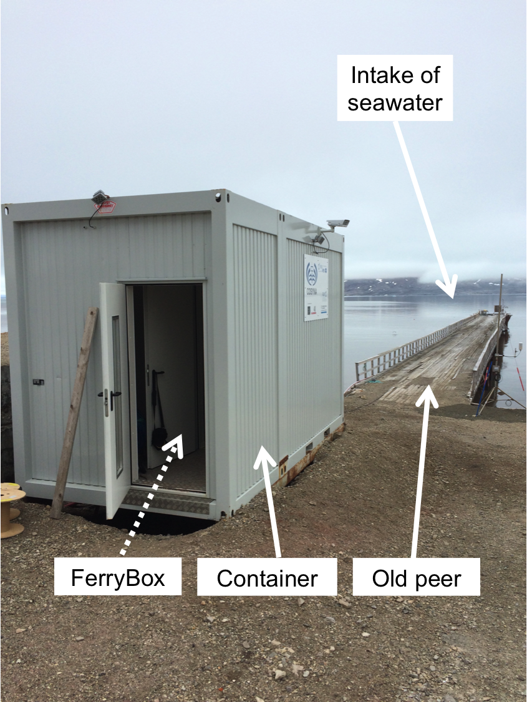
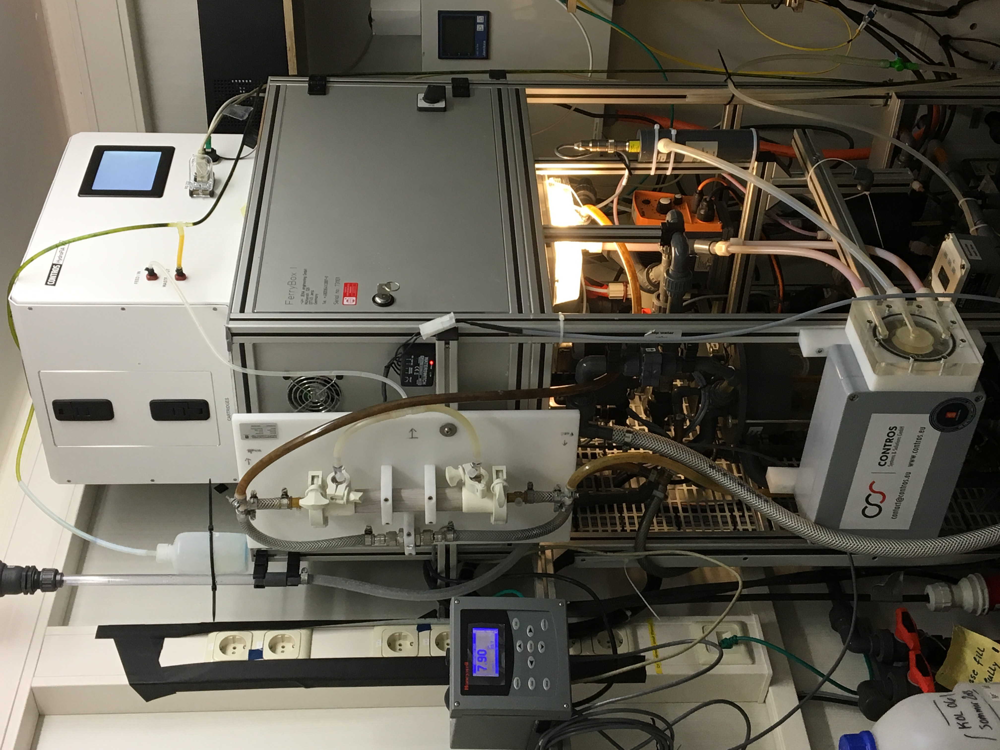
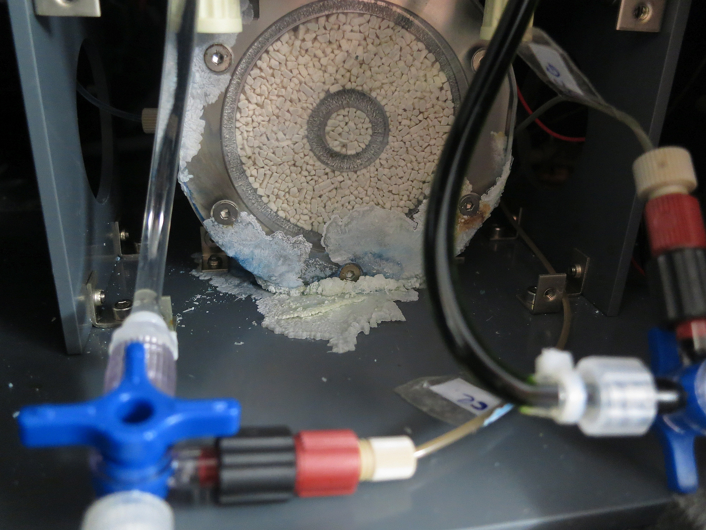
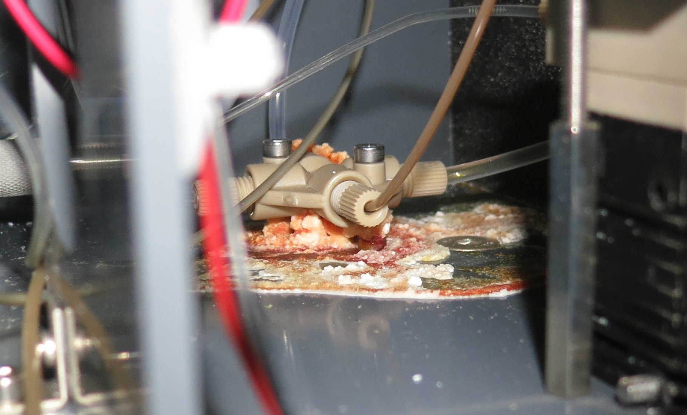

{width=250px}

```{r set-up, echo=FALSE, warning=FALSE, message=FALSE, include=FALSE}
Sys.setlocale("LC_ALL", "en_US.UTF-8")
Sys.setenv(TZ='UTC') # on utilise UTC
rm(list = ls())
library(tidyverse)
library(robfilter)
library(seacarb)
library(gridExtra)
library(reshape2)
library(lubridate)
library(lmtest)
library(grid)
library(viridis)
library(dygraphs)
require("knitr")
library("lmodel2")
library(captioner)
library(xts)
library(seismicRoll)
library(scales)
knitr::opts_chunk$set(echo = TRUE)

fig_nums <- captioner()
table_nums <- captioner(prefix = "Table")

#define who is the user and define path
if (Sys.getenv("LOGNAME") == "gattuso") path = "../../pCloud\ Sync/Documents/experiments/exp168_awipev-CO2/"
if (Sys.getenv("LOGNAME") == "samir") path = "../../pCloud\ Sync/exp168_awipev-CO2/"


######## function to make regression plot with model I equation in title
ggreg <- function (fit, point_size=2) {
  ggplot(fit$model, aes_string(x = names(fit$model)[2],
                               y = names(fit$model)[1])) +
    geom_point(size = point_size, col = "blue") +
    stat_smooth(method = "lm", col = "black") +
    labs(title = paste(title, "\nAdj R2 = ",signif(summary(fit)$adj.r.squared, 5),
                       "; Intercept =",signif(fit$coef[[1]],5 ),
                       "; Slope =",signif(fit$coef[[2]], 5),
                       "; P =",signif(summary(fit)$coef[2,4], 5))) +
    theme(plot.title = element_text(size=7))
}

#################### which.closest function
which.closest <- function(x, table, ...) {
  round(approx(x=table, y=1:length(table), xout=x, ...)$y)
}

#################### Regression function
# function regression plot with model II equation (MA) in title
## Dans labs ajout de la variable title pour mettre title avant chaque graphe
ggreg2 <- function (fit, x, y, point.size=5) { # x and y are the names of the variables
  fit_data <- data.frame(fit$x, fit$y)
  colnames(fit_data) = c(x, y)
reg <- fit$regression.results[2,] #one selects MA only
intercept <- reg$Intercept
slope <- reg$Slope
  ggplot(data = fit_data, aes_string(x = x, y = y)) + 
  geom_point(size = point.size, col = "blue") +
  geom_abline(aes(intercept = fit$regression.results[2,2], slope = fit$regression.results[2,3]),
              colour = "blue") +
  labs(title = paste(title,"\n Adj R2 = ", signif(fit$rsquare, 3),
                     "; Intercept =", signif(intercept, 3),
                     "; Slope =", signif(slope, 3),
                     "; P =", signif(fit$P.param, 3))) +
    theme(plot.title = element_text(size=7))
}

#################### Mytheme
Mytheme <- function(size_labs = 7, face_font="plain") {
  theme_bw() +
  theme(axis.text.x = element_text(face=face_font, size=size_labs, color="black"),
        axis.title.x = element_text(face=face_font, size=size_labs),
        axis.text.y = element_text(face=face_font, color="black", size=size_labs),
        axis.title.y = element_text(face=face_font, size=size_labs),
        axis.ticks.x = element_line(size=0.1),
        axis.ticks.y = element_line(size=0.1),
        axis.ticks.length = unit(1.1, "mm"),
        panel.grid.major = element_line(size = 0.25, color="black", linetype="dashed"),
        aspect.ratio = 1 / 2,
        plot.margin = margin(t = 0, r = 0, b = 0, l = 0, unit = "cm")
  )
}

ggplotRegression <- function(fit){

require(ggplot2)

ggplot(fit$model, aes_string(x = names(fit$model)[2], y = names(fit$model)[1])) + 
  geom_point() +
  stat_smooth(method = "lm", col = "red", se= FALSE) +
  labs(title = paste("Adj R2 = ",signif(summary(fit)$adj.r.squared, 5),
                     "Intercept =",signif(fit$coef[[1]],5 ),
                     " Slope =",signif(fit$coef[[2]], 5),
                     " P =",signif(summary(fit)$coef[2,4], 5)))
}
```

```{r read and prepare discrete data, echo=FALSE, warning=FALSE, message=FALSE}
d <- read.table(paste0(path, "fb_data/Discrete_analyses_AT_CT/Discrete_sampling_AWIPEV.csv"), header = T, dec = ".", as.is = T, sep = ";", fill = TRUE)
d$datetime <- as.POSIXct(d$sampling_date, format="%d/%m/%Y %H:%M", tz="UTC")
d$measure_date <- dmy(d$measure_date, tz="UTC")

# Add the flag location: some samples have been collected at the peer. Notes them here.
# Flag 1 = collected on the peer by Niskin and flag 0 = collected in the FB (normal collect)
 # And keep data with flag 0 for FB location
d <- d%>%
  dplyr::mutate(location_flag = ifelse(datetime == "2016-04-21 09:25:00" | datetime == "2016-02-10 14:00:00" | datetime == "2016-02-17 09:20:00" |datetime == "2016-02-24 14:20:00" | datetime == "2016-02-04 09:30:00" |datetime == "2016-01-27 15:00:00" |datetime == "2016-01-13 13:45:00" |datetime == "2016-01-06 14:10:00" |datetime == "2015-12-24 10:45:00" |datetime == "2015-12-30 13:30:00" |datetime == "2018-01-05 15:20:00" |datetime == "2018-02-02 14:35:00"|datetime == "2018-03-02 14:10:00", 1,0)
  )
d <- d%>%
  dplyr::filter(location_flag== 0)

# Keep only flag = 2 for at/ct analysis 
# Keep only flag = 2 for pH durafet and seaFET.
d <- d%>%
  dplyr::mutate(ct= replace(ct, qflag_ct != 2, NA),
                at= replace(at, qflag_at != 2, NA),
                pH_s_seafet= replace(pH_s_seafet, qflag_pH_s_seafet != 2, NA),
                pH_s_durafet= replace(pH_s_durafet, qflag_pH_s_durafet != 2, NA))


# Mercury chloride correction (Dickson et al. 2007, SOP3a)
# AT
d$at <- d$at * 1.0002
#CT
d$ct <- d$ct * 1.0002

# Fill "at/ct" to all line with same day.
at_ct_mean <- d %>% 
  group_by(datetime)%>%
  dplyr::summarize(at_mean = mean(at, na.rm = T),
                   ct_mean = mean(ct, na.rm = T),
                   at_sd = sd(at, na.rm = T), 
                   ct_sd = sd(ct, na.rm = T)
                   )

d <- left_join(d, at_ct_mean, by='datetime')
# Fill the gaps in at_mean with interpolation
TAinterp <-approx(d$datetime, d$at_mean, xout=d$datetime, method="linear", rule=2)
names(TAinterp) <- c("datetime", "at_mean_interp")
TAinterp <- as.data.frame(TAinterp)
d$at_mean_interp <- TAinterp$at_mean_interp

CTinterp <-approx(d$datetime, d$ct_mean, xout=d$datetime, method="linear", rule=2)
names(CTinterp) <- c("datetime", "ct_mean_interp")
CTinterp <- as.data.frame(CTinterp)
d$ct_mean_interp <- CTinterp$ct_mean_interp

# Conversion of spectro pH to a same T°
pH_seafet <- d %>%
  dplyr::filter(!is.na(pH_s_seafet))
pH_seafet <- pH_seafet %>%
  dplyr::mutate(pH_s_seafet_temp_field = pHinsi(pH=pH_seafet$pH_s_seafet,ALK=pH_seafet$at_mean_interp*1e-6, Tinsi=pH_seafet$temp_field, Tlab=pH_seafet$temp_s_lab, Pinsi= pH_seafet$depth/10, S=pH_seafet$salinity_field,Pt=0,Sit=0))
                
pH_durafet <- d %>%
  dplyr::filter(!is.na(pH_s_durafet))
pH_durafet <- pH_durafet %>%
  dplyr::mutate(pH_s_durafet_temp_field = pHinsi(pH=pH_durafet$pH_s_durafet,ALK=pH_durafet$at_mean_interp*1e-6, Tinsi=pH_durafet$temp_field, Tlab=pH_durafet$temp_s_lab, Pinsi= pH_durafet$depth/10, S=pH_durafet$salinity_field,Pt=0,Sit=0))
 
# create separate seafet/durafet df to join to initial "d" df
pH_seafet_mean <- pH_seafet%>%
  dplyr::select(datetime,pH_s_seafet_temp_field)%>% 
  dplyr::group_by(datetime) %>% 
  dplyr::summarize(pH_s_seafet_temp_field = mean(pH_s_seafet_temp_field, na.rm = T))
pH_durafet_mean <- pH_durafet%>%
  dplyr::select(datetime,pH_s_durafet_temp_field)%>% 
  dplyr::group_by(datetime) %>% 
  dplyr::summarize(pH_s_durafet_temp_field = mean(pH_s_durafet_temp_field, na.rm = T))

#  make means in "d" to have same format and call it "discrete"
discrete <- d %>% 
  dplyr::group_by(datetime) %>% 
  dplyr::summarize(sal = mean(salinity_field, na.rm = T),
            temp = mean(temp_field, na.rm = T),
            at_mean_interp = mean(at_mean_interp, na.rm = T),
            at = mean(at, na.rm = T),
            qflag_at = mean(qflag_at, na.rm = T),
            ct_mean_interp = mean(ct_mean_interp, na.rm = T),
            ct = mean(ct, na.rm = T),
            qflag_ct = mean(qflag_ct, na.rm = T)
            )
# join discrete + seafet/durafet
discrete <- left_join(discrete, pH_seafet_mean, by='datetime')
discrete <- left_join(discrete, pH_durafet_mean, by='datetime')

##   *****Attention, temp noted by logisticians in d is FB temp with SBE45 ******


# discrete_steffen <- discrete[c(21:72),1:4]
# write.table( discrete_steffen,"../fb_data/DiscreteTA_for_steffen.txt", sep= ",", dec=".", row.names = FALSE)

carb <- carb(15, discrete$at*1e-6, discrete$ct*1e-6,S=discrete$sal, T=discrete$temp, P=0, Pt=0, Sit=0,k1k2="l", kf="dg", ks="d", pHscale="T", b="u74")
discrete$phcalc<- carb$pH
discrete$pco2calc<- carb$pCO2
```

```{r Read and prepare ferrybox data, echo=FALSE, warning=FALSE, message=FALSE}
# xx <- read_tsv("../fb_server/ny-alesund/data/old/All_sensors_731101_2016-08-20.txt", skip=16, col_names=TRUE)
load(file = paste0(path, "fb_server/shinyroot/AWIPEV-CO2/nydata_hour_shiny.Rdata"))
#load(file = "../fb_server/shinyroot/AWIPEV-CO2/nydata_shiny.Rdata") #d
# load = d_hour
d_hour <- d_hour %>%
  dplyr::select(-date) %>%
  dplyr::mutate(AT = ifelse(datetime > "2016-02-26 12:00:00", AT, NA), # beginning of data series for AT
         AT = ifelse(AT == "NaN", NA, AT), #3 columns are character
         pH_AT = ifelse(pH_AT == "NaN", NA, pH_AT),
         PCO2_Corr_Zero2 = ifelse(PCO2_Corr_Zero2 %in% c("NaN", 66666), NA, PCO2_Corr_Zero2)
         ) %>%
  dplyr::rename(at_contros=AT, ph_at_contros=pH_AT, pco2_contros=PCO2_corr_contros_filtered, zero_contros=PCO2_Corr_Zero2, 
         sal_fb=Salinity_filtered, temp_fb=Temperature_filtered, pH_durafet=HW_pH1_filtered, temp_insitu=Temp_SBE38_filtered)
```

```{r Combine discrete and continous data, echo=FALSE}
d_all <- d_hour #d_all will be the merger
d_all<- d_all%>%
  dplyr::mutate(month = month(month(datetime)))
# at
closest <- which.closest(discrete$datetime, d_all$datetime) # closest date and time
discrete$closest_datetime <- d_all$datetime[closest]
# if the closest value is more than 30 min away, then we do not take it
discrete$closest_datetime[abs(discrete$datetime - d_all$datetime[closest]) > 30*60] <- NA
# remove the drop_na() because of seafet/durafet line with na
discrete2merge <- discrete %>%
  #drop_na() %>%
  dplyr::select(closest_datetime, at, qflag_at) %>%
  rename(datetime=closest_datetime)
d_all <- full_join(d_all, discrete2merge, by="datetime")

# ct
# closest <- which.closest(discrete$datetime, d$datetime) # closest date and time
# discrete$closest_datetime <- d$datetime[closest]
# # if the closest value is more than 30 min away, then we do not take it
# discrete$closest_datetime[abs(discrete$datetime - d$datetime[closest]) > 30*60] <- NA
discrete2merge <- discrete %>%
  #drop_na() %>%
  dplyr::select(closest_datetime, ct, qflag_ct) %>%
  rename(datetime=closest_datetime)
d_all <- full_join(d_all, discrete2merge, by="datetime")

# pH calculated
# closest <- which.closest(discrete$datetime, d_all$datetime) # closest date and time
# discrete$closest_datetime <- d_all$datetime[closest]
# # if the closest value is more than 30 min away, then we do not take it
# discrete$closest_datetime[abs(discrete$datetime - d_all$datetime[closest]) > 30*60] <- NA
discrete2merge <- discrete %>%
  #drop_na() %>%
  dplyr::select(closest_datetime, phcalc) %>%
  rename(datetime=closest_datetime)
d_all <- full_join(d_all, discrete2merge, by="datetime")

# seaFET pH 
# closest <- which.closest(discrete$datetime, d_all$datetime) # closest date and time
# discrete$closest_datetime <- d_all$datetime[closest]
# # if the closest value is more than 30 min away, then we do not take it
# discrete$closest_datetime[abs(discrete$datetime - d_all$datetime[closest]) > 30*60] <- NA
discrete2merge <- discrete %>%
  #drop_na() %>%
  dplyr::select(closest_datetime, pH_s_seafet_temp_field) %>%
  rename(datetime=closest_datetime)
d_all <- full_join(d_all, discrete2merge, by="datetime")
# #voltINT
# discrete2merge <- discrete %>%
#   #drop_na() %>%
#   dplyr::select(closest_datetime, voltINT) %>%
#   rename(datetime=closest_datetime)
# d_all <- full_join(d_all, discrete2merge, by="datetime")
# #voltEXT
# discrete2merge <- discrete %>%
#   #drop_na() %>%
#   dplyr::select(closest_datetime, voltEXT) %>%
#   rename(datetime=closest_datetime)
# d_all <- full_join(d_all, discrete2merge, by="datetime")

# duraFET pH 
# closest <- which.closest(discrete$datetime, d_all$datetime) # closest date and time
# discrete$closest_datetime <- d_all$datetime[closest]
# # if the closest value is more than 30 min away, then we do not take it
# discrete$closest_datetime[abs(discrete$datetime - d_all$datetime[closest]) > 30*60] <- NA
discrete2merge <- discrete %>%
  #drop_na() %>%
  dplyr::select(closest_datetime, pH_s_durafet_temp_field) %>%
  rename(datetime=closest_datetime)
d_all <- full_join(d_all, discrete2merge, by="datetime")

# pCO2
# closest <- which.closest(discrete$datetime, d_all$datetime) # closest date and time
# discrete$closest_datetime <- d_all$datetime[closest]
# # if the closest value is more than 30 min away, then we do not take it
# discrete$closest_datetime[abs(discrete$datetime - d_all$datetime[closest]) > 30*60] <- NA
discrete2merge <- discrete %>%
  #drop_na() %>%
  dplyr::select(closest_datetime, pco2calc) %>%
  rename(datetime=closest_datetime)
d_all <- full_join(d_all, discrete2merge, by="datetime")

save(file= paste0(path, "fb_data/d_all.Rdata"), d_all)

## bind the voltages and deployment ##

# Duplicate datetime in closest_datetime to do the left_join
d_all$closest_datetime <- d_all$datetime
discrete <- left_join(discrete, d_all%>%dplyr::select(c(closest_datetime, voltEXT, voltINT)), by="closest_datetime")
```

<style type="text/css">

body{ /* Normal  */
      font-size: 18px;
  }
h3{ /* Header 3 */
  font-size: 22px;
  <!-- font-family: "Times New Roman", Times, serif; -->
  color: DarkBlue;
}
h4{ /* Header 4 */
  font-size: 18px;
  <!-- font-family: "Times New Roman", Times, serif; -->
  color: DarkBlue;
}
h5{ /* Header 5 */
  font-size: 16px;
  <!-- font-family: "Times New Roman", Times, serif; -->
  color: DarkBlue;
}
</style>

#{.tabset .tabset-fade .tabset-pills}

##Infos 

###**Introduction**
<div style="text-align: justify">  
The AWIPEV-CO2 project aims at starting the first time series for the carbonate chemistry in the Arctic Ocean as part of the AWIPEV Underwater Observatory. It comprises two components: (1) continuous real-time measurements and (2) discrete measurements. The rationale is that discrete measurements are absolutely needed to calibrate and validate the sensors.

###**AWIPEV Underwater Observatory**
<div style="text-align: justify">  
The AWIPEV Underwater Observatory has been deployed at Ny-Alesund (Spitsbergen, 78°55'18N, 11°56'31E) in June 2012. It is part of the German Project COSYNA (Coastal Observation Systems of the Northern- and Arctic Seas), which aims at increasing the availability of continuous real-time data from remote but climatically-sensitive ecosystems. The AWIPEV underwater observatory comprises a fully remote controlled FerryBox system fed with seawater pumped in front of the old peer at 12 m depth. Temperature, salinity, pressure, turbidity, oxygen, chl-*a* fluorescence are measured. Furthermore, an additional remote controlled underwater sensor unit able to profile from 12 m to the surface at any frequency carries additional sensors for salinity, pressure, turbidity, oxygen chl-*a* fluorescence and PAR. The system also comprises an ADCP for continuous measurements of currents and waves. Besides these standard sensors, the underwater unit is equipped with a webcam and stereo-optical device to remotely assess fish and jellyfish populations. The AWIPEV observatory is specifically designed for polar experimental work under extreme conditions including ice coverage and the inaccessibility for about 7 months during polar winter. During this time, the system is remotely controlled and maintained from Germany. All data sampled by the sensors are continuously sent to a central server system at Helgoland Island where the data are stored and processed. The processed data are open access and available at http://codm.hzg.de/codm.

<div style="text-align:center" markdown="1">
  
  
  
</div>

###**Continuous and semi-continuous measurements**
<div style="text-align: justify">  
The Arctic version of the Contros-Kongsberg HydroC CO~2~ FT (Carbon Dioxyde partial pressure Flow Through surface water sensor) has been installed in July 2015. Molecules of dissolved CO~2~ diffuse through a thin composite membrane into the internal gas circuit leading to a detector chamber, where the partial pressure of CO~2~ is determined by means of infra-red absorption spectrometry. Concentration-dependent IR light is converted into the output signal from calibration coefficients stored in firmware and data from additional sensors within the gas circuit. The measuring range is 200-1000 uatm, resolution is < 1 uatm and accuracy is +- 1% reading. The sensor is the first instrument in the measuring loop; data are logged every minute. This instrument requires yearly factory calibration; two sensors ara available to allow a continuous time series.

Since February 2016, total alkalinity (AT) is measured every 90 min with a Contros-Kongsberg HydroFIA TA (Total Alkalinity analyser flow through system). Fifty ml of seawater is filtered (0.2 um) using a Contros-Kongsberg cross-flow filter and then acidified using dilute hydrochloric acid (0.1 N). CO~2~ is then flushed out (open-cell titration) and the final pH measured by means of an indicator dye (bromocresol green) and visible absorption spectrometry. Together with salinity and temperature at the time of measurement, the pH reading is used to calculate AT. According to the manufacturer, the measuring range is 400 umol/kg dynamic range, resolution 0.1 umol/kg, accuracy 25 umol/kg (+- 1%) and precision 5 umol/kg (+- 0.2%).

In August 2017, a seaFET Ocean pH sensor (Sea-Bird Scientific) has been added to the UWO. This new sensor continuously measures pH at 11 m using an ISFET (Ion Sensitive Field Effect Transistor). According to the manufacturer, the measuring range is between 6.5 and 9 pH units, initial accuracy is 0.02 pH units and precision is 0.004 pH units. Operating salinity and temperature range are 20 to 40 PSU and 0 to 50°C respectively.

In August 2017, a Durafet III pH electrode connected to a UDA2128 Analyser (Honeywell) was also implemented to the Ferrybox flow-through system. This electrode continuously measures pH, in the Ferrybox, through an ISFET. According to the manufacturer, the measuring range is between 0 and 14 pH units.

##Key plots
```{r whole time series, fig.width=10, fig.height=4, echo=FALSE, message= FALSE}
#SAL
sal_fb_xts <- dplyr::select(d_all, datetime, sal_fb)%>%
  dplyr::filter(sal_fb >28)
sal_fb_xts <- as.xts(sal_fb_xts, order.by = sal_fb_xts$datetime)
dygraph(sal_fb_xts, group = "awipev", main="Salinity", ylab="Salinity") %>%
      dySeries("sal_fb", color = "blue", strokeWidth = 0, label = "S") %>%
      dyHighlight(highlightCircleSize = 8,highlightSeriesBackgroundAlpha =0.2,hideOnMouseOut =TRUE) %>%
      dyOptions(drawGrid = TRUE, drawPoints = TRUE, pointSize = 2,useDataTimezone = TRUE) %>%
      dyRangeSelector(height = 30)
# TEMP Ferrybox SBE45
temp_fb_xts <- dplyr::select(d_all, datetime, temp_fb)
temp_fb_xts <- as.xts(temp_fb_xts, order.by = temp_fb_xts$datetime)
dygraph(temp_fb_xts, group = "awipev", main="Temperature (in Ferrybox)", ylab="Temperature") %>%
      dySeries("temp_fb", color = "blue", strokeWidth = 0, label = "T") %>%
      dyAxis("y", valueRange = c(-2.5, 9.5)) %>%
      dyHighlight(highlightCircleSize = 8,highlightSeriesBackgroundAlpha = 0.5,hideOnMouseOut = TRUE) %>%
      dyOptions(drawGrid = TRUE, drawPoints = TRUE, pointSize = 2,useDataTimezone = TRUE) %>%
      dyRangeSelector(height = 30)
# TEMP insitu SBE38
temp_insitu_xts <- dplyr::select(d_all, datetime, temp_insitu)
temp_insitu_xts <- as.xts(temp_insitu_xts, order.by = temp_insitu_xts$datetime)
dygraph(temp_insitu_xts, group = "awipev", main="Temperature (in situ)", ylab="Temperature") %>%
      dySeries("temp_insitu", color = "blue", strokeWidth = 0, label = "T") %>%
      dyAxis("y", valueRange = c(-2.5, 9.5)) %>%
      dyHighlight(highlightCircleSize = 8,highlightSeriesBackgroundAlpha = 0.5,hideOnMouseOut = TRUE) %>%
      dyOptions(drawGrid = TRUE, drawPoints = TRUE, pointSize = 2,useDataTimezone = TRUE) %>%
      dyRangeSelector(height = 30)
# PCO2 
#+ Ajout de la pCO2 corrigé par le script contros (dans R server ny-alesund_cc.R)
pco2_contros_xts <- dplyr::select(d_all, datetime, pco2calc, pco2_contros, PCO2_Corr_filtered)
pco2_contros_xts <- as.xts(pco2_contros_xts, order.by = d_all$datetime)
dygraph(pco2_contros_xts, group = "awipev", main="pCO2", ylab="pCO2") %>%
    dySeries("PCO2_Corr_filtered", label="Raw pCO2",color ="blue", strokeWidth = 0, pointSize = 2) %>%
    dySeries("pco2_contros", label="Corrected pCO2", color=  RColorBrewer::brewer.pal(3, "Dark2")[1],strokeWidth=0, pointSize=2) %>%
    dySeries("pco2calc", label="calculated pCO2",color = "red", strokeWidth = 0, pointSize = 4 ) %>%
    dyEvent(as.POSIXct("2016-02-28 12:00:00", tz="GMT"), "CO2FT-0515-001 installed", labelLoc = "bottom", color="red") %>% 
    dyEvent(as.POSIXct("2017-02-07 12:00:00", tz="GMT"), "CO2FT-0215-001 installed", labelLoc = "bottom", color="red") %>%
    dyEvent(as.POSIXct("2018-04-16 12:00:00", tz="GMT"), "CO2FT-0515-001 installed", labelLoc = "bottom", color="red") %>% 
    dyEvent(as.POSIXct("2018-10-31 15:00:00", tz="GMT"), "CO2FT-0215-001 installed", labelLoc = "bottom", color="red") %>% 
    #dyOptions(colors = RColorBrewer::brewer.pal(3, "Dark2"), pointSize = 4) %>%
    dyHighlight(highlightCircleSize = 8,highlightSeriesBackgroundAlpha = 0.5,hideOnMouseOut = TRUE) %>%
    dyOptions(drawGrid = TRUE, drawPoints = TRUE, pointSize = c(1,8,1),useDataTimezone = TRUE) %>%
    dyRangeSelector(height = 30)
# DURAFET 
durafet_contros_xts <- dplyr::select(d_all, datetime, pH_durafet, pH_s_durafet_temp_field)
durafet_contros_xts <- as.xts(durafet_contros_xts, order.by = d_all$datetime)
dygraph(durafet_contros_xts, group = "awipev", main="pH durafet (in Ferrybox)", ylab="pHT") %>%
    dySeries("pH_durafet", label = "Raw durafet pH", color ="blue", strokeWidth=0, pointSize=2) %>%
    dySeries("pH_s_durafet_temp_field", label = "pH spectro", color =  "red", strokeWidth = 0, pointSize = 4 ) %>%
    dyEvent(as.POSIXct("2017-08-24 12:00:00", tz="GMT"), "durafet installed", labelLoc = "bottom", color="red") %>%
    dyEvent(as.POSIXct("2017-10-30 13:00:00", tz="GMT"), "New holder installed", labelLoc = "bottom", color="red") %>% 
    # dyOptions(colors = RColorBrewer::brewer.pal(3, "Dark2"), pointSize = 4) %>%
    dyHighlight(highlightCircleSize = 8,highlightSeriesBackgroundAlpha = 0.5,hideOnMouseOut = TRUE) %>%
    dyOptions(drawGrid = TRUE, drawPoints = TRUE, pointSize = c(1,8,1),useDataTimezone = TRUE, digitsAfterDecimal=4) %>%
    dyRangeSelector(height = 30) 
# SEAFET 
seafet_contros_xts <- dplyr::select(d_all, datetime, phINT_filtered,pH_s_seafet_temp_field)
seafet_contros_xts <- as.xts(seafet_contros_xts, order.by = d_all$datetime)
dygraph(seafet_contros_xts, group = "awipev", main="pH seaFET (in situ)", ylab="pHT") %>%
  dySeries("phINT_filtered", label = "Raw data INT", color ="blue", strokeWidth=0, pointSize=2) %>%
  dySeries("pH_s_seafet_temp_field", label = "pH spectro", color =  "red", strokeWidth = 0, pointSize = 4 ) %>%
  dyEvent(as.POSIXct("2017-08-24 12:00:00", tz="GMT"), "seaFET #1005 installed", labelLoc = "bottom", color="red") %>%
  dyEvent(as.POSIXct("2018-02-02 09:00:00", tz="GMT"), "seaFET settings changed to every 1H", labelLoc = "bottom", color="red") %>% 
  dyEvent(as.POSIXct("2018-04-17 12:00:00", tz="GMT"), "seaFET #0007 installed + continuous mode set", labelLoc = "bottom", color="red") %>%
    dyHighlight(highlightCircleSize = 8,highlightSeriesBackgroundAlpha = 0.5,hideOnMouseOut = TRUE) %>%
    dyOptions(drawGrid = TRUE, drawPoints = TRUE, pointSize = c(1,8,1),useDataTimezone = TRUE, digitsAfterDecimal=4) %>%
    dyRangeSelector(height = 30) 
##
# to create periods according to TA deployments
TAevents <- c("2016-02-26 00:00:00", "2017-02-09 12:00:00", "2017-02-09 12:00:00", "2017-03-10 12:00:00", 
              "2018-01-07 00:00:00", "2018-06-20 00:00:00",  "2018-07-31 00:00:00","2018-10-30 18:00:00", format(Sys.Date(), "%Y-%m-%d %H:%M:%S"))

at_contros_cleaned_xts <- dplyr::select(d_all, datetime,AT_filtered,at)
at_contros_cleaned_xts <-  as.xts(at_contros_cleaned_xts, order.by = d_all$datetime)
dygraph(at_contros_cleaned_xts, group = "awipev", main=" Total Alkalinity (in Ferrybox)", ylab="Total alkalinity") %>%
   #dySeries("at_contros", color = RColorBrewer::brewer.pal(3, "Set2"), strokeWidth = 0, pointSize=2) %>%
  #dySeries("AT_filtered2", color = RColorBrewer::brewer.pal(4, "Set2"), strokeWidth = 0, pointSize=2) %>%
  dySeries("AT_filtered", label= "Raw TA", color = "blue", strokeWidth = 0, pointSize=2) %>%
  dySeries("at", label="TA reference",color = "red", strokeWidth = 0, pointSize=4) %>% 
  dyEvent(as.POSIXct("2016-05-31 10:00:00", tz="GMT"), "HCl Changed", labelLoc = "bottom") %>%
  dyEvent(as.POSIXct("2016-06-24 10:00:00", tz="GMT"), "BCG Changed", labelLoc = "bottom") %>%
  dyEvent(as.POSIXct("2016-02-24 14:00:00", tz="GMT"), "Calibration 1", labelLoc = "bottom") %>%
  dyEvent(as.POSIXct("2016-09-16 10:00:00", tz="GMT"), "Calibration 2", labelLoc = "bottom") %>% 
  dyEvent(as.POSIXct("2017-03-21 12:00:00", tz="GMT"), "TA analyser changed", labelLoc = "bottom", color="red") %>%
  dyEvent(as.POSIXct("2018-01-08 12:55:00", tz="GMT"), "TA analyser changed #TA-0317-001", labelLoc = "bottom", color="red") %>%
  dyEvent(as.POSIXct("2018-07-31 00:00:00", tz="GMT"), "TA analyser changed #TA-1215-001", labelLoc = "bottom", color="red") %>%
  dyEvent(as.POSIXct("2018-10-30 18:00:00", tz="GMT"), "TA analyser changed #TA-0317-001", labelLoc = "bottom", color="red") %>%
  dyEvent(as.POSIXct("2016-11-15 09:00:00", tz="GMT"), "CRM measurement", labelLoc = "bottom") %>% 
  dyEvent(as.POSIXct("2017-02-09 12:20:00", tz="GMT"), "CRM measurement", labelLoc = "bottom") %>% 
  dyEvent(as.POSIXct("2017-04-11 06:20:00", tz="GMT"), "CRM measurement", labelLoc = "bottom") %>% 
  dyEvent(as.POSIXct("2018-01-22 13:00:12", tz="GMT"), "CRM measurement", labelLoc = "bottom") %>%
  dyEvent(as.POSIXct("2018-05-16 12:39:39", tz="GMT"), "CRM measurement", labelLoc = "bottom") %>%
  dyEvent(as.POSIXct("2018-10-31 10:29:27", tz="GMT"), "CRM measurement", labelLoc = "top") %>%
  #dyOptions(colors = RColorBrewer::brewer.pal(3, "Dark2"), pointSize = 4) %>%
  dyShading(from = TAevents[1], to = TAevents[2], color = "#EDEDED") %>%
  dyShading(from = TAevents[3], to = TAevents[4], color = "#C2C2C2") %>%
  dyShading(from = TAevents[5], to = TAevents[6], color = "#EDEDED") %>%
  dyShading(from = TAevents[7], to = TAevents[8], color = "#C2C2C2") %>%
  dyShading(from = TAevents[8], to = TAevents[9], color = "#EDEDED") %>%
  dyAxis("y",valueRange = c(2100, 2550)) %>%
  dyHighlight(highlightCircleSize = 8,highlightSeriesBackgroundAlpha = 0.5,hideOnMouseOut = TRUE) %>%
  dyOptions( strokeWidth= 0) %>%
  dyOptions(drawGrid = TRUE, drawPoints = TRUE,useDataTimezone = TRUE) %>%
    dyRangeSelector(height = 30) 
 
f <- as.data.frame(table(d_all$at))
sum(f$Freq)
# Number of outliers removed in the dataset
# numberOutliers <- length(which((dat_ATnoNA$outliers > 0)))
```

##Total alkalinity

Since we bought the AT analyser (February 2016), numerous problems happened due to a leak of the degassing unit in each analyser and sudden step changes. Last analyser repaired by Contros was installed back in the FB on 2018-07-31. This was the 3rd analyser on site.

We identify four periods (see plot at the end of this page with dark and ligth grey):

- from the set-up of the instrument on **2016-02-23** to **2017-02-09** during which we try to correct for the drift
- from **2017-02-09** to **2017-03-10** during which no drift correction is made, just an offset is applied to correct for the sudden shift in the data
- from the set-up of a new instrument on **2018-01-08** to **2018-06-20**, during which another correction using the discrete samples will be performed. In this period and before to stop it, continuous leakages in the degasing unit happened.
- from the set-up of a repaired unit on **2018-07-31** to **2018-10-31**. Here, the instrument took wrong salinity to perform AT measurements. The cause is not clear yet but Steffen sent to Samir a protocol on 2018-08-24 to correct those data with right salinity. Also, after this issue, since 2018-08-20, bad data were still measured. Steffen diagnosed a "bubble issue" in the indicator tubbings. Steps will be sent to Marine to solve this issue. After this, it was not a bubble. We decided to switch off the instrument to save reagents and wait until the comming of Steffen in NYA with a new instrument.

A new instrument was installed with Steffen on **2018-10-31**. This new instrument has a complete new designed membrane which will solve the problem. Steffen also developped a TA web interface to communicate remotly with the analyser. Samir has all the passwords and ID to connect.

###**Filtration of AT data: outliers removing**

Outliers are present because of the cleaning operations made on the FerryBox everydays at 12:00am and 12:00pm. We first removed the outliers using a filter and decided, after a Skype conference with Steffen on September 2016, to:

  - Remove existing filters ( > 2350 µmol/kg).
  - Filter using salinity flag.
  - Filter using pH flag.
  - Not to filter on temperature flag.
  - Apply a 3 data points median filter (no longer used; see despike function in "oce" package)

We decided to use "despike" function as data filter. This filter is done in "ny-alesund_cc.R". Length of runing median is: k = 121 days and the indicator (n times the sd between x and the reference) to consider a data from an outlier is: n = 0.5.

###**Correction of AT data**

Calibration was initially performed twice a year since the analyser was supposed to be stable. Calibration was performed using the internal "calibration mode" against a CRM from A.Dickson (Batch #145, 2016-02-24) right after the instrument was installed and a second time on 2016-09-16. This approch is not longer used since September 2016 (Skype with Contros).

Since this date, the analyser is calibrated by measuring a CRM with the "measurement mode" in order to measure the offset of the instrument. Additionally, discrete seawater are sampled weekly and TA is analysed by SNAPO-CO2.

  - Two methods to correct the drift are available:
    - based on CRMs 
    - based on AT measurement of discrete samples ("references").
  

####**CRM measurements**

The calibration of the sensor is made against a CRM standard from A. Dickson. We run a standard on the analyser as a regular measurement (measurement mode). Result sof calibrations are shown on the following plot.Dashed lines represent the theoritical value of AT (CRM) and hard lines represent CRM measured AT by the instrument.

```{r CRM measurements, echo=FALSE, warning=FALSE, message=FALSE, out.width="60%",fig.show='hold', fig.align="center"}
calib_analyser <-  read.table(paste0(path, "fb_data/Calibration/TA_#1215/measure_CRM_TA.txt"), header = T, dec = ".", as.is = T, sep = ",", fill = TRUE)

# To make the mean 
# Keep dates as Character to plot without date gaps.
calib_analyser3 <- calib_analyser %>%
  dplyr::filter(analyser == "TA3") 
meanTA3 <- calib_analyser3 %>% 
  group_by(day) %>% 
  summarise (meanTA = mean(TA))

melt_calib <- melt(calib_analyser, id.vars=c("analyser", "TA_theo", "datetime", "CRM"), measure.vars=c("TA"))
calib_p <- ggplot()+ 
          geom_point(data= melt_calib, aes(x=datetime, y=value, color=factor(CRM), shape= factor(analyser)) , size=3) +
          scale_color_manual(values=c("blue","red"))+
         # set dashed lines for theoritical CRM
          geom_segment(aes(x=1,xend=20,y=2226.16,yend=2226.16), linetype="dashed", color="blue")+
          annotate("text", x = 11, y = 2228, label = "Batch #145 = 2226.16", color="blue")+
          geom_segment(aes(x=20,xend=23,y=2213.59,yend=2213.59), linetype="dashed", color="red")+
          annotate("text", x = 15.5, y = 2213.59, label = "Batch #159 = 2213.59", color="red")+
        # set hard lines for measured CRM
          geom_segment(aes(x=1,xend=5,y=2254,yend=2254), color="blue") +
          annotate("text", x = 3, y = 2249, label = "2254", color="blue")+
          geom_segment(aes(x=6,xend=10,y=2251.6,yend=2251.6), color="blue") +
          annotate("text", x = 8, y = 2247, label = "2251.6", color="blue")+
          geom_segment(aes(x=11,xend=15,y=2190.4,yend=2190.4), color="blue")+
          annotate("text", x = 14, y = 2195, label = "2190.4", color="blue")+
          geom_segment(aes(x=16,xend=20,y=2203.5,yend=2203.5), color="blue")+
          annotate("text", x = 18, y = 2200, label = "2203.5", color="blue")+
          geom_segment(aes(x=21,xend=23,y=2224.20,yend=2224.20), color="red")+
          annotate("text", x = 22, y = 2230, label = "2224.2", color="red") +
  theme_bw() + theme(axis.text.x = element_text(angle = 45, hjust = 1))+ 
  labs(title= "",y=expression(paste("Total alkalinity (µmoles.",kg^-1,")")), x="Date", color= "CRM",shape= "Deployed instrument")

ggsave(paste0(path, "fb_figures/TA_Analyser/Calibration/TA_calibration_CRM.png"), calib_p, units="cm")
print(calib_p)
```


####**Discrete samples ("references")** 

On 2018-04-19, Steffen sent his answer concerning the drift correction during the period February 2016 to March 2017. Within this one year period, the analyser was running, except the first week of May 2016. Discrete samples were collected and 3 CRMs were measured which was deemed not enough (see below). He suggested to base the correction on the AT of discrete ("reference") samples.

> "I chose the discrete reference samples due to the fact that those cover the entire working range including time, salinity and also provide a broader data basis for this kind of correction. Also, when looking at the uncertainty below, I fear that the three CRM measurements over 5 month are not sufficient enough for such a drift determination."

A linear regression was performed based on the difference between the measured (analyzer) and discrete samples. Discrete samples were matched with the AT measured by the analyser. If there is no measurement coincident with a discrete sample, a linear interpolation was made between the two data surrounding the discrete sample data. The differences between the measured (analyzer) and analysed ("reference") data was plotted as a function of time.

This approach was performed:
  
  - on the same period than in Steffen email's (**First period**, 2016-02-23 to 2017-02-09)
  - and during the **third period**, with the new analyzer (2018-01-07 to 2018-06-20)
  
##### **First period** 

```{r First period, echo=FALSE, warning=FALSE, message=FALSE, out.width="50%",fig.show='hold', fig.align="center"}
#Interpolation of continuous sensor data to match a maximum of reference data.
TAinterp_all <-approx(d_all$datetime, d_all$AT_filtered, xout=d_all$datetime, method="linear", rule=2)
names(TAinterp_all) <- c("datetime", "AT_filtered_interp")
TAinterp_all <- as.data.frame(TAinterp_all)
d_all$AT_filtered_interp <- TAinterp_all$AT_filtered_interp

# create a column with difference between sensor and ref
d_all <- d_all%>%
  dplyr::mutate(diff_ta =  at-AT_filtered_interp )
# create colum with instrument number
d_all <- d_all %>% 
  dplyr::mutate(TA_period= ifelse(datetime >= "2016-02-26 00:00:00" & datetime < "2017-02-09 12:00:00", "TA1",
                            ifelse(datetime >= "2017-02-09 12:00:00" & datetime < "2017-03-10 12:00:00", "TA2",
                            ifelse(datetime >= "2018-01-07 00:00:00" & datetime < "2018-07-31 00:00:00", "TA3", 
                            ifelse(datetime >= "2018-07-31 00:00:00" , "TA4", "TA0")))))

#remove outliers
calib_ta_first <- d_all%>%
  dplyr::select(datetime, closest_datetime,AT_filtered, AT_filtered_interp, at,diff_ta,TA_period)%>%
  dplyr::filter(TA_period =="TA1" & !is.na(at))
  #dplyr::filter( !is.na(at))#, diff_ta > -40 & diff_ta < 20 )
# & datetime != "2016-08-18 08:00:00" & datetime != "2016-12-29 12:00:00 ",!is.na(at))

# Parameters of regression
fit <- lm( data=calib_ta_first%>%filter(diff_ta <= 50), diff_ta ~ datetime)
at_slope_TA1 <- round(fit$coefficients[[2]] , digits=6)
at_slope1 <- round(at_slope_TA1 * 3600 *24 * 365.24, digits=2)
at_intercept1 <- round(fit$coefficients[[1]], digits= 2)
```

The slope is: `r at_slope_TA1` x 3600 x 24 x 365.24 = `r at_slope1` µmoles.kg-1.yr-1. Regression is: R2 = `r round(signif(summary(fit)$adj.r.squared, 5), digits =4)`. Outliers are in red.

```{r First period plot, echo=FALSE, warning=FALSE, message=FALSE, out.width="50%",fig.show='hold', fig.align="center"}
# Plot of regression
p <- ggplot(calib_ta_first%>%filter(diff_ta <= 50),aes(datetime,diff_ta)) + 
    geom_point() + geom_smooth(method='lm', se=FALSE)+ 
    geom_point(data= calib_ta_first%>%filter(diff_ta >= 50), aes(x=datetime, y=diff_ta), color="red")  +
  geom_hline(yintercept = 0, linetype="dashed" )+
  labs(title = paste("Adj R2 = ",signif(summary(fit)$adj.r.squared, 5),
                     "Intercept =",signif(fit$coef[[1]],5 ),
                     "Slope =",signif(fit$coef[[2]], 5),
                     "P =",signif(summary(fit)$coef[2,4], 5))) + 
  ylab("Difference: Reference - Analyser") + xlab("Time") + scale_x_datetime(date_labels = "%b %Y", date_minor_breaks = "month", timezone="UTC")
print(p)
ggsave(paste0(path, "fb_figures/TA_Analyser/Calibration/Diff_ref_TA_first_period.png"), p, units="cm")
```

#####**Third period**

```{r Third period, echo=FALSE, warning=FALSE, message=FALSE, out.width="50%",fig.show='hold',fig.align="center"}

#remove outliers and remove period without TA measurements 
calib_ta_third <- d_all%>%
  dplyr::select(datetime, closest_datetime,AT_filtered, AT_filtered_interp, at,diff_ta, TA_period)%>%
  dplyr::filter(TA_period == "TA3" & !is.na(at))

# Parameters of regression
fit <- lm( data=calib_ta_third, diff_ta ~ datetime)
at_slope_TA3 <- round(fit$coefficients[[2]] , digits=8)
at_slope3 <- round(at_slope_TA3 * 3600 *24 * 365.24, digits=2)
at_intercept3 <- round(fit$coefficients[[1]], digits= 2) # pas besoin ici.
```

The slope is in days: `r at_slope_TA3` x 3600 x 24 x 365.24 = `r at_slope3` µmoles.kg-1.an-1. Regression is: R2 = `r round(signif(summary(fit)$adj.r.squared, 5), digits =4)`. No outliers.

```{r Third period plot, echo=FALSE, warning=FALSE, message=FALSE, out.width="50%",fig.show='hold', fig.align="center"}
# Plot of regression
p <- ggplot(calib_ta_third,aes(x=datetime, y=diff_ta) )+ 
    geom_point() + geom_smooth(method='lm', se=FALSE)+ 
    #geom_point(data= calib_ta_third%>%filter(diff_ta < -40 & diff_ta<20), aes(x=datetime, y=diff_ta), color="red")  +
   geom_hline(yintercept = 0, linetype="dashed" )+
  geom_vline(xintercept = as.POSIXct("2018-01-08 12:55:00", tz="UTC"), colour="red", linetype = "longdash") +
  #geom_text(aes(xintercept=as.POSIXct("2018-01-01 12:55:00"),label="TA "), colour="red", vjust=1.2)+
  labs(title = paste("Adj R2 = ",signif(summary(fit)$adj.r.squared, 5),
                     "Intercept =",signif(fit$coef[[1]],5 ),
                     " Slope =",signif(fit$coef[[2]], 5),
                     " P =",signif(summary(fit)$coef[2,4], 5))) + ylab("Difference: Reference - Analyser") + xlab("Time") + 
  scale_x_datetime( date_labels = "%b %Y", date_minor_breaks = "month", timezone="UTC")
print(p)
ggsave(paste0(path, "fb_figures/TA_Analyser/Calibration/Diff_ref_TA_third_period.png"), p, units="cm")
```

#####**Second period**

```{r Second period, echo=FALSE, warning=FALSE, message=FALSE, out.width="100%",fig.show='hold'}

#remove outliers and remove period without TA measurements 
calib_ta_second <- d_all%>%
  dplyr::select(datetime, closest_datetime,AT_filtered, AT_filtered_interp, at,diff_ta, TA_period)%>%
  dplyr::filter(TA_period == "TA2" & !is.na(at))

mean_offset <- mean(calib_ta_second$diff_ta)

```
For the second period, the average difference between 5 discrete samples "references" and TA analyser measurements (`r mean_offset` µmoles.kg~-1~) was added to TA value as an offset.


#### **Final TA corrected data (Regression)**


The following plot shows the corrected TA data with regressions (Periods 1 and 3) and with offset (Period 2) applied according to Steffen's proposition.
It is clear that these corrected data (in green) cannot be used for periods 1 to 3. The jury is still out for period 4. The issue of salinity must be clarified before an assessment can be made. 

```{r Correction applied, echo=FALSE, warning=FALSE, message=FALSE, out.width="100%",fig.show='hold'}
# Correction for the 3 periods is apply
d_all <- d_all%>%
  dplyr::mutate(datetime_reg = as.numeric(datetime), 
                at_intercept = ifelse(TA_period == "TA1", at_intercept1, 
                               ifelse(TA_period == "TA3", at_intercept3, NA)),
                at_slope = ifelse(TA_period == "TA1", at_slope_TA1, 
                           ifelse(TA_period == "TA3", at_slope_TA3, NA))
                )
                
d_all <- d_all%>%
 dplyr::mutate(TA_reg_corrected = ifelse(TA_period == "TA1", (AT_filtered + (d_all$datetime_reg * d_all$at_slope + at_intercept)),
                                        ifelse(TA_period == "TA2", (AT_filtered + mean_offset),
                                        ifelse(TA_period == "TA3", (AT_filtered + (datetime_reg * at_slope)+ at_intercept), NA))))

at_contros_cleaned_xts <- dplyr::select(d_all, datetime,AT_filtered,at,TA_reg_corrected)
at_contros_cleaned_xts <-  as.xts(at_contros_cleaned_xts, order.by = d_all$datetime)
dygraph(at_contros_cleaned_xts, group = "awipev", main=" Total Alkalinity (in Ferrybox)", ylab="Total alkalinity") %>%
   #dySeries("at_contros", color = RColorBrewer::brewer.pal(3, "Set2"), strokeWidth = 0, pointSize=2) %>%
  dySeries("AT_filtered", label= "Raw TA", color = "blue", strokeWidth = 0, pointSize=2) %>%
  dySeries("TA_reg_corrected", label= "Corrected TA", color = RColorBrewer::brewer.pal(3, "Dark2")[1], strokeWidth = 0, pointSize=2) %>%
  dySeries("at", label="TA reference",color = "red", strokeWidth = 0, pointSize=4) %>% 
  dyEvent(as.POSIXct("2016-05-31 10:00:00", tz="GMT"), "HCl Changed", labelLoc = "bottom") %>%
  dyEvent(as.POSIXct("2016-06-24 10:00:00", tz="GMT"), "BCG Changed", labelLoc = "bottom") %>%
  dyEvent(as.POSIXct("2016-02-24 14:00:00", tz="GMT"), "Calibration 1", labelLoc = "bottom") %>%
  dyEvent(as.POSIXct("2016-09-16 10:00:00", tz="GMT"), "Calibration 2", labelLoc = "bottom") %>% 
  dyEvent(as.POSIXct("2017-03-21 12:00:00", tz="GMT"), "TA analyser changed", labelLoc = "bottom", color="red") %>%
  dyEvent(as.POSIXct("2018-01-08 12:55:00", tz="GMT"), "TA analyser changed #TA-0317-001", labelLoc = "bottom", color="red") %>%
  dyEvent(as.POSIXct("2018-07-31 00:00:00", tz="GMT"), "TA analyser changed #TA-1215-001", labelLoc = "bottom", color="red") %>%
  dyEvent(as.POSIXct("2018-10-30 18:00:00", tz="GMT"), "TA analyser changed #TA-0317-001", labelLoc = "bottom", color="red") %>%
  dyEvent(as.POSIXct("2016-11-15 09:00:00", tz="GMT"), "CRM measurement", labelLoc = "bottom") %>% 
  dyEvent(as.POSIXct("2017-02-09 12:20:00", tz="GMT"), "CRM measurement", labelLoc = "bottom") %>% 
  dyEvent(as.POSIXct("2017-04-11 06:20:00", tz="GMT"), "CRM measurement", labelLoc = "bottom") %>% 
  dyEvent(as.POSIXct("2018-01-22 13:00:12", tz="GMT"), "CRM measurement", labelLoc = "bottom") %>%
  dyEvent(as.POSIXct("2018-05-16 12:39:39", tz="GMT"), "CRM measurement", labelLoc = "bottom") %>%
  dyEvent(as.POSIXct("2018-10-31 10:29:27", tz="GMT"), "CRM measurement", labelLoc = "bottom") %>%
  #dyOptions(colors = RColorBrewer::brewer.pal(3, "Dark2"), pointSize = 4) %>%
  dyShading(from = TAevents[1], to = TAevents[2], color = "#EDEDED") %>%
  dyShading(from = TAevents[3], to = TAevents[4], color = "#C2C2C2") %>%
  dyShading(from = TAevents[5], to = TAevents[6], color = "#EDEDED") %>%
  dyShading(from = TAevents[7], to = TAevents[8], color = "#C2C2C2") %>%
  dyShading(from = TAevents[8], to = TAevents[9], color = "#EDEDED") %>%
  dyAxis("y",valueRange = c(1600, 2450)) %>%
  dyHighlight(highlightCircleSize = 8,highlightSeriesBackgroundAlpha = 0.5,hideOnMouseOut = TRUE) %>%
  dyOptions( strokeWidth= 0) %>%
  dyOptions(drawGrid = TRUE, drawPoints = TRUE,useDataTimezone = TRUE) %>%
    dyRangeSelector(height = 30) 

```


###**Discrete total alkalinity (reference) vs salinity relationship**

In the previous part, missing TA were interpolated with a linear model. This does not reflect the natural variability of TA. For this reason, missing TA is now calculated from salinity data by making a relationship between the same reference TA samples as in the previous part and salinity data.

```{r Discrete salinity vs TA, echo=FALSE, warning=FALSE, message=FALSE, out.width="50%", fig.align="center"}
d_all_at_discrete <- d_all %>% #  To remove an outlier in red 
  dplyr::select(datetime, month,closest_datetime, at, sal_fb)%>%
  dplyr::filter( !is.na(at) & !is.na(sal_fb) & sal_fb >30)
  
  #at != "2307.05" & sal_fb > 28, !is.na(at))

# d_all_Out <- d_all %>% #  To keep an outlier in red 
#   filter(at == "2307.05")

#fit <- lm(data = drop_na(d_all_at_discrete, at), at ~ sal_fb)
fit <- lm(data = d_all_at_discrete, at ~ sal_fb)
slope_s_at <- fit$coefficients[[2]]
intercept_s_at <- fit$coefficients[[1]]
# at_s <- ggreg(fit)+ labs(x="Salinity", y="Discrete TA") + Mytheme()
 
at_s <- ggplot(d_all_at_discrete,aes(x=sal_fb, y= at, label = month))+
  geom_text( aes(color=factor(month))) +
  scale_color_discrete(guide="none")+
    labs(x="Salinity", y="Discrete TA", color = "Months") +  
    theme(plot.title = element_text(size=7))  +
    stat_smooth(method = "lm", col = "black") +
    labs(title = paste("Discrete TA vs Salinity", "\nAdj R2 = ",signif(summary(fit)$adj.r.squared, 5),
                       "; Intercept =",signif(fit$coef[[1]],5 ),
                       "; Slope =",signif(fit$coef[[2]], 5),
                       "; P =",signif(summary(fit)$coef[2,4], 5))) +
  theme(aspect.ratio=1,plot.title = element_text(size=7)) + theme_bw() 

ggsave(paste0(path, "fb_figures/Discrete_TA_salinity_AWIPEV.png"), at_s, width=15, height =10, units="cm")

# Salinity is a predictor of AT -> using the regression defined above
d_all$at_calc <- slope_s_at * d_all$sal_fb + intercept_s_at
```
The relationship between titrated total alkalinity (references) and salinity is very good with an r2 of `r round(summary(fit)$r.squared, digits=2)`. Need to compare with other relationships from the literature.

```{r plot Discrete salinity vs TA, echo=FALSE, warning=FALSE, message=FALSE, out.width="60%", fig.align="center"}
# PLOT
print(at_s)
```

#### **Final TA re-calculated data (Salinity relationship)**
```{r Plot TA calc TA meas, echo=FALSE, warning=FALSE, message=FALSE,out.width='100%',fig.align='hold'}
at_contros_calc_xts <- dplyr::select(d_all, datetime,at_calc, AT_filtered, at)
at_contros_calc_xts <-  as.xts(at_contros_calc_xts, order.by =d_all$datetime)
dygraph(at_contros_calc_xts, group = "awipev", main="", ylab="Total alkalinity") %>%
  dySeries("AT_filtered", label= "Raw filtered TA", color ="blue", strokeWidth = 0, pointSize=2) %>%
  dySeries("at_calc", label="TA calculated from Salinity",color = RColorBrewer::brewer.pal(3, "Dark2")[1], strokeWidth = 0, pointSize=2) %>%
  dySeries("at", label="TA reference",color = "red", strokeWidth = 0, pointSize=4) %>%
  dyEvent(as.POSIXct("2016-05-31 10:00:00", tz="GMT"), "HCl Changed", labelLoc = "bottom") %>%
  dyEvent(as.POSIXct("2016-06-24 10:00:00", tz="GMT"), "BCG Changed", labelLoc = "bottom") %>%
  dyEvent(as.POSIXct("2016-02-24 14:00:00", tz="GMT"), "Calibration 1", labelLoc = "bottom") %>%
  dyEvent(as.POSIXct("2016-09-16 10:00:00", tz="GMT"), "Calibration 2", labelLoc = "bottom") %>% 
  dyEvent(as.POSIXct("2017-03-21 12:00:00", tz="GMT"), "TA analyser changed", labelLoc = "bottom", color="red") %>%
  dyEvent(as.POSIXct("2018-01-08 12:55:00", tz="GMT"), "TA analyser changed #TA-0317-001", labelLoc = "bottom", color="red") %>%
  dyEvent(as.POSIXct("2018-07-31 00:00:00", tz="GMT"), "TA analyser changed #TA-1215-001", labelLoc = "bottom", color="red") %>%
  dyEvent(as.POSIXct("2018-10-30 18:00:00", tz="GMT"), "TA analyser changed #TA-0317-001", labelLoc = "bottom", color="red") %>%
  dyEvent(as.POSIXct("2016-11-15 09:00:00", tz="GMT"), "CRM measurement", labelLoc = "bottom") %>% 
  dyEvent(as.POSIXct("2017-02-09 12:20:00", tz="GMT"), "CRM measurement", labelLoc = "bottom") %>% 
  dyEvent(as.POSIXct("2017-04-11 06:20:00", tz="GMT"), "CRM measurement", labelLoc = "bottom") %>% 
  dyEvent(as.POSIXct("2018-01-22 13:00:12", tz="GMT"), "CRM measurement", labelLoc = "bottom") %>%
  dyEvent(as.POSIXct("2018-05-16 12:39:39", tz="GMT"), "CRM measurement", labelLoc = "bottom") %>%
  dyEvent(as.POSIXct("2018-10-31 10:29:27", tz="GMT"), "CRM measurement", labelLoc = "bottom") %>%
  #dyOptions(colors = RColorBrewer::brewer.pal(3, "Dark2"), pointSize = 4) %>%
  dyShading(from = TAevents[1], to = TAevents[2], color = "#EDEDED") %>%
  dyShading(from = TAevents[3], to = TAevents[4], color = "#C2C2C2") %>%
  dyShading(from = TAevents[5], to = TAevents[6], color = "#EDEDED") %>%
  dyShading(from = TAevents[7], to = TAevents[8], color = "#C2C2C2") %>%
  dyShading(from = TAevents[8], to = TAevents[9], color = "#EDEDED") %>%
  dyAxis("y",valueRange = c(2100, 2450)) %>%
  dyHighlight(highlightCircleSize = 8,highlightSeriesBackgroundAlpha = 0.5,hideOnMouseOut = TRUE) %>%
  dyOptions( strokeWidth= 0) %>%
  dyOptions(drawGrid = TRUE, drawPoints = TRUE,useDataTimezone = TRUE) %>%
    dyRangeSelector(height = 30)

# Property plots : x= at (discretes data), y = at_contros/at_contros_rep/at_calibrated/at_calibrated_rep
```

## *p*CO~2~
The HydroC CO~2~ FT sensor (S/N: CO2FT-0215-001) was bought from Contros (Germany) in February 2015. It was deployed in the FerryBox with other sensors since July 2015, the 20th. A spare sensor (S/N: CO2FT-0515-001) was also bought in March 2015 and carried to Ny-Alesund to replace the first one in case of calibration or problem. Both sensors were set on a cycle according to informations given by Contros in March 2015 (c.kirbach@contros.eu):

30 min warm up --> (3 min Zeroing + 15 min Flushing + 702 minutes Measuring) --> (3 + 15 + 702)...

  - **Warm-up**: running without sending data. Done once, after the sensor is turned on. Time can vary depending on T water and power supply.
  - **Flushing**: running normally. Phase of equilibration that depends on the sensor configuration and the environment conditions. Warmer the water is and larger the flow is in front of the membrane, faster will be the response time and shorter will be the flush time. Recovery data of the sensor signal from the zeroing interval happen in this time. During this step the flush flag is set to “1” for simplifier extraction of the flush values.
  - **Measuring**: running normally and all other flags are on “0”. Sensor is fully equilibrated and T is stable.

During those steps (except zeroing) the sensor runs normally. Equilibration between the gas inside the sensor and the dissolved gas in ambient water takes place. Gas is led to NDIR unit while T control is running.

### **Corrected Contros vs calculated *p*CO~2~ data**
```{r measured vs calculated pCO2, echo=FALSE, warning=FALSE, message=FALSE}
title <- "Contros vs calculated pCO2"
fit <- lmodel2(data = d_all,  PCO2_corr_contros ~ pco2calc , nperm = 99)

pco2calc_pCO2_contros_text <-  ggplot(d_all,aes(x=pco2calc, y= PCO2_corr_contros, label = month))+
   geom_text(aes(color = factor(month)))+
  scale_color_discrete(guide="none")+
  geom_line(aes(x = PCO2_corr_contros, y = PCO2_corr_contros), linetype = "dashed") +
  geom_abline(aes(intercept = fit$regression.results[2,2], slope = fit$regression.results[2,3]),colour = "blue") +
  labs(title = paste(title,"\n Adj R2 = ", signif(fit$rsquare, 3),
                     "; Intercept =", signif(fit$regression.results[2,2], 3),
                     "; Slope =", signif( fit$regression.results[2,3], 3),
                     "; P =", signif(fit$P.param, 3))) +
  theme(aspect.ratio=1,plot.title = element_text(size=7)) + 
  coord_fixed(ratio = 1 ,xlim=c(200,460) , ylim=c(200,460))+
  labs(x="Calculated pCO2", y="Contros pCO2 corrected", color = "Months") + theme_bw()  

```
The relationship between the Contros and calculated *p*CO~2~ is not good at all in the sense that it is far from the 1:1 line, despite a good r2 (`r round(fit$rsquare, digits=2)`).
```{r plot measured vs calculated pCO2, echo=FALSE, warning=FALSE, message=FALSE, out.width='100%', fig.align="center"}
print(pco2calc_pCO2_contros_text)
ggsave(paste0(path, "fb_figures/pco2calc_pCO2_contros.png"), pco2calc_pCO2_contros_text, width=5, height=5, units="cm")
```

### **Final *p*CO~2~ data**

```{r Final pCO2, echo=FALSE, warning=FALSE, message=FALSE, out.width='100%', fig.align="center"}
pco2_contros_xts <- dplyr::select(d_all, datetime, pco2calc, pco2_contros, PCO2_Corr_filtered)
pco2_contros_xts <- as.xts(pco2_contros_xts, order.by = d_all$datetime)
dygraph(pco2_contros_xts, group = "awipev", main="pCO2", ylab="pCO2") %>%
    dySeries("PCO2_Corr_filtered", label="Raw pCO2",color ="blue", strokeWidth = 0, pointSize = 2) %>%
    dySeries("pco2_contros", label="Corrected pCO2", color=  RColorBrewer::brewer.pal(3, "Dark2")[1],strokeWidth=0, pointSize=2) %>%
    dySeries("pco2calc", label="calculated pCO2",color = "red", strokeWidth = 0, pointSize = 4 ) %>%
    dyEvent(as.POSIXct("2016-02-28 12:00:00", tz="GMT"), "CO2FT-0515-001 installed", labelLoc = "bottom", color="red") %>% 
    dyEvent(as.POSIXct("2017-02-07 12:00:00", tz="GMT"), "CO2FT-0215-001 installed", labelLoc = "bottom", color="red") %>%
    dyEvent(as.POSIXct("2018-04-16 12:00:00", tz="GMT"), "CO2FT-0515-001 installed", labelLoc = "bottom", color="red") %>% 
    dyEvent(as.POSIXct("2018-10-31 15:00:00", tz="GMT"), "CO2FT-0215-001 installed", labelLoc = "bottom", color="red") %>% 
    #dyOptions(colors = RColorBrewer::brewer.pal(3, "Dark2"), pointSize = 4) %>%
    dyHighlight(highlightCircleSize = 8,highlightSeriesBackgroundAlpha = 0.5,hideOnMouseOut = TRUE) %>%
    dyOptions(drawGrid = TRUE, drawPoints = TRUE, pointSize = c(1,8,1),useDataTimezone = TRUE) %>%
    dyRangeSelector(height = 30)
    ```

## pH seaFET

pH is measured continuously by an autonomous seaFET pH sensor. Because of issue, measurement periodicity was set to 1 hour from 2018-02-02 to 2018-04-17. pH calibration is based on monthly discrete samples that are analysed with spectrophotometric method in Villefranche by Samir Alliouane. When it is not possible to sample at the vicinity of the sensor for practice reasons (in winter), sampling is done in the harbour and is not taken in consideration for calibration for spatial reasons. Calibration was done following the methods and code described in Bresnahan et al. (2014) and adapted to use in R (seacarb package). Deployment periods are difined 15 days before and after the pH spectro sample and are in shading colors on the plot. Within this deployment period, calibration is made with E0 calculation (first plot) and final corrected pH is calculated (second plot).

###**seaFET calibration constante E0**

Plots of E0int25 and E0ext25 returned by the function "pHCalib" for each period of deployement are shown below. 

```{r seaFET calibration sf_calib, echo=FALSE, message= FALSE, warning=FALSE, out.width= "60%"}

# deployment period between 2 spectro measurements.
sfPeriod <- d_all%>%
  dplyr::select(datetime, pH_s_seafet_temp_field)%>%
  dplyr::filter(!is.na(pH_s_seafet_temp_field))

sfPeriod <-  sfPeriod %>%
  dplyr::arrange(datetime) %>%
  dplyr::mutate(middle=  seconds_to_period(c(0,difftime(time1= datetime[-1], time2= datetime[-nrow(sfPeriod)])/2* 3600 *24)))%>%
  dplyr::mutate(sf_interval = datetime + middle[2:nrow(sfPeriod)])

#put interval in a list with the start date of seaFET measurements
sfinterv <- c( as_datetime("2017-08-24 13:00:00"), sfPeriod[,4])
 #Change period sfinterv[6]. Because seafet was off and on on the 2018-04-24 19:00:00
sfinterv[6] <- ymd_hms("2018-04-24 18:00:00")

#sfinterv <-sort(unlist(sfinterv, use.names=FALSE))
# set deployment period between 2 spectro measurements.
# add here the new periods sfinterv[..]
d_all <- d_all %>%
  dplyr::mutate(deployment_sf = ifelse(datetime >= sfinterv[1] & datetime <= sfinterv[2], 01, 
                                ifelse(datetime >= sfinterv[2] & datetime <= sfinterv[3], 02, 
                                ifelse(datetime >= sfinterv[3] & datetime <= sfinterv[4], 03, 
                                ifelse(datetime >= sfinterv[4] & datetime <= sfinterv[5], 04,
                                ifelse(datetime >= sfinterv[5] & datetime <= sfinterv[6], 05,
                                ifelse(datetime >= sfinterv[6] & datetime <= sfinterv[7], 06,
                                       ifelse(datetime >= sfinterv[7] & datetime <= sfinterv[8], 07, NA ))))))))
  
# Raw voltage INT + pHINT must be filtered from 2017-12-14 to 2018-01-08 < 8.04 (1) and removed from 2018-01-08 to 2018-02-02 (2)
# 1
d_all$phINT_filtered <-ifelse(d_all$datetime >= "2017-12-14" & d_all$datetime <= "2018-01-08" & d_all$phINT_filtered < 8.04, NA, d_all$phINT_filtered) 
d_all$phEXT_filtered <-ifelse(d_all$datetime >= "2017-12-14" & d_all$datetime <= "2018-01-08" & d_all$phEXT_filtered < 8.04, NA, d_all$phEXT_filtered) 
d_all$voltINT <-ifelse(d_all$datetime >= "2017-12-14" & d_all$datetime <= "2018-01-08" & d_all$voltINT < -0.9439, NA, d_all$voltINT) 
d_all$voltEXT <-ifelse(d_all$datetime >= "2017-12-14" & d_all$datetime <= "2018-01-08" & d_all$voltEXT < -0.907, NA, d_all$voltEXT) 
# 2
d_all$voltINT <- ifelse(d_all$datetime >= "2018-01-08 17:00:00" & d_all$datetime <= "2018-02-02 09:00:00", NA, d_all$voltINT)
d_all$voltEXT <- ifelse(d_all$datetime >= "2018-01-08 17:00:00" & d_all$datetime <= "2018-02-02 09:00:00", NA, d_all$voltEXT)
d_all$phINT_filtered <- ifelse(d_all$datetime >= "2018-01-08 17:00:00" & d_all$datetime <= "2018-02-02 09:00:00", NA, d_all$phINT_filtered)
d_all$phEXT_filtered <- ifelse(d_all$datetime >= "2018-01-08 17:00:00" & d_all$datetime <= "2018-02-02 09:00:00", NA, d_all$phEXT_filtered)

# # 5th period, pH spectro from 2018-04-16 07:00:00 must fit one  voltINT to calculate E0
# we put the mean of 4 previous days because voltINT was not present.
mean_voltINT_4d <- d_all%>%
  dplyr::filter(datetime >= "2018-04-11" & datetime <= "2018-04-14")%>%
  dplyr::summarise( mean(voltINT, na.rm = TRUE))
mean_voltINT_4d <- as.numeric(mean_voltINT_4d)
d_all$voltINT <- ifelse(d_all$datetime == "2018-04-16 07:00:00" , mean_voltINT_4d, d_all$voltINT)

mean_voltEXT_4d <- d_all%>%
  dplyr::filter(datetime >= "2018-04-11" & datetime <= "2018-04-14")%>%
  dplyr::summarise( mean(voltEXT, na.rm = TRUE))
mean_voltEXT_4d <- as.numeric(mean_voltEXT_4d)
d_all$voltEXT <- ifelse(d_all$datetime == "2018-04-16 07:00:00" , mean_voltEXT_4d, d_all$voltEXT)

# put also a salinity value because FB was off
sal_to_replace <- d_all%>%
  dplyr::filter(datetime >= "2018-04-16 00:00:00" & datetime <= "2018-04-16 23:59:59")%>%
  dplyr::summarise( mean(sal_fb, na.rm = TRUE))
sal_to_replace <- as.numeric(sal_to_replace)
d_all$sal_fb <- ifelse(d_all$datetime == "2018-04-16 07:00:00" , sal_to_replace, d_all$sal_fb)
#interpolation of salinity during the FB off maintenance
sal_fbinterp <-approx(d_all$datetime, d_all$sal_fb, xout=d_all$datetime, method="linear", rule=2)
names(sal_fbinterp) <- c("datetime", "sal_fb_interp")
sal_fbinterp <- as.data.frame(sal_fbinterp)
d_all$sal_fb_interp <- sal_fbinterp$sal_fb_interp

d_all$sal_fb <- ifelse(d_all$datetime > "2018-03-09 00:00:00" & d_all$datetime < "2018-04-16 16:00:00", d_all$sal_fb_interp, d_all$sal_fb)

temp_to_replace <- d_all%>%
  dplyr::filter(datetime >= "2018-04-16 00:00:00" & datetime <= "2018-04-16 23:59:59")%>%
  dplyr::summarise( mean(temp_fb, na.rm = TRUE))
temp_to_replace <- as.numeric(temp_to_replace)
d_all$temp_fb <- ifelse(d_all$datetime == "2018-04-16 07:00:00" , temp_to_replace, d_all$temp_fb)


# put also a temp insi value because FB was off FOR PERIOD ONE 2017-08-24
temp_to_replace <- d_all%>%
  dplyr::filter(datetime == "2017-08-24 12:00:00")%>%
  dplyr::summarise( mean(temp_insitu, na.rm = TRUE))
temp_to_replace <- as.numeric(temp_to_replace)
d_all$temp_insitu <- ifelse(d_all$datetime == "2017-08-24 13:00:00" , temp_to_replace, d_all$temp_insitu)

test <- d_all%>%
  dplyr::filter(datetime=="2017-08-24 13:00:00")
####
## calculation of E0INT25/E0EXT25 ##
##     new sf_calib function      ##
####
calib_spectro <- sf_calib(calEint = d_all$voltINT, calEext = d_all$voltEXT, calpH = d_all$pH_s_seafet_temp_field,
                          calT = d_all$temp_insitu, calSal = d_all$sal_fb )
# put number of deployment 
calib_spectro$deployment_sf <- d_all$deployment_sf 

# make the mean of E0 by period of deployement
calib_spectro <- group_by(calib_spectro, deployment_sf) %>%
  summarise(E0int25 = mean(E0int25, na.rm = T),
            E0ext25 = mean(E0ext25, na.rm = T) 
            )
names(calib_spectro) <- c("deployment_sf", "E0int25_sf", "E0ext25_sf")
# add E0 mean to seaFET data per deployment
d_all <-left_join(d_all, calib_spectro,by="deployment_sf" )

#### plot
kk <- melt(calib_spectro, id.vars="deployment_sf")
p_calib <- ggplot(kk) + geom_point(aes(x=deployment_sf, y=value, color=variable),size=2) +
  facet_grid(variable~., scales="free_y") + theme_bw() +
  scale_colour_discrete(guide="none")
print(p_calib)
```


###**seaFET pHT calibrated**
pH is measured continuously by an autonomous seaFET pH sensor. Final calibrated seaFET pHT data (green dots) are shown here after calibration with spectro measurements (red dots) according to each period of deployement, defined between 2 spectro measurements (shading grey).
Calibration was done following the methods and code described in Bresnahan *et al.* (2014) using seaFET voltage and spectro measurements.
During the fifth period, seaFET cannot be calibrated because seaFET was not working during the time of reference (pH spectro) sampling (2018-04-16). To solve this calibration, we decided to fit the spectro measurement with a pH mean of 4 previous days.

We also defined a period of malfunction from **2017-12-14** to **2018-02-02**. in the first part of this period, until 2018-01-08, we decided to filter outliers.  In the second part, until the end of the period, data must be removed.


```{r seaFET pH calculation sf_calc, echo=FALSE,message= FALSE}
####
## calculation of the calibrated pH ##
##       new sf_calc function       ##
####
seafet_calib <- sf_calc(calEint = d_all$voltINT, calEext = d_all$voltEXT, E0int25 = d_all$E0int25_sf, 
                        E0ext25 = d_all$E0ext25_sf, calT = d_all$temp_insitu, calSal = d_all$sal_fb_interp)

# bind new calibrated pH data to the seafet data set.
names(seafet_calib) <- c("pHint_tot_sf", "pHext_tot_sf")
d_all <- cbind(d_all, seafet_calib )

# pH seaFET Final
seafet_contros_xts <- dplyr::select(d_all, datetime, phINT_filtered,pH_s_seafet_temp_field,pHint_tot_sf)
#seafet_contros_xts <- dplyr::select(d_all, datetime,voltINT)
seafet_contros_xts <- as.xts(seafet_contros_xts, order.by = d_all$datetime)
dygraph(seafet_contros_xts, group = "awipev", main="pH seaFET (in situ)", ylab="pHT") %>%
  #dySeries("voltINT", label = "Raw data INT", color ="blue", strokeWidth=0, pointSize=2) %>%
  dySeries("phINT_filtered", label = "Raw data INT", color ="blue", strokeWidth=0, pointSize=2) %>%
  dySeries("pHint_tot_sf", label = "pHT corrected", color =  RColorBrewer::brewer.pal(3, "Dark2")[1], strokeWidth = 0, pointSize = 2) %>%
  dySeries("pH_s_seafet_temp_field", label = "pH spectro", color =  "red", strokeWidth = 0, pointSize = 4 ) %>%
  dyEvent(as.POSIXct("2017-08-24 12:00:00", tz="GMT"), "seaFET #1005 installed", labelLoc = "bottom", color="red") %>%
  dyEvent(as.POSIXct("2018-02-02 09:00:00", tz="GMT"), "seaFET settings changed to every 1H", labelLoc = "bottom", color="red") %>% 
  dyEvent(as.POSIXct("2018-04-17 12:00:00", tz="GMT"), "seaFET #0007 installed + continuous mode set", labelLoc = "bottom", color="red") %>%
  dyShading(from =  sfinterv[1], to= sfinterv[2], color = "#CCCCCC") %>%
  dyShading(from = sfinterv[2], to= sfinterv[3], color = "#E0E0E0") %>%
  dyShading(from = sfinterv[3], to= sfinterv[4], color = "#CCCCCC") %>%
  dyShading(from = sfinterv[4], to= sfinterv[5], color = "#E0E0E0") %>%
  dyShading(from = sfinterv[5], to= sfinterv[6], color = "#CCCCCC") %>%
  dyShading(from = sfinterv[6], to= sfinterv[7], color = "#E0E0E0") %>%
  dyShading(from = sfinterv[7], to= sfinterv[8], color = "#CCCCCC") %>%
  dyHighlight(highlightCircleSize = 8,highlightSeriesBackgroundAlpha = 0.5,hideOnMouseOut = TRUE) %>%
  dyOptions(drawGrid = TRUE, drawPoints = TRUE, pointSize = c(1,8,1),useDataTimezone = TRUE, digitsAfterDecimal=4) %>%
  dyRangeSelector(height = 30) 

# Offset between seafet pH and spec pH 
sfoffset <- left_join(sfPeriod[,c(1,2)], d_all%>%dplyr::select(datetime, pHint_tot_sf), by="datetime")
dat <- mutate(sfoffset, diff_pH_sf = pH_s_seafet_temp_field - pHint_tot_sf)
average_offset <- mean(abs(dat$diff_pH_sf), na.rm=TRUE)

plot_offset <- ggplot(data = filter(dat, !is.na(diff_pH_sf))) +
  geom_hline(yintercept=mean(dat$diff_pH_sf, na.rm = TRUE), size=0.3, linetype="dashed", col="red") +
  geom_hline(yintercept=0, size=0.3) +
  geom_point(aes(x = datetime, y = diff_pH_sf), size = 1, colour = "#51C56AFF") +
  labs(x = NULL, y=expression(paste(pH[T], " difference")), title = NULL) +
  scale_x_datetime(date_breaks="month", date_minor_breaks="1 week", labels=date_format("%b %Y")) +
  Mytheme() + theme(panel.grid.major.x = element_blank()) 

print(plot_offset)

```

## pH durafet

pH is measured continuously by an autonomous durafet pH sensor. Final calibrated durafet pHT data (green dots) are shown here after calibration with spectro measurements (red dots) according to each period of deployement, defined between 2 spectro measurements (shading grey). Calibration was done appliying an offset of pH between measured and spectro data per periods.

###**durafet calibration**

```{r durafet calibration, echo=FALSE, message= FALSE, warning=FALSE}
# deployment period between 2 spectro measurements.
durPeriod <- d_all%>%
  dplyr::select(datetime, pH_s_durafet_temp_field)%>%
  dplyr::filter(!is.na(pH_s_durafet_temp_field))

durPeriod <-  durPeriod %>%
  dplyr::arrange(datetime) %>%
  dplyr::mutate(middle=  seconds_to_period(c(0,difftime(time1= datetime[-1], time2= datetime[-nrow(durPeriod)])/2* 3600 *24)))%>%
  dplyr::mutate(dur_interval = datetime + middle[2:nrow(durPeriod)])

#put interval in a list with the start date of seaFET measurements
durinterv <- c( as_datetime("2017-08-24 13:00:00"), durPeriod[,4])
 
# set deployment period between 2 spectro measurements.
# add here the new periods durinterv[..]
d_all <- d_all %>%
  dplyr::mutate(deployment_dur = ifelse(datetime >= durinterv[1] & datetime <= durinterv[2], 01, 
                                ifelse(datetime >= durinterv[2] & datetime <= durinterv[3], 02, 
                                ifelse(datetime >= durinterv[3] & datetime <= durinterv[4], 03, 
                                ifelse(datetime >= durinterv[4] & datetime <= durinterv[5], 04,
                                ifelse(datetime >= durinterv[5] & datetime <= durinterv[6], 05,
                                ifelse(datetime >= durinterv[6] & datetime <= durinterv[7], 06,
                                ifelse(datetime >= durinterv[7] & datetime <= durinterv[8], 08, NA ))))))))

# Offset between durafet pH and spec pH 
duroffset <- left_join(durPeriod[,c(1,2)], d_all[,c(1,18)], by="datetime")
dat_dur <- mutate(duroffset, diff_pH_dur = pH_s_durafet_temp_field - pH_durafet)
average_offset_dur <- round(mean(dat_dur$diff_pH_dur, na.rm=TRUE), digits = 2)
sd_offset_dur <- round(sd(abs(dat_dur$diff_pH_dur), na.rm=TRUE), digits = 2)
n_offset_dur <- length(!is.na(dat_dur$diff_pH_dur))


plot_offset_dur <- ggplot(data = filter(dat_dur, !is.na(diff_pH_dur))) +
  geom_hline(yintercept=mean(dat_dur$diff_pH_dur, na.rm = TRUE), size=0.3, col="red") +
  annotate("text", x = dat_dur$datetime[3], y = -0.16, label = "offset mean", color="red")+
  geom_hline(yintercept=0, size=0.3) +
  geom_point(aes(x = datetime, y = diff_pH_dur), size = 1, colour = "#51C56AFF") +
  labs(x = NULL, y=expression(paste(pH[T], " difference")), title = NULL) +
  scale_x_datetime(date_breaks="month", date_minor_breaks="1 week", labels=date_format("%b %Y")) +
  Mytheme() + theme(panel.grid.major.x = element_blank()) 


# create offset per period + add this offset per period.
d_all <- d_all%>%
 dplyr::mutate(offset_durafet = ifelse(deployment_dur == 1, dat_dur$diff_pH_dur[1],
                                ifelse(deployment_dur == 2, dat_dur$diff_pH_dur[2],
                                ifelse(deployment_dur == 3, dat_dur$diff_pH_dur[3],
                                ifelse(deployment_dur == 4, dat_dur$diff_pH_dur[4],
                                ifelse(deployment_dur == 5, dat_dur$diff_pH_dur[5],
                                ifelse(deployment_dur == 6, dat_dur$diff_pH_dur[6], 0)))))),
              pH_durafet_corrected = pH_durafet + offset_durafet
              )
# DURAFET 
durafet_contros_xts <- dplyr::select(d_all, datetime, pH_durafet, pH_s_durafet_temp_field,pH_durafet_corrected)
durafet_contros_xts <- as.xts(durafet_contros_xts, order.by = d_all$datetime)
 dygraph(durafet_contros_xts, group = "awipev", main="pH durafet (in Ferrybox)", ylab="pHT") %>%
    dySeries("pH_durafet", label = "Raw durafet pH", color ="blue", strokeWidth=0, pointSize=2) %>%
    dySeries("pH_durafet_corrected", label = "pH durafet corrected", color =  RColorBrewer::brewer.pal(3, "Dark2")[1], strokeWidth = 0, pointSize = 2 ) %>%
    dySeries("pH_s_durafet_temp_field", label = "pH spectro", color =  "red", strokeWidth = 0, pointSize = 4 ) %>%
    dyEvent(as.POSIXct("2017-10-30 13:00:00", tz="GMT"), "New holder installed", labelLoc = "bottom", color="red") %>% 
    dyEvent(as.POSIXct("2017-08-24 12:00:00", tz="GMT"), "durafet installed", labelLoc = "bottom", color="red") %>%
    # dyOptions(colors = RColorBrewer::brewer.pal(3, "Dark2"), pointSize = 4) %>%
    dyShading(from =  durinterv[1], to= durinterv[2], color = "#CCCCCC") %>%
    dyShading(from = durinterv[2], to= durinterv[3], color = "#E0E0E0") %>%
    dyShading(from = durinterv[3], to= durinterv[4], color = "#CCCCCC") %>%
    dyShading(from = durinterv[4], to= durinterv[5], color = "#E0E0E0") %>%
    dyShading(from = durinterv[5], to= durinterv[6], color = "#CCCCCC") %>%
    dyShading(from = durinterv[6], to= durinterv[7], color = "#E0E0E0") %>%
    dyHighlight(highlightCircleSize = 8,highlightSeriesBackgroundAlpha = 0.5,hideOnMouseOut = TRUE) %>%
    dyOptions(drawGrid = TRUE, drawPoints = TRUE, pointSize = c(1,8,1),useDataTimezone = TRUE, digitsAfterDecimal=4) %>%
    dyRangeSelector(height = 30) 

print(plot_offset_dur)
```
The average offset between durafet and references (spectro) data is `r average_offset_dur` pH unit (sd = `r sd_offset_dur`, n = `r n_offset_dur`).

## pHs 
Comparaison is done here with **corrected pHs** (**seaFET**, **durafet** and **calculated** (from AT/CT)) and normalized at 4°C with a total alkalinity of 2273 µmoles.kg-1 (mean data). 
For information, mean temperatures in Ferrybox and *in situ* are repectively 3.5°C and 2.5°C.

###**seaFET / durafet pHs**

```{r pHs comparaison, echo=FALSE, message= FALSE, warning=FALSE}
# remove sf biofouling period
pH_sf <- d_all %>%
  dplyr::select(datetime, sal_fb,temp_fb,temp_insitu, pHint_tot_sf)%>%
  dplyr::filter(!is.na(pHint_tot_sf), !is.na(temp_insitu), !is.na(temp_fb)) %>%
  dplyr::filter(datetime< "2018-01-01" | datetime> "2018-02-03")
pH_sf$pHint_tot_sf_norm4 <- pHinsi(pH=pH_sf$pHint_tot_sf, ALK=2.273e-3, Tinsi=4, Tlab=pH_sf$temp_insitu, Pinsi=11, S=pH_sf$sal_fb, Pt=0, Sit=0, k1k2 = "x", kf = "x", ks="d", pHscale = "T", b="u74")

pH_dur <- d_all %>%
  dplyr::select(datetime, sal_fb,temp_fb,temp_insitu, pH_durafet_corrected)%>%
  dplyr::filter(!is.na(pH_durafet_corrected), !is.na(temp_insitu))
pH_dur$pH_durafet_norm4 <- pHinsi(pH=pH_dur$pH_durafet_corrected, ALK=2.273e-3, Tinsi=4, Tlab=pH_dur$temp_insitu, Pinsi=11, S=pH_dur$sal_fb, Pt=0, Sit=0, k1k2 = "x", kf = "x", ks="d", pHscale = "T", b="u74")

# join pH sf norm + pH dur norm
d_all <- left_join(d_all, pH_sf%>%dplyr::select(datetime,pHint_tot_sf_norm4 ), by="datetime")
d_all <- left_join(d_all, pH_dur%>%dplyr::select(datetime,pH_durafet_norm4 ), by="datetime")

fit <- lmodel2(data = d_all,  pHint_tot_sf_norm4 ~ pH_durafet_norm4 , nperm = 99)

pdur_sf_norm_text <-  ggplot(d_all,aes(x=pH_durafet_norm4, y= pHint_tot_sf_norm4, label = month))+
  geom_text( aes(color=factor(month))) + 
 # scale_color_viridis_d(option = "C", guide="none")+
  geom_line(aes(x = pHint_tot_sf_norm4, y = pHint_tot_sf_norm4), linetype = "dashed") +
  geom_abline(aes(intercept = fit$regression.results[2,2], slope = fit$regression.results[2,3]),colour = "blue") +
  labs(title = paste("pH seaFET vs pH durafet, normalized 4°C","\n Adj R2 = ", signif(fit$rsquare, 3),
                     "; Intercept =", signif(fit$regression.results[2,2], 3),
                     "; Slope =", signif( fit$regression.results[2,3], 3),
                     "; P =", signif(fit$P.param, 3))) +
  theme(aspect.ratio=1,plot.title = element_text(size=7)) + 
  coord_fixed(ratio = 1 , xlim=c(7.8,8.35), ylim=c(7.8,8.35))+ scale_colour_discrete(guide="none") +
  labs( x="pH durafet, 4°C", y="pH seaFET, 4°C ", color = "Months")  +theme_bw()

print(pdur_sf_norm_text)

durafet_sf_contros_xts <- dplyr::select(d_all, datetime, pH_durafet_norm4, pHint_tot_sf_norm4)
durafet_sf_contros_xts <- as.xts(durafet_sf_contros_xts, order.by = d_all$datetime)
dygraph(durafet_sf_contros_xts, group = "awipev", main="pH durafet vs pH seaFET at 4°C", ylab="pHT") %>%
    dySeries("pH_durafet_norm4", label = "pH durafet", color ="blue", strokeWidth=0, pointSize=2) %>%
    dySeries("pHint_tot_sf_norm4", label = "pH seaFET", color =  "red", strokeWidth = 0, pointSize = 2 ) %>%
    # dyOptions(colors = RColorBrewer::brewer.pal(3, "Dark2"), pointSize = 4) %>%
    dyHighlight(highlightCircleSize = 8,highlightSeriesBackgroundAlpha = 0.5,hideOnMouseOut = TRUE) %>%
    dyOptions(drawGrid = TRUE, drawPoints = TRUE, pointSize = c(1,8,1),useDataTimezone = TRUE, digitsAfterDecimal=4) %>%
    dyRangeSelector(height = 30) 
```

###**calculated / durafet pHs**
```{r pHs comparaison dur calc, echo=FALSE, message= FALSE, warning=FALSE}
# Normalize phcalc from AT/CT to 4°c
pH_calc <- discrete %>%
  dplyr::select(datetime, sal,temp, phcalc, at)%>%
  dplyr::filter(!is.na(phcalc), !is.na(temp))
pH_calc$pH_calc_norm4 <- pHinsi(pH=pH_calc$phcalc, ALK=pH_calc$at*1e-6, Tinsi=4, Tlab=pH_calc$temp, Pinsi=11, S=pH_calc$sal, Pt=0, Sit=0, k1k2 = "x", kf = "x", ks="d", pHscale = "T", b="u74")

# join pH calc norm + pH dur/sf norm in d_all
d_all <- left_join(d_all, pH_calc[, c(1,6)], by="datetime")

# DURAFET vs CALC
pdur_calc_norm_text <-  ggplot(d_all,aes(x=pH_durafet_norm4, y= pH_calc_norm4, label = month))+
  geom_text( aes(color=factor(month))) + 
  geom_line(aes(x = pH_calc_norm4, y = pH_calc_norm4), linetype = "dashed") +
  geom_abline(aes(intercept = fit$regression.results[2,2], slope = fit$regression.results[2,3]),colour = "blue") +
  labs(title = paste("pH calculated vs pH durafet, normalized at 4°C","\n Adj R2 = ", signif(fit$rsquare, 3),
                     "; Intercept =", signif(fit$regression.results[2,2], 3),
                     "; Slope =", signif( fit$regression.results[2,3], 3),
                     "; P =", signif(fit$P.param, 3))) +
  theme(aspect.ratio=1,plot.title = element_text(size=7)) + 
   coord_fixed(ratio = 1 , xlim=c(8,8.2), ylim=c(8,8.2)) + scale_color_discrete(guide="none")+
  labs(x="pH durafet, 4°C", y="pH calculated, 4°C ", color = "Months") + theme_bw() 
pdur_calc_norm_text

durafet_calc_contros_xts <- dplyr::select(d_all, datetime, pH_durafet_norm4, pH_calc_norm4)
durafet_calc_contros_xts <- as.xts(durafet_calc_contros_xts, order.by = d_all$datetime)
dygraph(durafet_calc_contros_xts, group = "awipev", main="pH calculated vs pH durafet, normalized at 4°C", ylab="pHT") %>%
    dySeries("pH_durafet_norm4", label = "pH durafet", color ="blue", strokeWidth=0, pointSize=2) %>%
    dySeries("pH_calc_norm4", label = "pH calculated", color =  "red", strokeWidth = 0, pointSize = 4 ) %>%
    # dyOptions(colors = RColorBrewer::brewer.pal(3, "Dark2"), pointSize = 4) %>%
    dyHighlight(highlightCircleSize = 8,highlightSeriesBackgroundAlpha = 0.5,hideOnMouseOut = TRUE) %>%
    dyOptions(drawGrid = TRUE, drawPoints = TRUE, pointSize = c(1,8,1),useDataTimezone = TRUE, digitsAfterDecimal=4) %>%
    dyRangeSelector(height = 30)
```

###**calculated / seaFET pHs**
```{r pHs comparaison sf calc, echo=FALSE, message= FALSE, warning=FALSE}
# SEAFET vs CALC
psf_calc_norm_text <-  ggplot(d_all,aes(x=pHint_tot_sf_norm4, y= pH_calc_norm4, label = month))+
  geom_text( aes(color=factor(month))) + 
  scale_color_discrete(guide = "none")+
  geom_line(aes(x = pH_calc_norm4, y = pH_calc_norm4), linetype = "dashed") +
  geom_abline(aes(intercept = fit$regression.results[2,2], slope = fit$regression.results[2,3]),colour = "blue") +
  labs(title = paste("pH calculated vs pH seaFET, normalized at 4°C","\n Adj R2 = ", signif(fit$rsquare, 3),
                     "; Intercept =", signif(fit$regression.results[2,2], 3),
                     "; Slope =", signif( fit$regression.results[2,3], 3),
                     "; P =", signif(fit$P.param, 3))) +
  theme(aspect.ratio=1,plot.title = element_text(size=7)) + 
    coord_fixed(ratio = 1 , xlim=c(8,8.2), ylim=c(8,8.2))+
  labs(x="pH seaFET, 4°C", y="pH calculated, 4°C ", color = "Months") + theme_bw() 
psf_calc_norm_text

seafet_calc_contros_xts <- dplyr::select(d_all, datetime, pHint_tot_sf_norm4, pH_calc_norm4)
seafet_calc_contros_xts <- as.xts(seafet_calc_contros_xts, order.by = d_all$datetime)
dygraph(seafet_calc_contros_xts, group = "awipev", main="pH calculated vs pH seaFET, normalized at 4°C", ylab="pHT") %>%
    dySeries("pHint_tot_sf_norm4", label = "pH seaFET", color ="blue", strokeWidth=0, pointSize=2) %>%
    dySeries("pH_calc_norm4", label = "pH calculated", color =  "red", strokeWidth = 0, pointSize = 4 ) %>%
    # dyOptions(colors = RColorBrewer::brewer.pal(3, "Dark2"), pointSize = 4) %>%
    dyHighlight(highlightCircleSize = 8,highlightSeriesBackgroundAlpha = 0.5,hideOnMouseOut = TRUE) %>%
    dyOptions(drawGrid = TRUE, drawPoints = TRUE, pointSize = c(1,8,1),useDataTimezone = TRUE, digitsAfterDecimal=4) %>%
    dyRangeSelector(height = 30)
```

## SNAPO-CO2
We found that some analysed discrete seawater replicates for AT/CT, performed by SNAPO in Paris sometimes show a large difference between duplicates.
Arbitrary, we decided to take in consideration replicates with a standard deviation smaller than 10 µmoles.kg-1. In the other case (greater than 10 µmoles.kg-1), the closest replicate from the general trend will be kept with qflag_at/qflag_ct of 2 (correct analysis) and the farthest one will be rejected with a flag of 1.
There are exceptions when it is difficult to decide which of the replicates need to be eliminated.

For TA, dupicates's flags that have been changed to 1 are:

- 2015-11-18
- 2016-07-28
- 2016-09-29
- 2016-11-17
- 2016-11-23
- 2016-12-29
- 2017-01-19
- 2017-05-04
- 2018-04-26
- 2018-05-04
- 2018-05-16
- 2018-05-25
- 2018-06-22
- 2018-06-30
- 2018-07-27

For CT, dupicates's flags that have been changed to 1 are:

- 2015-08-06
- 2015-08-13
- 2016-05-12
- 2016-05-16
- 2016-06-16
- 2016-07-28
- 2016-09-08
- 2016-10-27
- 2016-11-17
- 2017-01-19
- 2017-03-02
- 2017-04-27
- 2017-09-17
- 2018-04-26
- 2018-05-04
- 2018-05-12
- 2018-05-25
- 2018-06-30


```{r SNAPO, echo=FALSE, message= FALSE, warning=FALSE}
# use the df at_ct for mean and sd
# creat a new df to calculate the diff between replicate
 diff <- d %>%
    group_by(datetime) %>%
   dplyr::select(datetime, at, ct)%>%   
   dplyr::mutate(at_diff = abs(at - lag(at)),
                 ct_diff = abs(ct - lag(ct)))

pdelta_at_snapo <-ggplot() +
    geom_point(data=diff, aes(x= datetime, y= at_diff)) +
    geom_hline(yintercept= 3, size= 0.6, col="red", linetype="dashed") +
    geom_hline(yintercept= -3, size= 0.6, col="red", linetype="dashed") +
    #annotate("text", x = dat_dur$datetime[3], y = -0.16, label = "offset mean", color="red")+
    labs(title= "AT", x="Time", y="Delta between TA replicates")+
    Mytheme()
pdelta_ct_snapo <-ggplot() +
    geom_point(data=diff, aes(x= datetime, y= ct_diff)) +
    geom_hline(yintercept= 3, size= 0.6, col="red", linetype="dashed") +
    geom_hline(yintercept= -3, size= 0.6, col="red", linetype="dashed") +
    #annotate("text", x = dat_dur$datetime[3], y = -0.16, label = "offset mean", color="red")+
    labs(title= "CT",x="Time", y="Delta between CT replicates")+
    Mytheme()

# DYGRAPH
at_diff_xts <- dplyr::select(diff, datetime, at_diff, at)
at_diff_xts <- as.xts(at_diff_xts, order.by = diff$datetime)
pdelta_at_snapo_dygraph <- dygraph(at_diff_xts, group = "awipev", main="Discrete AT (SNAPO) measurements", ylab="AT") %>%
    dySeries("at_diff", label = "AT delta", color ="red", strokeWidth=0, pointSize=4) %>%
    dySeries("at", label = "AT duplicates", color =  "blue", strokeWidth = 0, pointSize = 2, axis = "y2" ) %>%
    # dyOptions(colors = RColorBrewer::brewer.pal(3, "Dark2"), pointSize = 4) %>%
  dyAxis("y", axisLineColor="red",label = "", axisLabelColor ="red", axisLineWidth=5) %>%
    dyAxis("y2", axisLineColor="blue", axisLabelColor = "blue", axisLineWidth=5) %>%
    dyHighlight(highlightCircleSize = 8,highlightSeriesBackgroundAlpha = 0.5,hideOnMouseOut = TRUE) %>%
    dyOptions(drawGrid = TRUE, drawPoints = TRUE, pointSize = c(1,8,1),useDataTimezone = TRUE, digitsAfterDecimal=2) %>%
    dyRangeSelector(height = 30) 

ct_diff_xts <- dplyr::select(diff, datetime, ct_diff, ct)
ct_diff_xts <- as.xts(ct_diff_xts, order.by = diff$datetime)
pdelta_ct_snapo_dygraph <- dygraph(ct_diff_xts, group = "awipev", main="Discrete CT (SNAPO) measurements", ylab="CT") %>%
    dySeries("ct_diff", label = "CT delta", color ="red", strokeWidth=0, pointSize=4) %>%
    dySeries("ct", label = "CT duplicates", color =  "blue", strokeWidth = 0, pointSize = 2, axis = "y2" ) %>%
    # dyOptions(colors = RColorBrewer::brewer.pal(3, "Dark2"), pointSize = 4) %>%
  dyAxis("y", axisLineColor="red",label = "", axisLabelColor ="red", axisLineWidth=5) %>%
    dyAxis("y2", axisLineColor="blue", axisLabelColor = "blue", axisLineWidth=5) %>%
    dyHighlight(highlightCircleSize = 8,highlightSeriesBackgroundAlpha = 0.5,hideOnMouseOut = TRUE) %>%
    dyOptions(drawGrid = TRUE, drawPoints = TRUE, pointSize = c(1,8,1),useDataTimezone = TRUE, digitsAfterDecimal=2) %>%
    dyRangeSelector(height = 30) 

pdelta_at_snapo
pdelta_at_snapo_dygraph
pdelta_ct_snapo
pdelta_ct_snapo_dygraph
ggsave(paste0(path, "fb_figures/SNAPO/delta_at_awipev_snapo.png"), pdelta_at_snapo, units="cm")
ggsave(paste0(path, "fb_figures/SNAPO/delta_ct_awipev_snapo.png"), pdelta_ct_snapo, units="cm")
```

##Maintenance
<div style="text-align: justify"> 

###**REMOS**
- **2018-11-24**: REMOS stopped because of an iceberg. At the moment we dont know if instruments are still there/broken.

###**FerryBox**
- **2018-10-12**: FB is working again. 
- **2018-10-10**: FB is stopped after a seawater leakage. 
- **2018-10-08**: FB is working again. 
- **2018-10-05**: FB is stopped after a seawater leakage. 
- **2018-09-12**: FB is stopped. Problems inland could be the reason. The same day Marine make it working again.
- **2018-04-14**: FB is working again. They made an outlet "by-pass" tube to flush the seawater directly on the beach, not at 11 m.
- **2018-03-08**: Last data at 23:59. Frozen Ferrybox system (outlet tubings) in Svalbard, maybe due to a power failure over night in Kingsbay. UWO parameters (seaFET and SBE38 are still runing)
- **2017-05-24**: FerryBox was shut down due to many connexion issues...see Philipp's email 24/05/2017 18:17.
- **2017-03-20**: Philipp arrived in NYA to solve the problem.
- **2017-03-11**: Iceberg destroyed the power-pumps cables (Philipp's email on 2017-03-11 10:40). No more data for all parameters.
- **2017-01-31**: Beginning of the 14-days FB maintenance by Philipp and Uwe. Gaps in data could be present during this period.
- **2017-01-17**: Ferrybox stopped for unknown reasons from 2017-01-17 21:00 to 2017-01-19.
- **2016-09-24**: No data because of maintenance until the 28th. Except for TA wich has data available for this period.
- **2016-09-20**: Test in the Ferrybox with the seawater. Seawater was "sucked" (not pumped) from 7:40 to 10:00 by a vaccum system in order to test it. This system was installed if the pumps 1 and 2 broke during winter. This is a "plan C". This system is not automatic and we will be informed about its power up in case of emergency. As long as the water is not pumped with this system, we have to monitor the data because changements in gas partial pressure can occur.
- **2016-09-12**: No data because of maintenance until the 18th.
- **2016-09-10**: No data because of maintenance until the 11th.
- **2016-05-09**: data are back.
- **2016-05-04**: No data for all parameters because of electricity issues. 
- **2016-04-23**: FerryBox was shut down by AWI team for maintenance.
- **2016-02-23**: FerryBox was switched on by AWI team after maintenance.
- **2015-12-20**: FerryBox was shut down because of pump issues. Waiting for the maintenance in February.
- **2015-11-27**: The ferrybox was down from Nov. 18th until today Nov. 27th. (emails from P.Fischer 2015-11-24 23:09 and Station Leader AWIPEV 2015-11-27 12:57). Tubes frozen.
 
###**TA analyser**
- **2018-11-26**: TA analyser was stopped in order to save reagents because of filter issues.
- **2018-11-20**: A web interface was created by KM Contros to access the TA via VPN and Virtual Machine (VNC viewer). Samir received password and access from the AWI in order to communicate from France with the TA.                  
- **2018-10-31**: New TA analyser (SN 0317-001) was installed with a new membrane inside (completely new technology). Tests were made with Steffen from KM Contros.
- **2018-07-31**: TA analyser was received (SN TA-1215-001) and pluged again. First data were received (high: 2450 and low: 2150) but salinity issue since this time. Uwe/Philipp try to find if this comes from comunication issue with the FB.
- **2018-06-20**: TA analyser was stopped in order to save reagents because leakage in degasing unit is not solved. Email was sent to Steffen. 
- **2018-01-05**: TA analyser switched on and first communication tests. S/N TA-0317-001.
- **2017-08-23**: The 2 TA analysers were sent to Contros for repair, 1 will be sent back to NYA after. No more TA data during this period.
- **2017-04-06**: (12:30 UTC) Christelle repaired TA analyser by removing air bubbles in Acid tubings (advices from Steffen).
- **2017-04-01**: No more TA data...waiting for a diagnostic by Contros.
- **2017-03-31**: (11:00 UTC) Christelle switched on TA analyser.
- **2017-03-30**: (07:30 UTC) Christelle switched TA analyser on "standby" because of cartridge leakage issue (3 ways connector broken).
- **2017-03-21**: Philipp changed the TA analyser provided by Contros.
- **2017-02-10**: TA cleaning salt crusts.
- **2017-02-09**: TA calibration with CRM at 12:20.
- **2017-01-20**: The date issue with TA analyser since 201-01-07 was fixed by Uwe with a restart of the Ferrybox Module around 14:00 UTC.
- **2016-11-15**: TA calibration done by Christelle with Dickson CRM run as regular sample (measure mode). Data of this calibration do not appear on plot because TA analyser is disconnected from the FerryBox.
- **2016-09-16**: Cleaning of the TA analyser removing all the salt crusts from the bottom of the degazing unit (Samir).
- **2016-06-24**: BCG cartridge was changed (Christelle, ObsEng).
- **2016-05-31**: HCL cartridge was changed (Christelle, ObsEng).
- **2016-05-01**: No data for TA.
- **2016-04-26**: Salt crusts inside the TA analyser appeared during deployment (see pictures) were removed by René Burgi (Observatory engineer) according to Contros advices (email from Steffen Assmann 13/04/2016 10:30).
 
###**pH seaFET**
- **2018-04-17**: seaFET #1005 was changed on the REMOS and seaFET #007 (from Villefranche) was installed. Continuous mode with external power supply was set and internal pack of baterries was removed. Old seaFET will be brought back to France with Samir.
- **2018-03-09**: #007 seaFET currently in USA will be sent by seabird to NYA. #1005 seaFET currently in NYA will be sent to USA for update, following all external issues, for free.
- **2017-08-24**: seaFET #1005 was installed on the REMOS into the field.
 
###**Cross-Flow filter**
- **2018-11-01**: The filter clogged a lot of time even after acid cycles. It was not replaced since its initial installation with the TA analyser. We think to replace it soon.
- **2016-07-20**: Cross filter was cleanned by Obs. eng. with 10-15 min tape water flush.

###**durafet**
- **2017-10-30**: (13:00 UTC) Durafet holder was changed by Benoit and the new one (made by Uwe) more larger (all the durafet's body is plunge in the seawater) was installed.
- **2017-08-24**: durafet was installed.

###***p*CO~2~**
- **2018-10-31**: *p*CO~2~ analyser (S/N: CO2FT-0215-001) have been installed and *p*CO~2~ analyser (S/N: CO2FT-0515-001) was brought back to France and waiting 2019 fundings to bring it for calibration.
- **2018-04-16**: *p*CO~2~ analyser switching by Uwe and Samir. S/N CO2FT-0515-001 is now installed. Old *p*CO~2~ sensor will be brought back to France with Samir.
- **2017-02-07**: pCO2 analyser switching by Uwe. S/N CO2FT-0215-001 is now installed.
- **2016-09-13**: Changement of the *p*CO~2~ S/N CO2FT-0515-001 membrane (Uwe from 4H-Jena).
- **2016-02-28**: *p*CO~2~ analyser (S/N CO2FT-0215-001) was sent to calibration and the second *p*CO~2~ analyser (S/N: CO2FT-0515-001) have been installed.

<div style="text-align:center" markdown="1">


</div>

##Script + data
<div style="text-align: justify">  
Here is reported all important modifications made on *ny-alesund_cc.*. This script is accessible via http://efoce-shiny.obs-vlfr.fr:8787/auth-sign-in.

###**FerryBox**
- **2018-11-14**: One instrument was removed by Uwe (Chlorophyl-a), that means that one column (CHl_A_Cyclops) was also removed from the Ferrybox data file. Script was modified in consequence.

###**pH seaFET**
- **2018-08-30**: voltINT + phINT were filtered from 2017-12-14 to 2018-01-08 and bad data were removed from 2018-01-08 to 2018-02-02. pH spectro from 2018-04-16 07:00:00 was fitted with a mean of 4 days of voltINT in order to make the calibration for this 5th period.
- **2018-07-30**: Flag location (location_flag) is added in the script to localize seaFET/durafet discrete samples: flag 1 = at the harbor (not takken in consideration) and flag 0 = in the FB for durafet or on site for seaFET (takken in consideration as "normal" sampling"). See seaFET part.
- **2018-02-02**: Based on Darrell's advices (SeaBird), Philipp implemented the seaFET as: 1h periodic sampling with the following commands: perdival 1h, navg 5, brstsize 1, opermode periodic. 
- **2017-12-29**: "SVL_20171218_010426.dat" from seaFet data was deleted because of bug with its size (0 octect). pH filter was added to "ny_alesund_cc" file for seaFet data (<7.5 and <8.5).

###***p*CO~2~**
- **2018-08-29**: Calibration parameters from #0215-001 were added to "./data/Calibration_pCO2/Data_Processing_sheet_pCO2.csv".
- **2018-04-20**: For *p*CO~2~ Calibration the previous period (N° 4) was added to the script "ny-alesund_cc" line 466.
- **2015-10-13**: we put back the spike.pCO2 to 600 because data in October reached more than 350 µAtm. We let this like that and we are going to deal with it manually later if needed.
- **2015-09-28**: we put the spike.pCO2 (detection of peaks: threshold) at 350 to remove anomalies on the 12 and 15 September. We have to monitor data. If data reach this value, then problem.
 
###**SNAPO**
- **2018-08-30**: flag of 1 AT duplicate (2205) from 2017-08-31 was put to 3 (dosage douteux).

###**Files - server**
- **2018-04-19**: Since "Ferrybox" is on again, the adding to solve the files issues are making not data into d_hour for this period (2018-09-03 to 2018-14-04). This adding was put in comments now. In seaFET data reading, S/N have been changed from 1005 to 0007.
- **2018-03-21**: Files issues. FerryBox instruments are down because of freezing but UWO instrument as seaFET and SBE38 are OK. Removing of one 0 octet file from seaFET20180317_1404 and put back seaFET files from 20180309 to 20180312 in seaFET folder. They were in SBE38 folder...Weird. Additionnal script lines were added in order to deal with the issue of "in situ" created date whereas "Ferrybox" created data ware not. Since "in situ" parameters are running (d df) and not "in ferrybox" parameters (z df), the new datetime lines are not taking in consideration with the left_join function we have to add them during Ferrybox shutdown.
- **2018-03-09**: Script issue solved with first negative values encountred in SBE38 files. We find a regex solution to take "space + space or negative value" in consideration.
- **2017-11-07**: Wrong seaFET files (wrong datetime starting on the 5th September) from 24 to 26 October were fixed. File "SVL_20171024_030426_to_20171026_110425_SeaFet-1005.txt" were created in SeaFet_archive.

<!-- ```{r Graph pour proposal, echo=FALSE, message= FALSE, warning=FALSE} -->

<!-- p_sal <- ggplot() + -->
<!--          geom_point(data=d_all%>%filter(sal_fb >28),aes(x=datetime, y=sal_fb),size=1, color="blue") + -->
<!--          scale_x_datetime(breaks=date_breaks("3 months"), labels = date_format("%b%y") ) + -->
<!--          labs(y = "Salinity", x="Time")+ -->
<!--         theme_bw() -->
<!--  p_temp_fb <- ggplot() + -->
<!--          geom_point(data=d_all,aes(x=datetime, y=temp_fb),size=1, color="blue") + -->
<!--          scale_x_datetime(breaks=date_breaks("3 months"), labels = date_format("%b%y") ) + -->
<!--          labs(y = "Temperature (in Ferrybox)", x="Time")+ ylim(c(-2.5, 9.5)) + -->
<!--         theme_bw() -->
<!--  p_pco2 <- ggplot() + -->
<!--          geom_point(data=d_all%>%filter(pco2_contros < 450),aes(x=datetime, y=pco2_contros),size=1, color="blue") + -->
<!--          scale_x_datetime(breaks=date_breaks("3 months"), labels = date_format("%b%y") ) + -->
<!--          labs(y = "Corrected pCO2", x="Time")+ -->
<!--         theme_bw() -->
<!--  p_ta_raw <- ggplot() + -->
<!--          geom_point(data=d_all,aes(x=datetime, y=sal_fb),size=1, color="blue") + -->
<!--          scale_x_datetime(breaks=date_breaks("3 months"), labels = date_format("%b%y") ) + -->
<!--          labs(y = "Salinity", x="Time")+ -->
<!--         theme_bw() -->
<!--  p_sf <- ggplot() + -->
<!--          geom_point(data=d_all,aes(x=datetime, y=pHint_tot_sf),size=1, color="blue") + -->
<!--          scale_x_datetime(breaks=date_breaks("3 months"), labels = date_format("%b%y") ) + -->
<!--          labs(y = "Corrected seaFET pH", x="Time")+ -->
<!--         theme_bw() -->
<!--  p_df <- ggplot() + -->
<!--          geom_point(data=d_all,aes(x=datetime, y=pH_durafet_),size=1, color="blue") + -->
<!--          scale_x_datetime(breaks=date_breaks("3 months"), labels = date_format("%b%y") ) + -->
<!--          labs(y = "Corrected seaFET pH", x="Time")+ -->
<!--         theme_bw() -->
<!-- ggsave("../fb_figures/Plots_proposal/p_sal.png", p_sal,width = 15, height = 5 ,units="cm") -->
<!-- ggsave("../fb_figures/Plots_proposal/p_temp_fb.png", p_temp_fb,width = 15, height = 5 ,units="cm") -->
<!-- ggsave("../fb_figures/Plots_proposal/p_pco2.png", p_pco2,width = 15, height = 5 ,units="cm") -->
<!-- ggsave("../fb_figures/Plots_proposal/p_sf.png", p_sf,width = 15, height = 5 ,units="cm") -->
<!-- ggsave("../fb_figures/Plots_proposal/p_df.png", p_df,width = 15, height = 5 ,units="cm") -->
<!-- ggsave("../fb_figures/Plots_proposal/p_ta.png", p_ta,width = 15, height = 5 ,units="cm") -->

<!--  # DURAFET  -->
<!-- durafet_contros_xts <- dplyr::select(d_all, datetime, pH_durafet, pH_s_durafet_temp_field) -->
<!-- durafet_contros_xts <- as.xts(durafet_contros_xts, order.by = d_all$datetime) -->
<!-- dygraph(durafet_contros_xts, group = "awipev", main="pH durafet (in Ferrybox)", ylab="pHT") %>% -->
<!--     dySeries("pH_durafet", label = "Raw durafet pH", color ="blue", strokeWidth=0, pointSize=2) %>% -->
<!--     dySeries("pH_s_durafet_temp_field", label = "pH spectro", color =  "red", strokeWidth = 0, pointSize = 4 ) %>% -->
<!--     dyEvent(as.POSIXct("2017-08-24 12:00:00", tz="GMT"), "durafet installed", labelLoc = "bottom", color="red") %>% -->
<!--     dyEvent(as.POSIXct("2017-10-30 13:00:00", tz="GMT"), "New holder installed", labelLoc = "bottom", color="red") %>%  -->
<!--     # dyOptions(colors = RColorBrewer::brewer.pal(3, "Dark2"), pointSize = 4) %>% -->
<!--     dyHighlight(highlightCircleSize = 8,highlightSeriesBackgroundAlpha = 0.5,hideOnMouseOut = TRUE) %>% -->
<!--     dyOptions(drawGrid = TRUE, drawPoints = TRUE, pointSize = c(1,8,1),useDataTimezone = TRUE, digitsAfterDecimal=4) %>% -->
<!--     dyRangeSelector(height = 30)  -->
<!-- # SEAFET  -->
<!-- seafet_contros_xts <- dplyr::select(d_all, datetime, phINT_filtered,pH_s_seafet_temp_field) -->
<!-- seafet_contros_xts <- as.xts(seafet_contros_xts, order.by = d_all$datetime) -->
<!-- dygraph(seafet_contros_xts, group = "awipev", main="pH seaFET (in situ)", ylab="pHT") %>% -->
<!--   dySeries("phINT_filtered", label = "Raw data INT", color ="blue", strokeWidth=0, pointSize=2) %>% -->
<!--   dySeries("pH_s_seafet_temp_field", label = "pH spectro", color =  "red", strokeWidth = 0, pointSize = 4 ) %>% -->
<!--   dyEvent(as.POSIXct("2017-08-24 12:00:00", tz="GMT"), "seaFET #1005 installed", labelLoc = "bottom", color="red") %>% -->
<!--   dyEvent(as.POSIXct("2018-02-02 09:00:00", tz="GMT"), "seaFET settings changed to every 1H", labelLoc = "bottom", color="red") %>%  -->
<!--   dyEvent(as.POSIXct("2018-04-17 12:00:00", tz="GMT"), "seaFET #0007 installed + continuous mode set", labelLoc = "bottom", color="red") %>% -->
<!--     dyHighlight(highlightCircleSize = 8,highlightSeriesBackgroundAlpha = 0.5,hideOnMouseOut = TRUE) %>% -->
<!--     dyOptions(drawGrid = TRUE, drawPoints = TRUE, pointSize = c(1,8,1),useDataTimezone = TRUE, digitsAfterDecimal=4) %>% -->
<!--     dyRangeSelector(height = 30)  -->

<!-- ``` -->
