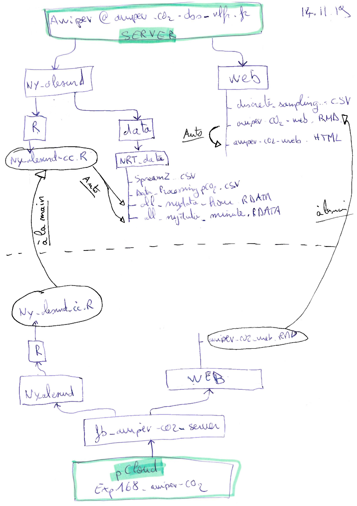

{width=250px}


```{r set-up, echo=FALSE, warning=FALSE, message=FALSE, include=FALSE}
Sys.setlocale("LC_ALL", "en_US.UTF-8")
Sys.setenv(TZ='UTC') # on utilise UTC
rm(list = ls())
if (!require("tidyverse")) install.packages("tidyverse")
library(tidyverse)
if (!require("robfilter")) install.packages("robfilter")
library("robfilter")
if (!require("seacarb")) install.packages("seacarb")
library("seacarb")
if (!require("gridExtra")) install.packages("gridExtra")
library("gridExtra")
if (!require("reshape2")) install.packages("reshape2")
library("reshape2")
if (!require("lubridate")) install.packages("lubridate")
library("lubridate")
if (!require("lmtest")) install.packages("lmtest")
library("lmtest")
if (!require("grid")) install.packages("grid")
library(grid)
if (!require("viridis")) install.packages("viridis")
library("viridis")
if (!require("dygraphs")) install.packages("dygraphs")
library("dygraphs")
if (!require("knitr")) install.packages("knitr")
require("knitr")
if (!require("lmodel2")) install.packages("lmodel2")
library("lmodel2")
if (!require("captioner")) install.packages("captioner")
library("captioner")
if (!require("xts")) install.packages("xts")
library("xts")
if (!require("seismicRoll")) install.packages("seismicRoll")
library("seismicRoll")
if (!require("scales")) install.packages("scales")
library("scales")
if (!require("cowplot")) install.packages("cowplot")
library(cowplot)
if (!require("htmlwidgets")) install.packages("htmlwidgets")
library("htmlwidgets")
if (!require("hms")) install.packages("hms")
library("hms")
if (!require("ragg")) install.packages("ragg")
library("ragg")
if (!require("skimr")) install.packages("skimr")
library("skimr")
if (!require("FNN")) install.packages("FNN")
library("FNN")
if (!require("patchwork")) install.packages("patchwork")
library("patchwork")
if (!require("pander")) install.packages("pander")
library("pander")

knitr::opts_chunk$set(echo = TRUE)

fig_nums <- captioner()
table_nums <- captioner(prefix = "Table")

#define who is the user and define path
if (Sys.getenv("LOGNAME") == "gattuso") path = "../../pCloud\ Sync/Documents/experiments/exp168_awipev-CO2/"
if (Sys.getenv("LOGNAME") == "samir") path = "../../pCloud\ Sync/exp168_awipev-CO2/"

#################### which.closest function
which.closest <- function(x, table, ...) {
  round(approx(x=table, y=1:length(table), xout=x, ...)$y)
}

#################### Regression function
# function regression plot with equation (MA or OLS) in title
ggreg <- function (xdata, ydata, type = "OLS", plot = TRUE, title = "title") { # x and y are the names of the variables
  fit_data <- tibble(xdata, ydata)
  colnames(fit_data) = c("xdata", "ydata")
  fit <- print(lmodel2::lmodel2(ydata ~ xdata))
if (type == "OLS") ty = 1 #one selects OLS only
if (type == "MA") ty = 2 #one selects MA only
#reg <- fit$regression.results[ty,] #one selects OLS only
intercept <- fit$regression.results$Intercept[ty]
slope <- fit$regression.results$Slope[ty]
if (plot == TRUE) {
  plt <- ggplot(data = fit_data, aes(x = xdata, y = ydata)) + 
  geom_point(na.rm = TRUE, size = 2, colour = "blue") +
  geom_abline(aes(intercept = intercept, slope = slope),
              colour = "blue")  + 
  labs(title = paste(title, "; type: ", type,
                     "\n R2 = ", round(fit$rsquare, digits = 2),
                     "; Intercept =", signif(intercept, 3),
                     "; Slope =", signif(slope, 3),
                     "; P =", signif(fit$P.param, 3)))
  return(plt)
  } else {
  return(fit)
}
}

#################### Function RMSE for model 2 regression root mean square error
#test <- readr::read_csv(file="test_file")
lm2 <- function(data = NULL, x, y) {
  col_x <- eval(substitute(x), data)
  col_y <- eval(substitute(y), data)
  col_x <- x
  col_y <- y
fit <- lmodel2(col_y ~ col_x, nperm = 99)
  intercept_MA <- fit$regression.results[2,2]
  slope_MA <- fit$regression.results[2,3]
  intercept_OLS <- fit$regression.results[1,2]
  slope_OLS <- fit$regression.results[1,3]
  predicted <- intercept_OLS + col_x * slope_OLS
  error <- col_x - predicted
  my_list <- list(fit = print(fit), rmse = sqrt(mean(error^2, na.rm=TRUE)))
  return(my_list)
}
#z <- lm2(x = d_all$pco2_calc_fb, y = d_all$pco2_fb)
#z <- lmodel2(d_all$pco2_fb ~ d_all$pco2_calc_fb)
#z <- lm2(data = d_all, x = pco2_calc_fb, y = pco2_fb)

#################### Mytheme
Mytheme <- function(size_labs = 7, face_font="plain") {
  theme_bw() +
  theme(axis.text.x = element_text(face=face_font, size=size_labs, color="black"),
        axis.title.x = element_text(face=face_font, size=size_labs),
        axis.text.y = element_text(face=face_font, color="black", size=size_labs),
        axis.title.y = element_text(face=face_font, size=size_labs),
        axis.ticks.x = element_line(size=0.1),
        axis.ticks.y = element_line(size=0.1),
        axis.ticks.length = unit(1.1, "mm"),
        panel.grid.major = element_line(size = 0.25, color="black", linetype="dashed"),
        aspect.ratio = 1 / 2,
        plot.margin = margin(t = 0, r = 0, b = 0, l = 0, unit = "cm")
  )
}

ggplotRegression <- function(fit){
ggplot(fit$model, aes_string(x = names(fit$model)[2], y = names(fit$model)[1])) + 
  geom_point() +
  stat_smooth(method = "lm", col = "red", se= FALSE) +
  labs(title = paste("Adj R2 = ",signif(summary(fit)$adj.r.squared, 5),
                     "Intercept =",signif(fit$coef[[1]],5 ),
                     " Slope =",signif(fit$coef[[2]], 5),
                     " P =",signif(summary(fit)$coef[2,4], 5)))
}

#################### MySkim
# myskim <- skim_with(numeric = sfl(min = ~min(., na.rm = TRUE),
#                                   max = ~max(., na.rm = TRUE)))
```

```{r read observatory data, cleanup and prepare ferrybox data, echo=FALSE, warning=FALSE, message=FALSE}
d_hour <-
  readRDS(file = paste0(
    path,
    "fb_awipev-co2_server/ny-alesund/data/NRT_data/nydata_hour.rds"
  ))
d_hour <- d_hour %>%
  dplyr::rename(
    pco2_fb = pco2_corr_filtered,
    temp_dur = temp_dur_filtered,
    pco2_raw = pco2_raw_filtered,
    sal_fb = sal_fb_filtered,
    temp_insitu_11m = temp_insitu_11m_filtered,
    temp_fb = temp_fb_filtered,
    ph_dur = ph_dur_filtered
  ) %>% 
  arrange(datetime)
d_all <- as_tibble(d_hour) #d_all will be the merger
d_all <- d_all %>%
  dplyr::mutate_all(function(x) ifelse(is.nan(x), NA, x)) %>% # replace all NaN by NA
  dplyr::mutate(depth = ifelse( # create new variable depth
      pressure_insitu_ctd <= 2,
      1,
      ifelse(
        pressure_insitu_ctd > 2 & pressure_insitu_ctd <= 4,
        3,
        ifelse(
          pressure_insitu_ctd > 4 & pressure_insitu_ctd <= 6,
          5,
          ifelse(
            pressure_insitu_ctd > 6 & pressure_insitu_ctd <= 8,
            7,
            ifelse(pressure_insitu_ctd > 8, 9, NA)
          )
        )
      )
    )) %>%
  dplyr::rowwise() %>% 
  dplyr::mutate(n_depth_ctd = sum(is.na( # create new variable to identify the hours for which there are CTD data at more than 1 depth 
  c(
    sal_insitu_ctd_1m,
    sal_insitu_ctd_3m,
    sal_insitu_ctd_5m,
    sal_insitu_ctd_7m,
    sal_insitu_ctd_9m
  )
), na.rm = TRUE)) %>% 
  ungroup()
#restore datetime, date which are mangled by the mutates above, arrange ascending
d_all <- d_all %>% 
  dplyr::mutate(datetime = d_hour$datetime, 
                date = d_hour$date,
                year = lubridate::year(d_hour$datetime), # year as a number
                monthd = lubridate::month(d_hour$datetime), # month as a number
                montht = lubridate::month(d_hour$datetime, label = TRUE, abbr = TRUE) # abbreviated months
  )
```

```{r Sal filter, fig.width=10, fig.height=4, echo=FALSE, message= FALSE}

########### Binding sal_fb + sal_insitu if we get gaps in sal_insitu = call this new column = sal_mix ########### 
d_all <- d_all %>%
  dplyr::mutate(sal_mix = ifelse(!is.na(sal_fb), sal_fb, sal_insitu_ctd_9m))
```
   
```{r Temp filter, fig.width=10, fig.height=4, echo=FALSE, message= FALSE}
# Create temp_mix: filling gaps in temp_insitu_11m using temp_insitu_9m
d_all <- d_all %>%
  dplyr::mutate(temp_mix = ifelse(!is.na(temp_insitu_11m), temp_insitu_11m, temp_insitu_ctd_9m))
```

```{r read and prepare discrete AT+CT, echo=FALSE, warning=FALSE, message=FALSE}
d <- tibble(
  read.table(paste0(path, "fb_data/Discrete_analyses_AT_CT/Discrete_sampling_AWIPEV.csv"), header = T, dec = ".", as.is = T, sep = ";", fill = TRUE)
) %>% 
  dplyr::mutate(datetime = dmy_hm(sampling_date, tz="UTC"),
                measure_date = dmy(measure_date, tz="UTC"),
                date = as.Date(datetime)) %>% 
  dplyr::rename(ph_s_sf = pH_s_seafet,
                ph_s_dur = pH_s_durafet,
                qflag_ph_s_sf = qflag_pH_s_seafet,
                qflag_ph_s_dur = qflag_pH_s_durafet)

# Add the flag location: some samples have been collected at the pier. Notes them here.
# Flag 1 = collected on the pIer by Niskin and flag 0 = collected in the FB (normal collect)
 # And keep data with flag 0 for FB location
d <- d%>%
  dplyr::mutate(location_flag = ifelse(datetime == as.POSIXct("2016-04-21 09:25:00") | 
                                         datetime == as.POSIXct("2016-02-10 14:00:00") | 
                                         datetime == as.POSIXct("2016-02-17 09:20:00") |
                                         datetime == as.POSIXct("2016-02-24 14:20:00") |
                                         datetime == as.POSIXct("2016-02-04 09:30:00") |
                                         datetime == as.POSIXct("2016-01-27 15:00:00") |
                                         datetime == as.POSIXct("2016-01-13 13:45:00") |
                                         datetime == as.POSIXct("2016-01-06 14:10:00") |
                                         datetime == as.POSIXct("2015-12-24 10:45:00") |
                                         datetime == as.POSIXct("2015-12-30 13:30:00") |
                                         datetime == as.POSIXct("2018-01-05 15:20:00") |
                                         datetime == as.POSIXct("2018-02-02 14:35:00") |
                                         datetime == as.POSIXct("2018-03-02 14:10:00") |
                                         datetime == as.POSIXct("2019-05-31 11:45:00"), 
                                       1, 0))
d <- d %>%
  dplyr::filter(location_flag == 0)

# Keep only flag = 2 for at/ct analysis 
# Keep only flag = 2 for pH durafet and seaFET.
d <- d%>%
  dplyr::mutate(ct = replace(ct, qflag_ct != 2, NA),
                at = replace(at, qflag_at != 2, NA),
                ph_s_sf = replace(ph_s_sf, qflag_ph_s_sf != 2, NA),
                ph_s_dur = replace(ph_s_dur, qflag_ph_s_dur != 2, NA))

# Mercuric chloride correction (Dickson et al. 2007, SOP3a)
d$at <- d$at * 1.0002
d$ct <- d$ct * 1.0002

# mean at and ct
at_ct_mean <- d %>% 
#  group_by(datetime)%>%
  group_by(date) %>%
  dplyr::summarize(at_mean = mean(at, na.rm = TRUE),
                   ct_mean = mean(ct, na.rm = TRUE),
                   at_sd = sd(at, na.rm = TRUE), 
                   ct_sd = sd(ct, na.rm = TRUE)
                   )
d <- left_join(d, at_ct_mean, by='date') %>% 
  dplyr::select(datetime, date, temp_s_lab, ph_s_sf, ph_s_dur, location_flag, at, ct, at_mean, ct_mean) %>% # removed useless variables and also to do unique next
  dplyr::distinct()

# Fill the gaps in at_mean with interpolation
TAinterp <-approx(d$datetime, d$at_mean, xout=d$datetime, method="linear", rule=2)
names(TAinterp) <- c("datetime", "at_mean_interp")
TAinterp <- as.data.frame(TAinterp)
d$at_mean_interp <- TAinterp$at_mean_interp

CTinterp <-approx(d$datetime, d$ct_mean, xout=d$datetime, method="linear", rule=2)
names(CTinterp) <- c("datetime", "ct_mean_interp")
CTinterp <- as.data.frame(CTinterp)
d$ct_mean_interp <- CTinterp$ct_mean_interp

# add sal_fb + sal_insitu_ctd + temp_fb + temp_insitu_ctd from d_all into d, to use pHinsi
# use the closest time to add them
closest <- which.closest(d$datetime, d_all$datetime) # closest date and time
d$closest_datetime <- d_all$datetime[closest]
# if the closest value is more than 30 min away, then we do not take it
d$closest_datetime[abs(d$datetime - d_all$datetime[closest]) > 30*60] <- NA
# create closest_datetime in d_all (copy of datetime)
d_all$closest_datetime <- d_all$datetime
d <- left_join(d, d_all %>%
                 dplyr::select(
                   c(
                     closest_datetime,
                     sal_fb,
                     temp_fb,
                     temp_mix,
                     sal_mix,
                     temp_insitu_11m,
                     temp_insitu_ctd,
                     pressure_insitu_ctd
                   )
                 ), by = "closest_datetime") %>% 
  dplyr::select(-closest_datetime)

# Conversion of spec pH of in situ samples to in situ temp
pH_seafet <- d %>%
  dplyr::filter(!is.na(ph_s_sf) & !is.na(temp_insitu_ctd))
pH_seafet <- pH_seafet %>% 
  dplyr::mutate(ph_s_sf_temp_insi = 
                  pHinsi(pH = pH_seafet$ph_s_sf, 
                         ALK = pH_seafet$at_mean_interp*1e-6, Tinsi = pH_seafet$temp_insitu_ctd, 
                         Tlab = pH_seafet$temp_s_lab, Pinsi = pH_seafet$pressure_insitu_ctd/10, 
                         S = pH_seafet$sal_mix, Pt = 0, Sit = 0))

# Conversion of spec pH of FerryBox samples to FerryBox temp
pH_durafet <- d %>%
  dplyr::filter(!is.na(ph_s_dur) & !is.na(sal_fb) & !is.na(temp_fb))
pH_durafet <- pH_durafet %>% 
  dplyr::mutate(ph_s_dur_temp_fb = pHinsi(pH = pH_durafet$ph_s_dur, ALK = pH_durafet$at_mean_interp*1e-6, Tinsi = pH_durafet$temp_fb, Tlab = pH_durafet$temp_s_lab, Pinsi = 0, S = pH_durafet$sal_fb, Pt = 0, Sit = 0))

# Make mean for replicates. create separate seafet/durafet df to join to initial "d" df
pH_seafet_mean <- pH_seafet%>%
  dplyr::select(date, ph_s_sf_temp_insi)%>% 
  dplyr::group_by(date) %>% 
  dplyr::summarize(ph_s_sf_temp_insi = mean(ph_s_sf_temp_insi, na.rm = TRUE))
pH_durafet_mean <- pH_durafet%>%
  dplyr::select(date, ph_s_dur_temp_fb)%>% 
  dplyr::group_by(date) %>% 
  dplyr::summarize(ph_s_dur_temp_fb = mean(ph_s_dur_temp_fb, na.rm = TRUE))

#  make means in "d" to have same format and call it "discrete"
discrete <- d %>%
  dplyr::group_by(date) %>%
  dplyr::summarize(
    datetime = mean(datetime, na.rm = TRUE),
      sal_fb = mean(sal_fb, na.rm = TRUE),
    sal_mix = mean(sal_mix, na.rm = TRUE),
    temp_fb = mean(temp_fb, na.rm = TRUE),
    at_mean_interp = mean(at_mean_interp, na.rm = TRUE),
    at = mean(at, na.rm = TRUE),
    #qflag_at = mean(qflag_at, na.rm = TRUE), # already dealt with above
    ct_mean_interp = mean(ct_mean_interp, na.rm = TRUE),
    ct = mean(ct, na.rm = TRUE),
    #qflag_ct = mean(qflag_ct, na.rm = TRUE)  # already dealt with above
    temp_mix = mean(temp_mix, na.rm = TRUE),
    temp_insitu_11m = mean(temp_insitu_11m, na.rm = TRUE)
  )
# join discrete + seafet/durafet
discrete <- left_join(discrete, pH_seafet_mean, by='date')
discrete <- left_join(discrete, pH_durafet_mean, by='date')

##   *****Attention, temp noted by logisticians in d is FB temp with SBE45 ******
##   *****Attention, I asked to the logisticians to log insitu temp from 9 june 2019
##   *****Attention, but no longer used in the script, so no problem

# pH calculated (at and ct) at Ferrybox sal and temp
discrete_no_na <- discrete %>%
  dplyr::filter(!is.na(sal_fb)  & !is.na(temp_fb) & !is.na(at) & !is.na(ct))
discrete_is_na <- discrete %>%
  dplyr::filter(is.na(sal_fb)  | is.na(temp_fb) | is.na(at) | is.na(ct))
carb <- carb(15, discrete_no_na$at*1e-6, discrete_no_na$ct*1e-6, S = discrete_no_na$sal_fb, T = discrete_no_na$temp_fb, P = 0, Pt = 0, Sit = 0, k1k2 = "l", kf = "dg", ks = "d", pHscale = "T", b = "u74")
discrete_no_na$phcalc_fb <- carb$pH # pH to compare with durafet pH (at Ferrybox temp and sal)
discrete_no_na$pco2_calc_fb <- carb$pCO2

# create new variable in "discrete_is_na" to bind "discrete_no_na"
discrete_is_na$phcalc_fb <- NA
discrete_is_na$pco2_calc_fb <- NA
discrete <- bind_rows(discrete_no_na, discrete_is_na) %>% 
  dplyr::arrange(date)
```
```{r read and prepare nutrient data, echo=FALSE, warning=TRUE, message=FALSE}
# File "Ferrybox nutrients 2014-2018.xlsx" provided by 
# Willem van de Poll <w.h.van.de.poll@rug.nl> on 2020-01-16
# nutrients in umol/l
nuts <- readxl::read_excel(paste0(path, "fb_data/Ferrybox nutrients 2014-2018.xlsx"),
                           skip =1) %>% 
  drop_na(date) %>% 
  dplyr::mutate(datetime = as.POSIXct(paste0(date, " 12:00:00")),
                ) %>% # assuming sampling time 12:00
  dplyr::filter(datetime > as.POSIXct("2015-07-09"))
# The nearest times
time_index <- unique(d_all$datetime)
# nuts$closest <- time_index[
#   FNN::knnx.index(time_index, # The values to be queried (big df)
#                   as.vector(nuts$datetime), # The value to find the closest match to (small df)
#                   k = 1)] # The number of closest values to return
nuts <- nuts %>% 
  dplyr::mutate(closest = time_index[
  FNN::knnx.index(time_index, # The values to be queried (big df)
                  as.vector(nuts$datetime), # The value to find the closest match to (small df)
                  k = 1)]) %>%  # The number of closest values to return
  dplyr::select(-date, -datetime) %>% 
  dplyr::rename(NO3NO2 = `NO3+NO2`)
# cleanup and convert in umol/kg
d_all <- left_join(d_all, nuts, by = c("datetime" = "closest")) #%>% 
  #dplyr::select(-closest_datetime)
d_all <- d_all %>% 
  dplyr::mutate(density_fb = seacarb::rho(S = sal_fb, T = temp_fb, P = 0),
                po4 = PO4 / (density_fb/1000),
                nh4 = NH4 / (density_fb/1000),
                no3no2 = NO3NO2 / (density_fb/1000),
                no3 = NO3 / (density_fb/1000),
                si = Si / (density_fb/1000)
  )
```

```{r Combine discrete and continous data, echo=FALSE}
# at
closest <- which.closest(discrete$datetime, d_all$datetime) # closest date and time
discrete$closest_datetime <- d_all$datetime[closest]
# if the closest value is more than 30 min away, then we do not take it
discrete$closest_datetime[abs(discrete$datetime - d_all$datetime[closest]) > 30*60] <- NA
discrete2merge <- discrete %>%
  dplyr::select(closest_datetime, at) %>%
    dplyr::filter(!is.na(closest_datetime)) %>%
  rename(datetime=closest_datetime)
d_all <- full_join(d_all, discrete2merge, by="datetime")

# ct
discrete2merge <- discrete %>%
  #drop_na() %>%
  dplyr::select(closest_datetime, ct) %>%
  dplyr::filter(!is.na(closest_datetime)) %>%
  rename(datetime=closest_datetime)
d_all <- full_join(d_all, discrete2merge, by="datetime")

# pH calculated ferrybox
discrete2merge <- discrete %>%
  #drop_na() %>%
  dplyr::select(closest_datetime, phcalc_fb) %>%
  dplyr::filter(!is.na(closest_datetime)) %>%
  rename(datetime=closest_datetime)
d_all <- full_join(d_all, discrete2merge, by="datetime")

# seaFET pH 
discrete2merge <- discrete %>%
  dplyr::select(closest_datetime, ph_s_sf_temp_insi) %>%
  dplyr::filter(!is.na(closest_datetime)) %>%
  rename(datetime=closest_datetime)
d_all <- full_join(d_all, discrete2merge, by="datetime")
d_all <- d_all %>% 
  dplyr::mutate(ph_s_sf_temp_insi = ifelse(n_depth_ctd == 4, ph_s_sf_temp_insi, NA)) # eliminate ph spec data when the profiler was at several depth during the same hour
  #dplyr::mutate(ph_s_sf_temp_insi = ifelse(!is.na(temp_insitu_ctd_7m) |
  #                                           !is.na(temp_insitu_ctd_9m), 
   #                                        ph_s_sf_temp_insi, NA)) # only use ph spec data when profiler was below 6 m

# durafet pH 
discrete2merge <- discrete %>%
  dplyr::select(closest_datetime, ph_s_dur_temp_fb) %>%
  dplyr::filter(!is.na(closest_datetime)) %>%
  rename(datetime=closest_datetime)
d_all <- full_join(d_all, discrete2merge, by="datetime")

# calculated pCO2 
discrete2merge <- discrete %>%
  dplyr::select(closest_datetime, pco2_calc_fb) %>%
  dplyr::filter(!is.na(closest_datetime)) %>%
  rename(datetime=closest_datetime)
d_all <- full_join(d_all, discrete2merge, by="datetime")

saveRDS(file= paste0(path, "fb_data/d_all.rds"), d_all)

## bind the voltages and deployment ##

# Duplicate datetime in closest_datetime to do the left_join
d_all$closest_datetime <- d_all$datetime
discrete <- left_join(discrete, d_all %>% dplyr::select(c(closest_datetime, voltEXT, voltINT)), by="closest_datetime")

# order columns
d_all <- d_all %>% 
  dplyr::select(order(colnames(d_all))) %>% 
  dplyr::select(datetime, date, year, monthd, montht, everything())
```

<style type="text/css">

body{ /* Normal  */
      font-size: 18px;
  }
h3{ /* Header 3 */
  font-size: 22px;
  <!-- font-family: "Times New Roman", Times, serif; -->
  color: DarkBlue;
}
h4{ /* Header 4 */
  font-size: 18px;
  <!-- font-family: "Times New Roman", Times, serif; -->
  color: DarkBlue;
}
h5{ /* Header 5 */
  font-size: 16px;
  <!-- font-family: "Times New Roman", Times, serif; -->
  color: DarkBlue;
}
</style>

# {.tabset .tabset-fade .tabset-pills}

## Infos 

### **Introduction**
<div style="text-align: justify">  
The AWIPEV-CO2 project aims at starting the first time series for the carbonate chemistry in the Arctic Ocean as part of the AWIPEV Underwater Observatory. It comprises two components: (1) continuous real-time measurements and (2) discrete measurements. The rationale is that discrete measurements are absolutely needed to calibrate and validate the sensors. 

### **AWIPEV Underwater Observatory**
<div style="text-align: justify">  
The AWIPEV Underwater Observatory has been deployed at Ny-Alesund (Spitsbergen, 78°55'18N, 11°56'31E) in June 2012. It is part of the German Project COSYNA (Coastal Observation Systems of the Northern- and Arctic Seas), which aims at increasing the availability of continuous real-time data from remote but climatically-sensitive ecosystems. The AWIPEV underwater observatory comprises a fully remote controlled FerryBox system fed with seawater pumped in front of the old pIer at 12 m depth. Temperature, salinity, pressure, turbidity, oxygen, chl-*a* fluorescence are measured. Furthermore, an additional remote controlled underwater sensor unit able to profile from 12 m to the surface at any frequency carries additional sensors for salinity, pressure, turbidity, oxygen chl-*a* fluorescence and PAR. The system also comprises an ADCP for continuous measurements of currents and waves. Besides these standard sensors, the underwater unit is equipped with a webcam and stereo-optical device to remotely assess fish and jellyfish populations. The AWIPEV observatory is specifically designed for polar experimental work under extreme conditions including ice coverage and the inaccessibility for about 7 months during polar winter. During this time, the system is remotely controlled and maintained from Germany. All data sampled by the sensors are continuously sent to a central server system at Helgoland Island where the data are stored and processed. The processed data are open access and available at http://codm.hzg.de/codm.

<div style="text-align:center" markdown="1">
  
  
  
</div>

### **Continuous and semi-continuous measurements**
<div style="text-align: justify">  
The Arctic version of the Contros-Kongsberg HydroC CO~2~ FT (Carbon Dioxyde partial pressure Flow Through surface water sensor) has been installed in July 2015. Molecules of dissolved CO~2~ diffuse through a thin composite membrane into the internal gas circuit leading to a detector chamber, where the partial pressure of CO~2~ is determined by means of infra-red absorption spectrometry. Concentration-dependent IR light is converted into the output signal from calibration coefficients stored in firmware and data from additional sensors within the gas circuit. The measuring range is 200-1000 uatm, resolution is < 1 uatm and accuracy is +- 1% reading. The sensor is the first instrument in the measuring loop; data are logged every minute. This instrument requires yearly factory calibration; two sensors ara available to allow a continuous time series.

Since February 2016, total alkalinity (AT) is measured every 90 min with a Contros-Kongsberg HydroFIA TA (Total Alkalinity analyser flow through system). Fifty ml of seawater is filtered (0.2 um) using a Contros-Kongsberg cross-flow filter and then acidified using dilute hydrochloric acid (0.1 N). CO~2~ is then flushed out (open-cell titration) and the final pH measured by means of an indicator dye (bromocresol green) and visible absorption spectrometry. Together with salinity and temperature at the time of measurement, the pH reading is used to calculate AT. According to the manufacturer, the measuring range is 400 umol/kg dynamic range, resolution 0.1 umol/kg, accuracy 25 umol/kg (+- 1%) and precision 5 umol/kg (+- 0.2%).

In August 2017, a seaFET Ocean pH sensor (Sea-Bird Scientific) has been added to the UWO. This new sensor continuously measures pH at 11 m using an ISFET (Ion Sensitive Field Effect Transistor). According to the manufacturer, the measuring range is between 6.5 and 9 pH units, initial accuracy is 0.02 pH units and precision is 0.004 pH units. Operating salinity and temperature range are 20 to 40 PSU and 0 to 50°C respectively.

In August 2017, a Durafet III pH electrode connected to a UDA2128 Analyser (Honeywell) was also implemented to the Ferrybox flow-through system. This electrode continuously measures pH, in the Ferrybox, through an ISFET. According to the manufacturer, the measuring range is between 0 and 14 pH units.

### **Data availability**
The data at one minute frequency were tagged with the following quality flags

+ 1: good data
+ 3: failing the date and time test
+ 4: data not usable according to manufacturer
+ 6: failing the manufacturer range test (not used)
+ 7: failing the regional range test 
+ 12: failing the spike test (NAs from despike)
+ 13: failing the gradient test
+ 15: instrument not deployed or operated
+ 16: acid flush
+ 99: failing the final visual inspection 

* Despike using oce::despike with n=2, k=5761


```{r data availability, echo=FALSE, message= FALSE, warning=FALSE, out.width="80%",fig.show='hold', fig.align="center"}
d_min <- readRDS(file = paste0(path, "fb_awipev-co2_server/ny-alesund/data/NRT_data/all_nydata_minute.rds")) %>%
dplyr::select(datetime, c(pco2_corr_qf, sal_fb_qf, sal_insitu_ctd_qf, 
                          temp_fb_qf, temp_insitu_11m_qf, ph_dur_qf, phINT_qf))

s1 <- summary(as.factor(d_min$pco2_corr_qf))*100/length(d_min$pco2_corr_qf)
s2 <- summary(as.factor(d_min$sal_fb_qf))*100/length(d_min$sal_fb_qf)
s3 <- summary(as.factor(d_min$sal_insitu_ctd_qf))*100/length(d_min$sal_insitu_ctd_qf)
s4 <- summary(as.factor(d_min$temp_fb_qf))*100/length(d_min$temp_fb_qf)
s5 <- summary(as.factor(d_min$temp_insitu_11m_qf))*100/length(d_min$temp_insitu_11m_qf)
# durafet and seafet started later
x <- filter(d_min, datetime >= as.POSIXct("2017-08-29 10:00:00"))
#s6 <- summary(as.factor(x$temp_dur_qf))*100/length(x$temp_dur_qf)
s7 <- summary(as.factor(x$ph_dur_qf))*100/length(x$ph_dur_qf)
x <- filter(d_min, datetime >= as.POSIXct("2017-08-24 19:00:00"))
s8 <- summary(as.factor(x$phINT_qf))*100/length(x$phINT_qf)
z <- t(bind_rows(s1,s2,s3,s4,s5,s7,s8)) %>%
  as.data.frame() %>%
         rownames_to_column(var = "flag") %>% 
         as_tibble()
labels <- c("Good", "Not usable", "Outside regional range", "Outliers (despike)", 
            "Failed visual inspection", "Not deployed or operated", "Acid flush", "Failed visual inspection")
colnames(z) <- c("Flag", "pCO2", "Salinity FerryBox", "In situ salinity", 
                 "Temperature FerryBox", "In situ temperature", "Durafet pH", "seaFET pH")
zz <- pivot_longer(z, -Flag)
p <- ggplot(data = zz, aes(x = name, y = value, fill = Flag)) +
  geom_bar(position = position_stack(reverse = TRUE), stat="identity", width = 0.3) +
  #scale_y_reverse() +
  scale_fill_discrete(labels = labels) + 
  coord_flip() +
  #geom_text(aes(label=round(value, digits = 0)), position = position_stack((hjust = 0.5)), size = 3) +
  labs(x="", y="", title = "Distribution (%) of quality flags", color = "Quality flag") +
  Mytheme(size_labs = 8) +
  theme(plot.margin = margin(t = 0, r = 0.0, b = 0, l = 0.0, unit = "cm"))
ggsave(filename = "figures/availability.png", plot = p, width = 20, units = "cm")
kable(z, digits = 1)

# Good data per year

#rm(d_min)
```


## Salinities
Several salinity sensors are on site, 1 inside the Ferrybox (SBE45) and 5 outside (ctd183, ctd181, ctd578, ctd964/964b and ctd103) that are switched periodically. Salinity from FB is taken in consideration. If data gaps are encountered, they are filled with bottom salinty data from ctd (> 8 m). New column "sal_mix" is created and is the one used in ESSD paper.

+ 1 SBE45 inside the Ferrybox (sal_fb)
+ 5 CTD > 8 m depth (sal_insitu_ctd)

```{r Salinity, echo=FALSE, message= FALSE, warning=FALSE, out.width="80%",fig.show='hold', fig.align="center"}
# SAL FerryBox and sal_mix
sal_xts <- dplyr::select(d_all, datetime, sal_fb, sal_mix)
sal_xts <- as.xts(sal_xts, order.by = sal_xts$datetime)
dygraph(sal_xts, group = "awipev", main="Salinity (in FerryBox)", ylab="Salinity") %>%
            dySeries("sal_fb", color = "blue", strokeWidth = 0, label = "sal_fb") %>%
            dySeries("sal_mix", color = "red", strokeWidth = 0, label = "sal_mix") %>%
dyHighlight(highlightCircleSize = 8,highlightSeriesBackgroundAlpha =0.2,hideOnMouseOut =TRUE) %>%
      dyOptions( drawGrid = TRUE, drawPoints = TRUE, pointSize = 2,useDataTimezone = TRUE) %>%
    dyLegend(show = "follow")   %>%
    dyAxis("y",valueRange = c(30, 37)) %>%
      dyRangeSelector(height = 30, dateWindow= NULL)
# now remove outliers
d_all <- d_all %>%
  dplyr::mutate(
    sal_mix = case_when(
      date > as.Date("2016-02-01") &
        date <  as.Date("2016-02-09") & sal_mix < 34 ~ NA_real_,
      date == as.Date("2015-11-19") & sal_mix < 33 ~ NA_real_,
      date > as.Date("2015-10-01") &
        date <  as.Date("2015-10-05") & sal_mix < 31.5 ~ NA_real_,
      date == as.Date("2017-03-22") &
        sal_mix < 34 ~ NA_real_,
      TRUE ~ sal_mix
    )
  )
```

### **Depth profile**

```{r Sal profile, echo=FALSE, message= FALSE, warning=FALSE, out.width="80%",fig.show='hold', fig.align="center"}

#SAL CTD profile
sal_xts <- dplyr::select(d_all, datetime, sal_insitu_ctd_1m, sal_insitu_ctd_3m, sal_insitu_ctd_5m, sal_insitu_ctd_7m, sal_insitu_ctd_9m)
sal_xts <- as.xts(sal_xts, order.by = sal_xts$datetime)
dygraph(sal_xts, group = "awipev", main="Salinity (in situ CTD, all depths)", ylab="Salinity") %>%
dySeries("sal_insitu_ctd_1m", color = RColorBrewer::brewer.pal(5, "Set1")[1], strokeWidth = 0, label = "1m") %>%
dySeries("sal_insitu_ctd_3m", color = RColorBrewer::brewer.pal(5, "Set1")[2], strokeWidth = 0, label = "3m") %>%
dySeries("sal_insitu_ctd_5m", color = RColorBrewer::brewer.pal(5, "Set1")[3], strokeWidth = 0, label = "5m") %>%
dySeries("sal_insitu_ctd_7m", color = RColorBrewer::brewer.pal(5, "Set1")[4], strokeWidth = 0, label = "7m") %>%
dySeries("sal_insitu_ctd_9m", color = RColorBrewer::brewer.pal(5, "Set1")[5], strokeWidth = 0, label = "9m") %>%
      dyHighlight(highlightCircleSize = 8,highlightSeriesBackgroundAlpha =0.2,hideOnMouseOut =TRUE) %>%
      dyOptions( drawGrid = TRUE, drawPoints = TRUE, pointSize = 2,useDataTimezone = TRUE) %>%
    dyLegend(show = "follow")   %>%
    dyAxis("y",valueRange = c(30, 37)) %>%
      dyRangeSelector(height = 30, dateWindow= NULL)

df <- d_all %>% 
  dplyr::select(datetime, sal_insitu_ctd_1m, sal_insitu_ctd_3m, sal_insitu_ctd_5m, sal_insitu_ctd_7m, sal_insitu_ctd_9m) %>%
  dplyr::mutate(date = format(datetime, '%Y-%m-%d')) %>% 
  group_by(date) %>% 
  summarize(mean1m = mean(sal_insitu_ctd_1m, na.rm = TRUE),
            mean9m = mean(sal_insitu_ctd_9m, na.rm = TRUE),
            range = mean(sal_insitu_ctd_1m, na.rm = TRUE)-mean(sal_insitu_ctd_9m, na.rm = TRUE)) %>% 
  ungroup()

p_sal_range <- ggplot(data = df) +
  geom_histogram((aes(x = df$range))) +
  labs(title = "Salinity difference between 1 and 9 m", x = "Difference") +
  Mytheme(size_labs = 8)
p_sal_range

kable(quantile(x = df$range, na.rm = TRUE), digits = 2, col.names = "Sal. unit", caption = "Quantiles salinity gradient between 0-2 m and > 8 m")
```
There are `r sum(!is.na(df$range))` days with salinity values at both 1 m (0-2 m) and 9 m (> 8 m). The salinity difference between 1 and 9 m ranges between `r min(df$range, na.rm=TRUE)` and `r max(df$range, na.rm=TRUE)` (mean: `r mean(df$range, na.rm=TRUE)`; `r median(df$range, na.rm=TRUE)`). The difference with depth is therefore significant.


### **Sal FB / Sal CTD 9 m **

```{r Sal comparaison, echo=FALSE, message= FALSE, warning=FALSE, out.width="80%",fig.show='hold', fig.align="center"}
lm <- lm2(x = d_all$sal_insitu_ctd_9m, y = d_all$sal_fb)
p <-  ggplot(d_all,aes(x=sal_insitu_ctd_9m, y= sal_fb))+
  geom_point( aes(color=factor(monthd))) + 
  geom_abline(slope=1, intercept=0, linetype = "dashed")+
  geom_abline(aes(intercept = lm$fit$regression.results[2,2], slope = lm$fit$regression.results[2,3]),colour = "blue") +
  ylim(c(30.5,35.5)) +xlim(c(28,35.5)) +
  labs(title = paste("","\n Adj R2 = ", signif(lm$fit$rsquare, 3),
                     "; Intercept =", signif(lm$fit$regression.results[2,2], 3),
                     "; Slope =", signif(lm$fit$regression.results[2,3], 3),
                     "; P =", signif(lm$fit$P.param, 3),
                     "; RMSE = ", signif(lm$rmse, 3))) +
  theme(aspect.ratio = 1, plot.title = element_text(size = 7)) + #
  coord_fixed(ratio = 1 )+
  labs( x="Salinity CTD 9 m", y="Salinity FB ", color = "Months") + theme_bw()

print(p) #p_sal_fb_ctd

d_all$diff_sal_fb_insitu_9m <- d_all$sal_insitu_ctd_9m - d_all$sal_fb
mean_diff_sal_fb_insitu_9m <- round(mean(d_all$diff_sal_fb_insitu_9m, na.rm = TRUE), digits = 2)
sd_diff_sal_fb_insitu_9m <- round(sd(d_all$diff_sal_fb_insitu_9m, na.rm = TRUE), digits = 2)
```

The mean difference between salinity FB and in situ is: `r mean_diff_sal_fb_insitu_9m` ± `r sd_diff_sal_fb_insitu_9m` PSU.

## Temperatures
Several temperature sensors are on site, 1 inside the Ferrybox (SBE45), 5 outside (ctd183, ctd181, ctd578, ctd964/964b and ctd103) that are switched periodically and 1 fixed at 11 m depth (sbe38). 
Temperature in situ at 11 m depth is taken in consideration. If data gaps are encountered, they are filled with bottom temperature data from ctd (> 8 m). New column "temp_mix" is created. For the moment, no gaps are encountered and temp_mix = temp_insitu_11m.

- 1 SBE45 inside the Ferrybox (temp_fb)
- 5 CTD profiling (temp_insitu_ctd_1m - 3m - 5m - 7m - 9m)
- 1 fixed at 11 meters depth (temp_insitu_11m)

```{r temperature time series, echo=FALSE, message= FALSE, warning=FALSE, out.width="80%",fig.show='hold', fig.align="center"}
# TEMP Ferrybox SBE45
temp_fb_xts <- dplyr::select(d_all, datetime, temp_fb)
temp_fb_xts <- as.xts(temp_fb_xts, order.by = temp_fb_xts$datetime)
dygraph(temp_fb_xts, group = "awipev", main="Temperature (in Ferrybox)", ylab="Temperature") %>%
      dySeries("temp_fb", color = "blue", strokeWidth = 0, label = "temp_fb") %>%
      dyAxis("y", valueRange = c(-2.5, 10)) %>%
      dyLegend(show = "follow")   %>%
      dyHighlight(highlightCircleSize = 8,highlightSeriesBackgroundAlpha = 0.5,hideOnMouseOut = TRUE) %>%
      dyOptions(drawGrid = TRUE, drawPoints = TRUE, pointSize = 2,useDataTimezone = TRUE) %>%
      dyRangeSelector(height = 30, dateWindow= NULL)
# TEMP insitu SBE38
temp_insitu_xts <- dplyr::select(d_all, datetime, temp_insitu_11m)
temp_insitu_xts <- as.xts(temp_insitu_xts, order.by = temp_insitu_xts$datetime)
dygraph(temp_insitu_xts, group = "awipev", main="Temperature (in situ 11 m)", ylab="Temperature") %>%
      dySeries("temp_insitu_11m", color = "blue", strokeWidth = 0, label = "temp_insitu_11m") %>%
      dyAxis("y", valueRange = c(-2.8, 10)) %>%
      dyHighlight(highlightCircleSize = 8,highlightSeriesBackgroundAlpha = 0.5,hideOnMouseOut = TRUE) %>%
      dyOptions(drawGrid = TRUE, drawPoints = TRUE, pointSize = 2,useDataTimezone = TRUE) %>%
      dyLegend(show = "follow")   %>%
      dyRangeSelector(height = 30, dateWindow= NULL)
```
      
### **Temperature profiles**
```{r temperature profiles, echo=FALSE, message= FALSE, warning=FALSE, out.width="80%",fig.show='hold', fig.align="center"}
temp_xts <- dplyr::select(d_all, datetime, temp_insitu_ctd_1m, temp_insitu_ctd_3m, temp_insitu_ctd_5m, temp_insitu_ctd_7m, temp_insitu_ctd_9m)
temp_xts <- as.xts(temp_xts, order.by = temp_xts$datetime)
dygraph(temp_xts, group = "awipev", main="Temperature profile (in situ CTD, all depths)", ylab="Temperature") %>%
dySeries("temp_insitu_ctd_1m", color = RColorBrewer::brewer.pal(5, "Set1")[1], strokeWidth = 0, label = "1m") %>%
dySeries("temp_insitu_ctd_3m", color = RColorBrewer::brewer.pal(5, "Set1")[2], strokeWidth = 0, label = "3m") %>%
dySeries("temp_insitu_ctd_5m", color = RColorBrewer::brewer.pal(5, "Set1")[3], strokeWidth = 0, label = "5m") %>%
dySeries("temp_insitu_ctd_7m", color = RColorBrewer::brewer.pal(5, "Set1")[4], strokeWidth = 0, label = "7m") %>%
dySeries("temp_insitu_ctd_9m", color = RColorBrewer::brewer.pal(5, "Set1")[5], strokeWidth = 0, label = "9m") %>%
dyHighlight(highlightCircleSize = 8,highlightSeriesBackgroundAlpha =0.2,hideOnMouseOut =TRUE) %>%
dyOptions( drawGrid = TRUE, drawPoints = TRUE, pointSize = 2,useDataTimezone = TRUE) %>%
dyLegend(show = "follow")   %>%
dyAxis("y",valueRange = c(-2, 10)) %>%
dyRangeSelector(height = 30, dateWindow= NULL)

df <- d_all %>% 
  dplyr::select(datetime, temp_insitu_ctd_1m, temp_insitu_ctd_3m, temp_insitu_ctd_5m, temp_insitu_ctd_7m, temp_insitu_ctd_9m) %>%
  dplyr::mutate(date = format(datetime, '%Y-%m-%d')) %>% 
  group_by(date) %>% 
  summarize(mean1m = mean(temp_insitu_ctd_1m, na.rm = TRUE),
            mean9m = mean(temp_insitu_ctd_9m, na.rm = TRUE),
            range = mean(temp_insitu_ctd_1m, na.rm = TRUE)-mean(temp_insitu_ctd_9m, na.rm = TRUE)) %>% 
  ungroup()
```
There are `r sum(!is.na(df$range))` days with temperature values at both 1 m (0-2 m) and 9 m (> 8 m). The temperature difference between 1 and 9 m ranges between `r min(df$range, na.rm=TRUE)`°C and `r max(df$range, na.rm=TRUE)`°C (mean: `r mean(df$range, na.rm=TRUE)`°C; `r median(df$range, na.rm=TRUE)`°C). The difference with depth is therefore significant.

### **T Ferrybox / T insitu 11 m **

```{r Temp fb insi comparaison, echo=FALSE, message= FALSE, warning=FALSE}
# Remove temp_fb outliers 
d_all <- d_all %>%
  dplyr::mutate(
    temp_fb = ifelse(
      datetime >= as.POSIXct("2017-03-22 08:00:00") &
        datetime <= as.POSIXct("2017-03-23 16:00:00"),
      NA,
      temp_fb
    ),
    temp_fb = ifelse(temp_fb > 15, NA, temp_fb)
  )
lm <- lm2(x = d_all$temp_insitu_11m, y = d_all$temp_fb)

p <-  ggplot(d_all,aes(x=temp_insitu_11m, y= temp_fb, label = monthd))+
  geom_text( aes(color=factor(monthd))) + 
 # scale_color_viridis_d(option = "C", guide="none")+
  geom_abline(slope = 1, intercept = 0, linetype = "dashed") +
  geom_abline(aes(intercept = lm$fit$regression.results[2,2], slope = lm$fit$regression.results[2,3]),
              colour = "blue") +
  labs(title = paste("T FB vs T 11 m","\n Adj R2 = ", signif(lm$fit$rsquare, 3),
                     "; Intercept =", signif(lm$fit$regression.results[2,2], 3),
                     "; Slope =", signif(lm$fit$regression.results[2,3], 3),
                     "; P =", signif(lm$fit$P.param, 3),
                     "; RMSE = ", signif(lm$rmse, 3))) +
  theme_bw() +
  theme(aspect.ratio = 1, plot.title = element_text(size = 7)) + 
  coord_fixed(ratio = 1 ) + scale_colour_discrete(guide="none") +
  labs(x="T 11 m", y="T FB ", color = "Months") 
print(p) # p_temp_11_fb

d_all$diff_T_fb_11m <- d_all$temp_fb - d_all$temp_insitu_11m
mean_diff_T_fb_11m <- round(mean(d_all$diff_T_fb_11m, na.rm = TRUE), digits = 2)
sd_diff_T_fb_11m <- round(sd(d_all$diff_T_fb_11m, na.rm = TRUE), digits = 2)
```

The mean difference between temperature Ferrybox and in situ at 11 m is: `r mean_diff_T_fb_11m` ± `r sd_diff_T_fb_11m`°C.

### **T 11 m / T CTD > 8 m **

```{r Temp 11m and ctd comparaison, echo=FALSE, message= FALSE, warning=FALSE}
lm <- lm2(x = d_all$temp_insitu_ctd_9m, y = d_all$temp_insitu_11m)
p <-  ggplot(d_all, aes(x=temp_insitu_ctd_9m, y= temp_insitu_11m, label = monthd))+
  geom_text( aes(color=factor(monthd))) + 
 # scale_color_viridis_d(option = "C", guide="none")+
  geom_abline(slope = 1, intercept = 0, linetype = "dashed") +
  geom_abline(aes(intercept = lm$fit$regression.results[2,2], slope = lm$fit$regression.results[2,3]),
              colour = "blue") +
  labs(title = paste("T CTD 9 m vs T 11 m","\n Adj R2 = ", signif(lm$fit$rsquare, 3),
                     "; Intercept =", signif(lm$fit$regression.results[2,2], 3),
                     "; Slope =", signif(lm$fit$regression.results[2,3], 3),
                     "; P =", signif(lm$fit$P.param, 3),
                     "; RMSE = ", signif(lm$rmse, 3))) +
  theme_bw() +
  theme(aspect.ratio = 1,plot.title = element_text(size = 7)) + 
  coord_fixed(ratio = 1 ) + scale_colour_discrete(guide="none") +
  labs( x="T CTD 9 m", y="T 11 m ", color = "Months")
print(p)

d_all$diff_T_ctd_11m <- d_all$temp_sf - d_all$temp_insitu_ctd_9m
mean_diff_T_ctd_11m <- round(mean(d_all$diff_T_ctd_11m, na.rm = TRUE), digits = 2)
sd_diff_T_ctd_11m <- round(sd(d_all$diff_T_ctd_11m, na.rm = TRUE), digits = 2)
```

The mean difference between temperature Ferrybox and in situ at 11 m is: `r mean_diff_T_ctd_11m` ± `r sd_diff_T_ctd_11m`°C.


## Total alkalinity

Since we bought the AT analyser (February 2016), numerous problems happened due to a leak of the degassing unit in each analyser and sudden step changes. Last analyser repaired by Contros was installed back in the FB on 2018-07-31. This was the 3rd analyser on site. Even with this instrument, data collection didn't show satisfaction.

<!-- We identify four periods (see plot at the end of this page with dark and ligth grey): -->

<!-- - from the set-up of the instrument on **2016-02-23** to **2017-02-09** during which we try to correct for the drift -->
<!-- - from **2017-02-09** to **2017-03-10** during which no drift correction is made, just an offset is applied to correct for the sudden shift in the data -->
<!-- - from the set-up of a new instrument on **2018-01-08** to **2018-06-20**, during which another correction using the discrete samples will be performed. In this period and before to stop it, continuous leakages in the degasing unit happened. -->
<!-- - from the set-up of a repaired unit on **2018-07-31** to **2018-10-31**. Here, the instrument took wrong salinity to perform AT measurements. The cause is not clear yet but Steffen sent to Samir a protocol on 2018-08-24 to correct those data with right salinity. Also, after this issue, since 2018-08-20, bad data were still measured. Steffen diagnosed a "bubble issue" in the indicator tubbings. Steps will be sent to Marine to solve this issue. After this, it was not a bubble. We decided to switch off the instrument to save reagents and wait until the comming of Steffen in NYA with a new instrument. -->

<!-- A new instrument was installed with Steffen on **2018-10-31**. This new instrument has a complete new designed membrane which will solve the problem. Steffen also developped a TA web interface to communicate remotly with the analyser. Samir has all the passwords and ID to connect. -->

<!-- The instrument is usually calibrated against CRM standards after deployment, CRMs are run after 3 months as samples (measurement mode, not calibration mode), an then immediately calibrated again. This procedure is repeated every 3 months. -->

<!-- ### **Filtration of AT data: outliers removing** -->

<!-- Outliers are present because of the cleaning operations made on the FerryBox everydays at 12:00am and 12:00pm. We first removed the outliers using a filter and decided, after a Skype conference with Steffen on September 2016, to: -->

<!--   - Remove existing filters ( > 2350 µmol/kg). -->
<!--   - Filter using salinity flag. -->
<!--   - Filter using pH flag. -->
<!--   - Not to filter on temperature flag. -->
<!--   - Apply a 3 data points median filter (no longer used; see despike function in "oce" package) -->

<!-- We decided to use "despike" function as data filter. This filter is done in "ny-alesund_cc.R". Length of runing median is: k = 121 days and the indicator (n times the sd between x and the reference) to consider a data from an outlier is: n = 0.5. -->

<!-- ### **Correction of AT data** -->

<!-- Calibration was initially performed twice a year since the analyser was supposed to be stable. Calibration was performed using the internal "calibration mode" against a CRM from A.Dickson (Batch #145, 2016-02-24) right after the instrument was installed and a second time on 2016-09-16. This approch is not longer used since September 2016 (Skype with Contros). -->

<!-- Since this date, the analyser is calibrated by measuring a CRM with the "measurement mode" in order to measure the offset of the instrument. Additionally, discrete seawater are sampled weekly and TA is analysed by SNAPO-CO2. -->

<!--   - Two methods to correct the drift are available: -->
<!--     - based on CRMs  -->
<!--     - based on AT measurement of discrete samples ("references"). -->

<!-- #### **Calibration** -->

<!-- - **2019-01-29 14:10**: Calibration started by Philipp Fisher using CRM 145 (2226.16 umol/kg, 33.572). The three previous measurements were 2314.5, 233.8, 2313.7 (analyser stable) and the six subsequent measurements were 2211.8, 2277.5, 2305.4, 2316.6, 2317.9. Error was done with CRM salinity (Analyser was not unplugged from the FB).  -->
<!-- Steffen's response: -->
<!-- > Hence, the serial connection should be cut off or the FB module feeding the analyzer with salinity data should be stopped during calibration. The calibration can be recalculated afterwards in the data post-processing. However, I see that the calibration resulted in very similar pH values 3.540 (September calibration) and 3.543 (January calibration) with very similar correction factors 1.2371 and 1.2365. Also the TA values are very similar to the baseline measurements from before at approx. 2316 µM. So for now, it should be fine.   -->


<!-- #### **CRM measurements** -->

<!-- The calibration of the sensor is made against a CRM standard from A. Dickson. We run a standard on the analyser as a regular measurement (measurement mode). Result sof calibrations are shown on the following plot.Dashed lines represent the theoritical value of AT (CRM) and hard lines represent CRM measured AT by the instrument. -->

<!-- ```{r CRM measurements, echo=FALSE, warning=FALSE, message=FALSE, out.width="80%",fig.show='hold', fig.align="center"} -->
<!-- calib_analyser <-  read.table(paste0(path, "fb_data/Calibration_TA/TA_#1215/measure_CRM_TA.txt"), header = T, dec = ".", as.is = T, sep = ",", fill = TRUE) -->

<!-- # To make the mean  -->
<!-- # Keep dates as Character to plot without date gaps. -->
<!-- calib_analyser3 <- calib_analyser %>% -->
<!--   dplyr::filter(analyser == "TA3")  -->
<!-- meanTA3 <- calib_analyser3 %>%  -->
<!--   group_by(day) %>%  -->
<!--   summarise (meanTA = mean(TA)) -->

<!-- melt_calib <- melt(calib_analyser, id.vars=c("analyser", "TA_theo", "datetime", "CRM"), measure.vars=c("TA")) -->
<!-- calib_p <- ggplot()+  -->
<!--           geom_point(data= melt_calib, aes(x=datetime, y=value, color=factor(CRM), shape= factor(analyser)) , size=3) + -->
<!--           scale_color_manual(values=c("blue","red"))+ -->
<!--          # set dashed lines for theoritical CRM -->
<!--           geom_segment(aes(x=1,xend=20,y=2226.16,yend=2226.16), linetype="dashed", color="blue")+ -->
<!--           annotate("text", x = 11, y = 2228, label = "Batch #145 = 2226.16", color="blue")+ -->
<!--           geom_segment(aes(x=20,xend=23,y=2213.59,yend=2213.59), linetype="dashed", color="red")+ -->
<!--           annotate("text", x = 15.5, y = 2213.59, label = "Batch #159 = 2213.59", color="red")+ -->
<!--         # set hard lines for measured CRM -->
<!--           geom_segment(aes(x=1,xend=5,y=2254,yend=2254), color="blue") + -->
<!--           annotate("text", x = 3, y = 2249, label = "2254", color="blue")+ -->
<!--           geom_segment(aes(x=6,xend=10,y=2251.6,yend=2251.6), color="blue") + -->
<!--           annotate("text", x = 8, y = 2247, label = "2251.6", color="blue")+ -->
<!--           geom_segment(aes(x=11,xend=15,y=2190.4,yend=2190.4), color="blue")+ -->
<!--           annotate("text", x = 14, y = 2195, label = "2190.4", color="blue")+ -->
<!--           geom_segment(aes(x=16,xend=20,y=2203.5,yend=2203.5), color="blue")+ -->
<!--           annotate("text", x = 18, y = 2200, label = "2203.5", color="blue")+ -->
<!--           geom_segment(aes(x=21,xend=23,y=2224.20,yend=2224.20), color="red")+ -->
<!--           annotate("text", x = 22, y = 2230, label = "2224.2", color="red") + -->
<!--   theme_bw() + theme(axis.text.x = element_text(angle = 45, hjust = 1))+  -->
<!--   labs(title= "",y=expression(paste("Total alkalinity (µmoles.",kg^-1,")")), x="Date", color= "CRM",shape= "Deployed instrument") -->

<!-- ggsave("figures/TA_calibration_CRM.png", calib_p, units="cm") -->
<!-- print(calib_p) -->
<!-- ``` -->


<!-- #### **Discrete samples ("references")**  -->

<!-- On 2018-04-19, Steffen sent his answer concerning the drift correction during the period February 2016 to March 2017. Within this one year period, the analyser was running, except the first week of May 2016. Discrete samples were collected and 3 CRMs were measured which was deemed not enough (see below). He suggested to base the correction on the AT of discrete ("reference") samples. -->

<!-- > "I chose the discrete reference samples due to the fact that those cover the entire working range including time, salinity and also provide a broader data basis for this kind of correction. Also, when looking at the uncertainty below, I fear that the three CRM measurements over 5 month are not sufficient enough for such a drift determination." -->

<!-- A linear regression was performed based on the difference between the measured (analyzer) and discrete samples. Discrete samples were matched with the AT measured by the analyser. If there is no measurement coincident with a discrete sample, a linear interpolation was made between the two data surrounding the discrete sample data. The differences between the measured (analyzer) and analysed ("reference") data was plotted as a function of time. -->

<!-- This approach was performed: -->

<!--   - on the same period than in Steffen email's (**First period**, 2016-02-23 to 2017-02-09) -->
<!--   - and during the **third period**, with the new analyzer (2018-01-07 to 2018-06-20) -->

<!-- ##### **First period**  -->

<!-- ```{r First period, echo=FALSE, warning=FALSE, message=FALSE, out.width="50%",fig.show='hold', fig.align="center"} -->
<!-- #Interpolation of continuous sensor data to match a maximum of reference data. -->
<!-- TAinterp_all <-approx(d_all$datetime, d_all$AT, xout=d_all$datetime, method="linear", rule=2) -->
<!-- names(TAinterp_all) <- c("datetime", "AT_interp") -->
<!-- TAinterp_all <- as.data.frame(TAinterp_all) -->
<!-- d_all$AT_interp <- TAinterp_all$AT_interp -->

<!-- # create a column with difference between sensor and ref -->
<!-- d_all <- d_all%>% -->
<!--   dplyr::mutate(diff_ta =  at-AT_interp ) -->
<!-- # create colum with instrument number -->
<!-- d_all <- d_all %>% -->
<!--   dplyr::mutate(TA_period= ifelse(datetime >= "2016-02-26 00:00:00" & datetime < "2017-02-09 12:00:00", "TA1", -->
<!--                             ifelse(datetime >= "2017-02-09 12:00:00" & datetime < "2017-03-10 12:00:00", "TA2", -->
<!--                             ifelse(datetime >= "2018-01-07 00:00:00" & datetime < "2018-06-20 00:00:00", "TA3", -->
<!--                             ifelse(datetime >= "2018-07-31 00:00:00" & datetime < "2018-10-30 18:00:00", "TA4", -->
<!--                             ifelse(datetime >= "2018-10-31 09:00:00" & datetime < "2019-01-16 09:00:00", "TA5", -->
<!--                             ifelse(datetime >= "2019-01-26 13:25:00" , "TA6", "TA0"))))))) -->

<!-- #remove outliers -->
<!-- calib_ta_first <- d_all%>% -->
<!--   dplyr::select(datetime, closest_datetime,AT, AT_interp, at,diff_ta,TA_period)%>% -->
<!--   dplyr::filter(TA_period =="TA1" & !is.na(at)) -->
<!--   #dplyr::filter( !is.na(at))#, diff_ta > -40 & diff_ta < 20 ) -->
<!-- # & datetime != "2016-08-18 08:00:00" & datetime != "2016-12-29 12:00:00 ",!is.na(at)) -->

<!-- # Parameters of regression -->
<!-- fit <- lm( data=calib_ta_first%>%filter(diff_ta <= 50), diff_ta ~ datetime) -->
<!-- at_slope_TA1 <- round(fit$coefficients[[2]] , digits=6) -->
<!-- at_slope1 <- round(at_slope_TA1 * 3600 *24 * 365.24, digits=2) -->
<!-- at_intercept1 <- round(fit$coefficients[[1]], digits= 2) -->
<!-- ``` -->

<!-- The slope is: `r #at_slope_TA1` x 3600 x 24 x 365.24 = `r #at_slope1` µmoles.kg-1.yr-1. Regression is: R2 = `r #round(signif(summary(fit)$adj.r.squared, 5), digits =4)`. Outliers are in red. -->


<!-- ```{r First period plot, echo=FALSE, warning=FALSE, message=FALSE, out.width="50%",fig.show='hold', fig.align="center"} -->
<!--  # Plot of regression -->
<!--  p <- ggplot(calib_ta_first%>%filter(diff_ta <= 50),aes(datetime,diff_ta)) + -->
<!--      geom_point() + geom_smooth(method='lm', se=FALSE)+ -->
<!--      geom_point(data= calib_ta_first%>%filter(diff_ta >= 50), aes(x=datetime, y=diff_ta), color="red")  + -->
<!--    geom_hline(yintercept = 0, linetype="dashed" )+ -->
<!--    labs(title = paste("Adj R2 = ",signif(summary(fit)$adj.r.squared, 5), -->
<!--                       "Intercept =",signif(fit$coef[[1]],5 ), -->
<!--                       "Slope =",signif(fit$coef[[2]], 5), -->
<!--                       "P =",signif(summary(fit)$coef[2,4], 5))) + -->
<!--    ylab("Difference: Reference - Analyser") + xlab("Time") + scale_x_datetime(date_labels = "%b %Y", date_minor_breaks = "month", timezone="UTC") -->
<!--  print(p) -->
<!--  ggsave(paste0("figures/Diff_ref_TA_first_period.png"), p, units="cm") -->
<!-- ``` -->

<!-- ##### **Third period** -->

<!-- ```{r Third period, echo=FALSE, warning=FALSE, message=FALSE, out.width="50%",fig.show='hold',fig.align="center"} -->

<!--  #remove outliers and remove period without TA measurements -->
<!--  calib_ta_third <- d_all%>% -->
<!--    dplyr::select(datetime, closest_datetime,AT, AT_interp, at,diff_ta, TA_period)%>% -->
<!--    dplyr::filter(TA_period == "TA3" & !is.na(at)) -->

<!--  # Parameters of regression -->
<!--  fit <- lm( data=calib_ta_third, diff_ta ~ datetime) -->
<!--  at_slope_TA3 <- round(fit$coefficients[[2]] , digits=8) -->
<!--  at_slope3 <- round(at_slope_TA3 * 3600 *24 * 365.24, digits=2) -->
<!--  at_intercept3 <- round(fit$coefficients[[1]], digits= 2) # pas besoin ici. -->
<!-- ``` -->

<!-- The slope is in days: `r #at_slope_TA3` x 3600 x 24 x 365.24 = `r #at_slope3` µmoles.kg-1.an-1. Regression is: R2 = `r #round(signif(summary(fit)$adj.r.squared, 5), digits =4)`. No outliers. -->


<!-- ```{r Third period plot, echo=FALSE, warning=FALSE, message=FALSE, out.width="50%",fig.show='hold', fig.align="center"} -->
<!-- # # Plot of regression -->
<!--  p <- ggplot(calib_ta_third,aes(x=datetime, y=diff_ta) )+ -->
<!--      geom_point() + geom_smooth(method='lm', se=FALSE)+ -->
<!--      #geom_point(data= calib_ta_third%>%filter(diff_ta < -40 & diff_ta<20), aes(x=datetime, y=diff_ta), color="red")  + -->
<!--     geom_hline(yintercept = 0, linetype="dashed" )+ -->
<!--    geom_vline(xintercept = as.POSIXct("2018-01-08 12:55:00", tz="UTC"), colour="red", linetype = "longdash") + -->
<!--    #geom_text(aes(xintercept=as.POSIXct("2018-01-01 12:55:00"),label="TA "), colour="red", vjust=1.2)+ -->
<!--    labs(title = paste("Adj R2 = ",signif(summary(fit)$adj.r.squared, 5), -->
<!--                       "Intercept =",signif(fit$coef[[1]],5 ), -->
<!--                       " Slope =",signif(fit$coef[[2]], 5), -->
<!--                       " P =",signif(summary(fit)$coef[2,4], 5))) + ylab("Difference: Reference - Analyser") + xlab("Time") + -->
<!--    scale_x_datetime( date_labels = "%b %Y", date_minor_breaks = "month", timezone="UTC") -->
<!--  print(p) -->
<!--  ggsave(paste0("figures/Diff_ref_TA_third_period.png"), p, units="cm") -->
<!-- ``` -->

<!-- ##### **Second period** -->

<!-- ```{r Second period, echo=FALSE, warning=FALSE, message=FALSE, out.width="100%",fig.show='hold'} -->

<!-- #remove outliers and remove period without TA measurements -->
<!-- calib_ta_second <- d_all%>% -->
<!--   dplyr::select(datetime, closest_datetime, AT, AT_interp, at, diff_ta, TA_period)%>% -->
<!--   dplyr::filter(TA_period == "TA2" & !is.na(at)) -->

<!-- mean_offset <- mean(calib_ta_second$diff_ta) -->

<!-- ```  -->

<!-- For the second period, the average difference between 5 discrete samples "references" and TA analyser measurements (`r #mean_offset` µmoles.kg~-1~) was added to TA value as an offset. -->


<!-- #### **Final TA corrected data (Regression)** -->


<!-- The following plot shows the corrected TA data with regressions (Periods 1 and 3) and with offset (Period 2) applied according to Steffen's proposition. -->
<!-- It is clear that these corrected data (in green) cannot be used for periods 1 to 3. The jury is still out for period 4. The issue of salinity must be clarified before an assessment can be made.  -->


<!-- ```{r Correction applied, echo=FALSE, warning=FALSE, message=FALSE, out.width="100%",fig.show='hold'} -->
<!-- # Correction for the 3 periods is apply -->
<!-- d_all <- d_all%>% -->
<!--   dplyr::mutate(datetime_reg = as.numeric(datetime), -->
<!--                 at_intercept = ifelse(TA_period == "TA1", at_intercept1, -->
<!--                                ifelse(TA_period == "TA3", at_intercept3, NA)), -->
<!--                 at_slope = ifelse(TA_period == "TA1", at_slope_TA1, -->
<!--                            ifelse(TA_period == "TA3", at_slope_TA3, NA)) -->
<!--                 ) -->

<!-- d_all <- d_all%>% -->
<!--  dplyr::mutate(TA_reg_corrected = ifelse(TA_period == "TA1", (AT + (d_all$datetime_reg * d_all$at_slope + at_intercept)), -->
<!--                                         ifelse(TA_period == "TA2", (AT + mean_offset), -->
<!--                                         ifelse(TA_period == "TA3", (AT + (datetime_reg * at_slope)+ at_intercept), NA)))) -->

<!-- at_contros_cleaned_xts <- dplyr::select(d_all, datetime,AT,at,TA_reg_corrected) -->
<!-- at_contros_cleaned_xts <-  as.xts(at_contros_cleaned_xts, order.by = d_all$datetime) -->
<!-- dygraph(at_contros_cleaned_xts, group = "awipev", main=" Total Alkalinity (in Ferrybox)", ylab="Total alkalinity") %>% -->
<!--    #dySeries("at_contros", color = RColorBrewer::brewer.pal(3, "Set2"), strokeWidth = 0, pointSize=2) %>% -->
<!--   dySeries("AT", label= "Raw TA", color = "blue", strokeWidth = 0, pointSize=2) %>% -->
<!--   dySeries("TA_reg_corrected", label= "Corrected TA", color = RColorBrewer::brewer.pal(3, "Dark2")[1], strokeWidth = 0, pointSize=2) %>% -->
<!--   dySeries("at", label="TA reference",color = "red", strokeWidth = 0, pointSize=4) %>% -->
<!--   dyEvent(as.POSIXct("2016-05-31 10:00:00", tz="UTC"), "HCl Changed", labelLoc = "bottom") %>% -->
<!--   dyEvent(as.POSIXct("2016-06-24 10:00:00", tz="UTC"), "BCG Changed", labelLoc = "bottom") %>% -->
<!--   dyEvent(as.POSIXct("2016-02-24 14:00:00", tz="UTC"), "Calibration 1", labelLoc = "bottom") %>% -->
<!--   dyEvent(as.POSIXct("2016-09-16 10:00:00", tz="UTC"), "Calibration 2", labelLoc = "bottom") %>% -->
<!--   dyEvent(as.POSIXct("2017-03-21 12:00:00", tz="UTC"), "TA analyser changed", labelLoc = "top", color="red") %>% -->
<!--   dyEvent(as.POSIXct("2018-01-08 12:55:00", tz="UTC"), "TA analyser changed #TA-0317-001", labelLoc = "top", color="red") %>% -->
<!--   dyEvent(as.POSIXct("2018-07-31 00:00:00", tz="UTC"), "TA analyser changed #TA-1215-001", labelLoc = "top", color="red") %>% -->
<!--   dyEvent(as.POSIXct("2018-10-30 18:00:00", tz="UTC"), "TA analyser changed #TA-0317-001", labelLoc = "top", color="red") %>% -->
<!--   dyEvent(as.POSIXct("2016-11-15 09:00:00", tz="UTC"), "CRM measurement", labelLoc = "bottom") %>% -->
<!--   dyEvent(as.POSIXct("2017-02-09 12:20:00", tz="UTC"), "CRM measurement", labelLoc = "bottom") %>% -->
<!--   dyEvent(as.POSIXct("2017-04-11 06:20:00", tz="UTC"), "CRM measurement", labelLoc = "bottom") %>% -->
<!--   dyEvent(as.POSIXct("2018-01-22 13:00:12", tz="UTC"), "CRM measurement", labelLoc = "bottom") %>% -->
<!--   dyEvent(as.POSIXct("2018-05-16 12:39:39", tz="UTC"), "CRM measurement", labelLoc = "bottom") %>% -->
<!--   dyEvent(as.POSIXct("2018-10-31 10:29:27", tz="UTC"), "CRM measurement", labelLoc = "bottom") %>% -->
<!--   dyEvent(as.POSIXct("2019-01-26 13:25:20", tz="UTC"), "Calibration mode - CRM", labelLoc = "bottom") %>% -->
<!--   #dyOptions(colors = RColorBrewer::brewer.pal(3, "Dark2"), pointSize = 4) %>% -->
<!--   dyShading(from = TAevents[1], to = TAevents[2], color = "#EDEDED") %>% -->
<!--   dyShading(from = TAevents[3], to = TAevents[4], color = "#C2C2C2") %>% -->
<!--   dyShading(from = TAevents[5], to = TAevents[6], color = "#EDEDED") %>% -->
<!--   dyShading(from = TAevents[7], to = TAevents[8], color = "#C2C2C2") %>% -->
<!--   dyShading(from = TAevents[9], to = TAevents[10], color = "#EDEDED") %>% -->
<!--   dyShading(from = TAevents[11], to = TAevents[12], color = "#C2C2C2") %>% -->
<!--   dyAxis("y",valueRange = c(1600, 2650)) %>% -->
<!--   dyHighlight(highlightCircleSize = 8,highlightSeriesBackgroundAlpha = 0.5,hideOnMouseOut = TRUE) %>% -->
<!--   dyOptions( strokeWidth= 0) %>% -->
<!--   dyLegend(show = "follow")   %>% -->
<!--   dyOptions(drawGrid = TRUE, drawPoints = TRUE,useDataTimezone = TRUE) %>% -->
<!--     dyRangeSelector(height = 30, dateWindow= NULL) -->

<!-- ``` -->


### **Discrete total alkalinity (reference) vs salinity relationship**

In the previous part, missing TA were interpolated with a linear model. This does not reflect the natural variability of TA. For this reason, missing TA is now calculated from salinity data by making a relationship between the same reference TA samples as in the previous part and salinity data.


```{r Discrete salinity vs TA, echo=FALSE, fig.align="center", message=FALSE, warning=FALSE, out.width="100%"}
d_all_at_discrete <- d_all %>% #  To remove an outlier in red
  dplyr::select(datetime, monthd,closest_datetime, at, sal_mix)

fit <- lm(data = d_all_at_discrete, at ~ sal_mix)
slope_s_at <- fit$coefficients[[2]]
intercept_s_at <- fit$coefficients[[1]]
at_s <- ggplot(d_all_at_discrete,aes(x=sal_mix, y= at, label = monthd))+
  geom_text( aes(color=factor(monthd))) +
  scale_color_discrete(guide="none")+
    labs(x="Salinity", y="Discrete AT", color = "Months")  +
    stat_smooth(method = "lm", col = "black") +
    labs(title = paste("", "\nAdj R2 = ",signif(summary(fit)$adj.r.squared, 5),
                       ";\nIntercept =",signif(fit$coef[[1]],5 ),
                       ";\nSlope =",signif(fit$coef[[2]], 5),
                       ";\nP =", signif(summary(fit)$coef[2,4], 5),
                       ";\nRMSE =", signif(sqrt(mean(fit$residuals^2)), 5))) +
  theme_bw() +
  theme(aspect.ratio=1,
        axis.text=element_text(size=7),
        axis.title.y= element_text(size =7),
        axis.title.x= element_text(size =7),
        plot.margin = unit(c(0.5,1,1,1), "cm"),
        plot.title = element_text(size=7, hjust=0.05,margin = margin(l = 10, b = -70)))

# Salinity is a predictor of AT -> using the regression defined above
d_all$at_calc <- slope_s_at * d_all$sal_mix + intercept_s_at
```


The relationship between titrated total alkalinity (references) and salinity is very good with an r2 of `r #round(summary(fit)$r.squared, digits=2)`. Need to compare with other relationships from the literature.


```{r plot Discrete salinity vs TA, echo=FALSE, warning=FALSE, message=FALSE, out.width="100%", fig.align="center"}
 # PLOT
 print(at_s)
```

#### **Final TA re-calculated data (Salinity relationship)**

```{r Plot TA calc TA meas, echo=FALSE, warning=FALSE, message=FALSE,out.width='100%',fig.align='hold'}
TAevents <- as.POSIXct(c("2016-02-26 00:00:00", "2017-02-09 12:00:00", "2017-02-09 12:00:00", "2017-03-10 12:00:00",
              "2018-01-07 00:00:00", "2018-06-20 00:00:00", "2018-07-31 00:00:00", "2018-10-30 18:00:00",
              "2018-10-31 09:00:00", "2019-01-16 09:00:00", "2019-01-26 13:25:00", format(Sys.Date(),
              "%Y-%m-%d %H:%M:%S")))
at_contros_calc_xts <- dplyr::select(d_all, datetime, at_calc, at)
at_contros_calc_xts <-  as.xts(at_contros_calc_xts, order.by =d_all$datetime)
dygraph(at_contros_calc_xts, group = "awipev", main="TA, calculated from sal_mix (blue) and reference (red)", ylab="Total alkalinity") %>%
  #dySeries("AT", label= "Raw TA", color ="blue", strokeWidth = 0, pointSize=2) %>%
  dySeries("at_calc", label="at_calc",color = "blue", strokeWidth = 0, pointSize=2) %>%
  dySeries("at", label="at (ref)",color = "red", strokeWidth = 0, pointSize=4) %>%
  dyEvent(as.POSIXct("2016-05-31 10:00:00", tz="UTC"), "HCl Changed", labelLoc = "bottom") %>%
  dyEvent(as.POSIXct("2016-06-24 10:00:00", tz="UTC"), "BCG Changed", labelLoc = "bottom") %>%
  dyEvent(as.POSIXct("2016-02-24 14:00:00", tz="UTC"), "Calibration 1", labelLoc = "bottom") %>%
  dyEvent(as.POSIXct("2016-09-16 10:00:00", tz="UTC"), "Calibration 2", labelLoc = "bottom") %>%
  dyEvent(as.POSIXct("2017-03-21 12:00:00", tz="UTC"), "TA analyser changed", labelLoc = "top", color="red") %>%
  dyEvent(as.POSIXct("2018-01-08 12:55:00", tz="UTC"), "TA analyser changed #TA-0317-001", labelLoc = "top", color="red") %>%
  dyEvent(as.POSIXct("2018-07-31 00:00:00", tz="UTC"), "TA analyser changed #TA-1215-001", labelLoc = "top", color="red") %>%
  dyEvent(as.POSIXct("2018-10-30 18:00:00", tz="UTC"), "TA analyser changed #TA-0317-001", labelLoc = "top", color="red") %>%
  dyEvent(as.POSIXct("2016-11-15 09:00:00", tz="UTC"), "CRM measurement", labelLoc = "bottom") %>%
  dyEvent(as.POSIXct("2017-02-09 12:20:00", tz="UTC"), "CRM measurement", labelLoc = "bottom") %>%
  dyEvent(as.POSIXct("2017-04-11 06:20:00", tz="UTC"), "CRM measurement", labelLoc = "bottom") %>%
  dyEvent(as.POSIXct("2018-01-22 13:00:12", tz="UTC"), "CRM measurement", labelLoc = "bottom") %>%
  dyEvent(as.POSIXct("2018-05-16 12:39:39", tz="UTC"), "CRM measurement", labelLoc = "bottom") %>%
  dyEvent(as.POSIXct("2018-10-31 10:29:27", tz="UTC"), "CRM measurement", labelLoc = "bottom") %>%
  dyEvent(as.POSIXct("2019-01-26 13:25:20", tz="UTC"), "Calibration mode - CRM", labelLoc = "bottom") %>%
  #dyOptions(colors = RColorBrewer::brewer.pal(3, "Dark2"), pointSize = 4) %>%
  dyShading(from = TAevents[1], to = TAevents[2], color = "#EDEDED") %>%
  dyShading(from = TAevents[3], to = TAevents[4], color = "#C2C2C2") %>%
  dyShading(from = TAevents[5], to = TAevents[6], color = "#EDEDED") %>%
  dyShading(from = TAevents[7], to = TAevents[8], color = "#C2C2C2") %>%
  dyShading(from = TAevents[9], to = TAevents[10], color = "#EDEDED") %>%
  dyShading(from = TAevents[11], to = TAevents[12], color = "#C2C2C2") %>%
  #dyAxis("y",valueRange = c(2000, 2650)) %>%
  dyHighlight(highlightCircleSize = 8,highlightSeriesBackgroundAlpha = 0.5,hideOnMouseOut = TRUE) %>%
  dyOptions( strokeWidth= 0) %>%
  dyLegend(show = "follow")   %>%
  dyOptions(drawGrid = TRUE, drawPoints = TRUE,useDataTimezone = TRUE) %>%
    dyRangeSelector(height = 30, dateWindow= NULL)

```

There are a lot of outliers in the 4th period (since the new analyzer was set up in Nov. 2018). We use the desplike function to remove them.

<!-- #### **TA since November 2018 (final installation)** -->
<!-- ```{r TA since November 2018, echo=FALSE, warning=FALSE, message=FALSE,out.width='100%',fig.align='hold'} -->
<!--  # select subset of data and remove obvious outliers -->
<!--  at_nov_2018 <- -->
<!--   dplyr::select(d_all, datetime, at_calc, AT, at) %>% -->
<!--   filter(datetime > "2018-11-01", AT > 2250) -->
<!-- #despike -->
<!-- at_nov_2018 <- mutate(at_nov_2018, AT_despike = despike(AT, reference= "median", n=0.5, k=10, replace="NA")) -->
<!-- #plot -->
<!-- at_datetime <- ggplot(data = at_nov_2018, aes(x=datetime)) + -->
<!--   geom_point(aes(y=AT, colour = "before"), size =3) + -->
<!--   geom_point(aes(y=AT_despike, colour = "after"), size = 2) + -->
<!--   labs(x = "Time", y = "Total alkalinity", color = "despike") -->
<!-- print(at_datetime) -->

<!-- at_nov_2018_no_NA <- dplyr::filter(at_nov_2018, at_calc != "NA" & AT_despike != "NA") -->
<!-- titre <- "Contros AT vs Calculated AT" -->
<!--  fit <- lmodel2(data = at_nov_2018_no_NA, AT_despike ~ at_calc, nperm = 99) -->
<!-- ggreg2(fit, x = "at_calc", y = "AT_despike") -->

<!-- ``` -->

## *p*CO~2~ and *f*CO~2~
The HydroC CO~2~ FT sensor (S/N: CO2FT-0215-001) was bought from Contros (Germany) in February 2015. It was deployed in the FerryBox with other sensors since July 2015, the 20th. A spare sensor (S/N: CO2FT-0515-001) was also bought in March 2015 and carried to Ny-Alesund to replace the first one in case of calibration or problem. Both sensors were set on a cycle according to informations given by Contros in March 2015 (c.kirbach@contros.eu):

30 min warm up --> (3 min Zeroing + 15 min Flushing + 702 minutes Measuring) --> (3 + 15 + 702)...

  - **Warm-up**: running without sending data. Done once, after the sensor is turned on. Time can vary depending on T water and power supply.
  - **Flushing**: running normally. Phase of equilibration that depends on the sensor configuration and the environment conditions. Warmer the water is and larger the flow is in front of the membrane, faster will be the response time and shorter will be the flush time. Recovery data of the sensor signal from the zeroing interval happen in this time. During this step the flush flag is set to “1” for simplifier extraction of the flush values.
  - **Measuring**: running normally and all other flags are on “0”. Sensor is fully equilibrated and T is stable.

During those steps (except zeroing) the sensor runs normally. Equilibration between the gas inside the sensor and the dissolved gas in ambient water takes place. Gas is led to NDIR unit while T control is running.

### **Corrected Contros vs calculated *p*CO~2~ data**

```{r pco2 to fco2, echo=FALSE, warning=FALSE, message=FALSE}
d_all <- d_all %>%
  dplyr::mutate(
    fco2_fb = seacarb::p2fCO2(
      pCO2 = pco2_fb,
      T = temp_fb,
      Patm = 1,
      P = 0),
    fco2_fb_insi_temp = seacarb::fCO2insi(
      fCO2lab = fco2_fb,
      Tlab = temp_fb,
      SST = temp_insitu_11m)
)

set.caption("Difference fco2_fb - fco2_fb_insi_temp")
pander(summary(d_all$fco2_fb - d_all$fco2_fb_insi_temp))
```

We first calculate fCO2 from pCO2 and then express fCO2 at in situ temperature. Ideally, this should be done with SST as the goal is to estimate air-sea CO2 fluxes. I therefore use the in situ temperature at 11 m and we will need to speculate on stratification.


```{r measured vs calculated pCO2, echo=FALSE, warning=FALSE, message=FALSE}
title <- "Contros vs calculated pCO2"
fit <- lmodel2(data = d_all,  pco2_fb ~ pco2_calc_fb , nperm = 99)

p <-  ggplot(d_all,aes(x=pco2_calc_fb, y= pco2_fb, label = monthd))+
   geom_text(aes(color = factor(monthd)))+
  scale_color_discrete(guide="none")+
  geom_abline(slope = 1, intercept = 0, linetype = "dashed") +
  geom_abline(aes(intercept = fit$regression.results[2,2], slope = fit$regression.results[2,3]),colour = "blue") +
  labs(title = paste(title,"\n Adj R2 = ", signif(fit$rsquare, 3),
                     "; Intercept =", signif(fit$regression.results[2,2], 3),
                     "; Slope =", signif( fit$regression.results[2,3], 3),
                     "; P =", signif(fit$P.param, 3))) +
  theme(aspect.ratio=1,plot.title = element_text(size=7)) + 
  coord_fixed(ratio = 1 ,xlim=c(200,460) , ylim=c(200,460))+
  labs(x="Calculated pCO2", y="Contros pCO2") + theme_bw()  
```
The relationship between the Contros and calculated *p*CO~2~ is not good at all in the sense that it is far from the 1:1 line, despite a good r2 (`r round(fit$rsquare, digits=2)`).
```{r plot measured vs calculated pCO2, echo=FALSE, warning=FALSE, message=FALSE, out.width='100%', fig.align="center"}
print(p) # pco2_calc_fb_pco2_corr_text
```

### **Final *p*CO~2~ data**

```{r Final pCO2, echo=FALSE, warning=FALSE, message=FALSE, out.width='100%', fig.align="center"}
pco2_contros_xts <-
  dplyr::select(d_all, datetime, pco2_calc_fb, pco2_fb)
pco2_contros_xts <-
  as.xts(pco2_contros_xts, order.by = d_all$datetime)
dygraph(pco2_contros_xts,
        group = "awipev",
        main = "<i>p</i>CO<sub>2</sub>",
        ylab = "<i>p</i>CO<sub>2</sub>") %>%
  dySeries(
    "pco2_fb",
    label = "Corrected pCO2",
    color =  RColorBrewer::brewer.pal(3, "Dark2")[1],
    strokeWidth = 0,
    pointSize = 2
  ) %>%
  dySeries(
    "pco2_calc_fb",
    label = "pco2_calc_fb",
    color = "red",
    strokeWidth = 0,
    pointSize = 4
  ) %>%
  dyEvent(
    as.POSIXct("2016-02-28 12:00:00", tz = "UTC"),
    "CO2FT-0515-001 installed",
    labelLoc = "bottom",
    color = "red"
  ) %>%
  dyEvent(
    as.POSIXct("2017-02-07 12:00:00", tz = "UTC"),
    "CO2FT-0215-001 installed",
    labelLoc = "bottom",
    color = "red"
  ) %>%
  dyEvent(
    as.POSIXct("2018-04-16 12:00:00", tz = "UTC"),
    "CO2FT-0515-001 installed",
    labelLoc = "bottom",
    color = "red"
  ) %>%
  dyEvent(
    as.POSIXct("2018-10-31 15:00:00", tz = "UTC"),
    "CO2FT-0215-001 installed",
    labelLoc = "bottom",
    color = "red"
  ) %>%
  dyEvent(
    as.POSIXct("2019-09-03 15:00:00", tz = "UTC"),
    "CO2FT-0515-001 installed",
    labelLoc = "bottom",
    color = "red"
  ) %>%
  dyHighlight(
    highlightCircleSize = 8,
    highlightSeriesBackgroundAlpha = 0.5,
    hideOnMouseOut = TRUE
  ) %>%
  dyLegend(show = "follow")   %>%
  dyOptions(
    drawGrid = TRUE,
    drawPoints = TRUE,
    pointSize = c(1, 8, 1),
    useDataTimezone = TRUE
  ) %>%
  dyRangeSelector(height = 30, dateWindow = NULL)

# now remove outliers
d_all <- d_all %>%
  dplyr::mutate(
    pco2_fb = case_when(
      date > as.Date("2016-04-01") &
        date <  as.Date("2017-02-05") & pco2_fb > 400 ~ NA_real_,
      #date == as.Date("2015-11-19") & sal_mix < 33 ~ NA_real_,
      date > as.Date("2017-08-01") &
        date <  as.Date("2017-09-30") & pco2_fb > 300 ~ NA_real_,
      #date == as.Date("2017-03-22") & sal_mix < 34 ~ NA_real_,
      TRUE ~ pco2_fb
    )
  )
```

## pH seaFET

pH is measured continuously by an autonomous seaFET pH sensor. Because of issue, measurement periodicity was set to 1 hour from 2018-02-02 to 2018-04-17. *Note that the pH sensor is mounted on a profiling structure. Here, only seaFET data recorded with a depth > 8 m are taken in consideration.* pH calibration is based on monthly discrete samples that are analysed with spectrophotometric method in Villefranche by Samir Alliouane. When it is not possible to sample at the vicinity of the sensor for practice reasons (in winter), sampling is done in the harbour and is not taken in consideration for calibration for spatial reasons. 

Calibration was done following the methods and code described in Bresnahan et al. (2014) and adapted to use in R (seacarb package). Deployment periods are difined so that one spectrophotometric measurement is in the middle of a defined period of calibration (shaded colors in the plot). 

Within this deployment period, calibration is made with E0 calculation (first plot) and final corrected pH is calculated (second plot). To allow calibration, one spectrophotometric pH measurement must match: seaFET voltage, in situ temperature (SBE38) and salinity. When one of these parameters is missing for any reasons (Ferrybox maintenance, breakdown...), the gap is filled with a mean of the 4 previous or next hours when available. If the pH spectrophotometric measurement is too far from the available values, the calibration is not performed (environemental variability reasons). The SBE38 insitu temperature and seaFET temperature are very similar (slope = 0.992, r2 = 0.96, see tab "Temperatures"). These two temperatures were used interchangeably if one is missing.

Missing data which could be estimated on : 2017-08-24, 2017-09-28, 2019-09-13 x 2.
Missing data which could not be estimated on : 2018-04-16 , 2018-12-14, 2019-01-18.

We decided to change the calculation of E0. Before E0 was calculated for each pH spectro measurements. Now, EO is calculated making a mean of several E0 that come from one deployment period (sensor in the water for several months).

### **seaFET calibration constant E0**

Plots of E0int25 and E0ext25 returned by the function "pHCalib" for each period of deployement are shown below.

```{r seaFET calibration sf_calib, echo=FALSE, message= FALSE, warning=FALSE, out.width= "60%"}

# # We decided to calibrate pH data within each pH spectro measurement.
# # Thus, each pH spectro is taken as one calibration periode. 
# # We calculate here the day between 2 pH spectro in order to have the start/end of one deployment period.
# sfPeriod <- d_all%>%
#   dplyr::select(datetime, ph_s_sf_temp_insi)%>%
#   dplyr::filter(!is.na(ph_s_sf_temp_insi))
# # Remove pH spectro that not allow a calibration because of missing calibration value (voltINT, Sal or Temp insi)
# sfPeriod <- sfPeriod%>%
# dplyr::filter(datetime != "2018-04-16 07:00:00" & datetime != "2018-12-14 09:00:00" & datetime != "2019-01-18 09:00:00")
# 
# sfPeriod <-  sfPeriod %>%
#   dplyr::arrange(datetime) %>%
#   dplyr::mutate(middle=  seconds_to_period(c(0,difftime(time1= datetime[-1], time2= datetime[-nrow(sfPeriod)])/2* 3600)))%>%
#   dplyr::mutate(sf_interval = datetime + middle[2:nrow(sfPeriod)])
# 
# #put interval in a list with the start date of seaFET measurements
# sfinterv <- c( as_datetime("2017-08-24 13:00:00"), sfPeriod[,4])
# #Change period sfinterv[5]. make the end of this period longer until 2018-03-21 23:59:00 
# # This is needed in order to take in consideration pH from March 2018 with a calibration E0 lower (-1.4) than the next period (-0.38).
# sfinterv[5] <- ymd_hms("2018-03-22 23:59:59")
# #  #Change period sfinterv[6]. Because seafet was off and on on the 2018-04-24 19:00:00
# # sfinterv[6] <- ymd_hms("2018-04-24 18:00:00")
# #  #Change period sfinterv[6]. Because seafet was off and on on the 2018-04-24 19:00:00
# # sfinterv[14] <- ymd_hms("2019-01-29 16:00:00")
# 
# #sfinterv <-sort(unlist(sfinterv, use.names=FALSE))
# # set deployment period between 2 spectro measurements.

# # add here the new periods sfinterv[..]
# d_all <- d_all %>%
#   dplyr::mutate(deployment_sf = ifelse(datetime >= sfinterv[1] & datetime <= sfinterv[2], 01, 
#                                 ifelse(datetime >= sfinterv[2] & datetime <= sfinterv[3], 02, 
#                                 ifelse(datetime >= sfinterv[3] & datetime <= sfinterv[4], 03, 
#                                 ifelse(datetime >= sfinterv[4] & datetime <= sfinterv[5], 04,
#                                 ifelse(datetime >= sfinterv[5] & datetime <= sfinterv[6], 05,
#                                 ifelse(datetime >= sfinterv[6] & datetime <= sfinterv[7], 06,
#                                 ifelse(datetime >= sfinterv[7] & datetime <= sfinterv[8], 07,
#                                 ifelse(datetime >= sfinterv[8] & datetime <= sfinterv[9], 08,
#                                 ifelse(datetime >= sfinterv[9] & datetime <= sfinterv[10], 09,
#                                 ifelse(datetime >= sfinterv[10] & datetime <= sfinterv[11], 10,
#                                 ifelse(datetime >= sfinterv[11] & datetime <= sfinterv[12], 11,
#                                  ifelse(datetime >= sfinterv[12] & datetime <= sfinterv[13], 12,
#                                  ifelse(datetime >= sfinterv[13] & datetime <= sfinterv[14], 13,
#                                  ifelse(datetime >= sfinterv[14] & datetime <= sfinterv[15], 14,
#                                  ifelse(datetime >= sfinterv[15] & datetime <= sfinterv[16], 15,
#                                  ifelse(datetime >= sfinterv[16] & datetime <= sfinterv[17], 16,
#                                  ifelse(datetime >= sfinterv[17] & datetime <= sfinterv[18], 17,
#                                 ifelse(datetime >= sfinterv[18] & datetime <= sfinterv[19], 18,
#                                 ifelse(datetime >= sfinterv[19] & datetime <= sfinterv[20], 19,
#                                 ifelse(datetime >= sfinterv[20] & datetime <= sfinterv[21], 20,
#                                 ifelse(datetime >= sfinterv[21] & datetime <= sfinterv[22], 21,
#                                 #ifelse(datetime >= sfinterv[22] & datetime <= sfinterv[23], 22,
#                                 #ifelse(datetime >= sfinterv[23] & datetime <= sfinterv[24], 23,
#                                 #ifelse(datetime >= sfinterv[24] & datetime <= sfinterv[25], 24,
#                                 #ifelse(datetime >= sfinterv[25] & datetime <= sfinterv[26], 25,
#                                 ifelse(datetime >= sfinterv[22] , 22,NA )))))))))))))))))))))))

# set deployment period when seaFET is in/out of water
sfinterv <- as.POSIXct(c("2017-08-24 12:00:00","2018-04-17 12:00:00", "2019-09-02 12:00:00"))

# add here the new periods sfinterv[..]
d_all <- d_all %>%
  dplyr::mutate(deployment_sf = ifelse(datetime >= sfinterv[1] & datetime <= sfinterv[2], 01,
                                ifelse(datetime >= sfinterv[2] & datetime <= sfinterv[3], 02,
                                ifelse(datetime >= sfinterv[3], 03, NA ))))

# pco2_contros_xts <-
#   dplyr::select(d_all, datetime, voltINT, voltEXT, sal_fb, temp_insitu_ctd, ph_s_sf_temp_insi)
# pco2_contros_xts <-
#   as.xts(pco2_contros_xts, order.by = d_all$datetime)
# dygraph(pco2_contros_xts,
#         group = "awipev",
#         main = "<i>p</i>CO<sub>2</sub>",
#         ylab = "<i>p</i>CO<sub>2</sub>") %>%
#   dySeries(
#     axis = "y2",
#     "voltINT",
#     label = "voltINT",
#     color =  RColorBrewer::brewer.pal(5, "Dark2")[1],
#     strokeWidth = 0,
#     pointSize = 2
#   ) %>%
#   dySeries(axis="y2",
#     "voltEXT",
#     label = "voltEXT",
#     color =  RColorBrewer::brewer.pal(5, "Dark2")[2],
#     strokeWidth = 0,
#     pointSize = 2
#   ) %>%
#    dySeries(
#     "temp_insitu_ctd",
#     label = "temp_insitu_ctd",
#     color =  RColorBrewer::brewer.pal(5, "Dark2")[3],
#     strokeWidth = 0,
#     pointSize = 2
#   ) %>%
#    dySeries(
#     "sal_fb",
#     label = "sal_fb",
#     color =  RColorBrewer::brewer.pal(5, "Dark2")[4],
#     strokeWidth = 0,
#     pointSize = 2
#   ) %>%
#    dySeries(
#     "ph_s_sf_temp_insi",
#     label = "ph_s_sf_temp_insi",
#     color =  RColorBrewer::brewer.pal(5, "Dark2")[5],
#     strokeWidth = 0,
#     pointSize = 4
#   ) %>%
#   dyHighlight(
#     highlightCircleSize = 8,
#     highlightSeriesBackgroundAlpha = 0.5,
#     hideOnMouseOut = TRUE
#   ) %>%
#   dyLegend(show = "follow")   %>%
#   dyAxis("y2",valueRange = c(-2,2))%>%
#   dyOptions(
#     drawGrid = TRUE,
#     drawPoints = TRUE,
#     pointSize = c(1, 8, 1),
#     useDataTimezone = TRUE
#   ) %>%
#   dyRangeSelector(height = 30, dateWindow = NULL)

# To make sf calibration against pH spectro, we need: sal - T insi - voltINT/EXT . If we missed one of these parameters, calibration will not run
# Here we try to fill the gap when it is possible: make a mean with 4 previous/next hours available in the time serie. 
# If the pH spectro is too far from a needed value, we decided to skip it for the calibration.
# we highlighted 7 pH spectro that dont match one of these parameters : 2017-08-24 14:00:00 - 2017-09-28 13:00:00 - 2018-04-16 07:00:00 - 2018-12-14 09:00:00 - 2019-01-18 09:00:00 - 2019-09-13 08:00:00 - 2019-09-13 13:00:00
# (1) Raw voltage INT + pHINT must be filtered from 2017-12-14 to 2018-01-08 < 8.04,
# (2) removed from 2018-01-08 to 2018-02-02
# (3) outliers removed
# (1)
d_all$phINT <- ifelse(d_all$datetime >= as.POSIXct("2017-12-14") &
                        d_all$datetime <= as.POSIXct("2018-01-08") &
                        d_all$phINT < 8.04, NA, d_all$phINT)
d_all$phEXT <-ifelse(d_all$datetime >= as.POSIXct("2017-12-14") &
                       d_all$datetime <= as.POSIXct("2018-01-08") &
                       d_all$phEXT < 8.04, NA, d_all$phEXT) 
d_all$voltINT <-ifelse(d_all$datetime >= as.POSIXct("2017-12-14") &
                         d_all$datetime <= as.POSIXct("2018-01-08") &
                         d_all$voltINT < -0.9439, NA, d_all$voltINT) 
d_all$voltEXT <-ifelse(d_all$datetime >= as.POSIXct("2017-12-14") &
                         d_all$datetime <= as.POSIXct("2018-01-08") &
                         d_all$voltEXT < -0.907, NA, d_all$voltEXT) 
# (2)
d_all$voltINT <- ifelse(d_all$datetime >= as.POSIXct("2018-01-08 17:00:00") &
                          d_all$datetime <= as.POSIXct("2018-02-02 09:00:00"), 
                        NA, d_all$voltINT)
d_all$voltEXT <- ifelse(d_all$datetime >= as.POSIXct("2018-01-08 17:00:00") &
                          d_all$datetime <= as.POSIXct("2018-02-02 09:00:00"),
                        NA, d_all$voltEXT)
d_all$phINT <- ifelse(d_all$datetime >= as.POSIXct("2018-01-08 17:00:00") &
                        d_all$datetime <= as.POSIXct("2018-02-02 09:00:00"),
                      NA, d_all$phINT)
d_all$phEXT <- ifelse(d_all$datetime >= as.POSIXct("2018-01-08 17:00:00") &
                        d_all$datetime <= as.POSIXct("2018-02-02 09:00:00"),
                      NA, d_all$phEXT)
# (3)
d_all$voltINT <- ifelse(d_all$datetime == as.POSIXct("2017-11-02 21:00:00") |
                          d_all$datetime == as.POSIXct("2018-04-18 14:00:00"),
                        NA, d_all$voltINT)

# For this spec pH, some volt int and T seaF data are missing so we use the closest data
zz <- d_all %>%
  dplyr::filter(
    datetime >= as.POSIXct("2017-08-24 19:00:00") &
      datetime <= as.POSIXct("2017-08-24 22:00:00")
  )
mean_voltINT_4h <-  mean(zz$voltINT, na.rm = TRUE)
d_all <- d_all %>%
  dplyr::mutate(voltINT = ifelse(
    datetime == as.POSIXct("2017-08-24 13:00:00"),
    mean_voltINT_4h,
    voltINT
  ))
zz <- d_all %>%
  dplyr::filter(
    datetime >= as.POSIXct("2017-08-24 19:00:00") &
      datetime <= as.POSIXct("2017-08-24 22:00:00")
  )
mean_voltEXT_4h <-  mean(zz$voltEXT, na.rm = TRUE)
d_all <- d_all %>%
  dplyr::mutate(voltEXT = ifelse(
    datetime == as.POSIXct("2017-08-24 13:00:00"),
    mean_voltEXT_4h,
    voltEXT
  ))
zz <- d_all %>%
  dplyr::filter(
    datetime >= as.POSIXct("2017-08-24 19:00:00") &
      datetime <= as.POSIXct("2017-08-24 22:00:00")
  )
mean_TseaF_4h <-  mean(zz$temp_sf, na.rm = TRUE)
d_all <- d_all %>%
  dplyr::mutate(temp_mix = ifelse(
    datetime == as.POSIXct("2017-08-24 13:00:00"),
    mean_TseaF_4h,
    temp_mix
  ))

# For this spec pH, some volt int and T seaF data are missing so we use the closest data
zz <- d_all %>%
  dplyr::filter(
    datetime >= as.POSIXct("2017-09-28 15:00:00") &
      datetime <= as.POSIXct("2017-09-28 18:00:00")
  )
mean_voltINT_4h <-  mean(zz$voltINT, na.rm = TRUE)
d_all <- d_all %>%
  dplyr::mutate(voltINT = ifelse(
    datetime == as.POSIXct("2017-09-28 13:00:00"),
    mean_voltINT_4h,
    voltINT
  ))
zz <- d_all %>%
  dplyr::filter(
    datetime >= as.POSIXct("2017-09-28 15:00:00") &
      datetime <= as.POSIXct("2017-09-28 18:00:00")
  )
mean_voltEXT_4h <-  mean(zz$voltEXT, na.rm = TRUE)
d_all <- d_all %>%
  dplyr::mutate(voltEXT = ifelse(
    datetime == as.POSIXct("2017-09-28 13:00:00"),
    mean_voltEXT_4h,
    voltEXT
  ))

# For this spec pH, some volt int and T seaF data are missing so we use the closest data
zz <- d_all %>%
  dplyr::filter(
    datetime >= as.POSIXct("2019-09-13 04:00:00") &
      datetime <= as.POSIXct("2019-09-13 07:00:00")
  )
mean_voltINT_4h <-  mean(zz$voltINT, na.rm = TRUE)
d_all <- d_all %>%
  dplyr::mutate(voltINT = ifelse(
    datetime == as.POSIXct("2019-09-13 13:00:00"),
    mean_voltINT_4h,
    voltINT
  ))
d_all <- d_all %>%
  dplyr::mutate(voltINT = ifelse(
    datetime == as.POSIXct("2019-09-13 08:00:00"),
    mean_voltINT_4h,
    voltINT
  ))
zz <- d_all %>%
  dplyr::filter(
    datetime >= as.POSIXct("2019-09-13 04:00:00") &
      datetime <= as.POSIXct("2019-09-13 07:00:00")
  )
mean_voltEXT_4h <-  mean(zz$voltEXT, na.rm = TRUE)
d_all <- d_all %>%
  dplyr::mutate(voltEXT = ifelse(
    datetime == as.POSIXct("2019-09-13 08:00:00"),
    mean_voltEXT_4h,
    voltEXT
  ))

# For this spec pH, some volt int and T seaF data are missing so we use the closest data
zz <- d_all %>%
  dplyr::filter(
    datetime >= as.POSIXct("2019-09-13 11:00:00") &
      datetime <= as.POSIXct("2019-09-13 12:00:00")
  )
mean_voltINT_4h <-  mean(zz$voltINT, na.rm = TRUE)
d_all <- d_all %>%
  dplyr::mutate(voltINT = ifelse(
    datetime == as.POSIXct("2019-09-13 13:00:00"),
    mean_voltINT_4h,
    voltINT
  ))
zz <- d_all %>%
  dplyr::filter(
    datetime >= as.POSIXct("2019-09-13 11:00:00") &
      datetime <= as.POSIXct("2019-09-13 12:00:00")
  )
mean_voltEXT_4h <-  mean(zz$voltEXT, na.rm = TRUE)
d_all <- d_all %>%
  dplyr::mutate(voltEXT = ifelse(
    datetime == as.POSIXct("2019-09-13 13:00:00"),
    mean_voltEXT_4h,
    voltEXT
  ))
zz <- d_all %>%
  dplyr::filter(
    datetime >= as.POSIXct("2019-09-13 11:00:00") &
      datetime <= as.POSIXct("2019-09-13 12:00:00")
  )
mean_TseaF_4h <-  mean(zz$temp_sf, na.rm = TRUE)
d_all <- d_all %>%
  dplyr::mutate(temp_mix = ifelse(
    datetime == as.POSIXct("2019-09-13 13:00:00"),
    mean_TseaF_4h,
    temp_mix
  ))

#interpolation of salinity during gaps
salinterp <-
  approx(
    d_all$datetime,
    d_all$sal_insitu_ctd,
    xout = d_all$datetime,
    method = "linear",
    rule = 2
  )
names(salinterp) <- c("datetime", "sal_insitu_ctd_interp")
salinterp <- as.data.frame(salinterp)
d_all$sal_insitu_ctd_interp <- salinterp$sal_insitu_ctd_interp

d_all <- d_all %>%
  dplyr::mutate(
    sal_insitu_ctd_interp =  ifelse(
      datetime > as.POSIXct("2018-04-16 07:00:00") &
        datetime < as.POSIXct("2018-04-24 22:00:00"),
      sal_insitu_ctd_interp,
      sal_insitu_ctd
    )
  )


####
## calculation of E0INT25/E0EXT25 ##
##     new sf_calib function      ##
####
calib_spectro <- sf_calib(calEint = d_all$voltINT, calEext = d_all$voltEXT, calpH = d_all$ph_s_sf_temp_insi, calT = d_all$temp_sf, calSal = d_all$sal_insitu_ctd)
# put number of deployment 
calib_spectro$deployment_sf <- d_all$deployment_sf 

# make the mean of E0 by period of deployement
calib_spectro <- group_by(calib_spectro, deployment_sf) %>%
  summarise(E0int25 = mean(E0int25, na.rm = TRUE),
            E0ext25 = mean(E0ext25, na.rm = TRUE) 
            )
names(calib_spectro) <- c("deployment_sf", "E0int25_sf", "E0ext25_sf")

# add E0 mean to seaFET data per deployment
d_all <-left_join(d_all, calib_spectro,by="deployment_sf" )

#### plot
kk <- melt(calib_spectro, id.vars="deployment_sf")
p_calib <- ggplot(kk) + geom_point(aes(x=deployment_sf, y=value, color=variable), size=2) +
  facet_grid(variable~., scales="free_y") + theme_bw() +
  scale_colour_discrete(guide="none")
print(p_calib)
```


### **seaFET pHT calibrated**
pH is measured continuously by an autonomous seaFET pH sensor. Final calibrated seaFET pHT data (green dots) are shown here after calibration with spectro measurements (red dots) according to each period of deployement, defined between 2 spectro measurements (shading grey).
Calibration was done following the methods and code described in Bresnahan *et al.* (2014) using seaFET voltage and spectro measurements.
During the fifth period, seaFET cannot be calibrated because seaFET was not working during the time of reference (pH spectro) sampling (2018-04-16). To solve this calibration, we decided to fit the spectro measurement with a pH mean of 4 previous days.

We also defined a period of malfunction from **2017-12-14** to **2018-02-02**. in the first part of this period, until 2018-01-08, we decided to filter outliers. In the second part, until the end of the period, data must be removed.

```{r seaFET pH calculation sf_calc, echo=FALSE, message= FALSE, warning=FALSE}
####
## calculation of the calibrated pH ##
##       new sf_calc function       ##
####
seafet_calib <- sf_calc(calEint = d_all$voltINT, calEext = d_all$voltEXT, E0int25 = d_all$E0int25_sf,  E0ext25 = d_all$E0ext25_sf, calT = d_all$temp_sf, calSal = d_all$sal_insitu_ctd_interp)

# bind new calibrated pH data to the seafet data set.
names(seafet_calib) <- c("pHint_tot_sf", "pHext_tot_sf")
d_all <- dplyr::bind_cols(d_all, seafet_calib )

# pH seaFET Final
# add despike with n=2 k = 5762 to the final ph corrected data
# despike me semble inutile, faire plutôt un simple des outliers qui, vérification faite, n'est même pas nécessaire
# Il faut par contre créér une nouvelle variable avec pH deeper than 8 m, called *_9m for consistency with salinity and temp
d_all <- d_all %>%
  #dplyr::mutate(pHint_tot_sf = despike(d_all$pHint_tot_sf, reference= "median", n=2, k=5761, replace="NA")) %>%
  dplyr::mutate(pHint_tot_sf = seafet_calib$pHint_tot_sf) %>%
  dplyr::mutate(pHint_tot_sf_1m = ifelse(pressure_insitu_ctd > 0 & pressure_insitu_ctd < 2, pHint_tot_sf, NA),
                pHint_tot_sf_3m = ifelse(pressure_insitu_ctd >= 2 & pressure_insitu_ctd < 4, pHint_tot_sf, NA),
                pHint_tot_sf_5m = ifelse(pressure_insitu_ctd >= 4 & pressure_insitu_ctd < 6, pHint_tot_sf, NA),
                pHint_tot_sf_7m = ifelse(pressure_insitu_ctd >= 6 & pressure_insitu_ctd < 8, pHint_tot_sf, NA),
                pHint_tot_sf_9m = ifelse(pressure_insitu_ctd >= 8 , pHint_tot_sf, NA)
  )
                 
# add spectro points that cannot be taken into consideration (some ancillary data T and/or S not available)
# shown as white triangles on the plot
d_all <- d_all %>%
  dplyr::mutate(
    pH_s_sf_no_calb = ifelse(
      datetime == as.POSIXct("2018-04-16 07:00:00") |
        datetime == as.POSIXct("2018-12-14 10:00:00") |
        datetime == as.POSIXct("2019-01-18 11:00:00"),
      ph_s_sf_temp_insi,
      NA
    )
  )

seafet_depth_xts <- dplyr::select(d_all, datetime, ph_s_sf_temp_insi, pHint_tot_sf_7m, pHint_tot_sf_9m)
seafet_depth_xts <- as.xts(seafet_depth_xts, order.by = d_all$datetime)
dygraph(seafet_depth_xts, group = "depth", main="pH seaFET", ylab="pHT") %>%
dySeries("ph_s_sf_temp_insi", label = "pH spectro", color =  "red", strokeWidth = 0, pointSize = 4 ) %>%
dySeries("pHint_tot_sf_9m", label = "pHT 9m", color =  RColorBrewer::brewer.pal(3, "Dark2")[1], strokeWidth = 0, pointSize = 1) %>%
dySeries("pHint_tot_sf_7m", label = "pHT 7m", color =  RColorBrewer::brewer.pal(3, "Dark2")[2], strokeWidth = 0, pointSize = 1) %>%
dyEvent(as.POSIXct("2017-08-24 12:00:00", tz="UTC"), "seaFET #1005 installed", labelLoc = "bottom", color="red") %>%
  dyEvent(as.POSIXct("2018-02-02 09:00:00", tz="UTC"), "seaFET settings changed to every 1H", labelLoc = "bottom", color="red") %>% 
  dyEvent(as.POSIXct("2018-04-17 12:00:00", tz="UTC"), "seaFET #0007 installed + continuous mode set", labelLoc = "bottom", color="red") %>%
    dyEvent(as.POSIXct("2019-09-02 12:00:00", tz="UTC"), "seaFET #0007 out of water for cleaning", labelLoc = "bottom", color="red") %>%
  dyShading(from =  sfinterv[1], to= sfinterv[2], color = "#CCCCCC") %>%
  dyShading(from =  sfinterv[2], to= sfinterv[3], color = "#E0E0E0") %>%
  dyShading(from = sfinterv[3], to= Sys.Date(), color = "#E0E0E0") %>%
  dyLegend(show = "auto")   %>%
  dyAxis("y2",valueRange = c(-2, 2)) %>%
  dyHighlight(highlightCircleSize = 8,highlightSeriesBackgroundAlpha = 0.5,hideOnMouseOut = TRUE) %>%
  dyOptions(drawGrid = TRUE, drawPoints = TRUE, pointSize = c(1,8,1),useDataTimezone = TRUE, digitsAfterDecimal=4) %>%
  dyRangeSelector(height = 30, dateWindow= NULL)
```


### **seaFET pH profiles**

```{r seafet profile, echo=FALSE, message= FALSE, warning=FALSE, out.width="80%",fig.show='hold', fig.align="center"}
# range <- d_all %>%
#   dplyr::mutate(pH_range_more_6m = ifelse(pressure_insitu_ctd > 6, pHint_tot_sf, NA)) %>%
#   group_by(montht) %>%
#   summarize(pH_range = max(pHint_tot_sf, na.rm = TRUE) - min(pHint_tot_sf, na.rm = TRUE),
#             pH_range_more_6m = max(pH_range_more_6m, na.rm = TRUE) - min(pH_range_more_6m, na.rm = TRUE),
#             pH_range_more_9m = max(pHint_tot_sf_9m, na.rm = TRUE) - min(pHint_tot_sf_9m, na.rm = TRUE)) %>%
#   ungroup()
# print(kable(range, digits = 2))

# # datetime when pH values are in but no pressure data. File sent to send to Philipp
# no_pressure <- d_all %>% 
#   dplyr::select(datetime, pressure_insitu_ctd, pHint_tot_sf) %>% 
#   dplyr::filter(is.na(pressure_insitu_ctd) & !is.na(pHint_tot_sf))
# readr::write_csv(x = no_pressure, path=paste0(path,"/fb_awipev-co2_server/ny-alesund/data//no_pressure.csv"))


# we look at all depths
tmp <- d_all %>% 
  dplyr::select(montht, pHint_tot_sf, depth) %>%
  group_by(depth, montht)
p <- tmp %>% 
  ggplot(aes(x=as.factor(depth), y = pHint_tot_sf)) +
  geom_boxplot(notch=FALSE, size=0.2, fill="grey50", outlier.color = "blue", outlier.size = 0.3) +
  labs(title = "pHT", x = "Depth (m)", y= "pHT") +
  facet_wrap(vars(montht), scale = "free_y")
print(p)

# we look at 0 to 4 m vs more than 8 m
tmp <- d_all %>% 
  dplyr::select(montht, pHint_tot_sf, depth) %>%
  dplyr::mutate(depth = as.factor(ifelse(depth == 1 | depth == 3, 2, depth))) %>% 
  dplyr::filter(depth == 2 | depth == 9) %>% 
  group_by(depth, montht)
summary(aov(tmp$pHint_tot_sf ~ tmp$depth * tmp$montht))

p <- tmp %>% 
  ggplot(aes(x=as.factor(depth), y = pHint_tot_sf)) +
  geom_boxplot(notch=FALSE, size=0.2, fill="grey50", outlier.color = "blue", outlier.size = 0.3) +
  labs(title = "pHT", x = "Depth (m)", y= "pHT") +
  facet_wrap(vars(montht), scale = "free_y")
print(p)
```
**Conclusion**:
The range is significantly larger during some months when the data deeper than 8 m are considered. Also, pH is sometimes higher at the surface, at other times it is higher on the bottom (June). No data are available at 1 m (actually 0 to 2 m). So, to compare surface and bottom, I combine 1 and 3 m (0 to 4 m) and 9 m (below 8 m).

Depth and month of the year have a statistically significant effet on pH. The interaxction is also significant, indicating that the effect of depth differs depending on the month.

 + To compare with pCO2/pCO2 measured in the Ferrybox seems therefore better to stick with pH_9m, that is at depths deeper than 8 m.
  + pCO2 would have the same behaviour as pH. For air-sea CO2 fluxes, one should use data from 0 to 4 m.

## pH durafet

pH is measured continuously by an autonomous durafet pH sensor. Final calibrated durafet pHT data (green dots) are shown here after calibration with spectro measurements (red dots) according to each period of deployement, defined between 2 spectro measurements (shading grey). Calibration was done appliying an offset of pH between measured and spectro data per periods.

### **Durafet calibration**

```{r durafet calibration, echo=FALSE, message= FALSE, warning=FALSE}
# deployment period between 2 spectro measurements.
durPeriod <- d_all%>%
  dplyr::select(datetime, ph_s_dur_temp_fb)%>%
  dplyr::filter(!is.na(ph_s_dur_temp_fb))

durPeriod <-  durPeriod %>%
  dplyr::arrange(datetime) %>%
  dplyr::mutate(middle=  seconds_to_period(c(0,difftime(time1= datetime[-1], time2= datetime[-nrow(durPeriod)])/2* 3600 )))%>%
  dplyr::mutate(dur_interval = datetime + middle[2:nrow(durPeriod)])

#put interval in a list with the start date of durafet measurements
durinterv <- c( as_datetime("2017-08-24 13:00:00"), durPeriod[,4])
 #Change period sfinterv[2]. Because durafet measurementwas not working on period 1. No match between spectro and sensor. Durafet spectro 1 not taking into consideration.
durinterv[2] <- ymd_hms("2017-08-24 13:00:00")
 #Change period sfinterv[06]. Because durafet was not responding good after 2018-03-08 23:00:00.
durinterv[6] <- ymd_hms("2018-03-08 23:00:00")
 #Change period sfinterv[13]. Because durafet was off just after 2018-12-28.
durinterv[13] <- ymd_hms("2019-12-28 17:00:00")
 #Change period sfinterv[6]. Because seafet was off and on on the 2018-04-24 19:00:00
#durinterv[14] <- ymd_hms("2019-01-19 00:00:00")

# set deployment period between 2 spectro measurements.
# add here the new periods durinterv[..]
d_all <- d_all %>%
  dplyr::mutate(deployment_dur = ifelse(datetime >= durinterv[1] & datetime <= durinterv[2], 01, 
                                ifelse(datetime >= durinterv[2] & datetime <= durinterv[3], 02, 
                                ifelse(datetime >= durinterv[3] & datetime <= durinterv[4], 03, 
                                ifelse(datetime >= durinterv[4] & datetime <= durinterv[5], 04,
                                ifelse(datetime >= durinterv[5] & datetime <= durinterv[6], 05,
                                ifelse(datetime >= durinterv[6] & datetime <= durinterv[7], 06,
                                ifelse(datetime >= durinterv[7] & datetime <= durinterv[8], 07,
                                ifelse(datetime >= durinterv[8] & datetime <= durinterv[9], 08,
                                ifelse(datetime >= durinterv[9] & datetime <= durinterv[10], 09,
                                ifelse(datetime >= durinterv[10] & datetime <= durinterv[11], 10, 
                                ifelse(datetime >= durinterv[11] & datetime <= durinterv[12], 11,
                                ifelse(datetime >= durinterv[12] & datetime <= durinterv[13], 12,
                                ifelse(datetime >= durinterv[13] & datetime <= durinterv[14], 13,
                                ifelse(datetime >= durinterv[14] & datetime <= durinterv[15], 14,
                                ifelse(datetime >= durinterv[15] & datetime <= durinterv[16], 15,
                                ifelse(datetime >= durinterv[16] & datetime <= durinterv[17], 16,
                                 ifelse(datetime >= durinterv[17] & datetime <= durinterv[18], 17,
                                ifelse(datetime >= durinterv[18] & datetime <= durinterv[19], 18,
                                ifelse(datetime >= durinterv[19] & datetime <= durinterv[20], 19,
                                 ifelse(datetime >= durinterv[20] & datetime <= durinterv[21], 20,
                                ifelse(datetime >= durinterv[21] & datetime <= durinterv[22], 21,
                                 ifelse(datetime >= durinterv[22] & datetime <= durinterv[23], 22,
                                ifelse(datetime >= durinterv[23] & datetime <= durinterv[24], 23,
                                ifelse(datetime >= durinterv[24] & datetime <= durinterv[25], 24,
                                 ifelse(datetime >= durinterv[25] & datetime <= durinterv[26], 25,
                                ifelse(datetime >= durinterv[26], 26,NA )))))))))))))))))))))))))))

# Offset between durafet pH and spec pH 
duroffset <- left_join(durPeriod%>%dplyr::select(datetime,ph_s_dur_temp_fb), d_all%>%dplyr::select(datetime,ph_dur ), by="datetime")
dat_dur <- mutate(duroffset, diff_pH_dur = ph_s_dur_temp_fb - ph_dur)
average_offset_dur <- round(mean(dat_dur$diff_pH_dur, na.rm=TRUE), digits = 2)
sd_offset_dur <- round(sd(abs(dat_dur$diff_pH_dur), na.rm=TRUE), digits = 2)
n_offset_dur <- length(!is.na(dat_dur$diff_pH_dur))


plot_offset_dur <- ggplot(data = filter(dat_dur, !is.na(diff_pH_dur))) +
  geom_hline(yintercept=mean(dat_dur$diff_pH_dur, na.rm = TRUE), size=0.3, col="red") +
  annotate("text", x = dat_dur$datetime[3], y =-0.16, label = "offset mean", color="red")+
  geom_hline(yintercept=0, size=0.3) +
  geom_point(aes(x = datetime, y = diff_pH_dur), size = 1, colour = "#51C56AFF") +
  labs(x = NULL, y=expression(paste(pH[T], " difference")), title = NULL) +
  scale_x_datetime(date_breaks="month", date_minor_breaks="1 week", labels=date_format("%b %Y")) +
  Mytheme() + theme(panel.grid.major.x = element_blank(), axis.text.x = element_text(angle = 45, hjust = 1)) 


# create offset per period + add this offset per period.
d_all <- d_all%>%
 dplyr::mutate(offset_durafet = ifelse(deployment_dur == 1, dat_dur$diff_pH_dur[1],
                                ifelse(deployment_dur == 2, dat_dur$diff_pH_dur[2],
                                ifelse(deployment_dur == 3, dat_dur$diff_pH_dur[3],
                                ifelse(deployment_dur == 4, dat_dur$diff_pH_dur[4],
                                ifelse(deployment_dur == 5, dat_dur$diff_pH_dur[5],
                                ifelse(deployment_dur == 6, dat_dur$diff_pH_dur[6],
                                ifelse(deployment_dur == 7, dat_dur$diff_pH_dur[7],
                                ifelse(deployment_dur == 8, dat_dur$diff_pH_dur[8],
                                ifelse(deployment_dur == 9, dat_dur$diff_pH_dur[9],
                                ifelse(deployment_dur == 10, dat_dur$diff_pH_dur[10], 
                                ifelse(deployment_dur == 11, dat_dur$diff_pH_dur[11],
                                ifelse(deployment_dur == 12, dat_dur$diff_pH_dur[12],
                                ifelse(deployment_dur == 13, dat_dur$diff_pH_dur[13],
                                ifelse(deployment_dur == 14, dat_dur$diff_pH_dur[14],
                                ifelse(deployment_dur == 15, dat_dur$diff_pH_dur[15],
                                ifelse(deployment_dur == 16, dat_dur$diff_pH_dur[16],
                                ifelse(deployment_dur == 17, dat_dur$diff_pH_dur[17],
                                ifelse(deployment_dur == 18, dat_dur$diff_pH_dur[18],
                                ifelse(deployment_dur == 19, dat_dur$diff_pH_dur[19],
                                ifelse(deployment_dur == 20, dat_dur$diff_pH_dur[20],
                                ifelse(deployment_dur == 21, dat_dur$diff_pH_dur[21],
                                ifelse(deployment_dur == 22, dat_dur$diff_pH_dur[22],
                                ifelse(deployment_dur == 23, dat_dur$diff_pH_dur[23],
                                ifelse(deployment_dur == 24, dat_dur$diff_pH_dur[24],
                                ifelse(deployment_dur == 25, dat_dur$diff_pH_dur[25],0))))))))))))))))))))))))),
              ph_dur_corr = ph_dur + offset_durafet
              )

# Remove outliers from 2018-07-10 00:00 to 05:00
d_all$ph_dur_corr <-
  ifelse(
    d_all$datetime >= as.POSIXct("2018-07-10 00:00:00") &
      d_all$datetime <= as.POSIXct("2018-07-10 05:00:00"),
    NA,
    d_all$ph_dur_corr
  )
d_all$ph_dur <-
  ifelse(
    d_all$datetime >= as.POSIXct("2018-07-10 00:00:00") &
      d_all$datetime <= as.POSIXct("2018-07-10 05:00:00"),
    NA,
    d_all$ph_dur
  )

# DURAFET 
# add spectro points that are not taking into consideration
d_all <- d_all %>%
  dplyr::mutate(pH_s_dur_no_calb = ifelse(
    datetime == as.POSIXct("2017-08-24 13:00:00"),
    ph_s_dur_temp_fb,
    NA
  ))

durafet_contros_xts <- dplyr::select(d_all, datetime, ph_dur, ph_s_dur_temp_fb,ph_dur_corr, pH_s_dur_no_calb)
durafet_contros_xts <- as.xts(durafet_contros_xts, order.by = d_all$datetime)
 dygraph(durafet_contros_xts, group = "awipev", main="pH durafet (in Ferrybox)", ylab="pHT") %>%
    dySeries("ph_dur", label = "Raw durafet pH", color ="blue", strokeWidth=0, pointSize=2) %>%
       dySeries("pH_s_dur_no_calb", label = "pH spectro no calibration", color ="black", pointShape = "triangle",strokeWidth=0, pointSize=6) %>%
       dySeries("ph_dur_corr", label = "pH durafet corrected", color =  RColorBrewer::brewer.pal(3, "Dark2")[1], strokeWidth = 0, pointSize = 2 ) %>%
       dySeries("ph_s_dur_temp_fb", label = "pH spectro for calibration", color =  "red", strokeWidth = 0, pointSize = 6 ) %>%
    dyEvent(as.POSIXct("2017-10-30 13:00:00", tz="UTC"), "New holder installed", labelLoc = "bottom", color="red") %>% 
    dyEvent(as.POSIXct("2017-08-24 12:00:00", tz="UTC"), "durafet installed", labelLoc = "bottom", color="red") %>%
    dyEvent(as.POSIXct("2019-09-02 20:00:00", tz="UTC"), "cleaning same probe ", labelLoc = "bottom", color="red") %>%
    # dyOptions(colors = RColorBrewer::brewer.pal(3, "Dark2"), pointSize = 4) %>%
    dyShading(from =  durinterv[1], to= durinterv[2], color = "#CCCCCC") %>%
    dyShading(from = durinterv[2], to= durinterv[3], color = "#E0E0E0") %>%
    dyShading(from = durinterv[3], to= durinterv[4], color = "#CCCCCC") %>%
    dyShading(from = durinterv[4], to= durinterv[5], color = "#E0E0E0") %>%
    dyShading(from = durinterv[5], to= durinterv[6], color = "#CCCCCC") %>%
    dyShading(from = durinterv[6], to= durinterv[7], color = "#E0E0E0") %>%
   dyShading(from = durinterv[7], to= durinterv[8], color = "#CCCCCC") %>%
   dyShading(from = durinterv[8], to= durinterv[9], color = "#E0E0E0") %>%
   dyShading(from = durinterv[9], to= durinterv[10], color = "#CCCCCC") %>%
   dyShading(from = durinterv[10], to= durinterv[11], color = "#E0E0E0") %>%
    dyShading(from = durinterv[11], to= durinterv[12], color = "#CCCCCC") %>%
    dyShading(from = durinterv[12], to= durinterv[13], color = "#E0E0E0") %>%
   dyShading(from = durinterv[13], to= durinterv[14], color = "#CCCCCC") %>%
   dyShading(from = durinterv[14], to= durinterv[15], color = "#E0E0E0") %>%
   dyShading(from = durinterv[15], to= durinterv[16], color = "#CCCCCC") %>%
   dyShading(from = durinterv[16], to= durinterv[17], color = "#E0E0E0") %>%
   dyShading(from = durinterv[17], to= durinterv[18], color = "#CCCCCC") %>%
   dyShading(from = durinterv[18], to= durinterv[19], color = "#E0E0E0") %>%
    dyShading(from = durinterv[19], to= durinterv[20], color = "#CCCCCC") %>%
    dyShading(from = durinterv[20], to= durinterv[21], color = "#E0E0E0") %>%
   dyShading(from = durinterv[21], to= durinterv[22], color = "#CCCCCC") %>%
   dyShading(from = durinterv[22], to= durinterv[23], color = "#E0E0E0") %>%
   dyShading(from = durinterv[23], to= durinterv[24], color = "#CCCCCC") %>%
   dyShading(from = durinterv[24], to= durinterv[25], color = "#E0E0E0") %>%
  dyShading(from = durinterv[25], to= durinterv[26], color = "#CCCCCC") %>%
  dyShading(from = durinterv[26], to= Sys.Date(), color = "#E0E0E0") %>%
     dyLegend(show = "follow")   %>%
    dyHighlight(highlightCircleSize = 8,highlightSeriesBackgroundAlpha = 0.5,hideOnMouseOut = TRUE) %>%
    dyOptions(drawGrid = TRUE, drawPoints = TRUE, pointSize = c(1,8,1),useDataTimezone = TRUE, digitsAfterDecimal=4) %>%
    dyRangeSelector(height = 30, dateWindow= NULL) 

print(plot_offset_dur)

# now remove outliers
d_all <- d_all %>%
  dplyr::mutate(
    ph_dur_corr = case_when(
          ph_dur_corr < 8 ~ NA_real_,
      date > as.Date("2018-05-18") &
        date <  as.Date("2018-05-19") & ph_dur_corr < 8.16 ~ NA_real_,
      #date == as.Date("2015-11-19") & sal_mix < 33 ~ NA_real_,
      date > as.Date("2017-09-25") &
        date <  as.Date("2017-10-01") & ph_dur_corr < 8.07 ~ NA_real_,
      #date == as.Date("2017-03-22") & sal_mix < 34 ~ NA_real_,
      TRUE ~ ph_dur_corr
    )
  )

# RANGE of pH
range_dur <- tbl_df(
  d_all %>%
  group_by(date, montht, year=year(datetime)) %>%
  summarize(pH_range = max(ph_dur_corr) - min(ph_dur_corr))
)
quant <- quantile(range_dur$pH_range, probs =c(2.5/100, 97.5/100), na.rm =TRUE)

# Per month
range_month <-
  range_dur %>%
  group_by(montht) %>%
  summarize(pH_range_month = mean(pH_range, na.rm=TRUE))

size_point <- 0.4 # size of data points
p <-
  ggplot(data=range_dur, aes(x = as.factor(montht), y = pH_range)) +
  geom_violin(fill='lightblue', alpha=0.5, size=0.2, trim = TRUE) +
  geom_boxplot(notch=TRUE, size=0.2, fill="grey50", outlier.color = "blue", outlier.size = 0.3) +
  labs(y =expression(paste(pH[T], " range durafet")), x=NULL, title=NULL) +
  Mytheme() +
  theme(panel.grid.major.x = element_blank())
print(p) # plot_range_dur
```

The average offset between durafet and references (spectro) data is `r average_offset_dur` pH unit (sd = `r sd_offset_dur`, n = `r n_offset_dur`).

## Range per months

```{r Range per month, echo=FALSE, message= FALSE, warning=FALSE}
range_month <-
  d_all %>%
  group_by(montht) %>%
  #summarize(pH_range_month = mean(pH_range, na.rm=TRUE))%>%
  summarize(temp_mix_max = round( max(temp_mix, na.rm=TRUE), digits = 2),
            temp_mix_min = round(min(temp_mix, na.rm=TRUE), digits = 2),
            temp_ctd_1m_max = round( max(temp_insitu_ctd_1m, na.rm=TRUE), digits = 2),
            temp_ctd_1m_min = round(min(temp_insitu_ctd_1m, na.rm=TRUE), digits = 2),
            temp_ctd_3m_max = round( max(temp_insitu_ctd_3m, na.rm=TRUE), digits = 2),
            temp_ctd_3m_min = round(min(temp_insitu_ctd_3m, na.rm=TRUE), digits = 2),
            temp_ctd_5m_max = round( max(temp_insitu_ctd_5m, na.rm=TRUE), digits = 2),
            temp_ctd_5m_min = round(min(temp_insitu_ctd_5m, na.rm=TRUE), digits = 2),
            temp_ctd_7m_max = round( max(temp_insitu_ctd_7m, na.rm=TRUE), digits = 2),
            temp_ctd_7m_min = round(min(temp_insitu_ctd_7m, na.rm=TRUE), digits = 2),
            temp_ctd_9m_max = round( max(temp_insitu_ctd_9m, na.rm=TRUE), digits = 2),
            temp_ctd_9m_min = round(min(temp_insitu_ctd_9m, na.rm=TRUE), digits = 2),
            temp_11m_max = round( max(temp_insitu_11m, na.rm=TRUE), digits = 2),
            temp_11m_min = round(min(temp_insitu_11m, na.rm=TRUE), digits = 2),
            temp_fb_max = round(max(temp_fb, na.rm=TRUE), digits = 2),
            temp_fb_min = round( min(temp_fb, na.rm=TRUE), digits = 2),
            sal_mix_max = round(max(sal_mix, na.rm=TRUE), digits = 2),
            sal_mix_min = round(min(sal_mix, na.rm=TRUE), digits = 2),
            sal_ctd_1m_max = round( max(sal_insitu_ctd_1m, na.rm=TRUE), digits = 2),
            sal_ctd_1m_min = round(min(sal_insitu_ctd_1m, na.rm=TRUE), digits = 2),
            sal_ctd_3m_max = round( max(sal_insitu_ctd_3m, na.rm=TRUE), digits = 2),
            sal_ctd_3m_min = round(min(sal_insitu_ctd_3m, na.rm=TRUE), digits = 2),
            sal_ctd_5m_max = round( max(sal_insitu_ctd_5m, na.rm=TRUE), digits = 2),
            sal_ctd_5m_min = round(min(sal_insitu_ctd_5m, na.rm=TRUE), digits = 2),
            sal_ctd_7m_max = round( max(sal_insitu_ctd_7m, na.rm=TRUE), digits = 2),
            sal_ctd_7m_min = round(min(sal_insitu_ctd_7m, na.rm=TRUE), digits = 2),
            sal_ctd_9m_max = round( max(sal_insitu_ctd_9m, na.rm=TRUE), digits = 2),
            sal_ctd_9m_min = round(min(sal_insitu_ctd_9m, na.rm=TRUE), digits = 2),
            sal_fb_max = round(max(sal_fb, na.rm=TRUE), digits = 2),
            sal_fb_min = round(min(sal_fb, na.rm=TRUE), digits = 2),
            pH_sf_max = round(max(pHint_tot_sf_9m, na.rm=TRUE), digits = 4),
            pH_sf_min = round(min(pHint_tot_sf_9m, na.rm=TRUE), digits = 4))
kable(range_month, caption = "")
```

## pHs 
Comparaison is done here with **corrected pHs** (**seaFET**, **durafet** and **calculated** (from AT/CT)) and normalized at 4°C with a total alkalinity of `r mean(d_all$at, na.rm=TRUE)` µmoles kg-1 (mean data). For information, mean temperatures in Ferrybox and *in situ* are repectively 3.5°C and 2.5°C.

### **seaFET / durafet pHs**

```{r pHs comparaison, echo=FALSE, message= FALSE, warning=FALSE}
# prepare data and remove sf biofouling period
pH_sf <- d_all %>%
  dplyr::select(datetime, sal_insitu_ctd_9m , temp_insitu_ctd_9m, pHint_tot_sf)%>%
  dplyr::filter(!is.na(pHint_tot_sf), !is.na(temp_insitu_ctd_9m), !is.na(sal_insitu_ctd_9m)) %>%
  dplyr::filter(datetime < as.POSIXct("2018-01-01") | datetime > as.POSIXct("2018-02-03"))

pH_sf$pHint_tot_sf_norm4 <- pHinsi(pH=pH_sf$pHint_tot_sf, ALK=mean(d_all$at, na.rm=TRUE), Tinsi=4, Tlab=pH_sf$temp_insitu_ctd_9m, Pinsi=11/10, S=pH_sf$sal_insitu_ctd_9m, Pt=0, Sit=0, k1k2 = "x", kf = "x", ks="d", pHscale = "T", b="u74")

pH_dur <- d_all %>%
  dplyr::select(datetime, sal_fb,temp_fb, ph_dur_corr)%>%
  dplyr::filter(!is.na(ph_dur_corr), !is.na(temp_fb), !is.na(sal_fb))
pH_dur$pH_durafet_norm4 <- pHinsi(pH=pH_dur$ph_dur_corr, ALK=mean(d_all$at, na.rm=TRUE), Tinsi=4, Tlab=pH_dur$temp_fb, Pinsi=11/10, S=pH_dur$sal_fb, Pt=0, Sit=0, k1k2 = "x", kf = "x", ks="d", pHscale = "T", b="u74")

# join pH sf norm + pH dur norm
d_all <- left_join(d_all, pH_sf%>%dplyr::select(datetime, pHint_tot_sf_norm4 ), by="datetime")
d_all <- left_join(d_all, pH_dur%>%dplyr::select(datetime, pH_durafet_norm4 ), by="datetime")

fit <- lmodel2(data = d_all,  pHint_tot_sf_norm4 ~ pH_durafet_norm4 , nperm = 99)
pdur_sf_norm_text <-  ggplot(d_all,aes(x=pH_durafet_norm4, y= pHint_tot_sf_norm4, label = monthd))+
  geom_point( aes(color=factor(monthd)), size =1, alpha=0.5) + 
  facet_wrap( ~ factor(monthd), ncol = 3) +
  geom_abline(slope = 1, intercept = 0, linetype = "dashed") +
  theme(aspect.ratio=1,plot.title = element_text(size=7)) + 
  coord_fixed(ratio = 1 , xlim=c(7.8,8.35), ylim=c(7.8,8.35))+ #scale_colour_discrete(guide="none") +
  labs( x="pH durafet, 4°C", y="pH seaFET, 4°C ", color = "Month ")  +theme_bw()

print(pdur_sf_norm_text)

durafet_sf_contros_xts <- dplyr::select(d_all, datetime, pH_durafet_norm4, pHint_tot_sf_norm4)
durafet_sf_contros_xts <- as.xts(durafet_sf_contros_xts, order.by = d_all$datetime)
dygraph(durafet_sf_contros_xts, group = "awipev", main="pH durafet vs pH seaFET at 4°C", ylab="pHT") %>%
    dySeries("pH_durafet_norm4", label = "pH durafet", color ="blue", strokeWidth=0, pointSize=2) %>%
    dySeries("pHint_tot_sf_norm4", label = "pH seaFET", color =  "red", strokeWidth = 0, pointSize = 2 ) %>%
    # dyOptions(colors = RColorBrewer::brewer.pal(3, "Dark2"), pointSize = 4) %>%
    dyHighlight(highlightCircleSize = 8,highlightSeriesBackgroundAlpha = 0.5,hideOnMouseOut = TRUE) %>%
       dyLegend(show = "follow")   %>%
    dyOptions(drawGrid = TRUE, drawPoints = TRUE, pointSize = c(1,8,1),useDataTimezone = TRUE, digitsAfterDecimal=4) %>%
    dyRangeSelector(height = 30, dateWindow= NULL) 
```

### **Calculated / Durafet pHs**
```{r pHs comparaison dur calc, echo=FALSE, message= FALSE, warning=FALSE}
# Normalize phcalc from AT/CT to 4°c
pH_calc <- discrete %>%
  dplyr::select(datetime, sal_fb, temp_fb, phcalc_fb, at)%>%
  dplyr::filter(!is.na(phcalc_fb), !is.na(temp_fb), !is.na(sal_fb))
pH_calc$pH_calc_fb_norm4 <- pHinsi(pH = pH_calc$phcalc_fb, ALK=pH_calc$at*1e-6, Tinsi=4, Tlab=pH_calc$temp_fb, Pinsi=11/10, S=pH_calc$sal_fb, Pt=0, Sit=0, k1k2 = "x", kf = "x", ks="d", pHscale = "T", b="u74")

# join pH calc norm + pH dur/sf norm in d_all
d_all <- left_join(d_all, pH_calc %>% dplyr::select(datetime, pH_calc_fb_norm4), by="datetime")

durafet_calc_contros_xts <- dplyr::select(d_all, datetime, pH_durafet_norm4, pH_calc_fb_norm4)
durafet_calc_contros_xts <- as.xts(durafet_calc_contros_xts, order.by = d_all$datetime)
dygraph(durafet_calc_contros_xts, group = "awipev", main="pH calculated vs pH durafet, normalized at 4°C", ylab="pHT") %>%
    dySeries("pH_durafet_norm4", label = "pH durafet", color ="blue", strokeWidth=0, pointSize=2) %>%
    dySeries("pH_calc_fb_norm4", label = "pH calculated", color =  "red", strokeWidth = 0, pointSize = 4 ) %>%
    # dyOptions(colors = RColorBrewer::brewer.pal(3, "Dark2"), pointSize = 4) %>%
    dyHighlight(highlightCircleSize = 8,highlightSeriesBackgroundAlpha = 0.5,hideOnMouseOut = TRUE) %>%
       dyLegend(show = "follow")   %>%
    dyOptions(drawGrid = TRUE, drawPoints = TRUE, pointSize = c(1,8,1),useDataTimezone = TRUE, digitsAfterDecimal=4) %>%
    dyRangeSelector(height = 30, dateWindow= NULL)
```

### **Calculated / seaFET pHs**
```{r pHs comparaison sf calc, echo=FALSE, message= FALSE, warning=FALSE}
seafet_calc_contros_xts <- dplyr::select(d_all, datetime, pHint_tot_sf_norm4, pH_calc_fb_norm4)
seafet_calc_contros_xts <- as.xts(seafet_calc_contros_xts, order.by = d_all$datetime)
dygraph(seafet_calc_contros_xts, group = "awipev", main="pH calculated vs pH seaFET, normalized at 4°C", ylab="pHT") %>%
    dySeries("pHint_tot_sf_norm4", label = "pH seaFET", color ="blue", strokeWidth=0, pointSize=2) %>%
    dySeries("pH_calc_fb_norm4", label = "pH calculated", color =  "red", strokeWidth = 0, pointSize = 4 ) %>%
    # dyOptions(colors = RColorBrewer::brewer.pal(3, "Dark2"), pointSize = 4) %>%
    dyHighlight(highlightCircleSize = 8,highlightSeriesBackgroundAlpha = 0.5,hideOnMouseOut = TRUE) %>%
       dyLegend(show = "follow")   %>%
dyOptions(drawGrid = TRUE, drawPoints = TRUE, pointSize = c(1,8,1),useDataTimezone = TRUE, digitsAfterDecimal=4) %>%
    dyRangeSelector(height = 30, dateWindow= NULL)
```

### **Spectro / durafet**

```{r pHs comparaison durafet spectro, echo=FALSE, message= FALSE, warning=FALSE}
# Spectro / durafet
lm <- lm2(x = d_all$ph_s_dur_temp_fb, y = d_all$ph_dur_corr)

p <-  ggplot(d_all, aes(x=ph_s_dur_temp_fb, y= ph_dur_corr, label = monthd)) +
  geom_text( aes(color=factor(monthd))) + 
  scale_color_discrete(guide = "none")+
  geom_abline(slope=1, intercept =0, linetype = "dashed") +
  geom_abline(aes(intercept = lm$fit$regression.results[2,2], slope = lm$fit$regression.results[2,3]),
              colour = "blue") +
  labs(title = paste("pH spectro vs pH durafet","\n Adj R2 = ", signif(lm$fit$rsquare, 3),
                     "; Intercept =", signif(lm$fit$regression.results[2,2], 3),
                     "; Slope =", signif(lm$fit$regression.results[2,3], 3),
                     "; P =", signif(lm$fit$P.param, 3),
                     "; RMSE = ", signif(lm$rmse, 3))) +
  theme_bw() +
  theme(aspect.ratio = 1, plot.title = element_text(size=7)) + 
  coord_fixed(ratio = 1 , xlim=c(8,8.4), ylim=c(8,8.4))+
  labs(x="pH durafet", y="pH spectro", color = "Months")
p
```

```{r pHs comparaison sf spectro, echo=FALSE, message= FALSE, warning=FALSE}
# Spectro / seafet
lm <- lm2(x = d_all$ph_s_sf_temp_insi, y = d_all$pHint_tot_sf)

p <-  ggplot(d_all, aes(x=ph_s_sf_temp_insi, y= pHint_tot_sf, label = monthd)) +
  geom_text( aes(color=factor(monthd))) + 
  scale_color_discrete(guide = "none")+
  geom_abline(slope=1, intercept =0, linetype = "dashed") +
  geom_abline(aes(intercept = lm$fit$regression.results[2,2], slope = lm$fit$regression.results[2,3]),
              colour = "blue") +
  labs(title = paste("pH spectro vs pH seafet","\n Adj R2 = ", signif(lm$fit$rsquare, 3),
                     "; Intercept =", signif(lm$fit$regression.results[2,2], 3),
                     "; Slope =", signif(lm$fit$regression.results[2,3], 3),
                     "; P =", signif(lm$fit$P.param, 3),
                     "; RMSE = ", signif(lm$rmse, 1))) +
  theme_bw() +
  theme(aspect.ratio = 1, plot.title = element_text(size=7)) + 
  coord_fixed(ratio = 1 , xlim=c(8,8.4), ylim=c(8,8.4))+
  labs(x="pH spectro", y="pH seafet", color = "Months")
p
```

## SNAPO-CO2
Since November 2018, informations on weekly Ferrybox and monthly durafet/seaFET samplings are collected in a online document that can be consulted at anytime:

[weekly and monthly samplings](https://docs.google.com/spreadsheets/d/1bNh9q4bkNoh2ra78XC451EmGb9Q8kMf4ByBnKngeHOg/edit?usp=sharing) 

We found that some analysed discrete seawater replicates for AT/CT, performed by SNAPO in Paris sometimes show a large difference between duplicates. Arbitrarily, we decided to take in consideration replicates with a standard deviation smaller than 10 µmoles.kg-1. In the other case (greater than 10 µmoles.kg-1), the closest replicate from the general trend will be kept with qflag_at/qflag_ct of 2 (correct analysis) and the farthest one will be rejected with a flag of 1. There are exceptions when it is difficult to decide which of the replicates need to be eliminated.

For TA, dulpicates's flags that have been changed from 2 (good) to 1 (not good) are:

2015-11-18
, 2016-07-28, 2016-09-29, 2016-11-17, 2016-11-23, 2016-12-29, 2017-01-19, 2017-05-04, 2017-08-31, 2018-04-26, 2018-05-04, 2018-05-16, 2018-05-25, 2018-06-22, 2018-06-30, 2018-07-27, 2018-07-20, 2018-08-03, 2018-08-10, 2018-08-24, 2018-08-31, 2018-09-07, 2018-09-14, 2018-09-21, 2018-09-28, 2018-10-05, 2018-10-12, 2018-10-19, 2018-10-26, 2018-11-02, 2018-11-09, 2018-11-16, 2018-11-23, 2019-08-23, 2019-09-20, 2019-11-08, 2019-11-23. 

For CT, duplicates's flags that have been changed from 2 (good) to 1 (not good) are:

2015-08-06, 2015-08-13, 2016-05-12, 2016-05-19, 2016-06-16, 2016-07-28, 2016-09-08, 2016-10-27, 2016-11-17, 2017-01-19, 2017-03-02, 2017-04-27, 2017-09-14, 2018-04-26, 2018-05-04, 2018-05-12, 2018-05-25, 2018-06-30, 2018-07-20, 2018-08-03, 2018-08-31, 2018-09-07, 2018-09-14, 2018-09-28, 2018-10-05, 2018-10-12, 2018-10-19, 2018-10-26, 2018-11-02, 2018-11-09, 2018-11-16, 2018-11-23, 2019-05-03, 2019-05-10, 2019-08-23.

Also in the Discrete_sampling_AWIPEV.csv, some analysed samples have been flaged "3" by the SNAPO. After a close look, these samples are not differents from their duplicates. Then we put the flag to "2" (good result).

For TA and CT, samples's flags that have been changed from 3 to 2 are: 2019-12-27 (2264 and 2130), 2019-10-25 (2332 and 2152), 2019-09-06 (2268 and 2116).


```{r SNAPO, echo=FALSE, message= FALSE, warning=FALSE}
# use the df at_ct for mean and sd
# creat a new df to calculate the diff between replicate
 diff <- d %>%
    group_by(datetime) %>%
   dplyr::select(datetime, at, ct)%>%   
   dplyr::mutate(at_diff = abs(at - lag(at)),
                 ct_diff = abs(ct - lag(ct)))

pdelta_at_snapo <-ggplot() +
    geom_point(data=diff, aes(x= datetime, y= at_diff)) +
    geom_hline(yintercept= 4, size= 0.6, col="red", linetype="dashed") +
    annotate("text", x = diff$datetime[17], y = 7, label = "4 µmoles/kg", color="red")+
    #annotate("text", x = diff$datetime[17], y = -6, label = "-4 µmoles/kg", color="red")+
    labs(title= "AT", x="Time", y="Delta between TA replicates")+
    Mytheme()
pdelta_ct_snapo <-ggplot() +
    geom_point(data=diff, aes(x= datetime, y= ct_diff)) +
    geom_hline(yintercept= 4, size= 0.6, col="red", linetype="dashed") +
    annotate("text", x = diff$datetime[17], y = 6, label = "4 µmoles/kg", color="red")+
    #annotate("text", x = diff$datetime[17], y = -6, label = "-4 µmoles/kg", color="red")+
    labs(title= "CT",x="Time", y="Delta between CT replicates")+
    Mytheme()

p_ct_ts <- ggplot() +
    geom_point(data=discrete, aes(x= datetime, y= ct)) +
    labs(title= "",x="Time", y="CT (µmoles/kg)")+
    Mytheme()
p_at_ts <- ggplot() +
    geom_point(data=discrete, aes(x= datetime, y= at)) +
    labs(title= "",x="Time", y="AT (µmoles/kg)")+
    Mytheme()

# DYGRAPH
# to create periods according to SNAPCO analysis 
snapcoevents <-
  as.POSIXct(
    c(
      "2015-07-23 00:00:00",
      "2015-11-18 00:00:00",
      "2015-11-27 00:00:00",
      "2016-10-13 00:00:00",
      "2017-05-11 00:00:00",
      "2018-02-09 00:00:00",
      "2018-02-16 00:00:00",
      "2018-07-27 00:00:00",
      "2018-08-03 00:00:00",
      "2018-11-23 00:00:00",
      "2018-11-30 00:00:00",
      "2019-04-12 00:00:00",
      "2019-08-31 23:59:00",
      format(Sys.Date(), "%Y-%m-%d %H:%M:%S")
    )
  )

at_diff_xts <- dplyr::select(diff, datetime, at_diff, at)
at_diff_xts <- as.xts(at_diff_xts, order.by = diff$datetime)

pdelta_at_snapo_dygraph <- dygraph(at_diff_xts, group = "awipev", main="Discrete AT (SNAPO) measurements", ylab="AT") %>%
    dySeries("at_diff", label = "AT delta", color ="red", strokeWidth=0, pointSize=4) %>%
    dySeries("at", label = "AT duplicates", color =  "blue", strokeWidth = 0, pointSize = 2, axis = "y2" ) %>%
    # dyOptions(colors = RColorBrewer::brewer.pal(3, "Dark2"), pointSize = 4) %>%
  dyShading(from = snapcoevents[1], to = snapcoevents[2], color = "#E0DEDE") %>%
  dyShading(from = snapcoevents[3], to = snapcoevents[4], color = "#C2C2C2") %>%
  dyShading(from = snapcoevents[5], to = snapcoevents[6], color = "#E0DEDE") %>%
  dyShading(from = snapcoevents[7], to = snapcoevents[8], color = "#C2C2C2") %>%
  dyShading(from = snapcoevents[9], to = snapcoevents[10], color = "#E0DEDE") %>%
  dyShading(from = snapcoevents[11], to = snapcoevents[12], color = "#C2C2C2") %>%
    dyShading(from = snapcoevents[13], to = snapcoevents[14], color = "#E0DEDE") %>%

  dyAxis("y", axisLineColor="red",label = "", axisLabelColor ="red", axisLineWidth=5) %>%
    dyAxis("y2", axisLineColor="blue", axisLabelColor = "blue", axisLineWidth=5) %>%
    dyHighlight(highlightCircleSize = 8,highlightSeriesBackgroundAlpha = 0.5,hideOnMouseOut = TRUE) %>%
       dyLegend(show = "follow")   %>%
    dyOptions(drawGrid = TRUE, drawPoints = TRUE, pointSize = c(1,8,1),useDataTimezone = TRUE, digitsAfterDecimal=2) %>%
    dyRangeSelector(height = 30, dateWindow= NULL) 

ct_diff_xts <- dplyr::select(diff, datetime, ct_diff, ct)
ct_diff_xts <- as.xts(ct_diff_xts, order.by = diff$datetime)
pdelta_ct_snapo_dygraph <- dygraph(ct_diff_xts, group = "awipev", main="Discrete CT (SNAPO) measurements", ylab="CT") %>%
    dySeries("ct_diff", label = "CT delta", color ="red", strokeWidth=0, pointSize=4) %>%
    dySeries("ct", label = "CT duplicates", color =  "blue", strokeWidth = 0, pointSize = 2, axis = "y2" ) %>%
    # dyOptions(colors = RColorBrewer::brewer.pal(3, "Dark2"), pointSize = 4) %>%
   dyShading(from = snapcoevents[1], to = snapcoevents[2], color = "#E0DEDE") %>%
  dyShading(from = snapcoevents[3], to = snapcoevents[4], color = "#C2C2C2") %>%
  dyShading(from = snapcoevents[5], to = snapcoevents[6], color = "#E0DEDE") %>%
  dyShading(from = snapcoevents[7], to = snapcoevents[8], color = "#C2C2C2") %>%
  dyShading(from = snapcoevents[9], to = snapcoevents[10], color = "#E0DEDE") %>%
  dyShading(from = snapcoevents[11], to = snapcoevents[12], color = "#C2C0C0") %>%
      dyShading(from = snapcoevents[13], to = snapcoevents[14], color = "#E0DEDE") %>%

  dyAxis("y", axisLineColor="red",label = "", axisLabelColor ="red", axisLineWidth=5) %>%
    dyAxis("y2", axisLineColor="blue", axisLabelColor = "blue", axisLineWidth=5) %>%
       dyLegend(show = "follow")   %>%
    dyHighlight(highlightCircleSize = 8,highlightSeriesBackgroundAlpha = 0.5,hideOnMouseOut = TRUE) %>%
    dyOptions(drawGrid = TRUE, drawPoints = TRUE, pointSize = c(1,8,1),useDataTimezone = TRUE, digitsAfterDecimal=2) %>%
    dyRangeSelector(height = 30, dateWindow= NULL) 

pdelta_at_snapo
pdelta_at_snapo_dygraph
p_at_ts
pdelta_ct_snapo
pdelta_ct_snapo_dygraph
p_ct_ts
```

## Impact of nutrients
```{r impact of nutrients, echo=FALSE, warning=FALSE, message=FALSE}
# boxplot
ts_po4_bp <- d_all %>%
  ggplot(aes(x = month(x = datetime, label = TRUE, abbr = TRUE), y = po4)) +
  #geom_violin(fill='lightblue', alpha=0.5, size=0.2, trim = TRUE, na.rm = TRUE) +
  geom_boxplot(notch=FALSE, size=0.2, fill="grey50", outlier.color = "blue", outlier.size = 0.3, na.rm = TRUE) +
  labs(y = "po4", x=NULL, title=NULL) +
  Mytheme() +
  theme(panel.grid.major.x = element_blank())

ts_Si_bp <- d_all %>%
  ggplot(aes(x = month(x = datetime, label = TRUE, abbr = TRUE), y = si)) +
  #geom_violin(fill='lightblue', alpha=0.5, size=0.2, trim = TRUE, na.rm = TRUE) +
  geom_boxplot(notch=FALSE, size=0.2, fill="grey50", outlier.color = "blue", outlier.size = 0.3, na.rm = TRUE) +
  labs(y = "si", x=NULL, title=NULL) +
  Mytheme() +
  theme(panel.grid.major.x = element_blank())
ts_Si_bp + ts_Si_bp
# Effects of changes in po4 and si
# 1st cakculate mean values
means <- d_all %>% 
  group_by(montht) %>% 
  summarize(mean_ct = mean(ct, na.rm = TRUE),
            mean_at_calc = mean(at_calc, na.rm = TRUE),
            mean_pco2_calc = mean(pco2_calc_fb, na.rm = TRUE),
            mean_sal = mean(sal_fb, na.rm = TRUE),
            mean_temp = mean(temp_fb, na.rm = TRUE)) %>% 
  ungroup()
mean_ct <-  mean(means$mean_ct)
mean_at_calc <-  mean(means$mean_at_calc)
mean_pco2_calc <-  mean(means$mean_pco2_calc)
mean_sal <-  mean(means$mean_sal)
mean_temp <-  mean(means$mean_temp)
# then check impacts using pco2 and AT
carb_po4_1 <- carb(24, mean_pco2_calc, mean_at_calc*1e-6, S = mean_sal, T = mean_temp, P = 0, 
                 Pt = c(min(d_all$po4/1e6, na.rm=TRUE), max(d_all$po4/1e6, na.rm=TRUE)), Sit = 0,
                 k1k2 = "l", kf = "dg", ks = "d", pHscale = "T", b = "u74")
diff_po4_1 <- carb_po4_1[1,] - carb_po4_1[2,]
carb_Si_1 <- carb(24, mean_pco2_calc, mean_at_calc*1e-6, S = mean_sal, T = mean_temp, P = 0,
                Pt = 0, Sit = c(min(d_all$si/1e6, na.rm=TRUE), max(d_all$si/1e6, na.rm=TRUE)), 
                k1k2 = "l", kf = "dg", ks = "d", pHscale = "T", b = "u74")
diff_Si_1 <- carb_Si_1[1,] - carb_Si_1[2,]

# then check impacts using AT-DIC pair
carb_po4_2 <- carb(15, mean_at_calc*1e-6, mean_ct*1e-6, S = mean_sal, T = mean_temp, P = 0, 
                 Pt = c(min(d_all$po4/1e6, na.rm=TRUE), max(d_all$po4/1e6, na.rm=TRUE)), Sit = 0,
                 k1k2 = "l", kf = "dg", ks = "d", pHscale = "T", b = "u74")
diff_po4_2 <- carb_po4_2[1,] - carb_po4_2[2,]
carb_Si_2 <- carb(15, mean_at_calc*1e-6, mean_ct*1e-6, S = mean_sal, T = mean_temp, P = 0,
                Pt = 0, Sit = c(min(d_all$si/1e6, na.rm=TRUE), max(d_all$si/1e6, na.rm=TRUE)), 
                k1k2 = "l", kf = "dg", ks = "d", pHscale = "T", b = "u74")
diff_Si_2 <- carb_Si_2[1,] - carb_Si_2[2,]
```

The concentration of po4 and si varies with a factor 10 along a composite year. The ranges are respectively, `r round(range(d_all$po4, na.rm = TRUE), digits = 2)` for po4 and `r round(range(d_all$si, na.rm = TRUE), digits = 2)` for si. 

### Using the pCO2-AT pair (hourly data)
The impact of the min max changes of po4 on pH, DIC, and Omega_a are small:  `r round(1000*diff_po4_1$pH, digits=2)` mpH units, `r round(1e6*diff_po4_1$DIC, digits=2)` umol/kg for CT and `r round(diff_po4_1$OmegaAragonite, digits=2)` for OmegaAragonite.

The impact of the min max changes of si on pH, DIC, and Omega_a are small:  `r round(1000*diff_Si_1$pH, digits=2)` mpH units, `r round(1e6*diff_Si_1$DIC, digits=2)` umol/kg for CT and `r round(diff_Si_1$OmegaAragonite, digits=2)` for OmegaAragonite.

### Using the CT-AT pair (discrete data)
The impact of the min max changes of po4 on pH, pCO2, and Omega_a are small:  `r round(1000*diff_po4_2$pH, digits=2)` mpH units, `r round(diff_po4_2$pCO2, digits=2)` uatm for pCO2 and `r round(diff_po4_2$OmegaAragonite, digits=2)` for OmegaAragonite.

The impact of the min max changes of po4 on pH, pCO2, and Omega_a are small:  `r round(1000*diff_Si_2$pH, digits=2)` mpH units, `r round(diff_Si_2$pCO2, digits=2)` uatm for pCO2 and `r round(diff_Si_2$OmegaAragonite, digits=2)` for OmegaAragonite.

## Impact of choice of constants
### Using mean values
```{r impact of constants 1, echo=FALSE, warning=FALSE, message=FALSE}
# Compare Lueker and Sulpis
# use mean values calculated for impacts of nutrients above
means <- d_all %>% 
  group_by(montht) %>% 
  summarize(mean_ct = mean(ct, na.rm = TRUE),
            mean_at_calc = mean(at_calc, na.rm = TRUE),
            mean_pco2_calc = mean(pco2_calc_fb, na.rm = TRUE),
            mean_sal = mean(sal_fb, na.rm = TRUE),
            mean_temp = mean(temp_fb, na.rm = TRUE)) %>% 
  ungroup()
mean_ct <-  mean(means$mean_ct)
mean_at_calc <-  mean(means$mean_at_calc)
mean_pco2_calc <-  mean(means$mean_pco2_calc)
mean_sal <-  mean(means$mean_sal)
mean_temp <-  mean(means$mean_temp)
# impacts using pco2 and AT
carb_l_1 <- carb(24, mean_pco2_calc, mean_at_calc*1e-6, S = mean_sal, T = mean_temp, P = 0, 
                 Pt = 0, Sit = 0,
                 k1k2 = "l", kf = "dg", ks = "d", pHscale = "T", b = "u74")
carb_s_1 <- carb(24, mean_pco2_calc, mean_at_calc*1e-6, S = mean_sal, T = mean_temp, P = 0, 
                 Pt = 0, Sit = 0,
                 k1k2 = "s20", kf = "dg", ks = "d", pHscale = "T", b = "u74")
diff_ls_1 <- carb_l_1 - carb_s_1

# impacts using AT-DIC pair
carb_l_2 <- carb(15, mean_at_calc*1e-6, mean_ct*1e-6, S = mean_sal, T = mean_temp, P = 0, 
                 Pt = 0, Sit = 0,
                 k1k2 = "l", kf = "dg", ks = "d", pHscale = "T", b = "u74")
carb_s_2 <- carb(15, mean_at_calc*1e-6, mean_ct*1e-6, S = mean_sal, T = mean_temp, P = 0,
                Pt = 0, Sit = 0, 
                k1k2 = "s20", kf = "dg", ks = "d", pHscale = "T", b = "u74")
diff_ls_2 <- carb_l_2 - carb_s_2
const <- bind_rows(diff_ls_1, diff_ls_2) %>% 
  dplyr::mutate(flag = c("pCO2 and ALK", "ALK and DIC"),
                S = mean_sal,
                T = mean_temp,
                DIC = DIC * 1e6
                ) %>% 
  dplyr::select(flag:T, pH, pCO2, DIC, OmegaAragonite)
#kable(const, digits = c(0, 1, 1, 3, 1, 1, 2))
pander(const)
```
### Using all values pCO2 and at_calc

```{r impact of constants 2, echo=FALSE, warning=FALSE, message=FALSE}
# Compare Lueker and Sulpis
d_ls <- d_all %>% 
  drop_na(pco2_fb, at_calc, sal_fb, temp_fb)
carb_l <-
  carb(
    24,
    d_ls$pco2_fb,
    d_ls$at_calc * 1e-6,
    S = d_ls$sal_fb,
    T = d_ls$temp_fb,
    P = 0,
    Pt = 0,
    Sit = 0,
    k1k2 = "l",
    kf = "dg",
    ks = "d",
    pHscale = "T",
    b = "u74"
  )
carb_s <-
  carb(
    24,
    d_ls$pco2_fb,
    d_ls$at_calc * 1e-6,
    S = d_ls$sal_fb,
    T = d_ls$temp_fb,
    P = 0,
    Pt = 0,
    Sit = 0,
    k1k2 = "s20",
    kf = "dg",
    ks = "d",
    pHscale = "T",
    b = "u74"
  )
diff_ls <- as_tibble(carb_l - carb_s)
d_ls <- bind_cols(d_ls, diff_ls)

# plot
lm <- lm2(x = d_all$sal_insitu_ctd_9m, y = d_all$sal_fb)
p <-  ggplot(d_all,aes(x=sal_insitu_ctd_9m, y= sal_fb))+
  geom_point( aes(color=factor(monthd))) + 
  geom_abline(slope=1, intercept=0, linetype = "dashed")+
  geom_abline(aes(intercept = lm$fit$regression.results[2,2], slope = lm$fit$regression.results[2,3]),colour = "blue") +
  ylim(c(30.5,35.5)) +xlim(c(28,35.5)) +
  labs(title = paste("","\n Adj R2 = ", signif(lm$fit$rsquare, 3),
                     "; Intercept =", signif(lm$fit$regression.results[2,2], 3),
                     "; Slope =", signif(lm$fit$regression.results[2,3], 3),
                     "; P =", signif(lm$fit$P.param, 3),
                     "; RMSE = ", signif(lm$rmse, 3))) +
  theme(aspect.ratio = 1, plot.title = element_text(size = 7)) + #
  coord_fixed(ratio = 1 )+
  labs( x="Salinity CTD 9 m", y="Salinity FB ", color = "Months") + theme_bw()

print(p) #p_sal_fb_ctd
```

The difference induced by the choice of the carbonic acid constants is large for pH, pCO2 and DIC and negligible for OmegaAragonite.

## Air-sea CO2 flux

To calculate the air-sea CO2 flux, we use:

+ seawater pCO2 measured in the FerryBox on water pumped from 11 m depth.
+ atmospheric CO2 measured at the Zeppelin station and downloaded on 2020-08-19 from https://gaw.kishou.go.jp/search/file/0054-6001-1001-01-01-9999 
+ wind spreed data collected by the AWI at 10 m height (sent to JPG by P. Fischer, Aug. 2020)

Since there are many gaps, a climatological year is used: air-sea flux calculated by day, then by month, then by year.

seaFET pH is significantly different at the surface and depth. It should therefore be the same for pCO2.

Let's look first at the stratification (salinity, temperature and density).

```{r stratification, echo=FALSE, message= FALSE, warning=FALSE}
# we look at salinity all depths
tmp <- d_all %>% 
  dplyr::select(montht, sal_insitu_ctd, depth) %>%
  group_by(depth, montht)
p <- tmp %>% 
  ggplot(aes(x=as.factor(depth), y = sal_insitu_ctd)) +
  geom_boxplot(notch=FALSE, size=0.2, fill="grey50", outlier.color = "blue", outlier.size = 0.3) +
  labs(title = "Salinity vs depth", x = "Depth (m)", y= "Salinity") +
  facet_wrap(vars(montht), scale = "free_y")
print(p)

# heatmap
tmp <- d_all %>%
  dplyr::filter(!is.na(depth)) %>%
  dplyr::select(montht, sal_insitu_ctd, depth) %>%
  group_by(montht, depth)
sal_median <- skim(tmp) %>%
  dplyr::select(depth, montht, numeric.p50) %>%
  pivot_wider(names_from = depth, values_from = c(numeric.p50))

plt <- sal_median %>%
  ggplot(aes(
    x = montht,
    y = as.factor(depth),
    fill = median(sal_insitu_ctd)
  ), color = "white") +
  geom_tile() +
  scale_fill_gradientn(colors = viridis(5), breaks = seq(31, 36, by = 1), na.value = "grey") +
  labs(x = "", y = "", fill = "Salinity") +
  scale_x_discrete(position = "top") +
  scale_y_discrete(name = "", limits = rev(levels(as.factor(tmp$depth)))) +
  # scale_y_discrete(name = "", limits = rev(levels(as.factor(tmp$depth))),
  #                  rev(levels(tmp$depth))[c(1,3,5,7,9)]) +
  # coord_equal() +
  theme(legend.position = "top",
        axis.text.y = element_text(size = 13),
        axis.text.x = element_text(size = 13),
        legend.text = element_text(size = 13),
        legend.title = element_text(size = 14),
        #legend.key.size = unit(1.5, "cm"),
        legend.key.height = unit(0.8, "cm"),
        legend.key.width  = unit(2, "cm"))
#plt

# we look at salinity 0 to 4 m vs more than 8 m
tmp <- d_all %>% 
  dplyr::select(montht, sal_insitu_ctd, depth) %>%
  dplyr::mutate(depth = as.factor(ifelse(depth == 1 | depth == 3, 2, depth))) %>% 
  dplyr::filter(depth == 2 | depth == 9) %>% 
  group_by(depth, montht)
sal_range <- skim(tmp) %>% 
  dplyr::select(depth, montht, numeric.p50) %>% 
  pivot_wider(names_from = depth, values_from = c(numeric.p50)) %>% 
  dplyr::rename(median2m = "2",
                median9m = "9") %>% 
  dplyr::mutate(sal_range = median2m - median9m)
kable(sal_range, digits = 2, caption = "Median salinity")

summary(aov(tmp$sal_insitu_ctd ~ tmp$depth * tmp$montht))

p <- tmp %>% 
  ggplot(aes(x=as.factor(depth), y = sal_insitu_ctd)) +
  geom_boxplot(notch=FALSE, size=0.2, fill="grey50", outlier.color = "blue", outlier.size = 0.3) +
  labs(title = "Salinity vs depth", x = "Depth (m)", y= "Salinity") +
  facet_wrap(vars(montht), scale = "free_y")
print(p)

# we look at temperature all depths
tmp <- d_all %>% 
  dplyr::select(montht, temp_insitu_ctd, depth) %>%
  group_by(depth, montht)
p <- tmp %>% 
  ggplot(aes(x=as.factor(depth), y = temp_insitu_ctd)) +
  geom_boxplot(notch=FALSE, size=0.2, fill="grey50", outlier.color = "blue", outlier.size = 0.3) +
  labs(title = "Temperature vs depth", x = "Depth (m)", y= "Salinity") +
  facet_wrap(vars(montht), scale = "free_y")
print(p)

# we look at temperature 0 to 4 m vs more than 8 m
tmp <- d_all %>% 
  dplyr::select(montht, temp_insitu_ctd, depth) %>%
  dplyr::mutate(depth = as.factor(ifelse(depth == 1 | depth == 3, 2, depth))) %>% 
  dplyr::filter(depth == 2 | depth == 9) %>% 
  group_by(depth, montht)
temp_range <- skim(tmp) %>% 
  dplyr::select(depth, montht, numeric.p50) %>% 
  pivot_wider(names_from = depth, values_from = c(numeric.p50)) %>% 
  dplyr::rename(median2m = "2",
                median9m = "9") %>% 
  dplyr::mutate(temp_range = median2m - median9m)
kable(temp_range, digits = 2, caption = "Median temperature")
summary(aov(tmp$temp_insitu_ctd ~ tmp$depth * tmp$montht))

p <- tmp %>% 
  ggplot(aes(x=as.factor(depth), y = temp_insitu_ctd)) +
  geom_boxplot(notch=FALSE, size=0.2, fill="grey50", outlier.color = "blue", outlier.size = 0.3) +
  labs(title = "Temperature vs depth", x = "Depth (m)", y= "Salinity") +
  facet_wrap(vars(montht), scale = "free_y")
print(p)

# we look at density 0 to 4 m vs more than 8 m
tmp <- d_all %>% 
  dplyr::select(montht, sal_insitu_ctd, temp_insitu_ctd, depth) %>%
  dplyr::mutate(density = seacarb::rho(S = sal_insitu_ctd, T = temp_insitu_ctd, P = 0),
                depth = as.factor(ifelse(depth == 1 | depth == 3, 2, depth))) %>% 
  dplyr::filter(depth == 2 | depth == 9) %>% 
  dplyr::select(montht, depth, density) %>% 
  group_by(depth, montht) 
den_range <- skim(tmp) %>% 
  dplyr::select(depth, montht, numeric.p50) %>% 
  pivot_wider(names_from = depth, values_from = c(numeric.p50)) %>% 
  dplyr::rename(median2m = "2",
                median9m = "9") %>% 
  dplyr::mutate(den_range = median2m - median9m)
kable(den_range, digits = 2, caption = "Median density")
summary(aov(tmp$density ~ tmp$depth * tmp$montht))

p <- tmp %>% 
  ggplot(aes(x=as.factor(depth), y = density)) +
  geom_boxplot(notch=FALSE, size=0.2, fill="grey50", outlier.color = "blue", outlier.size = 0.3) +
  labs(title = "Density vs depth", x = "Depth (m)", y= "Salinity") +
  facet_wrap(vars(montht), scale = "free_y")
print(p)
```
Using the medians because data are missing.

+ Salinity 
+ Temperature is always colder at 0-4 m than below 8 m (0.15 to 2°C).


```{r atmospheric CO2 Zeppelin, echo=FALSE, message= FALSE, warning=FALSE}
## Atmospheric CO2 Zeppelin
# downloaded 2020-08-19 from https://gaw.kishou.go.jp/search/file/0054-6001-1001-01-01-9999
# value:units : ppm
# value:long_name : measured_mole_fraction_of_trace_gas_in_dry_air
atm_co2 <-
  read_delim(file = paste0(path, "atmospheric_co2_zeppelin/co2_zep_surface-insitu_54_9999-9999_hourly.txt"),
  delim = " ",
  comment = "#",
  #skip = 182,
  col_names = TRUE,
  na = "-999.999",
  ) %>%
  dplyr::mutate(pco2_air = value,
  datetime = as_datetime(paste(paste(year, month, day, sep="-"), paste(hour, minute, second, sep="-"), sep = " "))) %>%
  dplyr::select(datetime, pco2_air)
d_all <- dplyr::left_join(d_all, atm_co2, by = "datetime")
p_atm_co2 <- ggplot(data=atm_co2) +
  geom_point(aes(x = datetime, y = pco2_air), col = "blue", size = 0.15, na.rm = TRUE) +
  labs(title = "Atmospheric CO2 at Zeppelin", x = "Time", y = "CO2 (ppm)") +
  Mytheme(size_labs = 8)
ggsave(filename = "figures/atm_co2.png", plot = p_atm_co2, width = 20, units = "cm")
```

```{r meteo data, echo=FALSE, message= FALSE, warning=FALSE}
#[1] "Year"               "Month"              "Day"                "Hour"              
#[5] "Temperature[degC]"  "Pressure[hPa]"      "WindSpeed[m/s]"     "WindDirection[deg]"

load(file = paste0(path, "meteo_awi/wind_nyalesund.RData")) 
meteo <- tibble(windnyalesund) %>%
  dplyr::mutate(datetime = as_datetime(paste(paste(Year, Month, Day, sep="-"), paste(Hour, "00", "00", sep="-"), sep = " ")),
         temp_air = `Temperature[degC]`,
         p_air = `Pressure[hPa]`,
         ws = `WindSpeed[m/s]`,
         wd = `WindDirection[deg]`
        ) %>%
  dplyr::select(datetime, temp_air, p_air, ws, wd)
d_all <- dplyr::left_join(d_all, meteo, by = "datetime")
```

```{r air-sea CO2, echo=FALSE, message= FALSE, warning=FALSE}
# calculations as described by de Carlo et al. (2013)
# we consider that mole fraction in air = ppm TO CHECK
# By convention, a negative flux indicates fluxes directed from the atmosphere to the ocean, and a positive flux indicates fluxes directed from the ocean to the atmosphere.

##TO DO: check calculations by Miller et al. (2020); use formulation of Wanninkhof 2014?
d_all <- d_all %>%
  dplyr::mutate(delta_pco2 = pco2_fb - pco2_air, # ppm
                k600 = 0.266 * ws^2, #cm/hr Ho et al. (2006)
                Sc = 2073.1 - (125.62*temp_insitu_11m) + (3.6276*temp_insitu_11m^2) - (0.043219*temp_insitu_ctd^3), #dimensionless
                k = k600 * (Sc/600)^-0.5, #cm/h
                alp = seacarb::K0(S=sal_mix,T=temp_insitu_11m,P=0,Patm=p_air/1013.25), #mol/(kg/atm)
                alp = alp * (seacarb::rho(S = sal_mix, T = temp_insitu_11m, P = 0)/1000), #mol/(l/atm)
                f_air_sea = k * alp * delta_pco2 # mmol/(m2 h)
                )

p_f_air_sea <- ggplot(data=d_all) +
  geom_point(aes(x = datetime, y = f_air_sea), col = "blue", size = 0.15, na.rm = TRUE) +
  labs(title = "Air-sea CO2 flux (all data)", x = "Time", y = "CO2 (mmol/(m2 h))") +
  Mytheme(size_labs = 8)
#p_f_air_sea
#ggsave(filename = "figures/f_air_sea.png", plot = f_air_sea, width = 20, units = "cm")

air_sea_day <- d_all %>%
  dplyr::select(datetime, f_air_sea) %>%
  dplyr::group_by(lubridate::yday(datetime)) %>%
  dplyr::summarise(f_air_sea = 24 * mean(f_air_sea, na.rm=TRUE)/1000) %>% #mol/(m2 d)
  ungroup() %>%
  dplyr::rename(day = 1)
  
p_f_air_sea_d <- ggplot(data = air_sea_day) +
  geom_point(aes(x = day, y = f_air_sea), col = "blue", size = 0.15, na.rm = TRUE) +
  labs(title = "Air-sea CO2 flux (per day)", x = "Time", y = "CO2 (mmol/(m2 d))") +
  Mytheme(size_labs = 8)
#p_f_air_sea_d
#ggsave(filename = "figures/f_air_sea_d.png", plot = p_f_air_sea_d, width = 20, units = "cm")

air_sea_month <- d_all %>%
  dplyr::select(monthd, f_air_sea) %>%
  dplyr::group_by(monthd) %>%
  dplyr::summarise(f_air_sea = 24 * mean(f_air_sea, na.rm=TRUE)/1000) %>% #mol/(m2 d)
  ungroup() %>%
  dplyr::mutate(f_air_sea = days_in_month(monthd) * f_air_sea)
#air_sea_month
p_f_air_sea_m <- ggplot(data = air_sea_month) +
  geom_point(aes(x = monthd, y = f_air_sea), col = "blue", size = 2, na.rm = TRUE) +
  scale_x_discrete(breaks=c("Jan", "", "Mar", "", "May", "", "Jul", "", "Sep", "", "Nov", "")) +
  lims(y = c(-30, 0)) +
  labs(title = "Air-sea CO2 flux (per month)", x = "Julian day", y = "CO2 (mmol/(m2 month))") +
  Mytheme(size_labs = 8)
#p_f_air_sea_m
#ggsave(filename = "figures/f_air_sea_m.png", plot = p_f_air_sea_m, width = 20, units = "cm")

p <- cowplot::plot_grid(p_f_air_sea, p_f_air_sea_d, p_f_air_sea_m, ncol = 1)
pngfile <- "figures/air-sea_CO2_flux.png"
ggsave(
  pngfile, 
  p, 
  device = agg_png, 
  width = 6.6, height = 10, units = "cm", res = 300,
  scaling = 0.4
)
knitr::include_graphics(pngfile)
```

The annual air-sea CO2 flux is `r round(sum(air_sea_month), digits = 0)` mol/(m2 year).


```{r save all, echo=FALSE, message= FALSE, warning=FALSE}
# d_hour is the real data set that is read at the beginning of the script
# d_all comprises additional columns calculated in this script
d_all$at <- ifelse(is.nan(d_all$at), NA, d_all$at) # replace all NaN by NA
d_all$ct <- ifelse(is.nan(d_all$at), NA, d_all$ct) # replace all NaN by NA
#d_all <- dplyr::mutate(d_all, month = as.factor(month(x = datetime, label = TRUE)))

# order columns
d_all <- d_all %>% 
  dplyr::select(order(colnames(d_all))) %>% 
  dplyr::select(datetime, date, year, monthd, montht, everything())

saveRDS(file= paste0(path, "fb_data/d_all.rds"), d_all)

pangaea <- as_tibble(d_all) %>% 
  dplyr::select(datetime, pressure_insitu_ctd, sal_insitu_ctd, sal_fb, sal_mix, temp_insitu_11m, temp_insitu_ctd, temp_fb, temp_sf, temp_dur, at, ct, ph_s_sf_temp_insi, ph_s_dur_temp_fb, phcalc_fb, pco2_fb, pco2_calc_fb, at_calc, ph_dur_corr, pHint_tot_sf) %>%
  dplyr::rename(pressure = pressure_insitu_ctd,
                s_insitu = sal_insitu_ctd,
                s_fb = sal_fb, 
                s_mix = sal_mix,
                t_11m = temp_insitu_11m,
                t_insitu = temp_insitu_ctd, 
                t_fb = temp_fb, 
                t_sf = temp_sf, 
                t_dur = temp_dur, 
                at = at, 
                at_calc =at_calc,
                ct = ct, 
                ph_s_sf_t_insi = ph_s_sf_temp_insi, 
                ph_s_dur_t_fb = ph_s_dur_temp_fb,
                pco2 = pco2_fb,
                pco2_calc = pco2_calc_fb,
                pH_sf = pHint_tot_sf,
                ph_dur = ph_dur_corr,
                ph_calc = phcalc_fb
                )
saveRDS(file= paste0(path, "fb_data/pangaea.rds"), pangaea)
write_csv(pangaea, path = paste0(path, "fb_data/pangaea.csv"))
# Metadata Pangaea
# pressure = pressure in situ (profiler)
# s_insitu = salinity in situ (profiler)
# s_fb = salinity in FerryBox 
# s_mix = salinity in FerryBox with gaps filled by s_insitu below 8 m
# t_11m = temperature in situ at 11 m
# t_insitu = temperature in situ (profiler), 
# t_fb = temperature in FerryBox 
# t_sf = temperature SeaFET (profiler), °C
# t_dur = temperature Durafet (FerryBox)
# at = total alkalinity, discrete measurements (FerryBox)
# at_calc = total alkalinity, calculated from salinity
# ct = dissolved inorganic carbon, discrete measurements (FerryBox)
# ph_s_sf_t_insi = pH spectrophotometric SeaFET in situ (11 m)
# ph_s_dur_t_fb = pH spectrophotometric Durafet in FerryBox
# pco2 = pCO2 in Ferrybox
# pco2_calc = pCO2 calculated in the FerryBox calculated from discrete measurments of AT and CT
# pH_sf = pH SeaFET at in situ temperature (profiler)
# ph_dur = pH Durafet at FerryBox temperature (FerryBox)
# ph_calc = pH at fb temp calculated from CT and AT samples collected at the FerryBox
```
## Maintenance
<div style="text-align: justify"> 

### **REMOS**
- **2020-09-23**: REMOS started at 20:00 UTC.
- **2020-09-22**: REMOS stopped at 19:00 UTC because of a power shutdown.
- **2019-03-12**: REMOS on.
- **2020-02-24**: REMOS off.
- **2019-09-07**: REMOS back in the water.
- **2019-09-02**: REMOS removed from the water for maintenance with Philipp and Samir.
- **2018-11-24**: REMOS stopped because of an iceberg. At the moment we dont know if instruments are still there/broken.

### **FerryBox**
- **2020-09-30**: FB started at 19:00 UTC.
- **2020-09-29**: FB stopped at in the morning for few hours.
- **2020-09-26**: FB stopped at in the morning for few hours.
- **2020-09-25**: FB stopped at in the morning for few hours.
- **2020-09-23**: FB started at 20:00 UTC.
- **2020-09-22**: FB stopped at 19:00 UTC because of a power shutdown.
- **2020-09-22**: FB started again at 08:00 UTC after several months of locked down. Lisa repaired it in few minutes only. 
- **2020-09-22**: FB started again after several months of locked down. Lisa repaired it in few minutes only. 
- **2020-07-25**: FB stopped. Not possible to go inside to repair because the FB is locked after the "mercurygate". IPEV locked the FB with suspicion of mercury contamination rose up by Bettina (Stationleader)
- **2020-05-24**: FB started again after several months of on activity due to very cold T and frozen pipes.
- **2020-02-18**: FB stopped because of frozen pipes.
- **2020-01-24**: heater issues in the contenair (power shutdown maybe) caused some samples to freeze. See part "SNAPO" for details on samples.
- **2019-09-01**: Some interruptions for the FB during 2 weeks of maintenance.
- **2019-06-12**: Markus came to do maintenace. 
- **2019-06-05**: Problem in the relay 15 that controls the waste water pump was found. The spare part will be brought here next week (when Samir will leave...).
- **2019-06-03**: Samir is on site alone. Different tests were made. Maybe the 2 tapes that feed TA and pCO2 are responsible of the problem (low flow).
- **2019-05-22**: FB is stopped because of several problems. Philipp and Marine are working on it.
- **2019-05-21**: FB is unstable. 
- **2019-04-14**: FB is working again. 
- **2019-04-13**: FB is stopped since 05:00am (the level switch stuck in the full position in the waste tank). 
- **2019-02-27**: FB is working again. 
- **2019-02-26**: FB is stopped because of a "leakage" issue. 
- **2019-01-17**: FB is stopped until 19th January 
- **2019-01-11**: FB is stopped until 12th Decmeber. 
- **2018-12-28**: FB is stopped until 31st Decmeber. 
- **2018-10-12**: FB is working again. 
- **2018-10-10**: FB is stopped after a seawater leakage. 
- **2018-10-08**: FB is working again. 
- **2018-10-05**: FB is stopped after a seawater leakage. 
- **2018-09-12**: FB is stopped. Problems inland could be the reason. The same day Marine make it working again.
- **2018-04-14**: FB is working again. They made an outlet "by-pass" tube to flush the seawater directly on the beach, not at 11 m.
- **2018-03-08**: Last data at 23:59. Frozen Ferrybox system (outlet tubings) in Svalbard, maybe due to a power failure over night in Kingsbay. UWO parameters (seaFET and SBE38 are still runing)
- **2017-05-24**: FerryBox was shut down due to many connexion issues...see Philipp's email 24/05/2017 18:17.
- **2017-03-20**: Philipp arrived in NYA to solve the problem.
- **2017-03-11**: Iceberg destroyed the power-pumps cables (Philipp's email on 2017-03-11 10:40). No more data for all parameters.
- **2017-01-31**: Beginning of the 14-days FB maintenance by Philipp and Uwe. Gaps in data could be present during this period.
- **2017-01-17**: Ferrybox stopped for unknown reasons from 2017-01-17 21:00 to 2017-01-19.
- **2016-09-24**: No data because of maintenance until the 28th. Except for TA wich has data available for this period.
- **2016-09-20**: Test in the Ferrybox with the seawater. Seawater was "sucked" (not pumped) from 7:40 to 10:00 by a vaccum system in order to test it. This system was installed if the pumps 1 and 2 broke during winter. This is a "plan C". This system is not automatic and we will be informed about its power up in case of emergency. As long as the water is not pumped with this system, we have to monitor the data because changements in gas partial pressure can occur.
- **2016-09-12**: No data because of maintenance until the 18th.
- **2016-09-10**: No data because of maintenance until the 11th.
- **2016-05-09**: data are back.
- **2016-05-04**: No data for all parameters because of electricity issues. 
- **2016-04-23**: FerryBox was shut down by AWI team for maintenance.
- **2016-02-23**: FerryBox was switched on by AWI team after maintenance.
- **2015-12-20**: FerryBox was shut down because of pump issues. Waiting for the maintenance in February.
- **2015-11-27**: The ferrybox was down from Nov. 18th until today Nov. 27th. (emails from P.Fischer 2015-11-24 23:09 and Station Leader AWIPEV 2015-11-27 12:57). Tubes frozen.
 
### **TA analyser**
- **2019-11-15**: TA calibration done by Gwendall is OK but the sensore seems to have problem since 2019-10-16. Video conference is scheduled with Steffen on 2019-11-19. Maybe sample supply is defective.
- **2019-07-12**: Steffen told us that calibration was not OK. To check it, he calculated the mediane of the pH/volume sample / volumeIndicatorfactor and compared them to January/October calibration. We wait for Steffen recommandations before to make another calibration.
- **2019-06-07**: Samir did the TA calibration: T0 with CRM 145. Beginning of a 3-months period. TA was stable before the calibration and calibration was OK.
- **2019-02-15**: No data from 15th (14:08:21 UTC) to 19th February (14:58:46 UTC). files transfered but no data. No explanation.
- **2019-01-26**: Philipp did the TA calibration: T0 with CRM 145. Beginning of a 3-months period. Flow filter was also lifted up and the seawater flow has therefore increased.
- **2019-01-16**: Bad data since this date. 
- **2018-12-28**: HCL and BCG cartridges were changed by Marine.
- **2018-11-26**: TA analyser was stopped in order to save reagents because of filter issues.
- **2018-11-20**: A web interface was created by KM Contros to access the TA via VPN and Virtual Machine (VNC viewer). Samir received password and access from the AWI in order to communicate from France with the TA.
- **2018-10-31**: New TA analyser (SN 0317-001) was installed with a new membrane inside (completely new technology). Tests were made with Steffen from KM Contros.
- **2018-07-31**: TA analyser was received (SN TA-1215-001) and pluged again. First data were received (high: 2450 and low: 2150) but salinity issue since this time. Uwe/Philipp try to find if this comes from comunication issue with the FB.
- **2018-06-20**: TA analyser was stopped in order to save reagents because leakage in degasing unit is not solved. Email was sent to Steffen. 
- **2018-01-05**: TA analyser switched on and first communication tests. S/N TA-0317-001.
- **2017-08-23**: The 2 TA analysers were sent to Contros for repair, 1 will be sent back to NYA after. No more TA data during this period.
- **2017-04-06**: (12:30 UTC) Christelle repaired TA analyser by removing air bubbles in Acid tubings (advices from Steffen).
- **2017-04-01**: No more TA data...waiting for a diagnostic by Contros.
- **2017-03-31**: (11:00 UTC) Christelle switched on TA analyser.
- **2017-03-30**: (07:30 UTC) Christelle switched TA analyser on "standby" because of cartridge leakage issue (3 ways connector broken).
- **2017-03-21**: Philipp changed the TA analyser provided by Contros.
- **2017-02-10**: TA cleaning salt crusts.
- **2017-02-09**: TA calibration with CRM at 12:20.
- **2017-01-20**: The date issue with TA analyser since 201-01-07 was fixed by Uwe with a restart of the Ferrybox Module around 14:00 UTC.
- **2016-11-15**: TA calibration done by Christelle with Dickson CRM run as regular sample (measure mode). Data of this calibration do not appear on plot because TA analyser is disconnected from the FerryBox.
- **2016-09-16**: Cleaning of the TA analyser removing all the salt crusts from the bottom of the degazing unit (Samir).
- **2016-06-24**: BCG cartridge was changed (Christelle, ObsEng).
- **2016-05-31**: HCL cartridge was changed (Christelle, ObsEng).
- **2016-05-01**: No data for TA.
- **2016-04-26**: Salt crusts inside the TA analyser appeared during deployment (see pictures) were removed by René Burgi (Observatory engineer) according to Contros advices (email from Steffen Assmann 13/04/2016 10:30).
 
### **pH seaFET**
- **2019-09-02**: Out from the water for maintenance and cleaning only.
- **2018-04-17**: seaFET #1005 was changed on the REMOS and seaFET #007 (from Villefranche) was installed. Continuous mode with external power supply was set and internal pack of baterries was removed. Old seaFET will be brought back to France with Samir.
- **2018-03-09**: #007 seaFET currently in USA will be sent by seabird to NYA. #1005 seaFET currently in NYA will be sent to USA for update, following all external issues, for free.
- **2017-08-24**: seaFET #1005 was installed on the REMOS into the field.
 
### **Cross-Flow filter**
- **2019-01-26**: The filter was lifted up in order to fix the flow problem. 
- **2018-11-01**: The filter clogged a lot of time even after acid cycles. It was not replaced since its initial installation with the TA analyser. We think to replace it soon.
- **2016-07-20**: Cross filter was cleanned by Obs. eng. with 10-15 min tape water flush.

### **durafet**
- **2019-09-05**: same durafet 
- **2017-10-30**: (13:00 UTC) Durafet holder was changed by Benoit and the new one (made by Uwe) more larger (all the durafet's body is plunge in the seawater) was installed.
- **2017-08-24**: durafet was installed.

### ***p*CO~2~**
- **2019-09-03**: *p*CO~2~ analyser (S/N: CO2FT-0515-001) have been installed and *p*CO~2~ analyser (S/N: CO2FT-0215-001) was sent to Kiel for calibration.
- **2018-10-31**: *p*CO~2~ analyser (S/N: CO2FT-0215-001) have been installed and *p*CO~2~ analyser (S/N: CO2FT-0515-001) was brought back to France and waiting 2019 fundings to bring it for calibration.
- **2018-04-16**: *p*CO~2~ analyser switching by Uwe and Samir. S/N CO2FT-0515-001 is now installed. Old *p*CO~2~ sensor will be brought back to France with Samir.
- **2017-02-07**: pCO2 analyser switching by Uwe. S/N CO2FT-0215-001 is now installed.
- **2016-09-13**: Changement of the *p*CO~2~ S/N CO2FT-0515-001 membrane (Uwe from 4H-Jena).
- **2016-02-28**: *p*CO~2~ analyser (S/N CO2FT-0215-001) was sent to calibration and the second *p*CO~2~ analyser (S/N: CO2FT-0515-001) have been installed.

<div style="text-align:center" markdown="1">


</div>

## Script + data
<div style="text-align: justify">  
Here is reported all important modifications made on *ny-alesund_cc.*.
All documents concerning maintenance, tasks to do, calibration... are accessible by the AWIPEV staff on this link with special access:

[wiki document](https://spaces.awi.de)

[Logbook discrete sampling](https://docs.google.com/spreadsheets/d/1bNh9q4bkNoh2ra78XC451EmGb9Q8kMf4ByBnKngeHOg/edit#gid=1034421443)

[Logbook FerryBox](https://docs.google.com/spreadsheets/d/1QwAJm7TttoEwue-CUM0efhqEAMwj5m148Gy_Mp-1maM/edit?ts=5ed0fca6#gid=2036495380)

[UWO-Ferrybox variables from our sensors](https://docs.google.com/spreadsheets/d/1arKYfUjmg3YrgQ5g9LN_XFwUORyz7nqlKNWq3uYok3U/edit?ts=5c7e1d16#gid=393659093)

[Dashboard](https://dashboard.awi.de/?dashboard=3760)

[Procedure to download NRT data](https://spaces.awi.de/confluence/display/MOS/NRT+data+download+procedures)

[AWI NRT database](https://dashboard.awi.de/data-xxl/), search for svluwobs

[Quick overview AWI NRT database](https://dashboard.awi.de/?dashboard=9736) 

### **FerryBox**
- **2020-03-13**: Salinity was filtered above 28 in d_all.rds file.
- **2018-11-14**: One instrument was removed by Uwe (Chlorophyl-a), that means that one column (CHl_A_Cyclops) was also removed from the Ferrybox data file. Script was modified in consequence.

### **pH seaFET**
- **2018-08-30**: voltINT + phINT were filtered from 2017-12-14 to 2018-01-08 and bad data were removed from 2018-01-08 to 2018-02-02. pH spectro from 2018-04-16 07:00:00 was fitted with a mean of 4 days of voltINT in order to make the calibration for this 5th period.
- **2018-07-30**: Flag location (location_flag) is added in the script to localize seaFET/durafet discrete samples: flag 1 = at the harbor (not taken in consideration) and flag 0 = in the FB for durafet or on site for seaFET (takken in consideration as "normal" sampling"). See seaFET part.
- **2018-02-02**: Based on Darrell's advices (SeaBird), Philipp implemented the seaFET as: 1h periodic sampling with the following commands: perdival 1h, navg 5, brstsize 1, opermode periodic. 
- **2017-12-29**: "SVL_20171218_010426.dat" from seaFet data was deleted because of bug with its size (0 octect). pH filter was added to "ny_alesund_cc" file for seaFet data (<7.5 and <8.5).

### **Durafet**
- Reference spectro measurement from the 2019-01-18 11:00 do not match with a durafet raw data because Ferrybox was off. This reference point was not takken in consideration for calibration. The window of the previous and next calibration periods was extended.

### ***p*CO~2~**
- **2020-03-11**: Post calibration parameters for period 4 (2018-04-16 to 2018-10-31) were not taken in consideration because they lead to wrong correction.
- **2019-11-18**: Calibration parameters from #0215-001 were added to "server.../data/NRT_data/Data_Processing_sheet_pCO2.csv" (new path).
- **2018-08-29**: Calibration parameters from #0215-001 were added to "./data/Calibration_pCO2/Data_Processing_sheet_pCO2.csv".
- **2018-04-20**: For *p*CO~2~ Calibration the previous period (N° 4) was added to the script "ny-alesund_cc" line 466.
- **2015-10-13**: we put back the spike.pCO2 to 600 because data in October reached more than 350 µAtm. We let this like that and we are going to deal with it manually later if needed.
- **2015-09-28**: we put the spike.pCO2 (detection of peaks: threshold) at 350 to remove anomalies on the 12 and 15 September. We have to monitor data. If data reach this value, then problem.
 
### **SNAPO**
- **2020-01-23**: Freezed and lost samples because of heater issue in the container: 15/11/2019 (durafet x1), 03/12/2019 (FB x2), 11/12/2019 (FB x2), 13/12/2019 (FB x2), 20/12/2019 (FB x2), 03/01/2020 (FB x2). Following samples could have been frozen, not sure: 06/09/2019 (FB x2), 13/09/2019 (seaFET x1), 13/09/2019 (FB x2), 20/09/2019 (FB x1), 27/09/2019(FB x2), 04/10/2019 (FB x2), 11/10/2019 (FB x1), 11/10/2019  (durafet x1), 25/10/2019 (FB x2), 01/11/2019 (FB x1), 15/11/2019 (FB x1).

- **2020-01-15**: Results from 2019-04-19 to 2019-08-31 (sent in September 2019) were received. FB duplicates from 2019-08-09 were analysed as Durafet because of wrong box. One sample from 2019-06-07 (durafet) was analysed by Paris because of wrong box.
- **2019-04-30**: Duplicate "Ferrybox" samples (SN0316 and SN264, 2019-02-22 14:05) were sent by mistake in Villefranche for pH measurements. Those results were put in the datafile as "durafet" samples as soon as they are comming from the Ferrybox tape seawater. We will add a lack of DIC for this week. TA will be measured in Villefranche.
- **2018-08-30**: flag of 1 AT duplicate (2205) from 2017-08-31 was put to 3 (dosage douteux).

### **Files - server**
- **2019-11-15**: Script including the new data downloading from the NRT AWI database is running (ny-alesund_cc.R). From this date, data are donwloaded from AWI NRT dtabase. We are waiting some setting from Philipp to have the entire dataset. Only 2018-2019 are available for the moment. New path was created in the server and pCloud/exp168 with "NRT_data" file. Please see the picture bellow.
- **2018-04-19**: Since "Ferrybox" is on again, the adding to solve the files issues are making not data into d_hour for this period (2018-09-03 to 2018-14-04). This adding was put in comments now. In seaFET data reading, S/N have been changed from 1005 to 0007.
- **2018-03-21**: Files issues. FerryBox instruments are down because of freezing but UWO instrument as seaFET and SBE38 are OK. Removing of one 0 octet file from seaFET20180317_1404 and put back seaFET files from 20180309 to 20180312 in seaFET folder. They were in SBE38 folder...Weird. Additionnal script lines were added in order to deal with the issue of "in situ" created date whereas "Ferrybox" created data ware not. Since "in situ" parameters are running (d df) and not "in ferrybox" parameters (z df), the new datetime lines are not taking in consideration with the left_join function we have to add them during Ferrybox shutdown.
- **2018-03-09**: Script issue solved with first negative values encountred in SBE38 files. We find a regex solution to take "space + space or negative value" in consideration.
- **2017-11-07**: Wrong seaFET files (wrong datetime starting on the 5th September) from 24 to 26 October were fixed. File "SVL_20171024_030426_to_20171026_110425_SeaFet-1005.txt" were created in SeaFet_archive.

### Data processing
#### Script ny-alesund_cc.R which runs on awipev@awipev-co2.obs-vlfr.fr
* reads data from the AWI NRT database [Quick overview AWI NRT database](https://dashboard.awi.de/?dashboard=9736) 
* calibrates pCO2 data
* data cleaning:
  + Argo Global Range Test.
  + filter salinities above 28
  + filter temperatures above 10
  + filter seaFET Volt (outliers)
  + filter seaFET pH (outliers)
  + filter durafet (outliers)
* Quality flags
    + 1: good data
    + 3: impossible date and time test
    + 4: data not usable according to manufacturer (flush mode, zero mode, calibration mode...) 
    + 6: failing the manufacturer range test (not used)
    + 7: failing the regional range test 
    + 12: failing the spike test (NAs from despike)
    + 13: failing the gradient test
    + 15: the instrument was not deployed or operated
    + 16: acid flush
    + 99: failing the final visual inspection of the data. 
* Despike using oce::despike with n=2, k=5761
* Files generated:
    + previous_NRT_data.rds: all NRT data without alteration from the beginning (2015)
    + all_nydata_minute.rds: all data after filtering and despike describe above (every minute)
    + all_nydata_hour.rds: hourly means of all data after filtering and despike describe above (every minute)
    + nydata_minute.rds: selected data after filtering and despike describe above (every minute). **Useful?**
    + nydata_hour.rds: selected hourly means of all data after filtering and despike describe above (every minute).  This is for further data processing.

#### Script awipev-co2.Rmd which runs locally
* reads locally fb_awipev-co2_server/ny-alesund/data/NRT_data/nydata_hour.rds
* sal_mix: when ferrybox data (sal_fb) are missing, they are replaced by data from the profiling ctd for depths > 8 m (sal_insitu_ctd_9m)
* temp_mix: when data of in situ temperature at 11 m (temp_insitu_11m) are missing, they are replaced by data from the profiling ctd for depths > 8 m
* pco2_calc_fb: pco2 calc from AT/CT ferrybox = carb avec temp_fb +sal_fb
* calibrate seafet pH
    - ph_s_sf_temp_insi: pH spectro seaFET pH insi calculé avec AT interpolée + temp_mix +sal_mix
    - E0int25_sf: calculé à partir du voltage interne + ph_s_sf_temp_insi (temp 11m + temp_insitu_ctd_9m si trous) + temp CTD 9m + sal CTD 9m (calib seaFET fonction 1)
    - phint_tot_sf: calculé à partir du voltage interne + E0 + temp CTD + sal CTD (calib seaFET fonction 2)
* ph_calc: pH calc from AT/CT ferrybox = carb avec temp_fb +sal_fb
* despike pH seaFET
* calibrate durafet pH
    - ph_s_dur_temp_fb: pH spectro durafet pH insi calculé avec AT interpolée + temp_fb +sal_fb
* Relation at / sal_mix 
* at_calc: calculé from sal_mix
* saves locally d_all.rds which comprises all variables plus those generated in the script


### Villefranche Server informations

* Serveur : awipev-co2 (193.50.85.104)
* 3 comptes: awipev (partagé avec Samir), gattuso, nydata (pour l’envoi des données par P. Fischer mais n'est plus utilisé).
* Pour se connecter à awipev-co2.obs-vlfr.fr
    + ssh awipev@awipev-co2.obs-vlfr.fr
* Intervention sur le serveur :
    + ssh awipev@awipev-co2.obs-vlfr.fr
    + rebooting Ubuntu server: sudo shutdown -r now
    + to check versions:
        - dpkg -l | grep shiny
        - dpkg -l | grep r-base
    + To update Ubuntu, R and its packages:
        - sudo su
        - apt-get upgrade
    + To restart shiny server: sudo systemctl restart shiny-server
        - update shiny server: follow procedure detailed on the shiny web page Data processing
* To install R packages:
    + ssh gattuso@awipev-co2.obs-vlfr.fr
    + sudo R (then password)
    + install.packages("tidyverse")
    
**crontab awipev@awipev-co2.obs-vlfr.fr**

si on veut remplacer intégralement les fichiers de pCloud par ceux de awipev-co2 : ajouter “--delete” à la commande rsync.
Pattern des commandes : # m h dom mon dow command 

* (Every 4 hour on the hour, a crontab action runs automatically the script ny-alesund/R/ny-alesund_cc.R. This script essentially appends the daily files from AWI-NRT database and cleans the data)
    + 00 *//1 * * * cd $HOME; USER=awipev R --vanilla < ny-alesund/R/ny-alesund_cc.R > ny-alesund/R/log_ny-alesund_cc.txt 2>&1
* (Every 4 hour at 10 min past the hour, the web page is generated)
    + 10 *//1 * * * cd web; USER=awipev bash awipev-co2.sh > awipev-web.log 2>&1 
* (At 05:00 the files from server/web are copied to gattuso’s iMac in pCloud ... Exp168)
    + 00 05 * * * /usr/bin/rsync -e "ssh -o StrictHostKeyChecking=no" -avh /home/awipev/web 'gattuso@gattuso.obs-vlfr.fr:/Users/gattuso/pCloud\ Sync/Documents/experiments/exp168_awipev-CO2/fb_awipev-co2_server/'
* (At 05:00 the files from server/ny-alesund are copied to gattuso’s iMac in pCloud/Exp168)
    + 00 05 * * * /usr/bin/rsync -e "ssh -o StrictHostKeyChecking=no" -avh /home/awipev/ny-alesund 'gattuso@gattuso.obs-vlfr.fr:/Users/gattuso/pCloud\ Sync/Documents/experiments/exp168_awipev-CO2/fb_awipev-co2_server/' 

### Web page

* La page web index.html est faite sur le serveur awipev/web grâce au script awipev-CO2_web.Rmd puis transférée et renommée dans awipev/awipev-CO2_web
* Création du répertoire web qui contient ce qu’il faut pour générer la page web:
    + AWIPEV-Logo.jpg
    + Discrete_sampling_AWIPEV.csurv
    + awipev-CO2_web.Rmd
    + awipev-co2.sh (lancer par bash awipev-co2.sh)
* Accessible https://awipev-co2.obs-vlfr.fr 
* On utilise un shell script awipev-co2.sh :
    
    #!/bin/bash 
    
    # script de lancement via crontab echo '---------deb awipev-co2.sh -----------' 
    
    # On lance la fabrication du html (une seule ligne)
    cd web; R -e 'library("rmarkdown");library("knitr");rmarkdown::render("awipev-CO2_web.Rmd")'; cp awipev-CO2_web.html ../awipev-CO2_web/index.html 
    
    echo '---------fin awipev-co2.sh -----------'

A la main dans le terminal, cela donne :

* ssh awipev@awipev-co2.obs-vlfr.fr
* cd; bash web/awipev-co2.sh


{width=65%}
