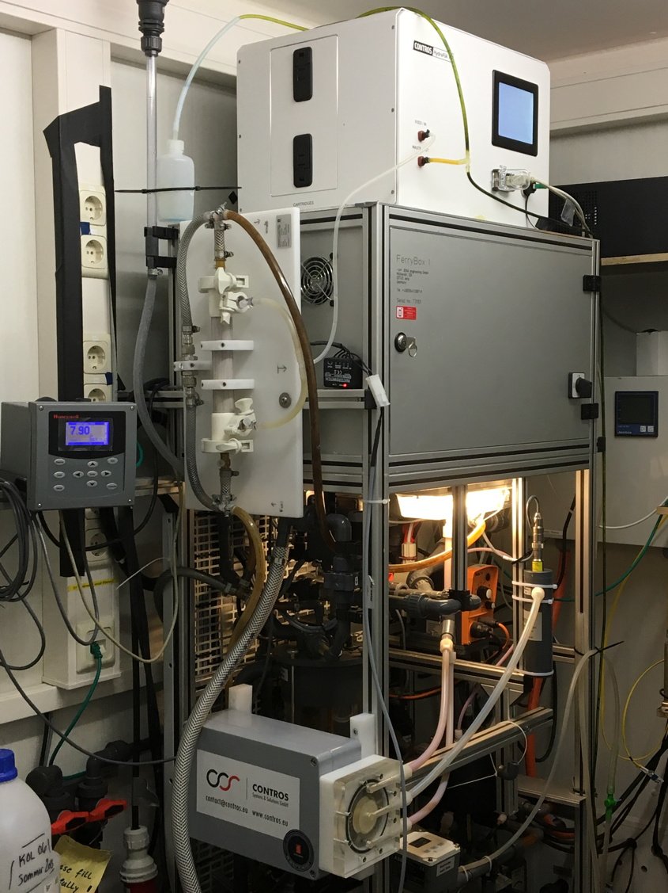

<!-- <style type="text/css"> -->
<!-- .main-container { -->
<!--   max-width: 100% !important; -->
<!--   margin: auto; -->
<!-- } -->
<!-- </style> -->
<style type="text/css">
.main-container {
  max-width: 100% !important;
  margin: auto;
}
h1.title {
  font-size: 50px;
}
body{
  font-size: 24pt;
}
h1,h2,h3,h4,h5,h6{
  font-size: 32pt;
}
.blackbox {
  padding: 1em;
  background: LightYellow;
  color: black;
  border: 0px solid orange;
  border-radius: 10px;
}
.center {
  text-align: center;
}
</style>


^1^Laboratoire d'Océanographie de Villefranche, CNRS-Sorbonne Université\
^2^Iddri, Sciences Po\
^3^Alfred Wegener Institute for Polar and Marine Research\

```{r set-up, echo=FALSE, warning=FALSE, message=FALSE, include=FALSE}
  #if (Sys.getenv("LOGNAME") == "gattuso") path = "."
```

{width="500px"}

***

:::: {.blackbox data-latex=""}

# **Introduction**

- Arctic region:  one of the "**reasons for concern**" of the IPCC.
- Arctic Ocean: less than 1% of ocean water but receives 11% of the global runoff; 7-10% of the global burial of organic carbon
- **SST** increased twice as fast as other regions; projections of up to +5.5 °C in 2100 
- Projected decrease in surface **pH** by 2100 larger than elsewhere (-0.45 vs -0.06 to -0.32 units)
- **Undersaturation** of surface water with respect to aragonite first reported in 2008 in the Canada Basin; due to the decrease of salinity and degradation of organic matter
- **No** fewer observations than elsewhere for carbonate variables: 11.6% of the SOCAT pCO<sub>2</sub> records and 9.1% of the GLODAP C<sub>T</sub> records are from the Arctic Ocean which is only about 4.3% of the global ocean surface
<!-- - Coastal data relatively well represented in both products (25% and 10% of the SOCAT and SOCAT Arctic data, respectively) -->
- **Uneven distribution**: 71.5% of the SOCAT pCO<sub>2</sub> data and 72% of the GLODAP C<sub>T</sub> data collected Jun-Sep). Few to very few data Dec-Mar.
- Critical to document the changes but no high frequency multi-year time-series
:::

***

Fransner et al. (2022)

{width="50%"}
{width="50%"}

***

# **Study location** 


Platt et al. (2022)

***

:::: {.blackbox data-latex=""}
# **Instrumental set-up** 

- Water pumped at **11 m depth**
- **July 2015**: Two pCO<sub>2</sub> sensors rotating every year (in FerryBox, 1 min) 
- **February 2016**: Total alkalinity analyser (in FerryBox, 90 min) but lots of technical issues
- For calibration and quality insurance: weekly discrete samples for C<sub>T</sub> and A<sub>T</sub>
- **August 2017**: pH measurements
  - Continuous measurements in fjord water (seaFET)
  - DURAFET pH sensor in the FerryBox
  - Discrete pH samples once a month for calibration
- Regular maintenance twice a year (except during Covid-19 pandemic)
- Came to an end in December 2021
:::

## **Instruments in the FerryBox**

:::: {style="display: flex;"}
::: {class='col-md-4'}

:::

::: {class='col-md-4'}

:::

::: {class='col-md-4'}

:::
::::

## **Instruments on the REMOS**


***

<!-- # No longer in real-time: https://awipev-co2.obs-vlfr.fr -->
<!--  -->

<!-- *** -->

# **Availability of data**
:::: {style="display: flex;"}
::: {class='col-md-4'}
Many challenges:

- extreme environmental conditions
- frozen pipes
- damages resulting from icebergs pounding on the field instruments
- weeks to months waiting for warmer temperatures to deice or to fly technical staff, including divers
- No access for extended periods of time during the Covid-19 pandemic

Nevertheless:

- data usable 50 to 76% of the time during the period of measurement
- pCO<sub>2</sub> and pH data are available throughout the year and well distributed across months, including winter months
:::
::: {class='col-md-8'}

{ width=70% }
:::
::::

***

# **Nutrients**
:::: {style="display: flex;"}
::: {class='col-md-4'}

- 90 phosphate and 133 silicate data kindly provided by van de Poll (unpubl.)
- PO4 and Si vary by a factor 10 along a composite year
- disregarding nutrients does not generate large differences:
  - pCO2-AT pair, differences in pH, CT and OmegaA: < 0.001 unit, 0.7 umol/kg and <0.01
  - CT-AT pair: differences in pH, pCO2 and OmegaA: 0.002 units, 1.5 uatm and <0.01
:::
::: {class='col-md-8'}

:::
::::

***

:::: {.blackbox data-latex=""}
# **K1 and K2**

- Big issue in the Arctic due to low temperature and salinity (Sulpis et al., 2020) 
- Lueker et al. (2000), which are recommended by the community (Jiang et al., 2022) derived in lab conditions with no temperature value < 2 °C. Overestimates K1 and K2 at temperatures below about 8 °C
- Millero et al. (2002) and Sulpis et al. (2020) based on large (> 900) field data sets that include cold temperature values
- Papadimitriou et al. (2018), obtained in the laboratory, also cover cold temperatures
- Formulations of Papadimitriou et al. (2018) perform better here but seldom used
- Hence, we used the facto standard of Lueker et al. (2000)
:::

***

# **Total alkalinity vs salinity relationship**
r2 = 0.81

{ width=50% height=50% }

***

# **Time series of key variables**


***

# **Monthly means**


***

# **Consistency**

<!-- ::: {style="text-align:center" markdown="1"} -->
{ width=70% height=70% }
<!-- ::: -->

***

# **Water column stratification**

:::: {style="display: flex;"}
::: {class='col-md-5'}

- Weird profiling approach
- Salinity in the bottom layer (8 to 12 m) is up to 1 unit higher than in the surface layer (0 to 4 m) in summer, 0.7 unit lower in Dec and similar in both layers at other times
- Temperature is lower by up to 2.7°C in the deep layer from Mar to Sep and higher by up to 2.4 °C in Nov-Jan
- Density is almost always higher in the bottom than in the surface layer.

:::
::: {class='col-md-5'}

  
:::
::::

***

# **Air-sea CO<sub>2</sub> flux**

  

***

:::: {.blackbox data-latex=""}
# **Conclusion**

- **Positive aspects**: 
  - **First** multi-year, high-frequency time series of the carbonate system in the Arctic 
  - Excellent support from AWIPEV staff until 2020
- **Logistical difficulties**:
  - Winter sampling essential
  - Challenging environment; divers needed to sort out issues
  - Difficult and costly to gather a team and organize field trip at short notice
  - New regulation for using HgCl<sub>2</sub> and transporting poisoned samples

:::
  
  ***

:::: {.blackbox data-latex=""}
# **Acknowledgements**

- AWIPEV staff until 2020
- Numerous AWI divers
- SNAPO-CO2
- Willem H. van de Poll who provided nutrient data
- Coastal Observing System for Northern and Arctic Seas (COSYNA)
- Helmholtz large-scale infrastructure projects ACROSS and MOSES
- French Polar Institute (IPEV) 
- EU projects Jericho-Next, INTAROS and FACE-IT
- Ove Hermansen, Cathrine Lund Myhre, and Stephen Platt at Norwegian institute for air research (NILU) for their assistance with atmospheric CO2 data from the Zeppelin observatory, as well as the Integrated Carbon Observing System (ICOS)-Norway, Norwegian Research Council project NFR-207587, and the Norwegian Environment Agency
:::