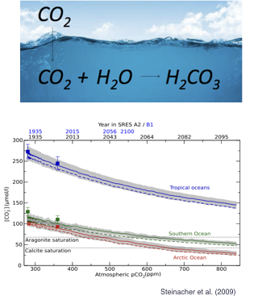
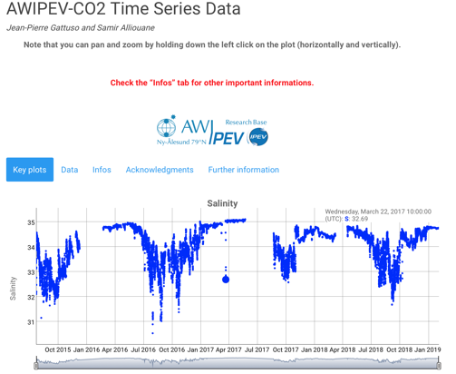
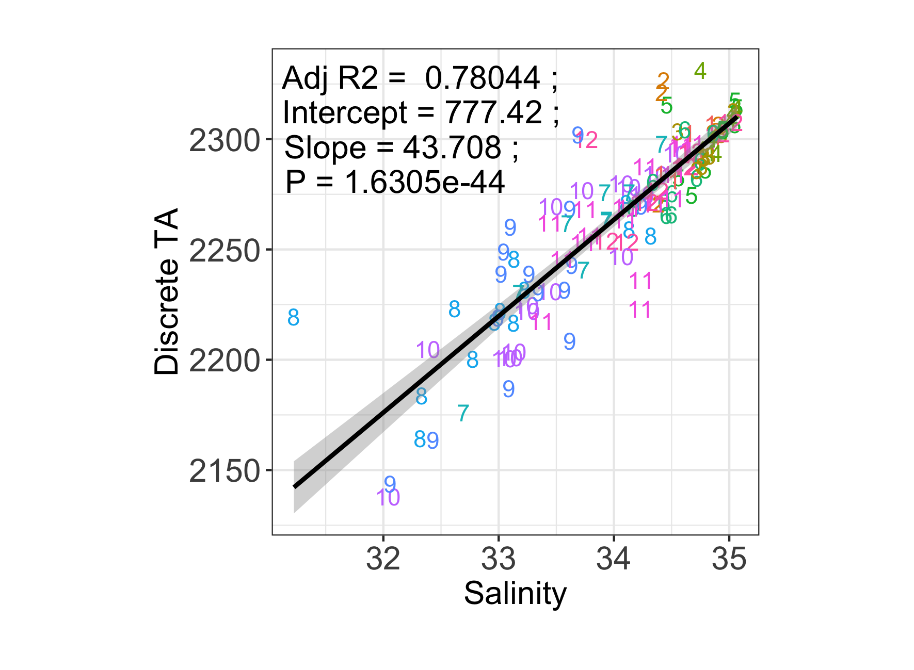

```{r set-up, echo=FALSE, warning=FALSE, message=FALSE, include=FALSE}
#was in r-setup chunk of test presentation
#knitr::opts_chunk$set(echo = FALSE)
#options(htmltools.dir.version = FALSE)

Sys.setlocale("LC_ALL", "en_US.UTF-8")
Sys.setenv(TZ='UTC') # on utilise UTC
rm(list = ls())
library(tidyverse)
library(robfilter)
library(seacarb)
library(gridExtra)
library(reshape2)
library(lubridate)
library(lmtest)
library(grid)
library(viridis)
library(dygraphs)
require("knitr")
library("lmodel2")
library(captioner)
library(xts)
library(seismicRoll)
library(scales)
library(widgetframe)

knitr::opts_chunk$set(echo = TRUE)

fig_nums <- captioner()
table_nums <- captioner(prefix = "Table")

#define who is the user and define path
if (Sys.getenv("LOGNAME") == "gattuso") path = "../../../pCloud\ Sync/Documents/experiments/exp168_awipev-CO2/"
if (Sys.getenv("LOGNAME") == "samir") path = "../../pCloud\ Sync/exp168_awipev-CO2/"


######## function to make regression plot with model I equation in title
ggreg <- function (fit, point_size=2) {
  ggplot(fit$model, aes_string(x = names(fit$model)[2],
                               y = names(fit$model)[1])) +
    geom_point(size = point_size, col = "blue") +
    stat_smooth(method = "lm", col = "black") +
    labs(title = paste(title, "\nAdj R2 = ",signif(summary(fit)$adj.r.squared, 5),
                       "; Intercept =",signif(fit$coef[[1]],5 ),
                       "; Slope =",signif(fit$coef[[2]], 5),
                       "; P =",signif(summary(fit)$coef[2,4], 5))) +
    theme(plot.title = element_text(size=7))
}

#################### which.closest function
which.closest <- function(x, table, ...) {
  round(approx(x=table, y=1:length(table), xout=x, ...)$y)
}

#################### Regression function
# function regression plot with model II equation (MA) in title
## Dans labs ajout de la variable title pour mettre title avant chaque graphe
ggreg2 <- function (fit, x, y, point.size=5) { # x and y are the names of the variables
  fit_data <- data.frame(fit$x, fit$y)
  colnames(fit_data) = c(x, y)
reg <- fit$regression.results[2,] #one selects MA only
intercept <- reg$Intercept
slope <- reg$Slope
  ggplot(data = fit_data, aes_string(x = x, y = y)) + 
  geom_point(size = point.size, col = "blue") +
  geom_abline(aes(intercept = fit$regression.results[2,2], slope = fit$regression.results[2,3]),
              colour = "blue") +
  labs(title = paste(title,"\n Adj R2 = ", signif(fit$rsquare, 3),
                     "; Intercept =", signif(intercept, 3),
                     "; Slope =", signif(slope, 3),
                     "; P =", signif(fit$P.param, 3))) +
    theme(plot.title = element_text(size=7))
}

#################### Mytheme
Mytheme <- function(size_labs = 7, face_font="plain") {
  theme_bw() +
  theme(axis.text.x = element_text(face=face_font, size=size_labs, color="black"),
        axis.title.x = element_text(face=face_font, size=size_labs),
        axis.text.y = element_text(face=face_font, color="black", size=size_labs),
        axis.title.y = element_text(face=face_font, size=size_labs),
        axis.ticks.x = element_line(size=0.1),
        axis.ticks.y = element_line(size=0.1),
        axis.ticks.length = unit(1.1, "mm"),
        panel.grid.major = element_line(size = 0.25, color="black", linetype="dashed"),
        aspect.ratio = 1 / 2,
        plot.margin = margin(t = 0, r = 0, b = 0, l = 0, unit = "cm")
  )
}

ggplotRegression <- function(fit){

require(ggplot2)

ggplot(fit$model, aes_string(x = names(fit$model)[2], y = names(fit$model)[1])) + 
  geom_point() +
  stat_smooth(method = "lm", col = "red", se= FALSE) +
  labs(title = paste("Adj R2 = ",signif(summary(fit)$adj.r.squared, 5),
                     "Intercept =",signif(fit$coef[[1]],5 ),
                     " Slope =",signif(fit$coef[[2]], 5),
                     " P =",signif(summary(fit)$coef[2,4], 5)))
}

#define who is the user and define path
if (Sys.getenv("LOGNAME") == "gattuso") path = "../../../pCloud\ Sync/Documents/experiments/exp168_awipev-CO2/"
if (Sys.getenv("LOGNAME") == "samir") path = "../../../pCloud\ Sync/exp168_awipev-CO2/"

```


class: center, middle, title-slide

# AWIPEV-CO2: First time-series of carbonate chemistry in the Arctic

### Jean-Pierre Gattuso (1,2), Samir Alliouane (1) & Philipp Fischer (3)
(1) CNRS and Sorbonne University
(2) Iddri
(3) AWI

18 February 2019


---
# What is ocean acidification?

.pull-left[
- CO2 is an acid gas (it produces acid when combined with water)
- Each of us adds 4 kg CO2 per day to the ocean (increasing acidity, reducing pH)
- The Arctic It will become corrosive for aragonite: 50% in 2050, 100% in 2100
- Critical to document the changes but no time-series until recently
]
.pull-right[

]

---
# History and instruments

- Water pumped from 12 m water depth at Ny-Ålesund
- **Since July 2015**: Two pCO2 sensors rotating every year (in FerryBox, 1 min) 
- **Since February 2016**: Total alkalinity analyser (in FerryBox, 90 min) but lots of technical issues
- For calibration and quality insurance: weekly discrete samples for high-precision measurements of dissolved inorganic carbon and total alkalinity
- **Since August 2017**: pH measurements
  - Continuous measurements in fjord water (seaFET)
  - DURAFET pH sensor in the FerryBox
  - Discrete pH samples once a month for calibration
- Regular maintenance twice a year

---
# Data available in near real-time: https://awipev-co2.obs-vlfr.fr



---
```{r whole time series, fig.width=10, fig.height=4, echo=FALSE, message= FALSE}
load(file= paste0(path, "fb_data/d_all.Rdata"))
```

```{r pCO2, fig.width=10, fig.height=4, echo=FALSE, message= FALSE}
# PCO2
#+ Ajout de la pCO2 corrigé par le script contros (dans R server ny-alesund_cc.R)
pco2_contros_xts <- dplyr::select(d_all, datetime, pco2calc, pco2_contros, PCO2_Corr_filtered)
pco2_contros_xts <- as.xts(pco2_contros_xts, order.by = d_all$datetime)
pco2_dyg <- dygraph(pco2_contros_xts, group = "awipev", main="pCO2", ylab="pCO2") %>%
    dySeries("PCO2_Corr_filtered", label="Raw pCO2",color ="blue", strokeWidth = 0, pointSize = 2) %>%
    dySeries("pco2_contros", label="Corrected pCO2", color=  RColorBrewer::brewer.pal(3, "Dark2")[1],strokeWidth=0, pointSize=2) %>%
    dySeries("pco2calc", label="calculated pCO2",color = "red", strokeWidth = 0, pointSize = 4 ) %>%
    dyEvent(as.POSIXct("2016-02-28 12:00:00", tz="GMT"), "CO2FT-0515-001 installed", labelLoc = "bottom", color="red") %>%
    dyEvent(as.POSIXct("2017-02-07 12:00:00", tz="GMT"), "CO2FT-0215-001 installed", labelLoc = "bottom", color="red") %>%
    dyEvent(as.POSIXct("2018-04-16 12:00:00", tz="GMT"), "CO2FT-0515-001 installed", labelLoc = "bottom", color="red") %>%
    dyEvent(as.POSIXct("2018-10-31 15:00:00", tz="GMT"), "CO2FT-0215-001 installed", labelLoc = "bottom", color="red") %>%
    #dyOptions(colors = RColorBrewer::brewer.pal(3, "Dark2"), pointSize = 4) %>%
    dyHighlight(highlightCircleSize = 8,highlightSeriesBackgroundAlpha = 0.5,hideOnMouseOut = TRUE) %>%
    dyOptions(drawGrid = TRUE, drawPoints = TRUE, pointSize = c(1,8,1),useDataTimezone = TRUE) %>%
    dyRangeSelector(height = 30, dateWindow= NULL)
frameWidget(pco2_dyg)
```
---

```{r seafet, fig.width=10, fig.height=4, echo=FALSE, message= FALSE}
# SEAFET
seafet_contros_xts <- dplyr::select(d_all, datetime, phINT_filtered,pH_s_seafet_temp_field)
seafet_contros_xts <- as.xts(seafet_contros_xts, order.by = d_all$datetime)
seafet_dyg <- dygraph(seafet_contros_xts, group = "awipev", main="pH seaFET (in situ)", ylab="pHT") %>%
  dySeries("phINT_filtered", label = "Raw data INT", color ="blue", strokeWidth=0, pointSize=2) %>%
  dySeries("pH_s_seafet_temp_field", label = "pH spectro", color =  "red", strokeWidth = 0, pointSize = 4 ) %>%
  dyEvent(as.POSIXct("2017-08-24 12:00:00", tz="GMT"), "seaFET #1005 installed", labelLoc = "bottom", color="red") %>%
  dyEvent(as.POSIXct("2018-02-02 09:00:00", tz="GMT"), "seaFET settings changed to every 1H", labelLoc = "bottom", color="red") %>%
  dyEvent(as.POSIXct("2018-04-17 12:00:00", tz="GMT"), "seaFET #0007 installed + continuous mode set", labelLoc = "bottom", color="red") %>%
    dyHighlight(highlightCircleSize = 8,highlightSeriesBackgroundAlpha = 0.5,hideOnMouseOut = TRUE) %>%
    dyOptions(drawGrid = TRUE, drawPoints = TRUE, pointSize = c(1,8,1),useDataTimezone = TRUE, digitsAfterDecimal=4) %>%
    dyRangeSelector(height = 30, dateWindow= NULL)
frameWidget(seafet_dyg)
```

---

```{r at, fig.width=10, fig.height=4, echo=FALSE, message= FALSE}
# TA
# to create periods according to TA deployments
TAevents <- c("2016-02-26 00:00:00", "2017-02-09 12:00:00", "2017-02-09 12:00:00", "2017-03-10 12:00:00",
              "2018-01-07 00:00:00", "2018-06-20 00:00:00", "2018-07-31 00:00:00", "2018-10-30 18:00:00", "2018-10-31 09:00:00", "2019-01-16 09:00:00", "2019-01-26 13:25:00", format(Sys.Date(), "%Y-%m-%d %H:%M:%S"))

at_contros_cleaned_xts <- dplyr::select(d_all, datetime,AT_filtered,at)
at_contros_cleaned_xts <-  as.xts(at_contros_cleaned_xts, order.by = d_all$datetime)
at_dyg <- dygraph(at_contros_cleaned_xts, group = "awipev", main=" Total Alkalinity (in Ferrybox)", ylab="Total alkalinity") %>%
   #dySeries("at_contros", color = RColorBrewer::brewer.pal(3, "Set2"), strokeWidth = 0, pointSize=2) %>%
  #dySeries("AT_filtered2", color = RColorBrewer::brewer.pal(4, "Set2"), strokeWidth = 0, pointSize=2) %>%
  dySeries("AT_filtered", label= "Raw TA", color = "blue", strokeWidth = 0, pointSize=2) %>%
  dySeries("at", label="TA reference",color = "red", strokeWidth = 0, pointSize=4) %>%
  dyEvent(as.POSIXct("2016-05-31 10:00:00", tz="GMT"), "HCl Changed", labelLoc = "bottom") %>%
  dyEvent(as.POSIXct("2016-06-24 10:00:00", tz="GMT"), "BCG Changed", labelLoc = "bottom") %>%
  dyEvent(as.POSIXct("2016-02-24 14:00:00", tz="GMT"), "Calibration 1", labelLoc = "bottom") %>%
  dyEvent(as.POSIXct("2016-09-16 10:00:00", tz="GMT"), "Calibration 2", labelLoc = "bottom") %>%
  dyEvent(as.POSIXct("2017-03-21 12:00:00", tz="GMT"), "TA analyser changed", labelLoc = "top", color="red") %>%
  dyEvent(as.POSIXct("2018-01-08 12:55:00", tz="GMT"), "TA analyser changed #TA-0317-001", labelLoc = "top", color="red") %>%
  dyEvent(as.POSIXct("2018-07-31 00:00:00", tz="GMT"), "TA analyser changed #TA-1215-001", labelLoc = "top", color="red") %>%
  dyEvent(as.POSIXct("2018-10-30 18:00:00", tz="GMT"), "TA analyser changed #TA-0317-001", labelLoc = "top", color="red") %>%
  dyEvent(as.POSIXct("2016-11-15 09:00:00", tz="GMT"), "CRM measurement", labelLoc = "bottom") %>%
  dyEvent(as.POSIXct("2017-02-09 12:20:00", tz="GMT"), "CRM measurement", labelLoc = "bottom") %>%
  dyEvent(as.POSIXct("2017-04-11 06:20:00", tz="GMT"), "CRM measurement", labelLoc = "bottom") %>%
  dyEvent(as.POSIXct("2018-01-22 13:00:12", tz="GMT"), "CRM measurement", labelLoc = "bottom") %>%
  dyEvent(as.POSIXct("2018-05-16 12:39:39", tz="GMT"), "CRM measurement", labelLoc = "bottom") %>%
  dyEvent(as.POSIXct("2018-10-31 10:29:27", tz="GMT"), "CRM measurement", labelLoc = "bottom") %>%
  dyEvent(as.POSIXct("2019-01-26 13:25:20", tz="GMT"), "Calibration mode - CRM", labelLoc = "bottom") %>%
  #dyOptions(colors = RColorBrewer::brewer.pal(3, "Dark2"), pointSize = 4) %>%
  dyShading(from = TAevents[1], to = TAevents[2], color = "#EDEDED") %>%
  dyShading(from = TAevents[3], to = TAevents[4], color = "#C2C2C2") %>%
  dyShading(from = TAevents[5], to = TAevents[6], color = "#EDEDED") %>%
  dyShading(from = TAevents[7], to = TAevents[8], color = "#C2C2C2") %>%
  dyShading(from = TAevents[9], to = TAevents[10], color = "#EDEDED") %>%
  dyShading(from = TAevents[11], to = TAevents[12], color = "#C2C2C2") %>%
  dyAxis("y",valueRange = c(2000, 2550)) %>%
  dyHighlight(highlightCircleSize = 8,highlightSeriesBackgroundAlpha = 0.5,hideOnMouseOut = TRUE) %>%
  dyOptions( strokeWidth= 0) %>%
  dyOptions(drawGrid = TRUE, drawPoints = TRUE,useDataTimezone = TRUE) %>%
    dyRangeSelector(height = 30, dateWindow= NULL)

frameWidget(at_dyg)

```
```{r others not used, fig.width=10, fig.height=4, echo=FALSE, message= FALSE}
#SAL
# sal_fb_xts <- dplyr::select(d_all, datetime, sal_fb)%>%
#   dplyr::filter(sal_fb >28)
# sal_fb_xts <- as.xts(sal_fb_xts, order.by = sal_fb_xts$datetime)
# sal_dyg <- dygraph(sal_fb_xts, group = "awipev", main="Salinity", ylab="Salinity") %>%
#       dySeries("sal_fb", color = "blue", strokeWidth = 0, label = "S") %>%
#       dyHighlight(highlightCircleSize = 8,highlightSeriesBackgroundAlpha =0.2,hideOnMouseOut =TRUE) %>%
#       dyOptions(drawGrid = TRUE, drawPoints = TRUE, pointSize = 2,useDataTimezone = TRUE) %>%
#       dyRangeSelector(height = 30, dateWindow= NULL)
# frameWidget(sal_dyg)

# # TEMP Ferrybox SBE45
# temp_fb_xts <- dplyr::select(d_all, datetime, temp_fb)
# temp_fb_xts <- as.xts(temp_fb_xts, order.by = temp_fb_xts$datetime)
# dygraph(temp_fb_xts, group = "awipev", main="Temperature (in Ferrybox)", ylab="Temperature") %>%
#       dySeries("temp_fb", color = "blue", strokeWidth = 0, label = "T") %>%
#       dyAxis("y", valueRange = c(-2.5, 9.5)) %>%
#       dyHighlight(highlightCircleSize = 8,highlightSeriesBackgroundAlpha = 0.5,hideOnMouseOut = TRUE) %>%
#       dyOptions(drawGrid = TRUE, drawPoints = TRUE, pointSize = 2,useDataTimezone = TRUE) %>%
#       dyRangeSelector(height = 30, dateWindow= NULL)
# # TEMP insitu SBE38
# temp_insitu_xts <- dplyr::select(d_all, datetime, temp_insitu)
# temp_insitu_xts <- as.xts(temp_insitu_xts, order.by = temp_insitu_xts$datetime)
# dygraph(temp_insitu_xts, group = "awipev", main="Temperature (in situ)", ylab="Temperature") %>%
#       dySeries("temp_insitu", color = "blue", strokeWidth = 0, label = "T") %>%
#       dyAxis("y", valueRange = c(-2.5, 9.5)) %>%
#       dyHighlight(highlightCircleSize = 8,highlightSeriesBackgroundAlpha = 0.5,hideOnMouseOut = TRUE) %>%
#       dyOptions(drawGrid = TRUE, drawPoints = TRUE, pointSize = 2,useDataTimezone = TRUE) %>%
#       dyRangeSelector(height = 30, dateWindow= NULL)


# # DURAFET 
# durafet_contros_xts <- dplyr::select(d_all, datetime, pH_durafet, pH_s_durafet_temp_field)
# durafet_contros_xts <- as.xts(durafet_contros_xts, order.by = d_all$datetime)
# dygraph(durafet_contros_xts, group = "awipev", main="pH durafet (in Ferrybox)", ylab="pHT") %>%
#     dySeries("pH_durafet", label = "Raw durafet pH", color ="blue", strokeWidth=0, pointSize=2) %>%
#     dySeries("pH_s_durafet_temp_field", label = "pH spectro", color =  "red", strokeWidth = 0, pointSize = 4 ) %>%
#     dyEvent(as.POSIXct("2017-08-24 12:00:00", tz="GMT"), "durafet installed", labelLoc = "bottom", color="red") %>%
#     dyEvent(as.POSIXct("2017-10-30 13:00:00", tz="GMT"), "New holder installed", labelLoc = "bottom", color="red") %>% 
#     # dyOptions(colors = RColorBrewer::brewer.pal(3, "Dark2"), pointSize = 4) %>%
#     dyHighlight(highlightCircleSize = 8,highlightSeriesBackgroundAlpha = 0.5,hideOnMouseOut = TRUE) %>%
#     dyOptions(drawGrid = TRUE, drawPoints = TRUE, pointSize = c(1,8,1),useDataTimezone = TRUE, digitsAfterDecimal=4) %>%
#     dyRangeSelector(height = 30, dateWindow= NULL) 
```
---
## Relationship between discrete AT and salinity



---

# Difficulties with logistics
```{r}

```

- Bullet 1
- Bullet 2
- Bullet 3

